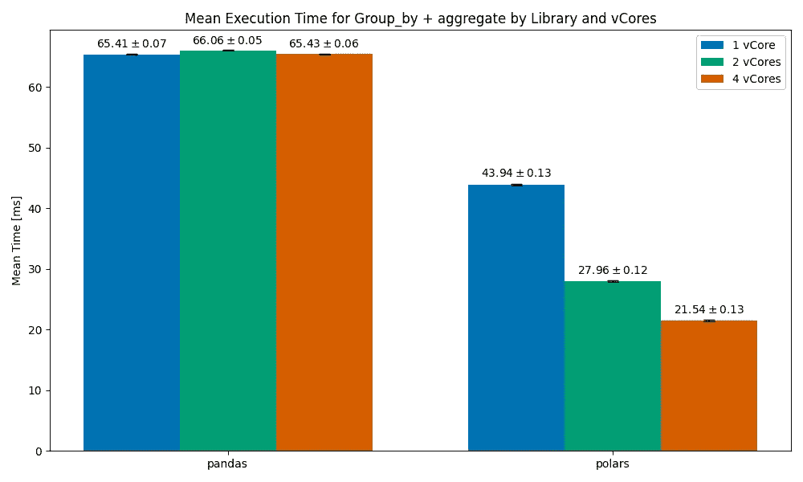
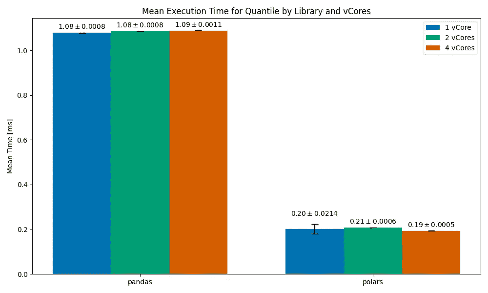
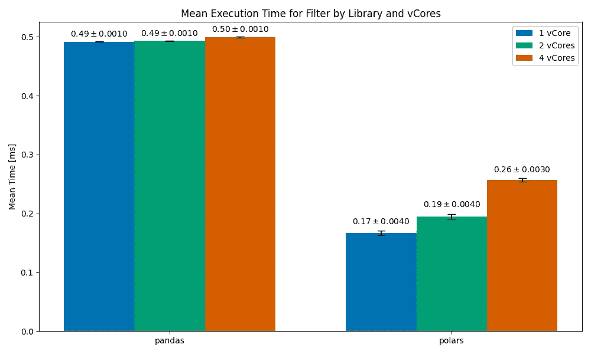
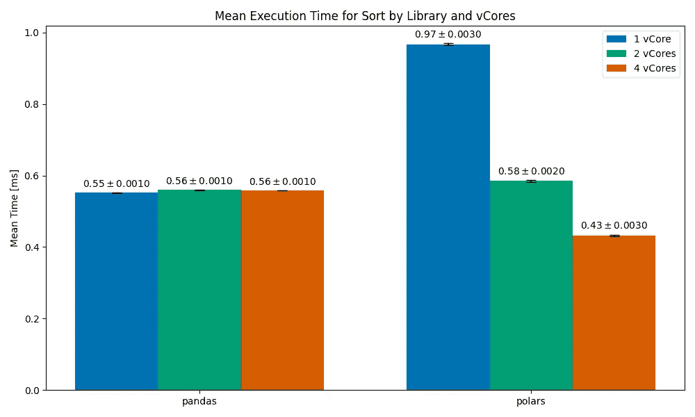
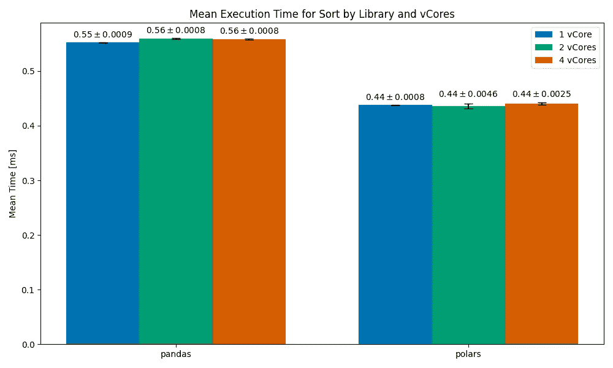

# 高性能 Python 数据处理：pandas 2 与 Polars，从 vCPU 视角看

> 原文：[`towardsdatascience.com/high-performance-data-processing-pandas-2-vs-polars-a-vcpu-perspective-e922d3064f4e?source=collection_archive---------1-----------------------#2024-08-07`](https://towardsdatascience.com/high-performance-data-processing-pandas-2-vs-polars-a-vcpu-perspective-e922d3064f4e?source=collection_archive---------1-----------------------#2024-08-07)

## Polars 承诺其多线程能力优于 pandas。但在单个 vCore 上是否也是如此？

 [Saar Berkovich](https://medium.com/@saarb?source=post_page---byline--e922d3064f4e--------------------------------)

·发表于 [Towards Data Science](https://towardsdatascience.com/?source=post_page---byline--e922d3064f4e--------------------------------) ·阅读时长 7 分钟·2024 年 8 月 7 日

--

图片由作者生成，使用 DALL-E

不管喜不喜欢，pandas 多年来一直是 Python 数据分析中占主导地位的库。它在数据科学和分析中得到了广泛应用（无论是在工业界还是学术界），同时也被软件和数据工程师在数据处理任务中大量使用。

pandas 长期以来作为表格数据分析的冠军，目前正面临着一个新库——Polars 的挑战。Polars 旨在通过实现一个更现代化的框架，替代 pandas 解决今天 pandas 所解决的相同用例。它的主要承诺之一是提供更好的性能，利用一个用 Rust 编写的后端，这个后端经过优化以进行并行处理。此外，它还深入实现了矢量化操作（[SIMD](https://en.wikipedia.org/wiki/Single_instruction,_multiple_data)），这是使 NumPy 和 pandas 如此快速和强大的功能之一。

## 它到底快多少？

查看[这个图表](https://pola.rs/_astro/perf-illustration.jHjw6PiD_165TDG.svg)（发布于[Polars 主页](https://pola.rs/) 2024 年 4 月 24 日），该图表展示了在不同的 Python 数据分析生态系统下，TPC-H 基准测试的运行时间（单位：秒）。一眼看上去，Polars 的速度比 pandas 快 25 倍。深入了解后，我们发现这些基准测试是在一台拥有 22 个 vCPU 的虚拟机上收集的。Polars 被设计为擅长并行处理，因此，当然可以从拥有如此多 vCPU 的系统中受益。而 pandas 则完全不支持多线程，因此可能仅使用了这台机器的 1 个 vCPU。换句话说，Polars 用 1/25 的时间完成了 pandas 的工作，但它也使用了 22 倍的计算资源。

## vCore 的问题

虽然如今每台物理计算机都配有某种形式的硬件并行化（多核、多 ALU、超线程等），但虚拟服务器却不总是如此，通常使用较小的服务器可以降低成本。例如，像 AWS Lambda Functions、GCP Cloud Functions 和 Azure Functions 等无服务器平台，vCore 会随着内存的变化而扩展，而且由于按 GB-秒计费，你通常不会为函数分配超过需求的内存。

鉴于情况如此，我决定测试 Polars 与 pandas 的表现，特别是我对以下两个问题感兴趣：

**1. 在仅有 1 个 vCore 可用的情况下，Polars 如何与 pandas 比较

2. **Polars 如何随着 vCore 扩展**

我们将考虑 4 个操作：分组和聚合、[分位数](https://en.wikipedia.org/wiki/Quantile)计算、过滤和排序，这些操作可能会被融入到数据分析工作或管道中，这些工作可以在数据分析师、数据科学家以及数据和软件工程师的工作中看到。

## 设置

我使用了一台 AWS `m6a.xlarge` 机器，配备 4 个 vCore 和 16GB 内存，并利用 [taskset](https://man7.org/linux/man-pages/man1/taskset.1.html) 为每次测试分配 1 个 vCore 或 2 个 vCore，以模拟每次有较少 vCore 的机器。在库版本方面，我选择了当时可用的最新稳定版本：

`pandas==2.2.2; polars=1.2.1`

## 数据

数据集是随机生成的，包含 100 万行和 5 列，旨在表示某一产品中 10,000 个会话内 100,000 次用户操作的历史记录：

user_id（整数）

action_types（枚举类型，可以取值为[“click”, “view”, “purchase”]）

timestamp（日期时间类型）

session_id（整数）

session_duration（浮动类型）

## 前提

给定数据集，我们想要根据用户的平均会话时长找到前 10%最活跃的用户。因此，我们首先需要计算每个用户的平均会话时长（分组与聚合），然后找到第 90 百分位数（百分位数计算），选择所有位于该百分位数以上的用户（筛选），并确保列表按平均会话时长排序（排序）。

## 测试

每个操作都运行了 200 次（使用[timeit](https://docs.python.org/3/library/timeit.html)），每次取平均运行时间，并用标准误差作为测量误差。[代码可以在这里找到](https://gist.github.com/Berkodev/68d45dfbffeeb820033f6927e34c0f97)。

## 关于急切执行与懒执行的说明

pandas 和 Polars 之间的另一个区别是，前者默认使用急切执行（语句按书写顺序执行），而后者使用懒执行（语句在需要时编译并执行）。Polars 的懒执行帮助它优化[查询](https://docs.pola.rs/user-guide/lazy/query-plan/)，这在大数据分析任务中是一个非常好的特性。我们选择将任务拆分，查看四个操作，目的是排除这一方面，专注于比较更基本的性能方面。

# 结果

## 分组 + 聚合

按库和 vCore 进行的分组和聚合操作的平均执行时间。图像和数据由作者提供。

我们可以看到，pandas 在 vCore 的扩展上没有表现出预期的效果。这个趋势在整个测试过程中都会保持。我决定保留图表中的这一部分，但之后我们将不再提及它。

polars 的结果相当令人印象深刻——在 1vCore 配置下，它比 pandas 快了三分之一的时间，而随着 vCore 数量增加到 2 核和 4 核时，它分别快了约 35%和 50%。

## 百分位数计算

按库和 vCore 进行的百分位数计算操作的平均执行时间。图像和数据由作者提供。

这个结果很有趣。在所有 vCore 配置中，polars 的执行速度是 pandas 的 5 倍。在 1vCore 配置下，平均执行时间为 0.2ms，但标准误差较大（意味着有时操作完成的时间会明显超过 0.2ms，而有时则会明显低于 0.2ms）。当扩展到多个 vCore 时，执行时间更加稳定——2vCore 配置为 0.21ms，4vCore 配置为 0.19ms（大约快 10%）。

## 筛选

按库和 vCore 进行的筛选操作的平均执行时间。图像和数据由作者提供。

在所有情况下，Polars 的完成速度都比 pandas 快（最差的运行时间仍然是 pandas 的两倍）。然而，我们在这里看到了一种非常不寻常的趋势 —— 运行时间随着 vCore 增加而增加（我们原本期望它会减少）。4vCore 的操作运行时间大约比 1vCore 的慢 35%。尽管并行化为你提供了更多的计算能力，但它通常伴随有一定的开销 —— 管理和协调并行进程通常是非常困难的。

这个 Polars 扩展问题令人困惑 —— 我这边的实现非常简单，而且在 Polars 的仓库中没有找到相关的开放问题（不过现在那儿确实有超过 1000 个开放问题）。

你知道为什么会发生这种情况吗？请在评论中告诉我。

## 排序

排序操作的平均执行时间，按库和 vCore 分类。图片和数据来源：作者。

过滤后，我们剩下了大约 13.5k 行数据。

在这一点上，我们可以看到 1vCore 的 Polars 情况比 pandas 慢得多（慢约 45%）。当我们扩展到 2vCore 时，运行时间与 pandas 相当，而扩展到 4vCore 时，Polars 的速度明显快于 pandas。这里可能的情况是，Polars 使用了一种针对并行优化的排序算法 —— 这种算法在单核心上可能表现不佳。

仔细查看文档后，我发现 Polars 中的排序操作有一个 `multithreaded` 参数，用于控制是否使用多线程排序算法或单线程排序算法。

## 排序（multithreading=False）

排序操作的平均执行时间（multithreading=False），按库和 vCore 分类。图片和数据来源：作者。

这次，我们可以看到更加一致的运行时间，虽然它们不会随着核心数的增加而扩展，但确实超过了 pandas。

## 结论

+   并行计算和分布式计算是困难的。我们通常认为，只要扩展我们的程序，它就能更快完成，但这总是会增加开销。在很多情况下，像 Redis 和 node.js 这样以极速著称的程序实际上是单线程的，并不支持并行化（node.js 以并发著称，但并发 ≠ 并行化）。

+   看起来，大多数情况下，即使只有 1 个可用 vCore，Polars 确实比 pandas 更快。令人印象深刻！

+   从过滤和排序操作来看，Polars 显然没有针对单个 vCore 情况进行优化，就像你在云服务中可能遇到的情况一样。如果你运行大量小型（<2GB 内存）无服务器函数，这是一个重要的考虑因素。为了提高速度进行扩展通常也伴随着价格的上升。

+   Polars 仍然是一个相对较新的解决方案，截至 2024 年中，它似乎没有 pandas 那么成熟。例如，在排序操作中的 `multithreaded` 参数 —— 我希望能够有一个 `auto` 默认选项，可以根据硬件选择算法。

## 最后备注

+   在考虑更换像 pandas 这样的基础库时，性能并不是唯一需要考虑的因素。还需要考虑其他参数，例如切换的成本（学习新语法、重构旧代码）、与其他库的兼容性以及新解决方案的成熟度。

+   这里的测试旨在处于快速粗略和彻底基准测试之间的中间地带。还需要更多工作才能得出决定性结论。

+   我简要讨论了 pandas 和 Polars 如何受益于 SIMD（单指令多数据），另一个你[可能听说过](https://www.forbes.com/sites/dereksaul/2024/06/20/nvidia-worlds-most-valuable-company-rallies-another-3-as-4-trillion-valuation-in-sight/)的硬件，GPU，因实现相同的思想而闻名。Nvidia 发布了一个[插件](https://docs.nvidia.com/spark-rapids/index.html)，用于在 GPU 上执行 Apache Spark 代码——根据我的测试，它甚至比 Polars 更不成熟，但值得一试。
