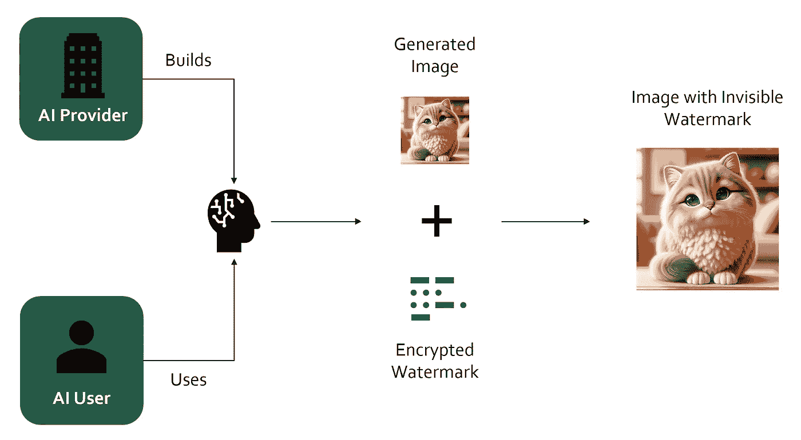
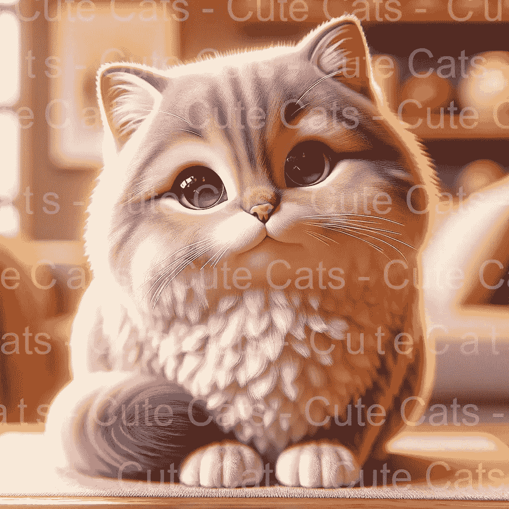
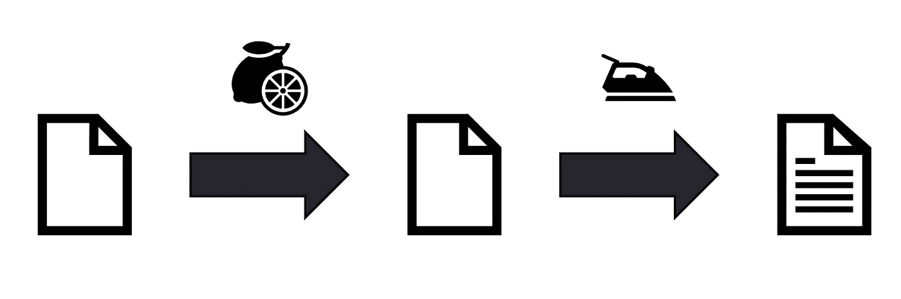
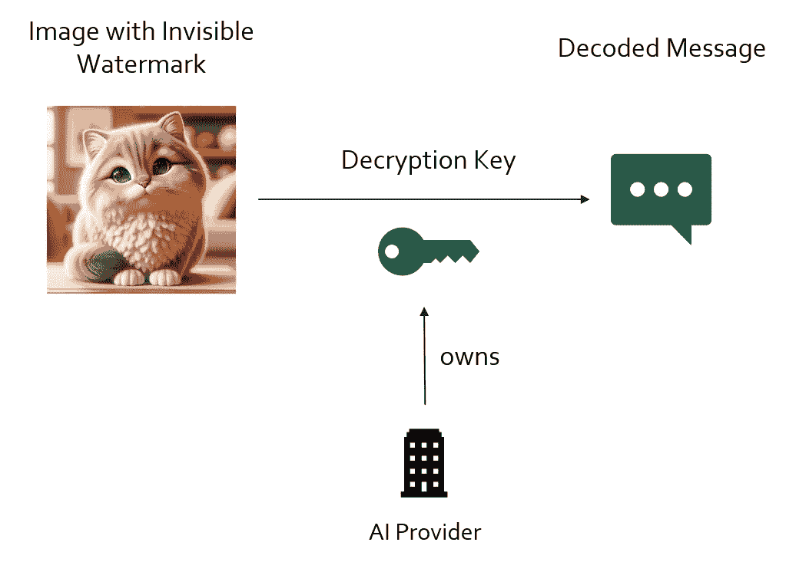
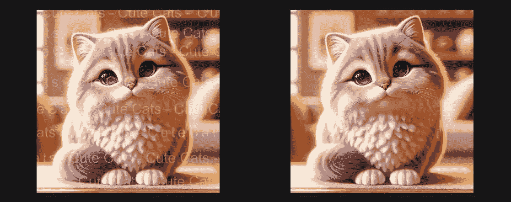
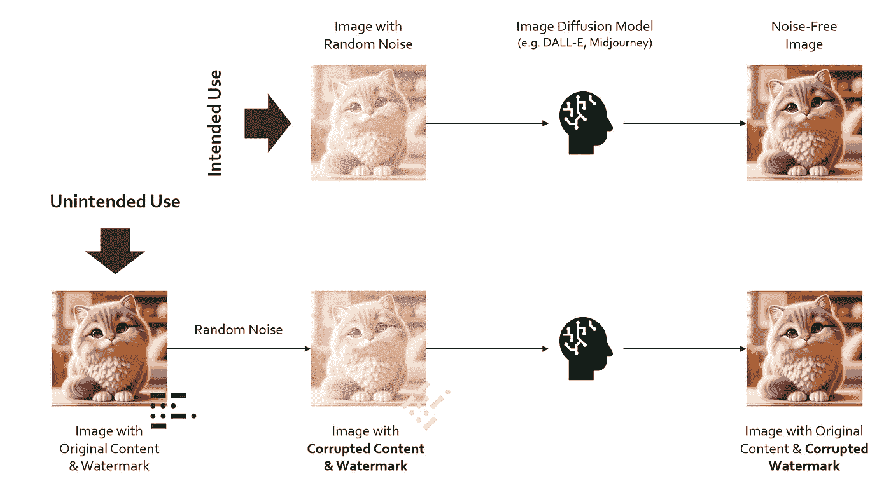
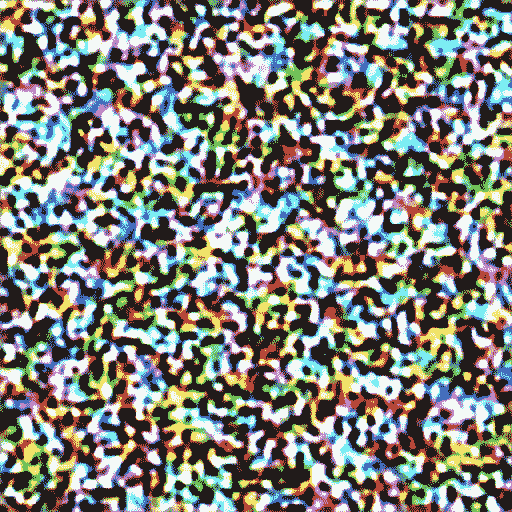
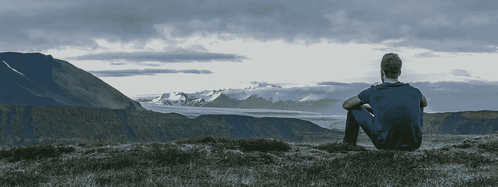
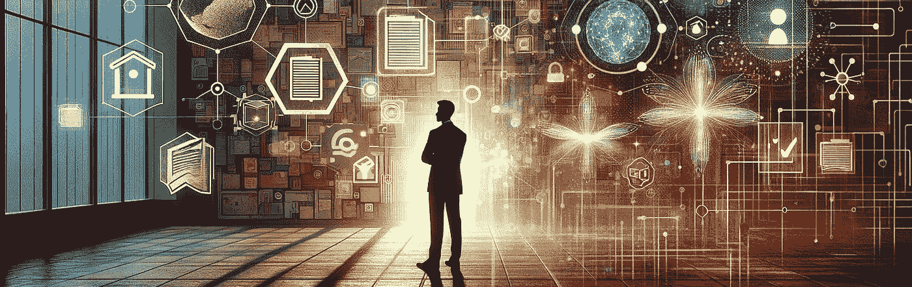

# AI 如何去除无法察觉的水印

> 原文：[`towardsdatascience.com/how-ai-can-remove-imperceptible-watermarks-6b4560ea867a?source=collection_archive---------8-----------------------#2024-02-06`](https://towardsdatascience.com/how-ai-can-remove-imperceptible-watermarks-6b4560ea867a?source=collection_archive---------8-----------------------#2024-02-06)

## 探索检测 AI 生成媒体中的漏洞

 [Max Hilsdorf](https://medium.com/@maxhilsdorf?source=post_page---byline--6b4560ea867a--------------------------------)

·发布于[Towards Data Science](https://towardsdatascience.com/?source=post_page---byline--6b4560ea867a--------------------------------) ·阅读时长：8 分钟·2024 年 2 月 6 日

--

无形水印工作原理的高级示意图。图片由作者提供。

# 我们为什么需要水印？

水印遍布整个互联网——这显然是有原因的。否则，你如何保护你的艺术作品或摄影作品不被随意用在某人的 PowerPoint 演示文稿中而不给创作者署名呢？解决这个问题的最简单方法就是制作像下面这样的可见水印。

可见水印示例。图片由作者基于 DALL-E 3 制作。

这种方法的主要缺点是可能会损害艺术本身。没有人会购买并使用这样带水印的猫咪图片。因此，虽然可以减少未经授权的复制，明显的水印也可能会使目标受众不愿意使用这件艺术作品。

在音乐领域，可听水印在免费 Hip-Hop 节拍中也很常见。节拍制作人通常会在第一段歌词开始之前插入带有品牌名称的语音样本。这可以作为防止非法下载的保障，或者当节拍是免费使用时，作为一种营销手段。

一段包含可听水印的 Hip-Hop 节拍示例，在约 10 秒时出现。“Solitude”由 Direct Beats 制作。

对于库存照片和 Hip-Hop 节拍来说，常见的做法是在在线预览中加上水印，并在客户支付后将原始产品发送给他们。然而，这种做法也容易被滥用。一旦没有水印的产品被购买，它就可能被复制并重新上传到互联网上。

# 无法察觉水印的必要性

## 知识产权的保护

不易察觉的水印有一个独特的优势：你可以在不影响产品质量的情况下，证明自己对任何数字副本的产品拥有所有权。就像一张带有隐形墨水的纸，纸张本身完全可用，但它携带了一条可以随时揭示的秘密信息。

不易察觉水印的示例。柠檬汁可以用作隐形墨水，可以通过加热使其显现。请观看[这个视频](https://www.youtube.com/watch?v=poCnU_crpjQ)来了解演示。图片由作者提供。

通过这项技术，创作者可以在作品中编码任何信息。更重要的是，由于他们有解码器的访问权限，他们可以随时声明对任何数字副本的原始作品拥有所有权。另一个对版权持有者来说新兴的机会是利用网络爬虫搜索网络并报告任何检测到的滥用行为。

## AI 生成内容的检测

不易察觉的水印的另一个重要应用是用于检测 AI 生成的内容。随着 ChatGPT 及类似 AI 工具的出现，人们对于互联网上可能泛滥的危险 AI 生成内容表示担忧。像[Meta](https://about.fb.com/news/2023/12/meta-ai-updates/)和[Google](https://deepmind.google/discover/blog/transforming-the-future-of-music-creation/)这样的科技公司正在推出不易察觉的水印系统，作为技术突破来缓解这一问题。他们的工具可以在不明显影响质量的情况下，为图像或音乐添加水印。

从原则上讲，这是一个值得关注的发展。通过不易察觉的水印，只有技术的拥有者能够解码并检测水印的存在。以我们之前的例子，Meta 和 Google 同时拥有隐形墨水和揭示它的手段。这使得他们能够准确地检测并筛选出在自己平台（例如 Instagram、YouTube）上生成的内容。通过合作，甚至像 X（前 Twitter）这样的独立平台也可以使用这项技术来限制 AI 生成的虚假信息或其他有害内容。

像 Meta 和 Google 这样的 AI 服务提供商正在建立自己的水印系统，以检测他们自己生成的内容，或者将这一能力出售给他人。图片由作者提供。

# AI 如何移除不易察觉的水印？

尽管不易察觉的水印听起来很有前景，并且正被大型科技公司推广，但它们远非完美。事实上，许多这样的水印可以通过智能 AI 算法可靠地移除。但 AI 如何移除那些不易察觉的水印呢？

## 移除显眼水印

我们首先来了解如何使用 AI 去除可察觉的水印。我提出一种简单的方法：首先从网络上收集成千上万张图片。然后，自动地在这些图片上添加人工水印。确保这些水印看起来像真实的水印，且涵盖各种字体、大小和风格。接着，训练 AI 去除水印，方法是反复展示水印和没有水印的相同图像对。

虽然确实存在更复杂的方法，但这说明了如果 AI 被训练去识别水印的外观或声音，水印可以多么轻松地被去除。网络上有许多工具，允许我轻松地从我上面的小猫图片中去除水印：

使用[watermarkremover.io](https://www.watermarkremover.io/)去除的水印。在这个例子中，图像和水印都是人工的。请不要使用此类工具来破坏他人的知识产权。

## 去除难以察觉的水印

为了使用上述简单的方法，你需要为 AI 提供“前后”示例。然而，如果水印是难以察觉的，怎么找到这些示例呢？更糟的是，我们仅凭查看图像或听歌也无法判断是否存在水印。

为了解决这个问题，研究人员不得不发挥创意。赵等人（2023 年）提出了一个两阶段的程序。

1.  通过向图像中添加随机噪声来摧毁水印

1.  通过使用去噪算法重建真实图像

去除图像上难以察觉水印的两阶段程序。改编自赵等人，2023 年。

这非常聪明，因为它挑战了一个直觉，即要去除水印，必须能够检测到水印。这个方法无法定位水印。然而，如果唯一的目标是去除水印，那么通过向图像中加入足够的白噪声来摧毁它是快速且有效的。

当然，在添加噪声后，你可能已经破坏了水印，但最终得到的是一张噪声图片。最有趣的部分是，作者如何从噪声中重建原始图像。为此，他们使用了 AI 扩散模型，比如 DALL-E 3 或 Midjourney 中使用的模型。这些模型通过迭代地将随机噪声转化为逼真的图像来生成图片。

扩散模型如何从噪声中生成图像。摘自[David Briand](https://www.photoroom.com/inside-photoroom/stable-diffusion-25-percent-faster-and-save-seconds)。

作为副作用，扩散模型也是极其有效的去噪系统，适用于图像和[音频](https://google-research.github.io/noise2music/)两者。通过利用这项技术，任何人都可以使用这个精确的两步流程去除难以察觉的水印。

# 这是否意味着难以察觉的水印毫无用处？

图片来源：[Anthony Tori](https://unsplash.com/@anthonytori?utm_source=medium&utm_medium=referral) via [Unsplash](https://unsplash.com/?utm_source=medium&utm_medium=referral)

是的，也不是。从一方面来说，到目前为止，似乎任何发明出来的不可察觉的水印系统都能通过某种方式被不法分子破解。当我第一次在 LinkedIn 上发布关于这个问题的帖子时，有人评论道：“这又是广告拦截器拦截器的游戏”，我完全同意这个观点。

针对赵等人（2023）提出的攻击方法，显而易见的防御方法是开发一种对其具有鲁棒性的隐形水印系统。例如，我们可以训练我们的水印系统，使得当前的 SOTA 扩散模型在用随机噪声去除水印后无法很好地重建图像。或者我们可以尝试构建一种对随机噪声攻击具有鲁棒性的水印。无论哪种方式，新漏洞都会迅速被发现并加以利用。

那么，不可察觉的水印真的毫无用处吗？在一篇[近期文章](https://venturebeat.com/ai/invisible-ai-watermarks-wont-stop-bad-actors-but-they-are-a-really-big-deal-for-good-ones/)中，Sharon Goldman 认为，尽管水印可能无法阻止不法分子，但它们对善意行为者仍然有益。它们有点像元数据，但直接编码在感兴趣的对象中。不同于可能在音频转换格式时丢失的 MP3 元数据，不可察觉的水印始终可以追溯，因为它们直接嵌入到音乐本身中。

然而，如果我对自己诚实一点，我曾希望不可察觉的水印能成为标记和检测 AI 生成内容的可行解决方案。显然，我错了。这些水印在很大程度上无法阻止不法分子将有害的 AI 生成内容充斥到互联网上。

# 在 AI 时代，我们还能通过什么方式证明所有权？

这张图片是作者使用 DALL-E 3 生成的。

## 对策的开发

如上所述，开发针对已知攻击算法的对策始终是一个选择。然而，在许多情况下，攻击者比防御者更容易在其攻击算法上进行迭代，而不是防御者开发保护措施。尽管如此，我们不能忽视可能发现一种不容易被破解的新水印方法的可能性。因此，确实值得投入时间和资源进行进一步的研究。

## 针对水印攻击者的法律后果

虽然用 AI 生成图像并上传到社交媒体平台通常不被认为是非法的，但故意去除 AI 生成图像上的水印很可能是非法的。由于我自己并没有法律专长，我只能认为，针对这种恶意行为采取法律后果威胁是合乎情理的。

当然，普通用户转发他们在网上找到的图片应该被排除在外。然而，故意去除水印以传播虚假信息显然是不道德的。即使法律压力无法根除滥用行为（历史上从未做到过），它也可以成为一种缓解因素。

## 重新思考所有权证明

目前有许多方法探讨区块链技术和/或智能合约如何在数字时代帮助证明所有权。简单来说，区块链是一种信息存储系统，用来追踪网络成员之间的互动。每一笔交易都可以被唯一识别，并且不能在任何后续时间被篡改。将智能合约加入这个网络后，我们就可以将交易与自动执行的责任绑定在一起，交易一旦完成，责任也会自动履行。

用更具体的说法，区块链和智能合约在未来可以用于自动化检查所有权或支付知识产权的版税。到目前为止，还没有这样的系统获得广泛采用。但我们可能离这些技术成为我们经济中不可或缺的资产只差几个技术突破。

# 结论

数字水印自互联网早期以来就被用于防止图片或音乐等知识产权的滥用。最近，它被讨论作为标记和检测 AI 生成内容的一种方法。然而，事实证明，AI 不仅擅长生成虚假图片，也同样擅长去除这些图片上的任何水印，这使得大多数检测系统变得无效。

很显然，我们不能因此而灰心丧气，在 AI 时代寻找替代的所有权证明方法仍然是必要的。通过制定具体的技术和法律对策，并同时探索区块链和/或智能合约如何在未来发挥作用，我们或许能够找到解决这一重要问题的办法。

# 参考文献

Zhao et al., 2023. 《不可见图像水印使用生成式 AI 可以被证明可移除》[`arxiv.org/pdf/2306.01953.pdf`](https://arxiv.org/pdf/2306.01953.pdf)

# 关于我

我是一名音乐学家和数据科学家，分享我对 AI 与音乐领域当前话题的思考。以下是与本文相关的部分早期工作：

+   **2024 年值得期待的 3 个音乐 AI 突破**：`towardsdatascience.com/3-music-ai-breakthroughs-to-expect-in-2024-2d945ae6b5fd`

+   **Meta 的 AI 如何基于参考旋律生成音乐**：[`medium.com/towards-data-science/how-metas-ai-generates-music-based-on-a-reference-melody-de34acd783`](https://medium.com/towards-data-science/how-metas-ai-generates-music-based-on-a-reference-melody-de34acd783)

+   **AI 音乐源分离：它是如何工作的以及为什么如此困难**： [`medium.com/towards-data-science/ai-music-source-separation-how-it-works-and-why-it-is-so-hard-187852e54752`](https://medium.com/towards-data-science/ai-music-source-separation-how-it-works-and-why-it-is-so-hard-187852e54752)

在[Medium](https://medium.com/@maxhilsdorf)和[Linkedin](https://www.linkedin.com/in/max-hilsdorf/)上找到我！
