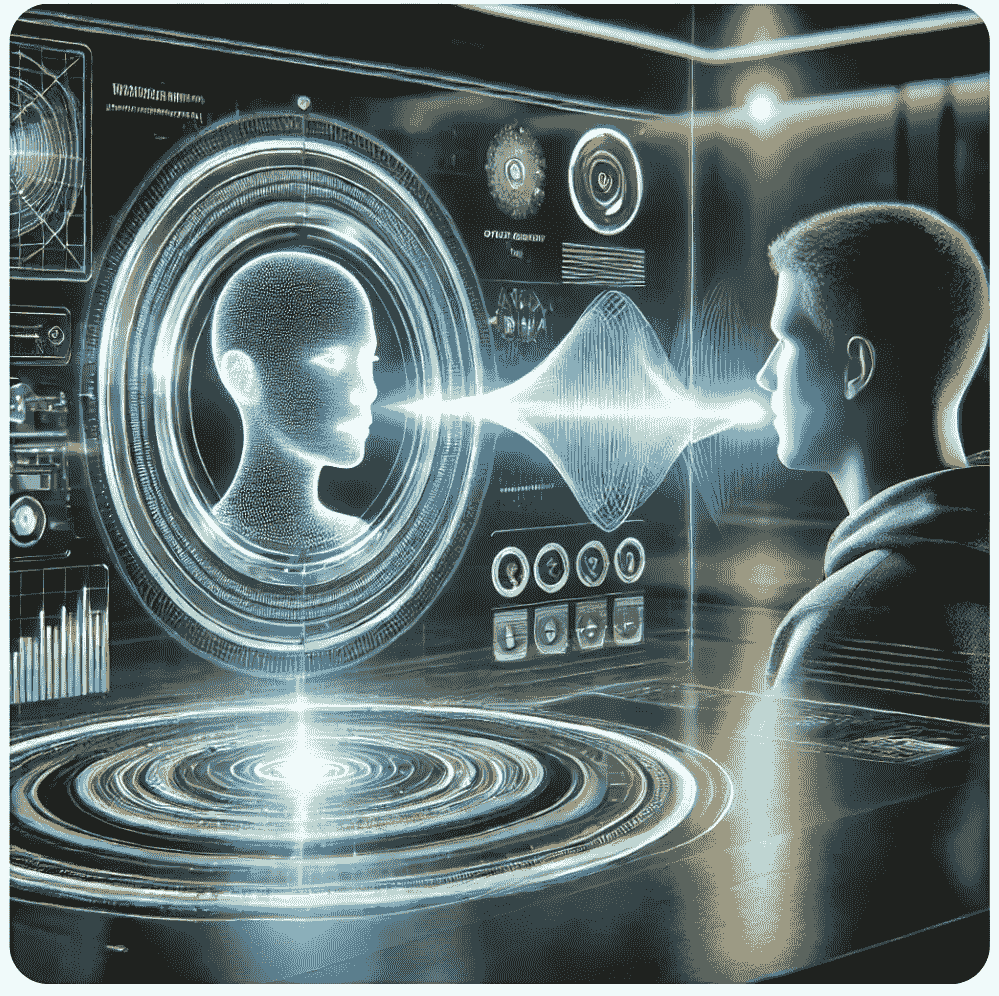

# 人工智能如何很快将人机交互带入新境界

> 原文：[`towardsdatascience.com/how-ai-could-soon-take-human-computer-interaction-to-new-levels-ecba1052a496?source=collection_archive---------6-----------------------#2024-08-28`](https://towardsdatascience.com/how-ai-could-soon-take-human-computer-interaction-to-new-levels-ecba1052a496?source=collection_archive---------6-----------------------#2024-08-28)

## 随着人工智能模型在语音识别和合成、文本处理以及多模态领域达到卓越水平，终极的语音用户界面可能很快会无处不在。

 [LucianoSphere (Luciano Abriata, PhD)](https://lucianosphere.medium.com/?source=post_page---byline--ecba1052a496--------------------------------)

·发表于 [Towards Data Science](https://towardsdatascience.com/?source=post_page---byline--ecba1052a496--------------------------------) ·18 分钟阅读 ·2024 年 8 月 28 日

--

语音用户界面（VUI），用于基于自然语言的语音人机交互，如 Dall-E 3 通过 ChatGPT 所构想的那样。

那是一个典型的周五下午，正值一周忙碌工作结束时，我与我的朋友兼同事陷入了一场激烈的讨论。他是一个“硬核”工程师、网站程序员和设计师，已经在网络开发领域奋战了十多年。作为一个以高效和对每行代码的控制为傲的人，尤其是总是把用户和用户体验放在心上的人，我的朋友对我提议语音接口很快就会成为常态的想法嗤之以鼻……

“语音接口？它们还不成熟、笨拙，说实话，有点吓人”，他说这话时并没有使用这些确切的词语，但他的意思无疑是如此，他也表达了科技界许多人共享的这种情绪。而这话是他在某种程度上已经被我说服之后说的，也许有 30%到 50%的可能性，甚至更大程度地接受了我们为分子图形和建模设计的增强现实/虚拟现实工具，的确需要这样的种类的人机交互，因为用户的双手是忙碌的……
