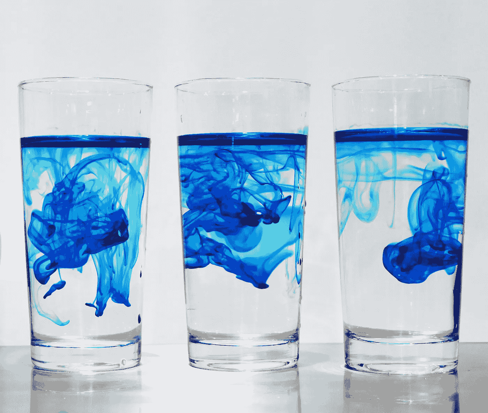
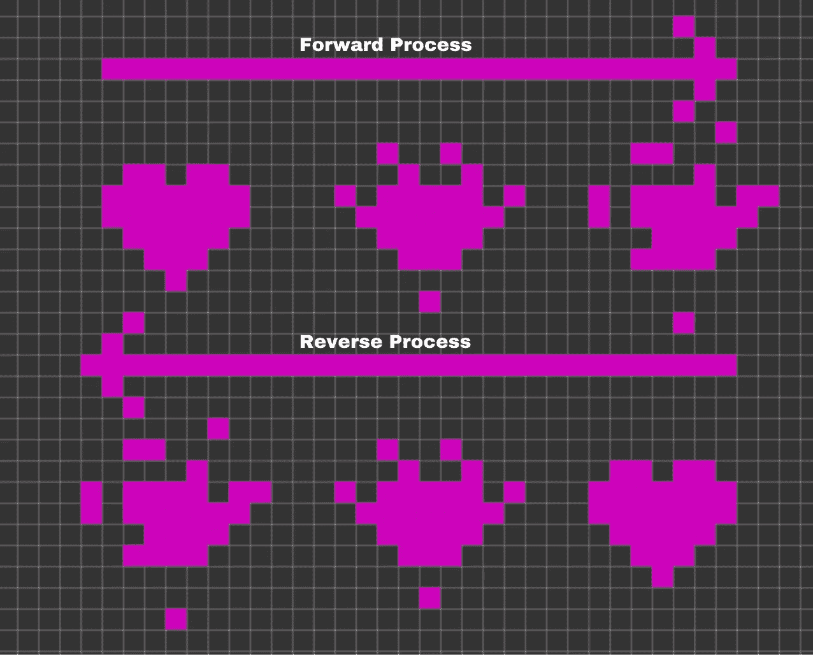
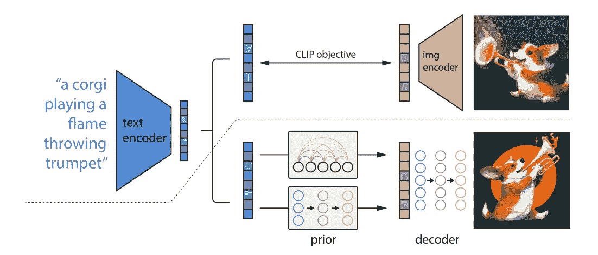
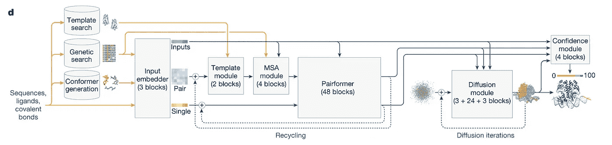
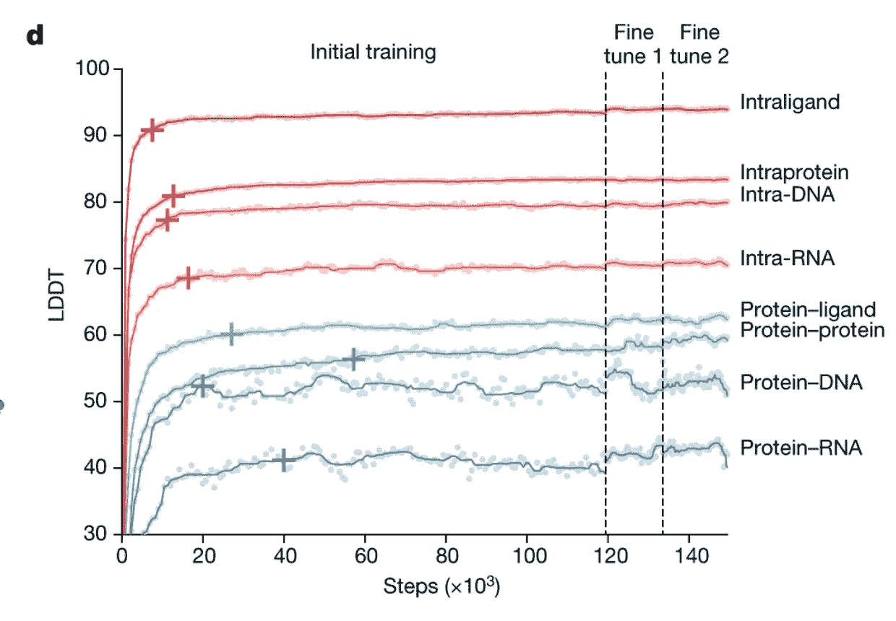

# AlphaFold 3 与 DALLE 2 的相似性及其他启示

> 原文：[`towardsdatascience.com/how-alphafold-3-is-like-dalle-2-and-other-learnings-1f809010afc7?source=collection_archive---------6-----------------------#2024-10-24`](https://towardsdatascience.com/how-alphafold-3-is-like-dalle-2-and-other-learnings-1f809010afc7?source=collection_archive---------6-----------------------#2024-10-24)

来自 [Unsplash](https://unsplash.com/photos/three-drinking-glasses-Y1ge0B9_oGE) 的扩散（字面意思）

## 为机器学习工程师理解生物领域的 AI 应用提供帮助

 [Meghan Heintz](https://medium.com/@meghanheintz?source=post_page---byline--1f809010afc7--------------------------------)

·发表于 [Towards Data Science](https://towardsdatascience.com/?source=post_page---byline--1f809010afc7--------------------------------) ·阅读时间 6 分钟·2024 年 10 月 24 日

--

在上一篇文章中，我们探讨了 [AlphaFold 2 与 BERT](https://medium.com/towards-data-science/alphafold-2-through-the-context-of-bert-78c9494e99af) 是如何通过 transformer 架构相互联系的。在这篇文章中，我们将学习最新版本的 [AlphaFold 3](https://www.nature.com/articles/s41586-024-07487-w)（以下简称 AlphaFold）是如何与 DALLE 2（以下简称 DALLE）更加相似的，并深入了解它的架构和训练方面的其他变化。

# 这有什么联系？

AlphaFold 和 DALLE 是另一个例子，展示了不同的应用场景如何通过跨领域的架构学习受益。DALLE 是一个文本生成图像的模型，能够根据文本提示生成图像。而 AlphaFold 3 是一个预测生物分子相互作用的模型。这两个模型的应用听起来似乎差异极大，但它们都依赖于扩散模型架构。

因为推理图像和文本比生物分子相互作用更直观，我们将首先探讨 DALLE 的应用。然后我们将了解 AlphaFold 如何应用相同的概念。

# 扩散模型

理解扩散模型的隐喻：考虑追踪一滴染料在一杯水中的起源。当染料扩散时，它在液体中随机移动，直到均匀分布。要追溯到初始滴落的位置，你必须一步步重建它的路径，因为每一次移动都依赖于前一步。如果你一遍又一遍地重复这个实验，你将能够建立一个模型来预测染料的运动。

更具体地说，扩散模型被训练以预测并去除数据集中的噪声。然后在推理过程中，模型使用随机噪声生成新的样本。该架构包括三个核心组件：前向过程、逆向过程和采样过程。前向过程从训练数据开始，并在每个时间步加入噪声。正如你所预料的那样，逆向过程在每个步骤去除噪声。采样过程（或推理）执行逆向过程，使用训练好的模型和噪声调度，将初始的随机噪声输入转化为一个结构化的数据样本。

前向和逆向过程的简化示意图，其中一个像素化的心形图像添加了噪声，然后又去除噪声恢复到原始形状。（作者创作）

# DALLE 和扩散

DALLE 将扩散模型架构融入两个主要组件：先验和解码器，并移除了其前身的自回归模块。先验模型接收由[CLIP](https://arxiv.org/abs/2103.00020)生成的文本嵌入（CLIP 是一个在图像和文本说明数据集上训练的模型，称为对比语言-图像预训练），并创建图像嵌入。在训练过程中，先验会接收一个文本嵌入和一个带噪声的图像嵌入版本。先验学习一步步去噪图像嵌入。这个过程使模型能够学习图像嵌入的分布，表示给定文本提示的可能图像的多样性。

解码器从结果图像嵌入生成图像，起始于随机噪声图像。逆扩散过程在每个时间步根据噪声调度，使用图像嵌入（来自先验）迭代地去除图像中的噪声。时间步嵌入告诉模型当前去噪过程的阶段，帮助其根据与最终步骤的接近程度调整去除的噪声量。

虽然 DALLE 2 使用扩散模型来生成图像，但其前身 DALLE 1 依赖自回归方法，基于文本提示依次预测图像标记。这种方法在计算效率上远不如扩散模型，需要更复杂的训练和推理过程，难以生成高分辨率图像，且常常产生伪影。

它的前身也没有使用 CLIP。相反，DALLE 1 直接学习文本-图像表示。CLIP 嵌入的引入统一了这些表示，使得文本到图像的表示更加稳健。

来自 OpenAI 团队的[基于 CLIP 潜在空间的层次文本条件图像生成](https://arxiv.org/pdf/2204.06125)中 DALLE 2 架构的高层次概述

# AlphaFold 如何使用扩散

虽然 DALLE 使用扩散帮助生成详细的视觉内容，但 AlphaFold 在生物分子结构预测中利用了类似的原理（不再仅仅是蛋白质折叠！）。

AlphaFold 2 不是一个生成模型，因为它是从给定的输入序列直接预测结构。由于引入了扩散模块，AlphaFold 3 是一个生成模型。就像 DALLE 一样，噪声被采样，然后反复去噪，最终生成一个结构。

扩散模块通过替代结构模块被纳入模型。这一架构变化大大简化了模型，因为结构模块预测氨基酸特定的框架和侧链扭转角，而扩散模块预测原子的原始坐标。这消除了推理过程中的几个中间步骤。

用于推理的 AF3 架构，展示了扩散模块的位置。从[AlphaFold 3 对生物分子相互作用的精确结构预测](https://www.nature.com/articles/s41586-024-07487-w)

移除这些中间步骤的动力源于本次模型迭代的训练数据范围大幅增加。AlphaFold 2 只在蛋白质结构上进行训练，而 AlphaFold 3 是一个“多模态”模型，能够预测包括蛋白质、核酸、小分子、离子和修饰残基在内的复合物的联合结构。如果模型仍然使用结构模块，它将需要大量关于化学键和立体化学的复杂规则来创建有效的结构。

扩散不需要这些规则的原因是它可以在粗粒度和细粒度层面上应用。对于高噪声水平，模型侧重于捕捉全局结构，而在低噪声水平时，它会细化细节。当噪声最小时，模型会优化结构的局部细节，例如原子的位置和它们的取向，这对精确的分子建模至关重要。这意味着该模型可以轻松处理不同类型的化学成分，而不仅仅是标准的氨基酸或蛋白质结构。

与不同类型的化学成分进行合作的好处似乎在于，模型可以从其他类型的结构（如蛋白质-配体界面）中学到更多关于蛋白质结构的信息。看起来，整合多样化的数据类型有助于模型在不同任务之间更好地推广。这种改进类似于[Gemini](https://blog.google/technology/ai/google-gemini-next-generation-model-february-2024/)在结合图像和视频数据后，其文本理解能力的提升。

# AlphaFold 的其他重要变化

**MSA（多序列比对）的作用显著降低。** AF2 evoformer 被更简单的 pairformer 模块取代（从 48 个模块减少到 4 个模块）。正如你可能还记得我上一篇文章中提到的，MSA 曾被认为有助于模型学习哪些氨基酸序列在进化上是重要的。实验变化表明，降低 MSA 的重要性对模型准确性的影响有限。

**必须对抗幻觉问题。** 生成模型非常令人兴奋，但它们也带来了幻觉的问题。研究人员发现，模型会在无结构区域虚构出看起来合理的结构。为了解决这个问题，使用了交叉蒸馏方法，通过[AlphaFold-Multimer (v.2.3)](https://deepmind.google/discover/blog/a-glimpse-of-the-next-generation-of-alphafold/)增强了训练数据，加入了预测的结构。交叉蒸馏方法帮助模型更好地区分结构化和无结构区域。这有助于模型理解何时避免添加虚构的细节。

**某些相互作用比其他相互作用更容易预测。** 为每种交互类型调整了采样概率，即对较简单的类型采样较少，这些类型可以通过相对较少的训练步骤来学习，而复杂类型则相反。这有助于避免在不同类型之间的欠拟合和过拟合。

初始训练和微调阶段的训练曲线展示了不同类别如何在不同训练步骤下达到最佳表现。因此，训练数据被子抽样，以防止按类别出现欠拟合和过拟合。来自[AlphaFold 3 的生物分子相互作用的准确结构预测](https://www.nature.com/articles/s41586-024-07487-w)

# 高级学习

+   DALLE 2 和 AlphaFold 3 通过使用扩散模块对其前代模型进行了改进，同时简化了它们的架构。

+   在更广泛的数据类型上进行训练，使生成模型更加稳健。通过多样化 AlphaFold 训练数据集中的结构类型，模型能够改善蛋白质折叠预测，并能够推广到其他生物分子相互作用。类似地，用于训练 CLIP 的文本-图像对的多样性也改善了 DALLE。

+   噪声调度是训练扩散模型时一个重要的调节参数。调整噪声的强度会影响模型学习粗略和精细细节的能力。这样做大大简化了 AlphaFold 的设计，因为它消除了对侧链扭转角度等中间预测的需求。

再次感谢你的阅读，敬请期待下期内容。在那之前，继续学习和探索吧。
