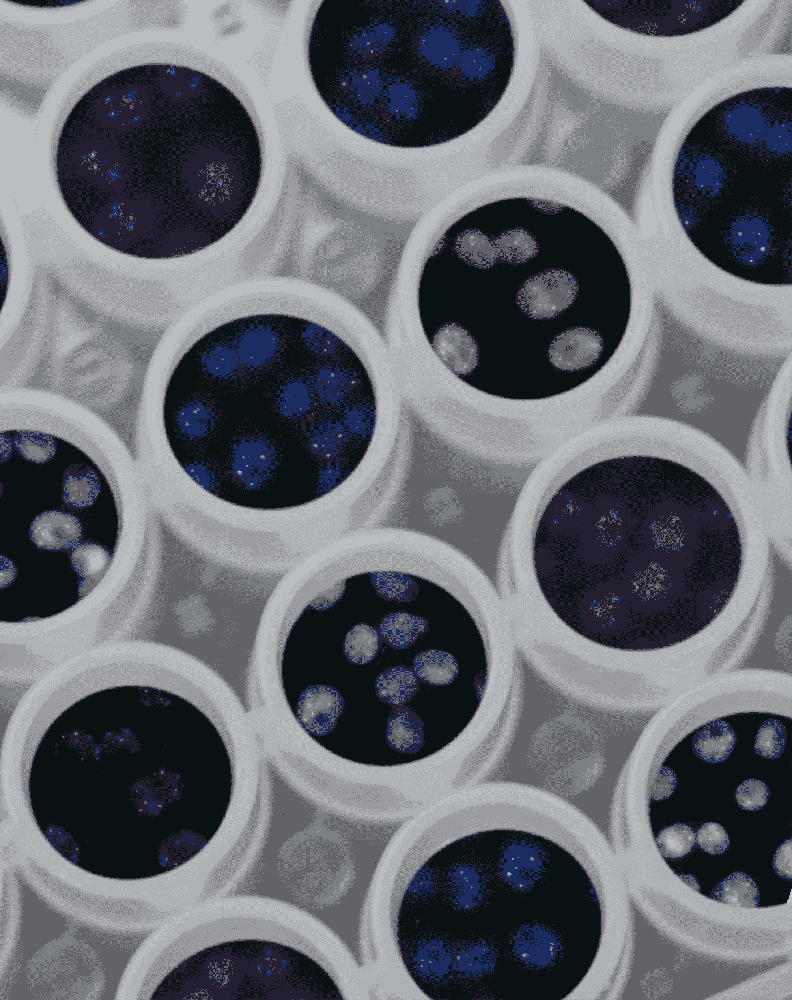

# 人工智能如何加剧科学和技术中的再现性危机

> 原文：[`towardsdatascience.com/how-artificial-intelligence-might-be-worsening-the-reproducibility-crisis-in-science-and-technology-47134f639f24?source=collection_archive---------3-----------------------#2024-01-03`](https://towardsdatascience.com/how-artificial-intelligence-might-be-worsening-the-reproducibility-crisis-in-science-and-technology-47134f639f24?source=collection_archive---------3-----------------------#2024-01-03)

## 通过一些具体的例子进行讨论，并勾画出如何开发更好的 AI 系统的广泛指南

 [LucianoSphere (Luciano Abriata, PhD)](https://lucianosphere.medium.com/?source=post_page---byline--47134f639f24--------------------------------)

·发表于[Towards Data Science](https://towardsdatascience.com/?source=post_page---byline--47134f639f24--------------------------------) ·13 分钟阅读·2024 年 1 月 3 日

--

图片来源：[美国国家癌症研究所](https://unsplash.com/@nci?utm_source=medium&utm_medium=referral)于[Unsplash](https://unsplash.com/?utm_source=medium&utm_medium=referral)

**人工智能已成为科学研究中的一个重要工具，但人们越来越担心这些强大工具的误用正在导致科学及其技术应用中的再现性危机。让我们探讨导致这一不利影响的根本问题，这不仅适用于科学研究中的 AI，也适用于 AI 的开发和一般利用。**

人工智能（Artificial Intelligence，简称 AI）已成为社会和技术中不可或缺的一部分，每个月都在医学、工程学和科学领域找到多个新应用。特别是，AI 已成为科学研究和新技术产品开发中非常重要的工具。它使研究人员能够识别数据中可能不易被人眼察觉的模式，以及其他类型的计算数据处理。所有这些无疑引发了一场革命，这场革命在许多情况下以改变游戏规则的软件解决方案的形式呈现出来。在众多例子中，一些像[可以应用于](https://pub.towardsai.net/provocatively-microsoft-researchers-say-they-found-sparks-of-artificial-intelligence-in-gpt-4-e1120f8bd058)的大型语言模型…
