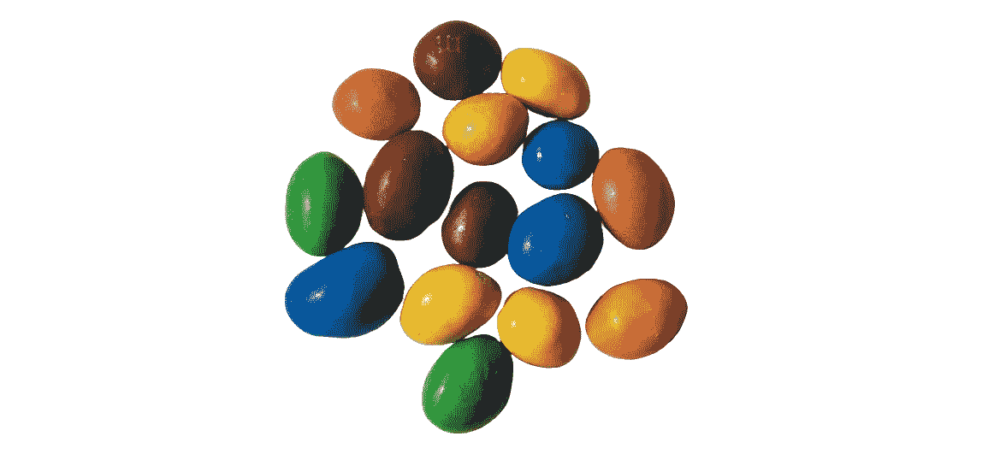
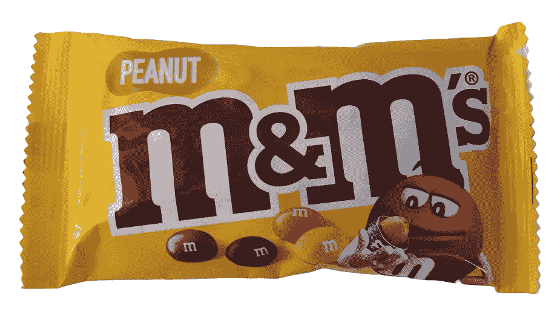

# 你的回归模型有多偏差？

> 原文：[`towardsdatascience.com/how-biased-is-your-regression-model-4ef6c1495b77?source=collection_archive---------0-----------------------#2024-09-13`](https://towardsdatascience.com/how-biased-is-your-regression-model-4ef6c1495b77?source=collection_archive---------0-----------------------#2024-09-13)

图片来源：作者

## 深入探讨回归模型中的偏差原因、影响及补救措施

 [Sachin Date](https://timeseriesreasoning.medium.com/?source=post_page---byline--4ef6c1495b77--------------------------------)

·发布于[Towards Data Science](https://towardsdatascience.com/?source=post_page---byline--4ef6c1495b77--------------------------------) ·阅读时长 27 分钟·2024 年 9 月 13 日

--

这一包花生 M&M 糖的重量是 45 克。

(图片来源：作者)

Mars 公司可能已经精确地定价了这一包。但 Mars 是如何知道要将多少颗花生 M&M 糖放入一个 45 克重的包裹中的呢？

我们可以简单地将 45 克除以一颗花生 M&M 糖的平均重量，然后四舍五入到最接近的整数（呃！）。

但这又引出了另一个问题：

一颗花生 M&M 糖的平均重量是多少？

到今年年底，Mars 公司工厂将生产出约 1500 亿颗 M&M 糖。明年生产的数量会更多，未来几年也会继续增加。那么，你如何知道一颗 M&M 糖的平均重量呢？

*顺便说一下，究竟是谁在吃掉这些 M&M 糖？*

无论如何，计算一颗 M&M 糖的平均重量——所谓的**总体均值**——几乎是不可能的。

如果我们无法得知它的值，那么我们必须估计它，而估计总是伴随着误差。
