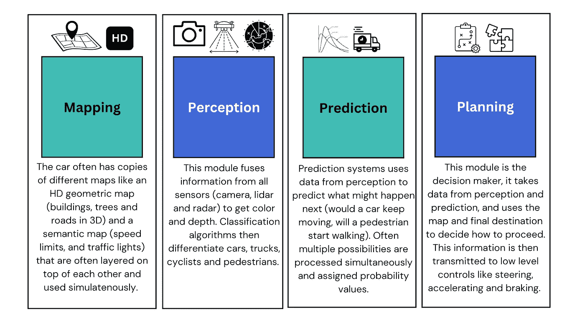
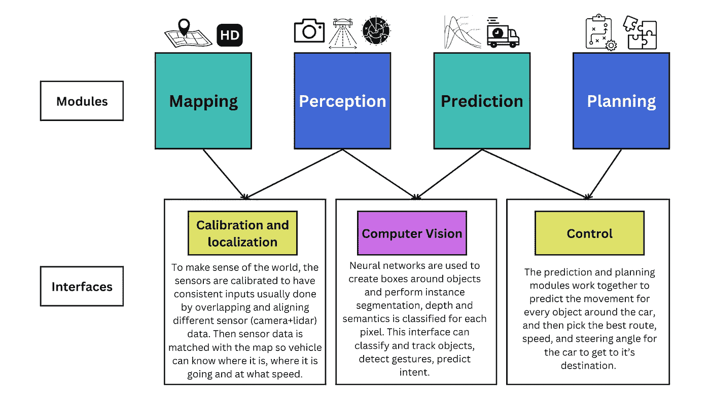
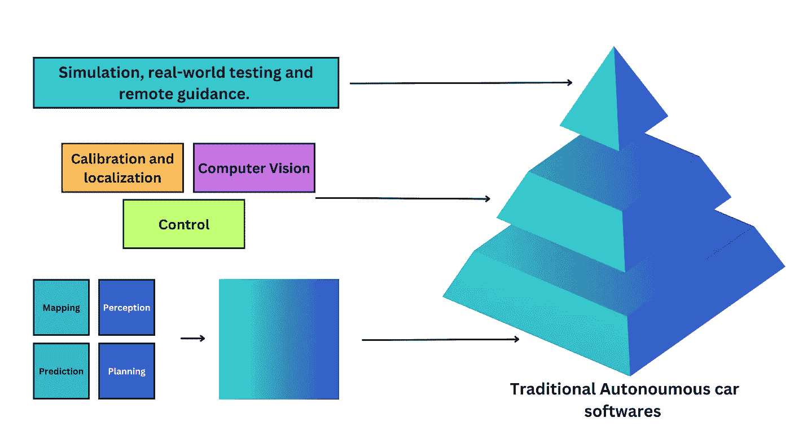
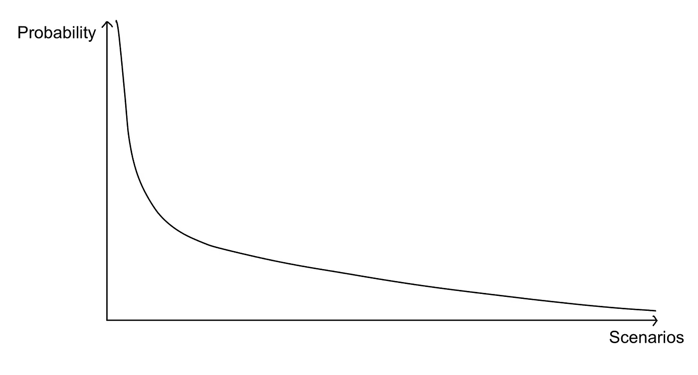
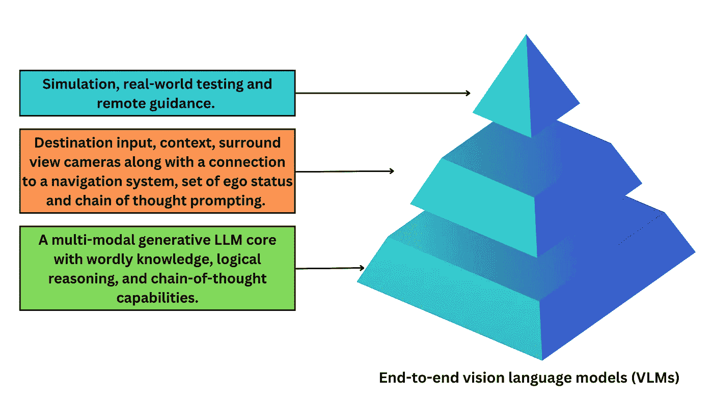

# 自动驾驶汽车如何更好地工作？

> 原文：[`towardsdatascience.com/how-can-self-driving-cars-work-better-b3b9ba035d38?source=collection_archive---------5-----------------------#2024-11-28`](https://towardsdatascience.com/how-can-self-driving-cars-work-better-b3b9ba035d38?source=collection_archive---------5-----------------------#2024-11-28)

## **Waymo 的 EMMA 及其他端到端驾驶系统的深远影响**

 [Ramsha Ali](https://ramsha4103.medium.com/?source=post_page---byline--b3b9ba035d38--------------------------------)

·发布于[Towards Data Science](https://towardsdatascience.com/?source=post_page---byline--b3b9ba035d38--------------------------------) ·7 分钟阅读·2024 年 11 月 28 日

--

图片由[Andy Li](https://unsplash.com/@andylid0?utm_source=medium&utm_medium=referral)提供，来源于[Unsplash](https://unsplash.com/?utm_source=medium&utm_medium=referral)

想象一下你是一位饥饿的登山者，迷失在远离城市的小径上。走了很多英里后，你终于发现了一条道路，并看到一辆车的轮廓正向你驶来。你心里准备了一番同情话语，想向司机求得帮助，但当你意识到这辆车是自动驾驶时，你的希望转为恐惧。车里没有人可以展示你的可信度，或向其寻求同情。

在决定不冲到车前之后，你尝试招车，但汽车的软件将你识别为一个奇怪的行人，迅速从你身边驶过。

有时候，仅仅拥有一个紧急呼叫按钮或一个实时帮助热线 [以满足加利福尼亚州法律要求] 是不够的。某些极端情况需要干预，随着自动驾驶汽车在我们道路上的普及，这类情况将会变得更加频繁。像这样的极端情况尤其棘手，因为它们需要逐案处理。解决这些问题不像编写一个困惑脸表情分类器那么简单，除非你想让人们摆出困惑的表情来免费搭车。也许汽车可以利用人工支持，Zoox 所称的“远程引导”，以筛选出真正的案例，同时确保系统不被滥用，这种现实而无聊的解决方案可以奏效……至少现在是这样。自动驾驶汽车研究中的一个有趣进展为更复杂的解决方案提供了钥匙。

通常，自动驾驶算法通过将驾驶任务分解为多个模块来实现，并在这些模块上不断提高技能。不同公司可能有不同的分解方式，但 Waymo 和 Zoox 使用的常见分解方式包括：地图绘制、感知、预测和规划模块。

图 1：传统自动驾驶汽车核心的基础模块。*来源：作者提供的图片。*

这些模块每个只专注于它们被大量训练的某一功能，这使得它们更容易调试和优化。然后，在这些模块之上设计接口，将它们连接起来，使其协同工作。

图 2：模块如何通过接口连接的简化示意图。*来源：作者，Ramsha Ali (@ramsha4103) 提供的图片。*

通过接口连接这些模块后，整个管道将进一步在模拟环境中进行训练，并在现实世界中进行测试。

图 3：自动驾驶汽车中不同软件模块如何结合在一起。*来源：作者，Ramsha Ali (@ramsha4103) 提供的图片。*

这种方法有效，但效率较低。由于每个模块都是单独训练的，接口常常难以让它们良好地协同工作。这意味着汽车在面对新环境时适应能力较差。通常，模块间会积累误差，且这些误差由于不灵活的预设规则而变得更严重。解决方案似乎是让它们在不太可能的场景上训练，直觉上这看起来是可行的，但实际上却并不可行。原因在于，驾驶场景遵循长尾分布。

图 4：长尾分布，展示了在不太可能的场景上训练汽车时，随着训练场景的增加，回报逐渐递减。*来源：作者，Ramsha Ali (@ramsha4103) 提供的图片。*

这意味着我们拥有最有可能的场景，容易训练，但也存在许多不太可能的场景，尝试在这些场景上训练模型会导致极高的计算成本和时间消耗，而得到的回报却微乎其微。比如鹰嘴俯冲下落，突发地陷形成，电力杆倒塌，或者跟在一辆刹车灯熔断的车后面行驶。对于一辆仅在高度相关数据上训练、没有任何世界知识、且难以适应新解决方案的汽车来说，这意味着必须不断追赶，去考虑所有这些不可能发生的场景，或者更糟的是，当出现严重问题时，不得不强行添加更多训练场景。

两周前，Waymo 研究团队发布了一篇关于 EMMA 的论文，这是一个端到端的多模态模型，可以从根本上改变问题的处理方式。这个端到端模型与其传统的模块化组件不同，它将所有的世界知识都集成在一个全知的 LLM 核心中，然后进一步微调以实现驾驶功能。例如，Waymo 的 EMMA 建立在 Google 的 Gemini 之上，而 DriveGPT 则建立在 OpenAI 的 ChatGPT 之上。

这个核心模型随后使用精心设计的提示进行训练，以提供上下文并提出问题，推导出其空间推理、道路图估算和场景理解能力。还要求 LLM 提供解码后的可视化结果，分析文本解释是否与 LLM 在模拟中可能的行为一致。通过语言输入的多模态融合，使得训练过程变得更加简化，因为可以使用单一模型同时训练多个任务，从而通过简单变更任务提示实现任务特定的预测。

图 5：端到端视觉语言模型如何被训练来驾驶。*来源：作者图像，Ramsha Ali（@ramsha4103）*

另一个有趣的输入变量通常是一个自我变量，这与车辆是否感觉优越无关，而是存储诸如车辆位置、速度、加速度和方向等数据，以帮助车辆规划出一条平稳一致的驾驶路线。这通过更加平滑的行为过渡和与周围代理的连续一致互动来提升性能。

这些端到端模型在通过模拟测试时，能够在公共基准测试中提供最先进的性能。GPT 知道如何填写 1040 表格，这如何帮助它开车更好呢？丰富的世界知识和逻辑推理能力意味着在新颖情况下的更好表现。该模型还允许我们在多个任务上共同训练，相较于单任务模型，其性能提高了超过 5.5%，尽管输入量更少（没有高清地图、没有接口、也没有激光雷达或雷达的访问权限）。它们在理解手势、转向信号或其他司机的口头指令方面也表现得更好，并且在社交上更善于评估周围汽车的驾驶行为和攻击性，并相应调整预测。你还可以要求它们为决策提供依据，从而绕过它们的“黑箱”特性，使得决策的验证和可追溯性变得更加容易。

除此之外，LLM（大语言模型）还可以帮助创建它们可以进行测试的模拟环境，因为它们可以为图像加标签，并能接收文本输入来生成图像。这可以显著简化构建一个易于控制的环境，用于测试和验证自动驾驶系统的决策边界，并模拟各种驾驶情境。

这种方法仍然较慢，能输入的图像帧有限，并且计算要求较高，但随着我们的 LLM（大语言模型）变得更好、更快、计算成本更低，并且能结合激光雷达和雷达等附加模态，我们将看到这种多模态方法在三维物体检测质量上以指数级的速度超过专门的专家模型，但这可能还需要几年时间。

随着端到端自动驾驶汽车行驶时间的增加，观察它们对周围人类驾驶员的影响，以及在每个城市中发展出独特的“自动气质”或个性，将会很有趣。这将成为一个全球驾驶行为的迷人案例研究。更为迷人的是，看看它们如何影响周围的人类驾驶员。

一个端到端系统还意味着能够与汽车进行对话，就像你与 ChatGPT 对话一样，或者能够在街上走到一辆车前并向它询问方向。这也意味着我将听到更少来自朋友的故事，他们发誓再也不坐 Waymo 了，因为它差点撞上了一辆超速行驶的救护车，或者没有为低飞的鸟停下。

想象一辆自动驾驶汽车不仅知道自己在什么时间、什么地点（在午夜接近的荒凉高速公路上），还理解这意味着什么（行人不合时宜且可能处于危险中）。想象一辆汽车不仅能够呼叫帮助（因为加利福尼亚州法律要求它这么做），而且能够真正提供帮助，因为它可以从伦理角度做出逻辑推理。那样的车，才值得一试。

**参考文献：**

Chen, L., Sinavski, O., Hünermann, J., Karnsund, A., Willmott, A. J., Birch, D., Maund, D., & Shotton, J. (2023). *Driving with LLMs: Fusing Object-Level Vector Modality for Explainable Autonomous Driving* (arXiv:2310.01957). arXiv. [`doi.org/10.48550/arXiv.2310.01957`](https://doi.org/10.48550/arXiv.2310.01957)

Cui, C., Ma, Y., Cao, X., Ye, W., Zhou, Y., Liang, K., Chen, J., Lu, J., Yang, Z., Liao, K.-D., Gao, T., Li, E., Tang, K., Cao, Z., Zhou, T., Liu, A., Yan, X., Mei, S., Cao, J., … Zheng, C. (2024). A Survey on Multimodal Large Language Models for Autonomous Driving. *2024 IEEE/CVF Winter Conference on Applications of Computer Vision Workshops (WACVW)*, 958–979. [`doi.org/10.1109/WACVW60836.2024.00106`](https://doi.org/10.1109/WACVW60836.2024.00106)

Fu, D., Lei, W., Wen, L., Cai, P., Mao, S., Dou, M., Shi, B., & Qiao, Y. (2024). *LimSim++: A Closed-Loop Platform for Deploying Multimodal LLMs in Autonomous Driving* (arXiv:2402.01246). arXiv. [`doi.org/10.48550/arXiv.2402.01246`](https://doi.org/10.48550/arXiv.2402.01246)

Hwang, J.-J., Xu, R., Lin, H., Hung, W.-C., Ji, J., Choi, K., Huang, D., He, T., Covington, P., Sapp, B., Zhou, Y., Guo, J., Anguelov, D., & Tan, M. (2024). *EMMA: End-to-End Multimodal Model for Autonomous Driving* (arXiv:2410.23262). arXiv. [`doi.org/10.48550/arXiv.2410.23262`](https://doi.org/10.48550/arXiv.2410.23262)

*“全栈”：自动驾驶背后的故事*。(n.d.). Zoox. 取自 2024 年 11 月 26 日，[`zoox.com/autonomy`](https://zoox.com/autonomy)

Wang, B., Duan, H., Feng, Y., Chen, X., Fu, Y., Mo, Z., & Di, X. (2024). *大语言模型能否理解自动驾驶游戏中的社会规范？* (arXiv:2408.12680). arXiv. [`doi.org/10.48550/arXiv.2408.12680`](https://doi.org/10.48550/arXiv.2408.12680)

Wang, Y., Jiao, R., Zhan, S. S., Lang, C., Huang, C., Wang, Z., Yang, Z., & Zhu, Q. (2024). *利用大语言模型赋能自动驾驶：安全视角* (arXiv:2312.00812). arXiv. [`doi.org/10.48550/arXiv.2312.00812`](https://doi.org/10.48550/arXiv.2312.00812)

Xu, Z., Zhang, Y., Xie, E., Zhao, Z., Guo, Y., Wong, K.-Y. K., Li, Z., & Zhao, H. (2024). *DriveGPT4: 通过大语言模型实现可解释的端到端自动驾驶* (arXiv:2310.01412). arXiv. [`doi.org/10.48550/arXiv.2310.01412`](https://doi.org/10.48550/arXiv.2310.01412)

Yang, Z., Jia, X., Li, H., & Yan, J. (n.d.). *LLM4Drive：大语言模型在自动驾驶中的应用综述*。
