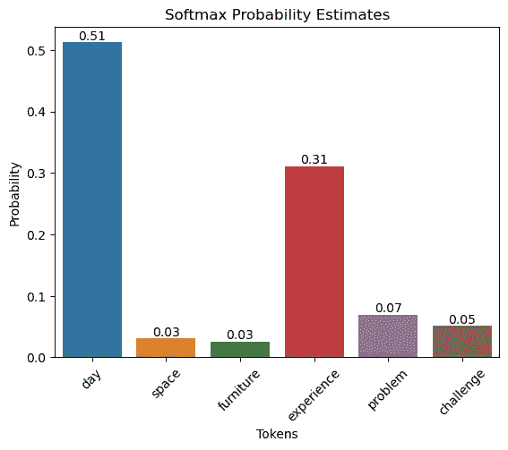
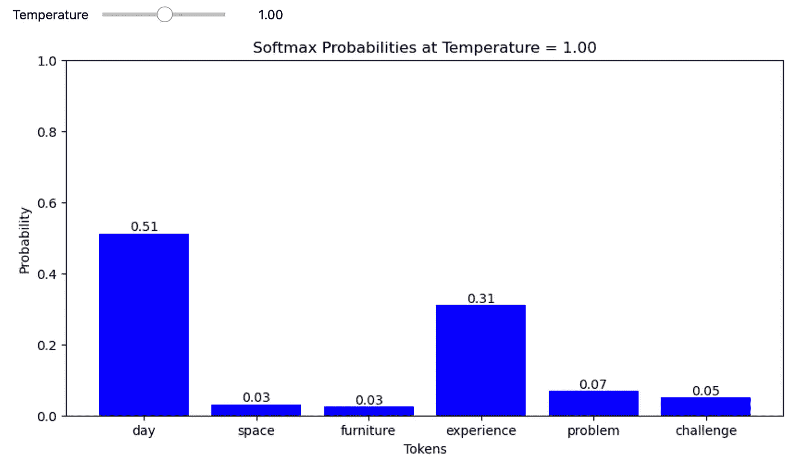
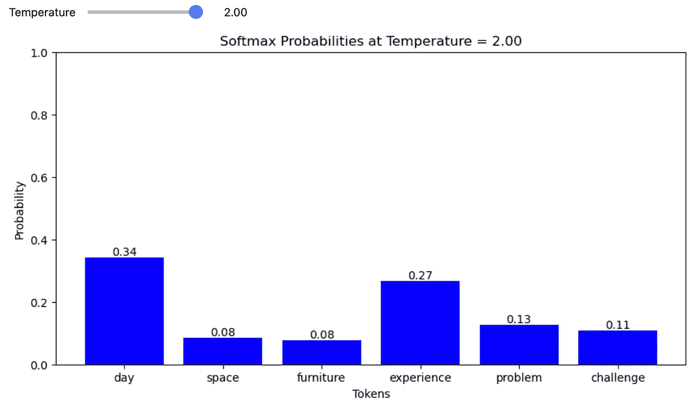
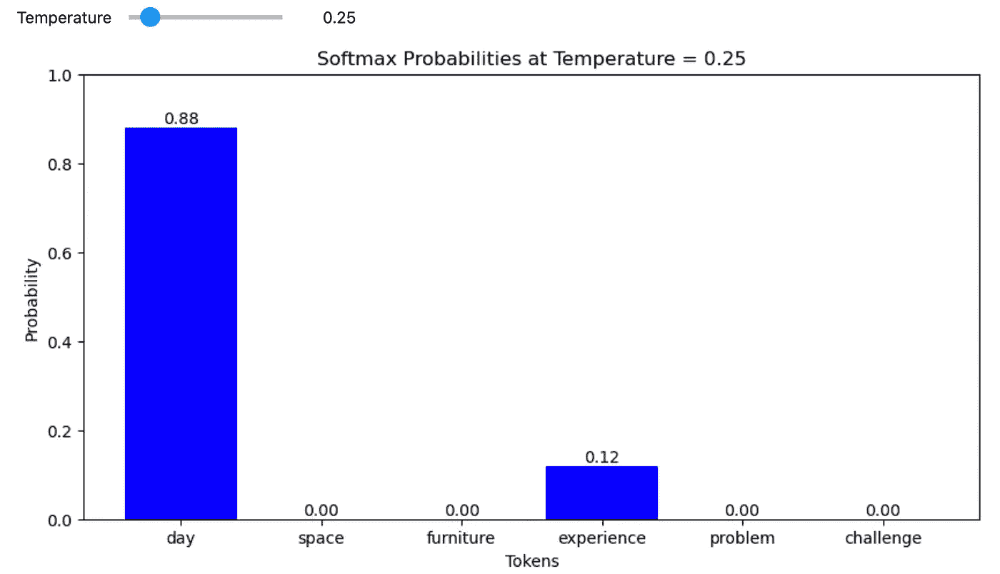

# 温度如何影响 LLMs 中的下一个标记预测？

> 原文：[`towardsdatascience.com/how-does-temperature-impact-next-token-prediction-in-llms-779bd908f2cf?source=collection_archive---------1-----------------------#2024-05-06`](https://towardsdatascience.com/how-does-temperature-impact-next-token-prediction-in-llms-779bd908f2cf?source=collection_archive---------1-----------------------#2024-05-06)

[](https://ankur-m.medium.com/?source=post_page---byline--779bd908f2cf--------------------------------)[](https://towardsdatascience.com/?source=post_page---byline--779bd908f2cf--------------------------------) [Ankur Manikandan](https://ankur-m.medium.com/?source=post_page---byline--779bd908f2cf--------------------------------)

·发布于[Towards Data Science](https://towardsdatascience.com/?source=post_page---byline--779bd908f2cf--------------------------------) ·阅读时间 4 分钟·2024 年 5 月 6 日

--

**简而言之**

1\. 在温度为 1 时，概率值与标准 softmax 函数得出的概率值相同。

2\. 提高温度会增加较不可能的标记的概率，从而扩展模型预测下一个标记的潜在候选范围（或多样性）。

3\. 降低温度则会使最可能标记的概率接近 1.0，从而增强模型的信心。减少温度有效地消除了模型中的不确定性。

[**Google Colab 笔记本**](https://colab.research.google.com/drive/1G6XZ_0DsHTZQBppjlgVM-ICdR6yz4g7m?usp=sharing)**.**

**介绍**

大型语言模型（LLMs）是多功能的生成模型，适用于广泛的任务。它们可以生成一致、可重复的输出，也可以通过将不太可能的单词组合在一起生成创造性内容。温度设置允许用户微调模型的输出，控制预测的可预见性程度。

让我们通过一个假设的例子来理解温度对下一个标记预测的影响。

我们让一个大型语言模型（LLM）完成句子**“这是一个美妙的 _____。”** 假设潜在的候选标记是：

```py
|   token    | logit |
|------------|-------|
| day        |    40 |
| space      |     4 |
| furniture  |     2 |
| experience |    35 |
| problem    |    25 |
| challenge  |    15 |
```

对数值通过 softmax 函数处理，使得值的总和等于 1。实际上，softmax 函数为每个标记生成概率估计。


标准 softmax 函数

让我们在 Python 中计算概率估计值。

```py
import numpy as np
import seaborn as sns
import pandas as pd
import matplotlib.pyplot as plt
from ipywidgets import interactive, FloatSlider

def softmax(logits):
    exps = np.exp(logits)
    return exps / np.sum(exps)

data = {
    "tokens": ["day", "space", "furniture", "experience", "problem", "challenge"],
    "logits": [5, 2.2, 2.0, 4.5, 3.0, 2.7]
}
df = pd.DataFrame(data)
df['probabilities'] = softmax(df['logits'].values)
df
```

```py
| No. |   tokens   | logits | probabilities |
|-----|------------|--------|---------------|
|   0 | day        |    5.0 |      0.512106 |
|   1 | space      |    2.2 |      0.031141 |
|   2 | furniture  |    2.0 |      0.025496 |
|   3 | experience |    4.5 |      0.310608 |
|   4 | problem    |    3.0 |      0.069306 |
|   5 | challenge  |    2.7 |      0.051343 |
```

```py
ax = sns.barplot(x="tokens", y="probabilities", data=df)
ax.set_title('Softmax Probability Estimates')
ax.set_ylabel('Probability')
ax.set_xlabel('Tokens')
plt.xticks(rotation=45)
for bar in ax.patches:
    ax.text(bar.get_x() + bar.get_width() / 2, bar.get_height(), f'{bar.get_height():.2f}',
            ha='center', va='bottom', fontsize=10, rotation=0)
plt.show()
```



**带温度的 softmax 函数**定义如下：


其中 (T) 是温度，(x_i) 是输入向量 (logits) 的第 (i) 个分量，(n) 是向量中分量的数量。

```py
def softmax_with_temperature(logits, temperature):
    if temperature <= 0:
        temperature = 1e-10  # Prevent division by zero or negative temperatures
    scaled_logits = logits / temperature
    exps = np.exp(scaled_logits - np.max(scaled_logits))  # Numerical stability improvement
    return exps / np.sum(exps)

def plot_interactive_softmax(temperature):
    probabilities = softmax_with_temperature(df['logits'], temperature)
    plt.figure(figsize=(10, 5))
    bars = plt.bar(df['tokens'], probabilities, color='blue')
    plt.ylim(0, 1)
    plt.title(f'Softmax Probabilities at Temperature = {temperature:.2f}')
    plt.ylabel('Probability')
    plt.xlabel('Tokens')
    # Add text annotations
    for bar, probability in zip(bars, probabilities):
        yval = bar.get_height()
        plt.text(bar.get_x() + bar.get_width()/2, yval, f"{probability:.2f}", ha='center', va='bottom', fontsize=10)
    plt.show()

interactive_plot = interactive(plot_interactive_softmax, temperature=FloatSlider(value=1, min=0, max=2, step=0.01, description='Temperature'))
interactive_plot
```

当 T = 1 时，



在温度为 1 时，概率值与标准 softmax 函数推导出的概率值相同。

当 T > 1 时，



提高温度会膨胀不太可能出现的标记的概率，从而扩大模型下一个标记预测的潜在候选范围（或多样性）。

当 T < 1 时，



降低温度则会使最可能的标记的概率接近 1.0，从而提高模型的信心。降低温度有效地消除了模型中的不确定性。

**结论**

大型语言模型（LLMs）利用温度参数为其预测提供灵活性。模型在温度为 1 时表现得可预测，紧跟原始的 softmax 分布。提高温度会引入更多的多样性，放大不太可能的标记。相反，降低温度则使预测更加集中，通过减少不确定性来增强模型对最可能标记的信心。这种适应性使得用户可以根据不同任务调整大型语言模型的输出，在创意探索和确定性输出之间找到平衡。

*除非另有说明，所有图片均为作者提供。*
