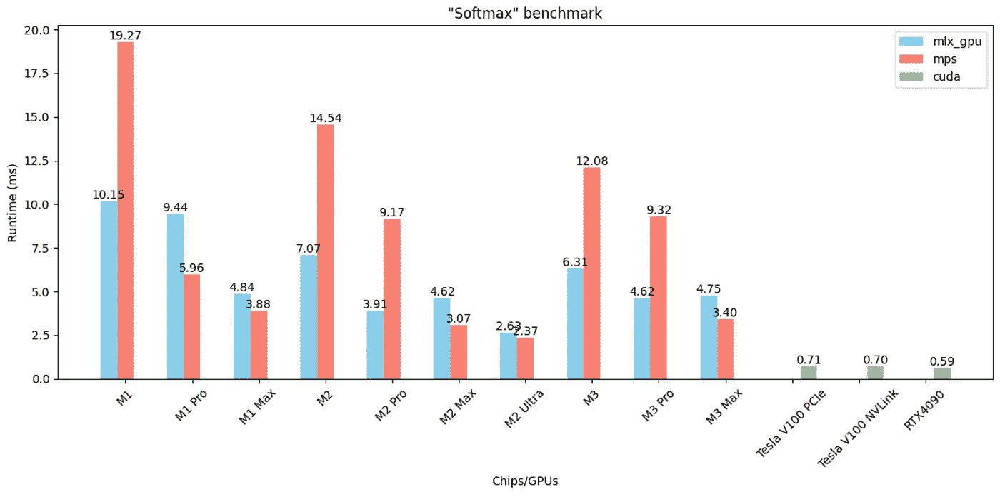

# MLX 的运行速度有多快？针对 10 款 Apple Silicon 芯片和 3 款 CUDA GPU 的全面基准测试

> 原文：[`towardsdatascience.com/how-fast-is-mlx-a-comprehensive-benchmark-on-8-apple-silicon-chips-and-4-cuda-gpus-378a0ae356a0?source=collection_archive---------5-----------------------#2024-02-02`](https://towardsdatascience.com/how-fast-is-mlx-a-comprehensive-benchmark-on-8-apple-silicon-chips-and-4-cuda-gpus-378a0ae356a0?source=collection_archive---------5-----------------------#2024-02-02)

## MLX、PyTorch MPS 和 CUDA GPU 上的主要操作和层的基准测试。

 [Tristan Bilot](https://tristanbilot.medium.com/?source=post_page---byline--378a0ae356a0--------------------------------)

·发表于[Towards Data Science](https://towardsdatascience.com/?source=post_page---byline--378a0ae356a0--------------------------------) ·6 分钟阅读·2024 年 2 月 2 日

--

作者提供的图片：软最大操作的基准测试示例

在首次发布不到两个月的时间里，Apple 的机器学习研究团队最新的创作——MLX，已经在机器学习社区取得了显著进展。令人惊讶的是，这个新框架的关注度如此之高，正如[GitHub](https://github.com/ml-explore/mlx)上的 12k 多颗星标和[Hugging Face](https://huggingface.co/mlx-community)上超过 500 名成员的不断增长的社区所证明的那样 🤗。

在[上一篇文章](https://medium.com/towards-data-science/mlx-vs-mps-vs-cuda-a-benchmark-c5737ca6efc9)中，我们展示了 MLX 在训练简单的图卷积网络（GCN）时的表现，并将其与包括**CPU**、PyTorch 的[**MPS**](https://pytorch.org/docs/stable/notes/mps.html)以及**CUDA** **GPU**在内的多种设备进行了基准测试。结果令人启发，展示了 MLX 在高效运行模型方面的潜力。

在这次探索中，我们深入探讨，旨在基准测试神经网络中常用的多个关键操作。

# 测试平台

在我们的基准测试中，每个操作都基于多种实验进行评估，这些实验在输入形状和大小上有所不同。我们已经在不同的进程中依次运行并多次测试这些操作，以确保稳定可靠的运行时度量。
