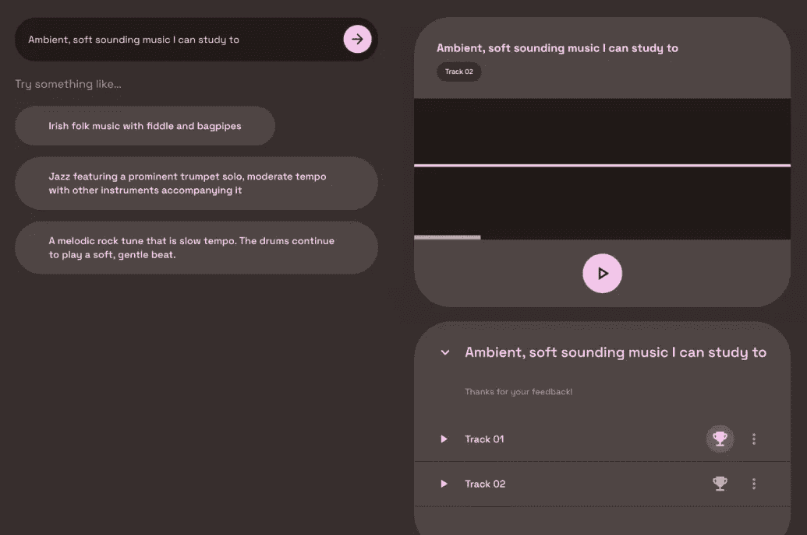
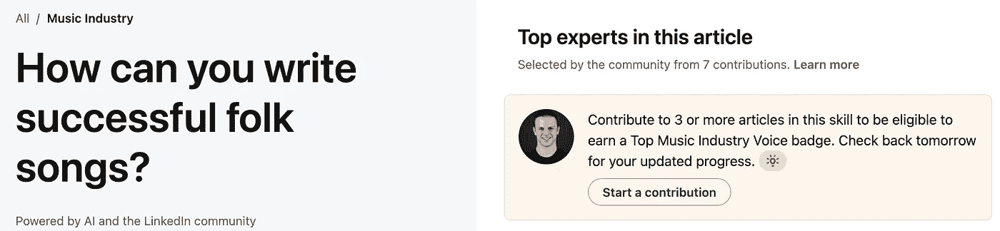
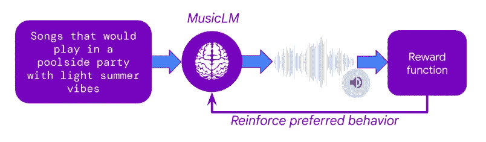
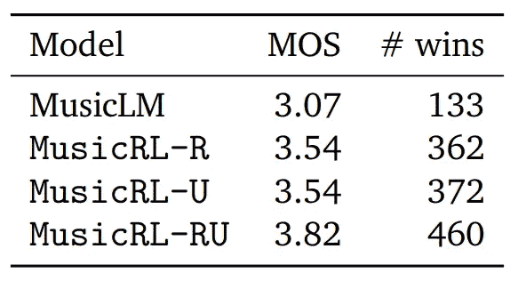

# 谷歌如何利用你的数据来改进他们的音乐 AI

> 原文：[`towardsdatascience.com/how-google-used-your-data-to-improve-their-music-ai-8948a1e85491?source=collection_archive---------10-----------------------#2024-02-28`](https://towardsdatascience.com/how-google-used-your-data-to-improve-their-music-ai-8948a1e85491?source=collection_archive---------10-----------------------#2024-02-28)

## MusicLM 根据用户偏好进行了微调

 [Max Hilsdorf](https://medium.com/@maxhilsdorf?source=post_page---byline--8948a1e85491--------------------------------)

·发表于 [Towards Data Science](https://towardsdatascience.com/?source=post_page---byline--8948a1e85491--------------------------------) ·阅读时长 7 分钟·2024 年 2 月 28 日

--

图片来自 [Firmbee.com](https://unsplash.com/@firmbee?utm_source=medium&utm_medium=referral) 由 [Unsplash](https://unsplash.com/?utm_source=medium&utm_medium=referral) 提供

# 什么是 MusicLM？

MusicLM 是谷歌的旗舰文本到音乐的 AI，最初于 2023 年初发布。即使在其基础版本中，它也代表了一个重大的突破，并让音乐行业感到震惊。然而，几周前，MusicLM 进行了**重大更新**。以下是两个选定提示的并排比较：

**提示：“带有旋律合成线和琶音的舞曲”**：

+   [**旧版 MusicLM**](https://google-research.github.io/seanet/musiclm/rlhf/audio_samples/musiclm-7.wav): [`google-research.github.io/seanet/musiclm/rlhf/audio_samples/musiclm-7.wav`](https://google-research.github.io/seanet/musiclm/rlhf/audio_samples/musiclm-7.wav)

+   [**新版 MusicLM**](https://google-research.github.io/seanet/musiclm/rlhf/audio_samples/musicrlhf-ru-7.wav): [`google-research.github.io/seanet/musiclm/rlhf/audio_samples/musicrlhf-ru-7.wav`](https://google-research.github.io/seanet/musiclm/rlhf/audio_samples/musicrlhf-ru-7.wav)

**提示：“由手风琴乐队演奏的怀旧旋律”**

+   [**旧版 MusicLM**](https://google-research.github.io/seanet/musiclm/rlhf/audio_samples/musiclm-27.wav): [`google-research.github.io/seanet/musiclm/rlhf/audio_samples/musiclm-27.wav`](https://google-research.github.io/seanet/musiclm/rlhf/audio_samples/musiclm-27.wav)

+   [**新 MusicLM**](https://google-research.github.io/seanet/musiclm/rlhf/audio_samples/musicrlhf-ru-27.wav)：[`google-research.github.io/seanet/musiclm/rlhf/audio_samples/musicrlhf-ru-27.wav`](https://google-research.github.io/seanet/musiclm/rlhf/audio_samples/musicrlhf-ru-27.wav)

质量的提高可以归因于谷歌研究发布的一篇新论文，标题为：“MusicRL: 将音乐生成与人类偏好对齐”。显然，这次升级被认为非常重要，以至于他们决定重新命名该模型。然而，在底层，MusicRL 在关键架构上与 MusicLM 是完全相同的。唯一的区别是：**微调**。

# 什么是微调？

从零开始构建 AI 模型时，它的知识是从零开始的，基本上是在进行随机猜测。然后，模型通过在数据上训练提取有用的模式，并随着训练的进行，开始表现出越来越智能的行为。这种方法的一个缺点是，**从零开始训练需要大量数据**。微调的理念是使用一个现有的模型，并将其调整到新任务上，或者调整它以不同的方式处理相同的任务。因为模型已经学习了最重要的模式，**所需的数据量要少得多**。

例如，一个像 Mistral7B 这样的强大开源 LLM，原则上任何人都可以从零开始训练。然而，要产生即使是稍微有用的输出所需的数据量是巨大的。相反，公司使用现有的 Mistral7B 模型，并为其提供少量专有数据，以使其能够解决新的任务，无论是编写 SQL 查询还是分类电子邮件。

**关键 takeaway**是微调不会改变模型的基本结构。它只是稍微调整其内部逻辑，以便在特定任务上表现得更好。现在，让我们利用这些知识来了解谷歌是如何在用户数据上微调 MusicLM 的。

# 谷歌是如何收集用户数据的

在 MusicLM 论文发布几个月后，作为谷歌 AI 测试厨房的一部分，发布了一个公共演示。在那里，用户可以免费试验文本到音乐的模型。然而，你可能听过这样一句话：**如果产品是免费的，那么你就是产品**。毫不奇怪，谷歌也不例外。在使用 MusicLM 的公共演示时，用户偶尔会遇到两个生成的输出，并被要求表明自己更喜欢哪一个。通过这种方式，谷歌能够在几个月内收集到**300,000 个用户偏好**。

以下是用户偏好评级的示例，这些数据在 MusicLM 公共平台中收集。图片摘自[MusicRL 论文](https://arxiv.org/pdf/2402.04229.pdf)。

从截图中可以看到，用户并没有**明确被告知**他们的偏好将被用于机器学习。虽然这可能感觉不公平，但需要注意的是，我们在互联网上的许多行为都被用来进行机器学习训练，无论是我们的谷歌搜索历史、Instagram 的点赞，还是我们的私人 Spotify 播放列表。与这些个人且敏感的情况相比，MusicLM 平台上的音乐偏好似乎微不足道。

## Linkedin 协作文章中的用户数据收集示例

需要注意的是，机器学习中的用户数据收集是随时发生的，通常是在没有明确同意的情况下。如果你在 Linkedin 上，你可能会被邀请参与所谓的“协作文章”。本质上，用户被邀请为自己擅长领域的问题提供建议。以下是一个关于[如何写一首成功的民谣歌曲的协作文章](https://www.linkedin.com/advice/3/how-can-you-write-successful-folk-songs-skills-music-industry-w4i5e?trk=cah1)（这是我以前从未知道我需要的）。

一篇关于[写歌的协作文章](https://www.linkedin.com/advice/3/how-can-you-write-successful-folk-songs-skills-music-industry-w4i5e?trk=cah1)的标题。在右侧，我被要求参与贡献以赚取“顶尖声音”徽章。

用户们被激励参与其中，获得平台上的“顶尖声音”徽章。然而，我的印象是**其实没有人真正阅读这些文章**。这让我相信，这些成千上万的问答对正被微软（Linkedin 的拥有者）用来**训练一个专家级的人工智能系统**。如果我的猜测准确，我会觉得这个例子比谷歌让用户提供他们最喜欢的曲目要更有问题。

**但让我们回到 MusicLM！**

# Google 是如何利用这些用户数据的

下一个问题是，谷歌是如何利用这个庞大的用户偏好数据集来微调 MusicLM 的。秘诀在于一种叫做**人类反馈强化学习（RLHF）**的技术，这是 2022 年 ChatGPT 的一个关键突破。在 RLHF 中，利用人类的偏好来训练一个人工智能模型，该模型学习模仿人类的偏好决策，从而生成一个人工人类评分员。一旦这个所谓的**奖励模型**被训练完成，它就可以接收任意两首曲目，并预测哪一首更有可能受到人类评分员的喜爱。

在设置好奖励模型后，MusicLM 可以被微调，以最大化其输出的用户偏好预测。这意味着，文本到音乐的模型生成了成千上万的曲目，每首曲目都获得了奖励模型的评分。通过对模型权重的反复调整，MusicLM 学会了生成人工评分员“喜欢”的音乐。

RLHF 解释。图片来源于[MusicRL](https://arxiv.org/abs/2402.04229)论文。

除了在用户偏好上的微调外，MusicLM 还在另外两个标准上进行了微调：

**1. 提示符合度**

[MuLan](https://research.google/pubs/mulan-a-joint-embedding-of-music-audio-and-natural-language/)，Google 的专有文本到音频嵌入模型，用于计算用户提示与生成音频之间的相似度。在微调过程中，这一符合度得分被最大化。

**2. 音频质量**

Google 还基于用户数据训练了另一个奖励模型，用于评估其生成输出的主观音频质量。这些用户数据似乎是在不同的调查中收集的，而不是 MusicLM 的公共演示中的数据。

# 新版 MusicLM 到底好多少？

新的、经过微调的模型似乎**在可靠性上超越了旧版 MusicLM**，可以在[演示页面](https://google-research.github.io/seanet/musiclm/rlhf/)上试听提供的样本。当然，精选的公共演示可能会让人产生误导，因为作者们有动力展示那些能够使新模型看起来尽可能优秀的例子。希望我们很快能在公共平台上测试 MusicRL。

然而，论文也提供了**主观质量的定量评估**。为此，Google 进行了一项研究，要求用户比较为同一提示生成的两首曲目，并为每首曲目打分，分数范围为 1 到 5。使用这种名为平均意见得分（MOS）的指标，我们不仅可以比较每个模型在直接比较中的获胜次数，还可以计算平均评分（MOS）。

定量基准。图像来源于[MusicRL](https://arxiv.org/abs/2402.04229)论文。

这里，MusicLM 代表原始的 MusicLM 模型。MusicRL-R 仅在音频质量和提示符合度上进行了微调。MusicRL-U 仅在人工反馈（奖励模型）上进行了微调。最后，MusicRL-RU 在三个目标上都进行了微调。毫不奇怪，**MusicRL-RU 在直接比较中以及平均评分上都超越了所有其他模型**。

论文还报告称，完全微调的模型 MusicRL-RU 在 87%的直接比较中胜过了 MusicLM。通过分析 MusicRL-R 和 MusicRL-RU 之间的直接比较，可以显示 RLHF 的重要性。在这里，后者的胜率为 66%，可靠地超越了其竞争对手。

# 这意味着什么？

尽管输出质量的差异是显著的，无论在定性还是定量上，新版 MusicLM 在大多数情况下**仍然远未达到人类水平的输出**。即使是在公共演示页面上，许多生成的输出也听起来很奇怪，节奏不对，未能捕捉到提示的关键元素，或是音色不自然。

在我看来，这篇论文仍然具有重要意义，因为它是**首次尝试使用 RLHF 进行音乐生成**。RLHF 在文本生成中已经广泛应用超过一年。但为什么这花了这么长时间？我怀疑收集用户反馈并进行模型微调是相当昂贵的。Google 可能发布了公开的 MusicLM 演示，主要目的是收集用户反馈。这是一个聪明的举动，让他们在竞争中领先于 Meta，后者也有同样强大的模型，但没有公开平台来收集用户数据。

总的来说，Google 通过借鉴 ChatGPT 的经过验证的微调方法，成功地将自己推到了竞争对手的前面。尽管即便采用了 RLHF，新的 MusicLM 仍未达到人类水平的质量，但 Google 现在能够保持并更新其奖励模型，**通过相同的微调程序改进未来的文本到音乐模型**。

看看其他竞争者，如 Meta 或 Stability AI，是否会赶超，什么时候赶超，应该会很有趣。对我们这些用户来说，这一切都是**好消息**！我们可以获得免费的公共演示和更强大的模型。

对于音乐人来说，当前发展的步伐可能有些让人感到威胁——而且这是有充分理由的。我预计在未来 1 到 3 年内，会看到**人类水平的文本到音乐生成**。我的意思是，文本到音乐的 AI 至少能像 ChatGPT 发布时那样，具备生成音乐的能力。音乐人必须了解 AI 及其如何在日常工作中已经能够支持他们。随着音乐行业再次遭到颠覆，好奇心和灵活性将是成功的关键。

# 对音乐 AI 感兴趣吗？

如果你喜欢这篇文章，你可能会想看看我的其他作品：

+   [“2024 年期待的 3 项音乐 AI 突破”](https://medium.com/towards-data-science/3-music-ai-breakthroughs-to-expect-in-2024-2d945ae6b5fd)。Medium 博客

+   [“生成性 AI 音乐现状如何？”](https://www.youtube.com/watch?v=OLJi1b-B0i0)。关于 Sync My Music 的 YouTube 访谈

+   [“MusicLM — Google 解决了 AI 音乐生成问题了吗？”](https://medium.com/towards-data-science/musiclm-has-google-solved-ai-music-generation-c6859e76bc3c) Medium 博客文章

你也可以在[Linkedin](https://www.linkedin.com/in/max-hilsdorf/)上关注我，随时了解音乐 AI 的新论文和趋势。

**感谢阅读本文！**

# 参考文献

Agostinelli 等人，2023 年。MusicLM：从文本生成音乐。[`arxiv.org/abs/2301.11325`](https://arxiv.org/abs/2301.11325)

Cideron 等人，2024 年。MusicRL：将音乐生成与人类偏好对齐。[`arxiv.org/abs/2402.04229`](https://arxiv.org/abs/2402.04229)
