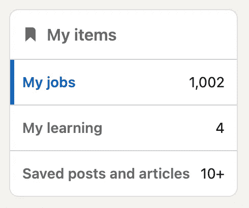

# 数据科学面试在 4 年中如何变化？

> 原文：[`towardsdatascience.com/how-have-data-science-interviews-changed-over-4-years-44b9ec356265?source=collection_archive---------1-----------------------#2024-12-14`](https://towardsdatascience.com/how-have-data-science-interviews-changed-over-4-years-44b9ec356265?source=collection_archive---------1-----------------------#2024-12-14)

## 对比过去和现在的总结：2020 年与 2024 年——一些主要的挫折和积极的收获。

 [Matt Przybyla](https://datascience2.medium.com/?source=post_page---byline--44b9ec356265--------------------------------)

·发表于[Towards Data Science](https://towardsdatascience.com/?source=post_page---byline--44b9ec356265--------------------------------) ·阅读时间 7 分钟·2024 年 12 月 14 日

--

是的，这实际上是我自己 LinkedIn 的截图[1]。

# 目录

1.  介绍

1.  申请过程

1.  面试过程

1.  总结

1.  参考文献

# 介绍

本文适用于那些希望更换公司的数据科学家、考虑申请和面试成为数据科学家的人群，以及对竞争激烈的就业市场在几年间的变化感兴趣的读者。我将首先讨论 2020 年的申请过程，并将其与 2024 年进行对比，分享我的个人经验以及一些他人的轶事观察。接着，我们将深入探讨一旦公司接受你的申请后的面试过程。我不会透露我申请过的公司名称，以保持评论的匿名性，而是将总结从申请和面试多个不同公司的趋势。如果你希望了解更多关于我在数据科学就业市场中的经历，以及这些经历如何对你有所帮助或引发兴趣，请继续阅读。
