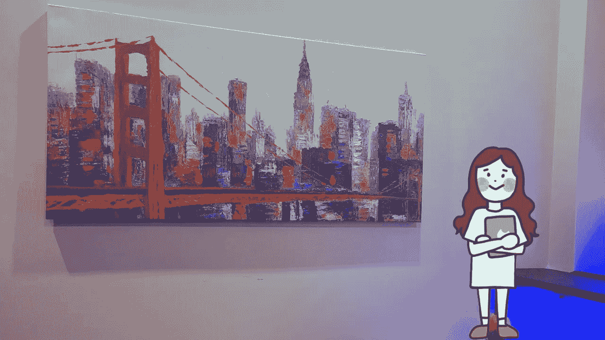
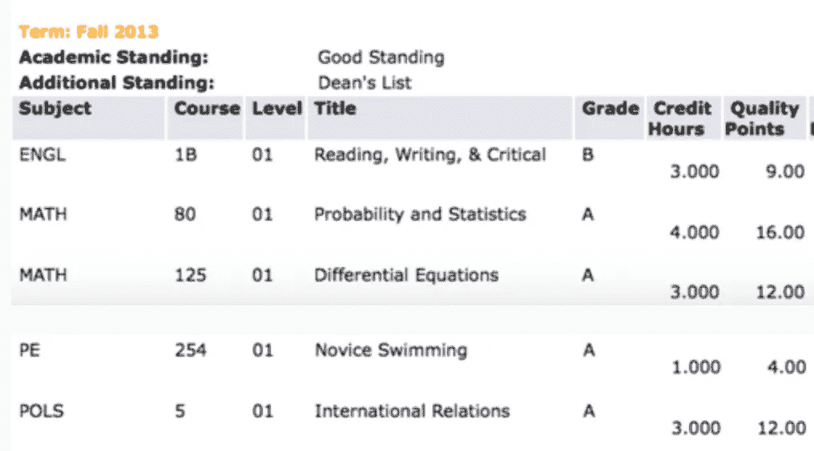
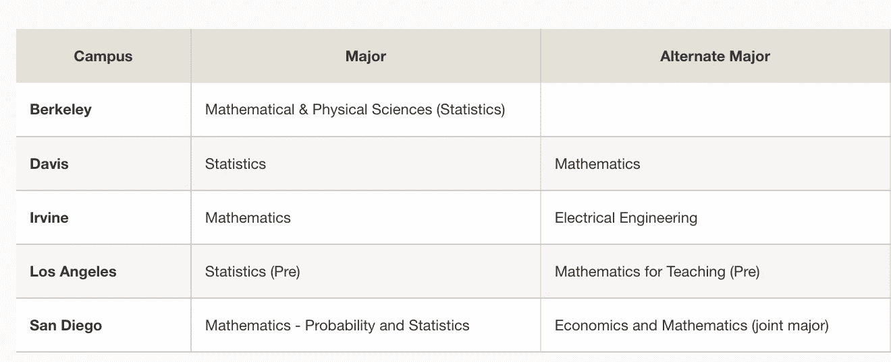
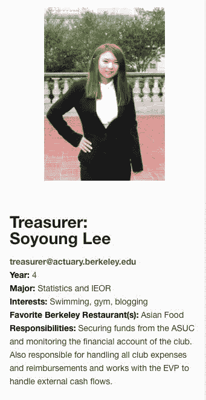
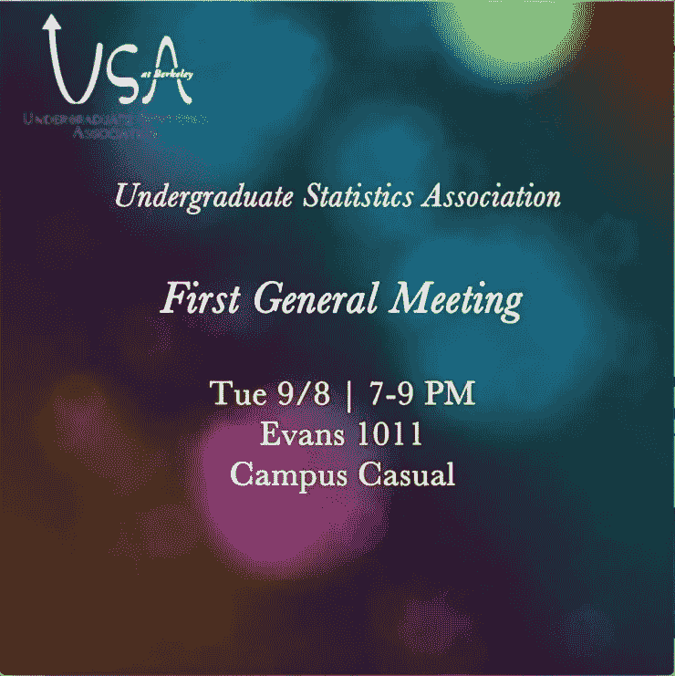
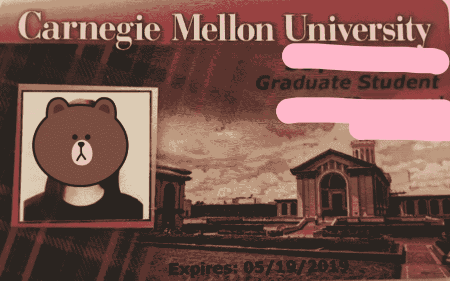

# 我是如何成为一名拥有破碎英语的国际学生数据科学家的

> 原文：[`towardsdatascience.com/how-i-became-a-data-scientist-as-an-international-student-with-broken-english-cce01d6db840?source=collection_archive---------5-----------------------#2024-04-09`](https://towardsdatascience.com/how-i-became-a-data-scientist-as-an-international-student-with-broken-english-cce01d6db840?source=collection_archive---------5-----------------------#2024-04-09)

## 花了很长时间，但我找到了自己愿意做一辈子的事

 [Soyoung L](https://medium.com/@soyoungluna?source=post_page---byline--cce01d6db840--------------------------------)

·发表于[Towards Data Science](https://towardsdatascience.com/?source=post_page---byline--cce01d6db840--------------------------------) ·阅读时间 5 分钟·2024 年 4 月 9 日

--

目前，我是一名拥有超过 4 年经验的数据科学家。我想深入讲述自己的故事——这是一个逐步发现自己对数据科学的热情的过程。我花了相当长的时间才弄清楚自己的职业道路，但这段旅程无疑是值得的。我希望我的故事能激励那些可能在努力成为数据科学家或怀疑自己能力的人。

作者使用 Canva 制作的图片

## 到达美国时，英语水平有限

“我在一个毒品实验室工作”。这就是我刚搬到美国时英语有多差。我不知道“meth”和“math”之间有区别。大约花了一年时间，我才终于弄清楚这个区别。我并没有参与制毒；相反，我是在[数学实验室](https://www.ccsf.edu/ram-resources/math-lab)担任数学辅导员，工作地点是旧金山城市学院（CCSF）。

在韩国高考失败后，我搬到了美国，坚信自己可以在这里建立新生活。我是一个大胆而天真的 18 岁女孩。我清晰地记得刚到旧金山市中心的几天，我甚至连在星巴克点一杯简单的咖啡都做不到。我结巴地说话，让员工一脸困惑，她用快速的英语回应我。我感到不知所措，最终用一种源自韩国文化的鞠躬表示感谢，匆忙离开了店铺。

## 在社区大学发现我对统计学的热情

为了提高我的英语水平，我报名参加了一所社区大学。在那里，我探索了各种学科，包括德语、游泳、计算机科学、数学、英语和统计学。在这个探索的过程中，我找到了我的热情。我的童年梦想是成为一名数学老师，因为我对数学和孩子们充满热爱。当我修读相关课程时，我发现学习统计学是一个重要的转折点。我爱上了统计学的各个方面，这最终促使我在转学时选择了统计学作为我的专业。

作者提供的图片，我的社区大学成绩单

## 成为第一代大学生

我的父母从未离开过韩国，更不用说上大学了。当我获得了多个大学的录取时，他们对加利福尼亚大学伯克利分校这样的名校并不熟悉。然而，他们愿意在经济上支持我，支付学费和生活费，为我能接受大学教育而感到自豪。

作者提供的图片，截图来自我的 UC 转学申请

## 努力追求精算职业

作为一名在加利福尼亚大学伯克利分校主修统计学的大三学生，我开始探索潜在的职业道路。我加入了统计学俱乐部和精算俱乐部，以获取更多的见解。最初，成为一名精算师似乎是一个合乎逻辑的选择——我喜欢解决数学问题，已经通过了几次精算考试，并完成了一次精算实习。然而，我在寻找全职精算职位时遇到了困难。尽管如此，我现在把这段经历视为一次学习的机会。回顾过去，我意识到我目前的工作比我当时在精算领域能找到的职位带给我更多的满足感。

作者提供的图片。我曾担任加利福尼亚大学精算联盟和本科统计学协会（目前称为统计学本科学生协会）的财务主管

## 商业数据科学简介

毕业时，我收到了两个工作机会：一个是初创公司的数据分析实习职位，另一个是电商公司的商品规划师职位。我选择了成为商品规划师，并有机会与那里的数据科学家合作。他们正在开发一个用于需求预测和定价的机器学习模型，这是我在加利福尼亚大学伯克利分校时非常喜欢学习的一个话题。目睹机器学习在商业中的实际应用让我感到非常有成就感。在寻求指导时，我找到了公司里的一位数据科学家。他建议我进一步深造，成为一名数据科学家，特别是在我作为国际学生面临签证挑战的情况下。

## 统计学硕士学位的价值（现在被称为应用数据科学）

我搬到了宾夕法尼亚州的 Pittsburgh，攻读卡内基梅隆大学（CMU）的硕士学位。在阿列克斯·赖因哈特教授的统计计算课程中，我提升了自己的 Python 技能，而在 Sivaraman·巴拉克里什南教授的数据挖掘课程中，我为机器学习面试做好了充分准备。我几乎每周都会去他们的办公时间，他们的帮助极大地促进了我的成长。我在 CMU 接受的优质教育，使我能够充分发挥自己的编程技能、项目经验和课程知识，成功地应对数据科学面试。

图片由作者提供

## 最终获得了 4 个数据分析师和数据科学家的工作邀请

这并不容易。在 4 到 5 个月的时间里，我申请了大约 700 个职位，目标是初级数据科学家岗位。我不知道哪些公司愿意雇佣外国员工，所以我全都申请了。尽管存在不确定性，我仍然收到了 20 多家公司的回复，并且与其中 4 家公司进入了最后阶段，最终都收到了工作邀请。

## 所学的经验

到达这个阶段花费了相当多的时间和精力，过程充满了挑战和不可预测性。求职之路充满了挫折和压力，但我对自己能力的信心支撑着我走下去，并最终让我在这一领域取得了成功。我坚信，任何具备正确技能和积极心态的人，都能够在数据科学领域开创自己的职业生涯。我希望我的故事能激励他人！
