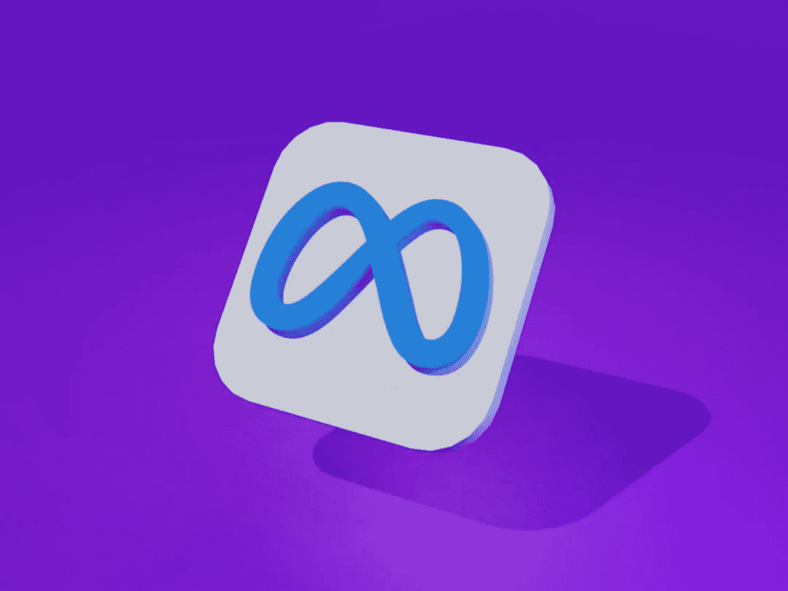

# 我是如何在没有“完美”学位的情况下成为 Meta 的数据科学家的

> 原文：[`towardsdatascience.com/how-i-became-a-data-scientist-at-meta-no-stats-degree-no-bootcamp-4aa07494d117?source=collection_archive---------1-----------------------#2024-08-06`](https://towardsdatascience.com/how-i-became-a-data-scientist-at-meta-no-stats-degree-no-bootcamp-4aa07494d117?source=collection_archive---------1-----------------------#2024-08-06)

## 4 份工作和 2 次职业转型

 [Mandy Liu](https://medium.com/@mandymliu?source=post_page---byline--4aa07494d117--------------------------------)

·发布于 [Towards Data Science](https://towardsdatascience.com/?source=post_page---byline--4aa07494d117--------------------------------) ·阅读时间：13 分钟·2024 年 8 月 6 日

--

图片由 [Muhammad Asyfaul](https://mandyliu.substack.com/p/true) 提供，来自 [Unsplash](https://unsplash.com/)

曾经梦想转行进入数据科学，但担心自己没有合适的背景？

也许你认为没有传统学位就落后于竞争对手？

或者你渴望进入一家大型科技公司工作，却觉得自己不够资格？

如果你也有过这些想法，别担心，你并不孤单。

我曾经也站在你的立场上。而且，我也与许多有志于成为数据科学家的朋友交谈过，他们面临着同样的疑虑。

**这篇文章是写给那些想要进入数据科学领域，但没有典型资历的人们。** 虽然它可能无法回答所有问题，但我希望它能为你提供清晰的思路和信心，帮助你追寻梦想中的职业。

这里是我旅程的一个概览，分为六个阶段：

+   发现

+   渴望

+   投资

+   第一次转型

+   第二次转型

+   机会敲门

## 你好！

我是 [Mandy Liu](https://www.linkedin.com/in/mandy-liu-2551724a/)，曾是 Meta 的数据科学家，拥有 8 年行业经验 :)
