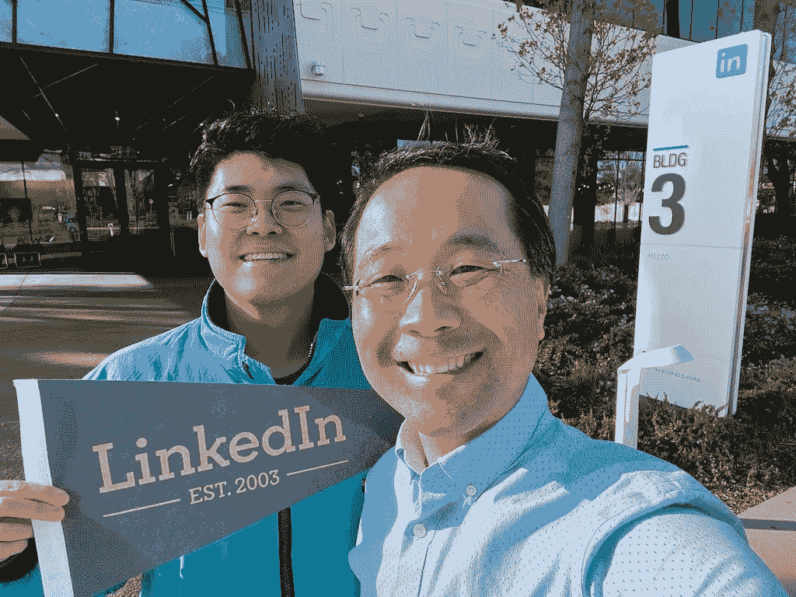

# 我是如何在加入 LinkedIn 之前成为一名数据科学家的

> 原文：[`towardsdatascience.com/how-i-became-a-data-scientist-before-i-joined-linkedin-e3b8e4816001?source=collection_archive---------4-----------------------#2024-03-07`](https://towardsdatascience.com/how-i-became-a-data-scientist-before-i-joined-linkedin-e3b8e4816001?source=collection_archive---------4-----------------------#2024-03-07)

## 这些实践项目对职业转型至关重要

 [Jimmy Wong](https://medium.com/@aijimmy?source=post_page---byline--e3b8e4816001--------------------------------)

·发表于 [Towards Data Science](https://towardsdatascience.com/?source=post_page---byline--e3b8e4816001--------------------------------) ·8 分钟阅读·2024 年 3 月 7 日

--

2023 年在 LinkedIn 总部与同事合影，已获授权使用（[来源](https://www.linkedin.com/pulse/my-12-years-linkedin-jimmy-wong/?trackingId=9Wn8B2jnTXKxY9X4VHNiNw%3D%3D)）

一个人是如何首次获得梦想中的数据科学家职位的？

我的梦想工作是成为 LinkedIn 数据科学部门的一员。

然而，我并没有接受过正式的数据科学教育，也没有担任过数据科学家的职务。当时，数据科学是一个新兴领域，它不像现在这样在学校里普及，也不像大多数公司现在那样普遍存在。

在我被 LinkedIn 招聘之前，我仍然需要证明自己能够胜任这项工作。

我很感激最终被 LinkedIn 招聘。我后来成为 LinkedIn 数据科学团队的负责人，带领由 14 位数据科学家组成的团队，负责获取和发展我们在数十亿美元规模的在线广告业务中的客户。

我将与大家分享我最初是如何开始从事数据科学工作的。

# 职业转型的规划

如果你还没有在数据科学领域工作过，获得第一份数据科学家的工作是很具挑战性的。也许你即将毕业，或者你已经在工程师、金融分析师或科学研究员的岗位上工作了一段时间，但现在想转行…
