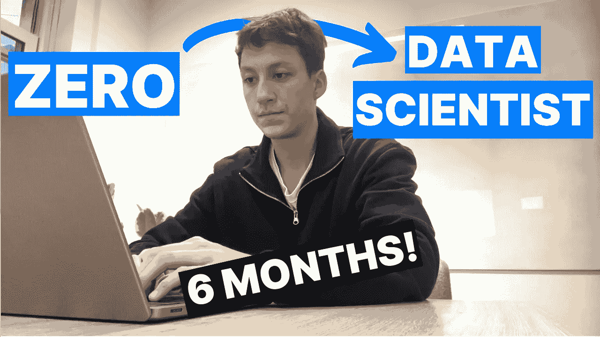

# 我是如何成为一名数据科学家的——没有计算机科学学位，没有训练营

> 原文：[`towardsdatascience.com/how-i-became-a-data-scientist-no-cs-degree-no-bootcamp-82c321904986?source=collection_archive---------0-----------------------#2024-01-06`](https://towardsdatascience.com/how-i-became-a-data-scientist-no-cs-degree-no-bootcamp-82c321904986?source=collection_archive---------0-----------------------#2024-01-06)

## 我是如何从厌恶编程到成为一名完全合格的数据科学家的

 [Egor Howell](https://medium.com/@egorhowell?source=post_page---byline--82c321904986--------------------------------)

·发表于[Towards Data Science](https://towardsdatascience.com/?source=post_page---byline--82c321904986--------------------------------) ·阅读时间 11 分钟·2024 年 1 月 6 日

--

毋庸置疑，成为一名数据科学家可以说是（以我谦虚的观点）目前最酷的工作之一，尤其是在今年人工智能的热潮之下。

在本文中，我想带你走过我成为数据科学家的整个过程，并分享一些如何让你自己也能成为数据科学家的建议和启示！

当然，成为数据科学家没有**最好的**方法，条条大路通罗马。然而，我认为有一些强烈推荐的策略，可以增加你获得理想的第一份工作的机会。

> 快速说明：我的目标是成为一名专注于机器学习的数据科学家。数据科学在不同公司有不同的定义，所以了解你自己想成为什么样的数据科学家很重要。然而，对于初级职位来说，这种定义的差异性并不大（这是一种英国俚语）。

# 我的背景
