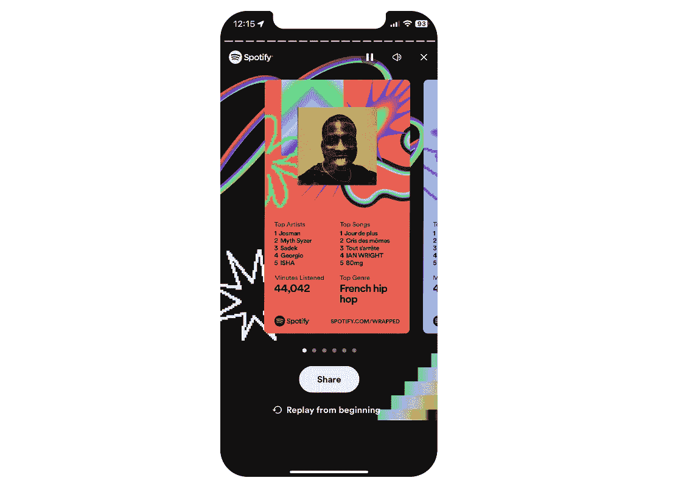
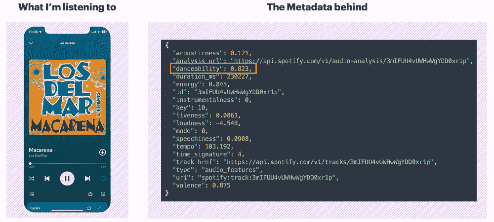
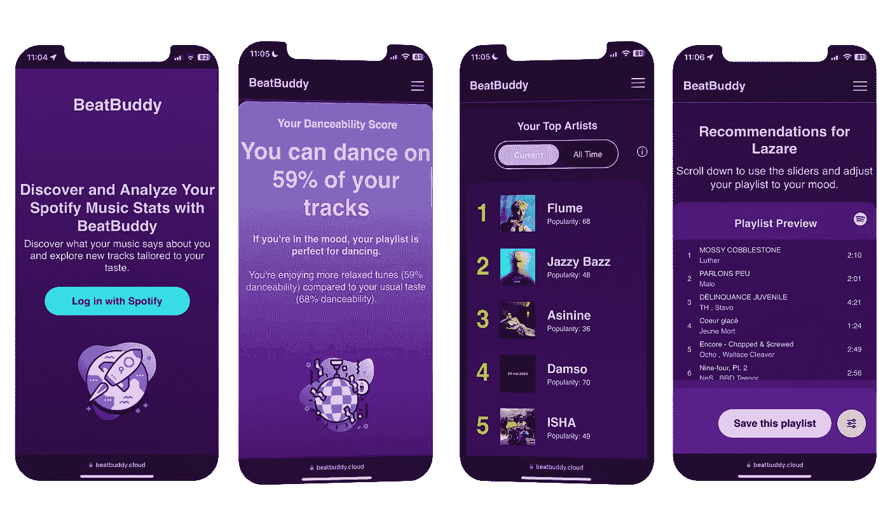
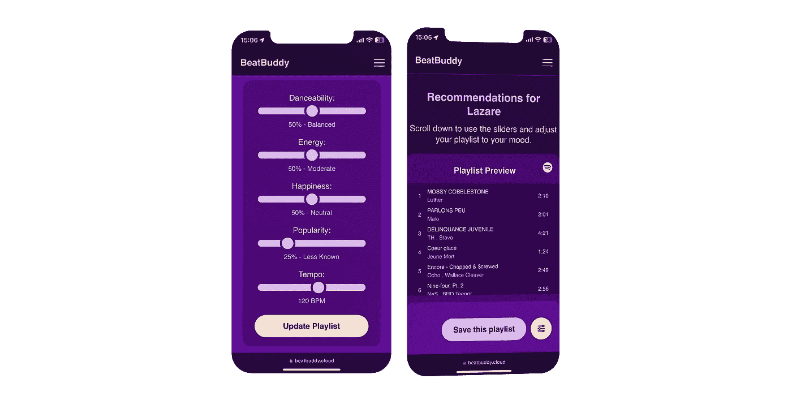
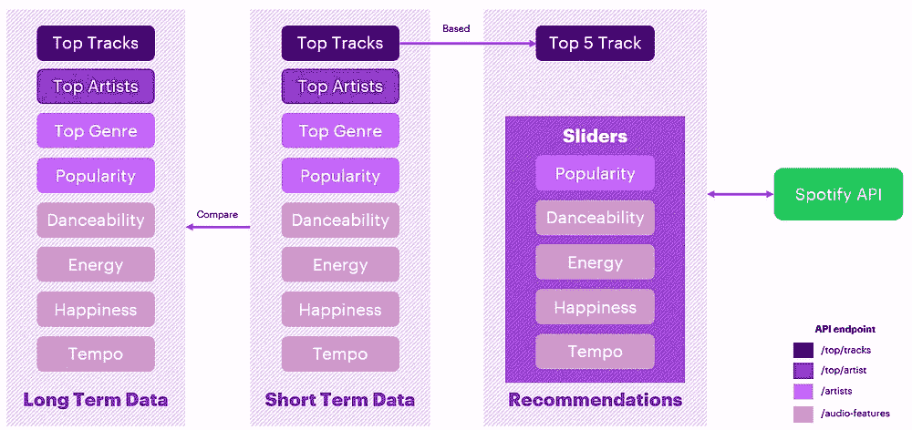
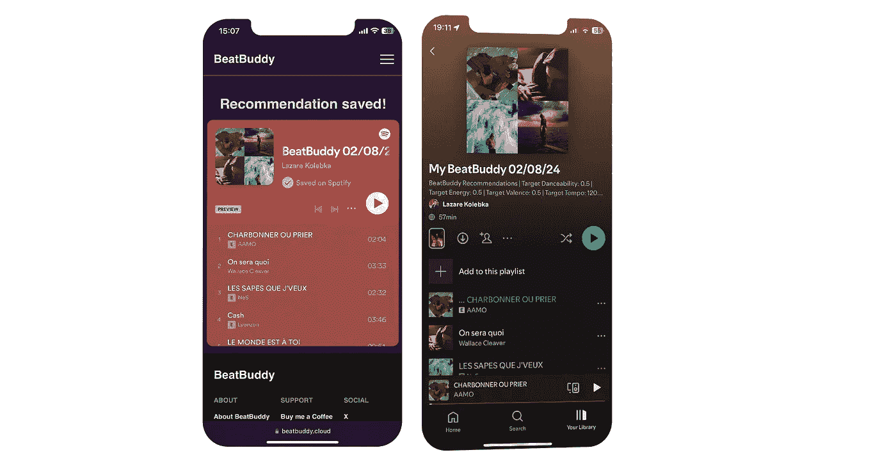
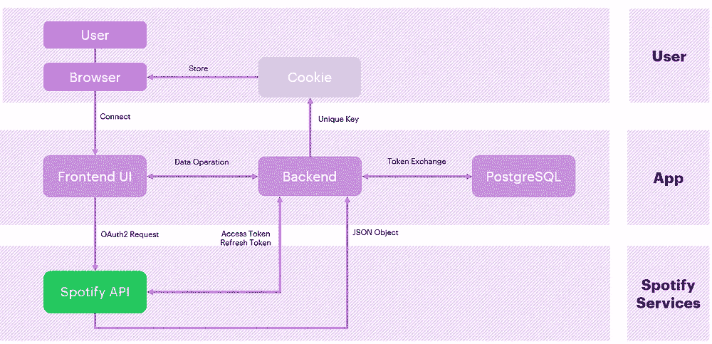

# 我是如何构建 BeatBuddy：一款分析你的 Spotify 数据的 Web 应用

> 原文：[`towardsdatascience.com/how-i-built-beatbuddy-a-web-app-that-analyzes-your-spotify-data-05b7b6d10f81?source=collection_archive---------3-----------------------#2024-08-05`](https://towardsdatascience.com/how-i-built-beatbuddy-a-web-app-that-analyzes-your-spotify-data-05b7b6d10f81?source=collection_archive---------3-----------------------#2024-08-05)

 [Lazare Kolebka](https://medium.com/@lazarekolebka?source=post_page---byline--05b7b6d10f81--------------------------------)

·发表于 [Towards Data Science](https://towardsdatascience.com/?source=post_page---byline--05b7b6d10f81--------------------------------) ·9 分钟阅读·2024 年 8 月 5 日

--

图像由 DALL·E 3 生成

你好，欢迎阅读这篇文章！我将向你解释我是如何构建 BeatBuddy 的，这是一款分析你在 Spotify 上收听内容的 web 应用。受 Spotify Wrapped 的启发，它旨在解读你当前的心情，并根据分析结果提供你可以调整的推荐。

如果你不想阅读所有内容，只是想试一试，你可以点击这里： [BeatBuddy](https://www.beatbuddy.cloud/)。其余内容请继续阅读！

## 项目的诞生

我是一名数据分析师，也是一个音乐爱好者，我相信数据分析是理解我们所生活的世界以及我们作为个体身份的一种强大方式。

音乐，尤其是，可以作为一面镜子，反映出你在某一时刻的身份和情感。你选择的音乐类型通常取决于你当前的活动和心情。例如，如果你在锻炼，你可能会选择一个充满活力的播放列表来激励自己。

另一方面，如果你正忙于学习或专注于处理一些数据，或许你会想听一些平静和宁静的音乐。我甚至听说过有人在集中注意力时听白噪声，这可以被描述为你在高速公路上打开汽车窗户时听到的声音。

另一个能反映你情绪的音乐例子是在聚会中。试想你和朋友们开派对，你需要选择音乐。如果是一个轻松的晚餐聚会，你可能想播放一些轻柔的爵士乐或者柔和的曲调。但如果你目标是那种每个人最后都跳到家具上或尽力演唱一首 80 年代热门歌曲的狂欢派对，你就需要选择一些充满活力、适合跳舞的歌曲。稍后我们会回到这些概念。

事实上，你听的所有音乐和你做出的选择可以揭示你在任何时刻个性和情感状态的有趣方面。如今，人们越来越喜欢分析自己，而这已经成为一种全球趋势！这个趋势被称为“量化自我”，是一个人们通过分析跟踪自己的活动（例如健身、睡眠和工作效率）以做出明智决定（或不做决定）的运动。

别误会，作为一个数据迷，我喜欢所有这些东西，但有时候它也有点过头——就像[AI 连接的牙刷](https://www.theverge.com/circuitbreaker/2019/10/25/20932250/oral-b-genius-x-connected-toothbrush-ai-artificial-intelligence)。首先，我不需要一把带 Wi-Fi 天线的牙刷。其次，我也不需要一张展示过去六周我刷牙情况变化的折线图。

不管怎样，我们回到音乐产业的话题。Spotify 是将用户数据收集转变为酷炫事物的先驱之一，他们称之为 Spotify Wrapped。

图 I ：Spotify Wrapped 示例 | 图片来自作者

到了年底，Spotify 会整理你所听过的音乐并制作 Spotify Wrapped，这一内容会在社交媒体上迅速传播开来。它的受欢迎程度在于它能揭示你个性和偏好的一些方面，并且你可以与朋友们进行比较。

Spotify 如何收集和汇总数据以制作这些年终总结的概念一直让我着迷。我记得曾经问自己，“他们是怎么做到的？”而这种好奇心正是这个项目的起点。

嗯，实际上不完全是。让我们实话实说：分析 Spotify 数据的想法最初写在一张标有“数据项目”的便签上——你知道的，那种充满了你可能永远不会开始或完成的想法的便签。它就这样放了一年。

有一天，我又看了一下这个清单，凭借着对自己数据分析能力的新信心（感谢 ChatGPT 一年来的成长和进步），我决定选一个项目开始动手。

起初，我只是想访问和分析我的 Spotify 数据，并没有什么特别的目的。我只是单纯地好奇看看能用这些数据做些什么。

# 第一步：获取你的 Spotify 数据

开始这样一个项目时，你首先要问自己的是数据源在哪里，哪些数据是可以获得的。从本质上来说，有两种方法可以获取你的数据：

1.  在隐私设置中，你可以请求一份历史数据的副本，但需要 30 天才能交付——这并不太方便。

1.  使用 Spotify 的 API，它允许你按需获取自己的数据，并使用不同的参数来调整 API 调用，获取各种信息。

显然，我选择了第二种方式。为此，首先你需要创建一个开发者项目来获取 API 密钥，然后就可以开始了。

## API 响应示例

记得我们讨论过某些曲目比其他曲目更容易跳舞的事实。作为人类，我们很容易感觉一首歌是否适合跳舞——这完全取决于你身体的感觉，对吧？但是计算机是如何判断这一点的呢？

Spotify 使用自己的算法来分析其目录中的每一首歌曲。对于每首歌曲，它们都会提供一系列与之相关的特征。这些分析的一个应用就是创建播放列表并为你提供推荐。好消息是，他们的 API 通过 audio_features 接口提供对这些分析的访问，允许你获取任何歌曲的所有特征。

例如，让我们分析一下著名歌曲《Macarena》的音频特征，我相信每个人都知道这首歌。我不会详细讲解曲目的每个参数，但我们可以集中关注一个方面，以更好地理解它是如何工作的——跳舞得分为 0.823。

图 II：Macarena 音频特征示例 | 作者提供的图像

根据 Spotify 的文档，跳舞得分描述了一首曲目基于多种音乐元素的适舞性，包括节奏、节奏稳定性、节拍强度和整体规律性。得分为 0.0 表示最不适合跳舞，1.0 则表示最适合跳舞。得分为 0.823（或 82.3%）意味着这首曲子非常适合跳舞。

## 三种时间维度

在继续之前，我需要介绍一个 Spotify API 中的概念——time_range。这个有趣的参数允许你通过指定 time_range 来检索不同时间段的数据：

+   **short_term**：过去 4 周的听歌活动

+   **medium_term**：过去 6 个月的听歌活动

+   **long_term**：你整个听歌活动的生命周期

让我们通过一个例子来说明：如果你想查看过去 4 周的前 10 首曲目，你可以调用相应的接口，并像这样传递 time_range 参数：[`api.spotify.com/v1/me/top/artists?time_range=short_term&limit=10`](https://api.spotify.com/v1/me/top/artists?time_range=short_term&limit=10)

调用此接口将返回过去一个月的前 10 名艺术家。

# 步骤 2：解读结果

有了所有这些信息，我的想法是创建一个数据产品，让用户了解他们正在听什么，并通过比较不同的时间段来检测他们情绪的变化。通过这种分析，我们可以看到生活中的变化是如何反映在我们选择的音乐中的。

例如，我最近重新开始跑步，而这一变化影响了我的音乐偏好。现在，我听的音乐比以前通常听的更快、更有活力。当然，这是我的解读，但看到身体活动的变化如何影响我听的音乐，还是挺有趣的。

这只是一个例子，因为每个人的音乐之旅都是独一无二的，且可以根据个人经历和生活变化进行不同的解读。通过分析这些模式，我觉得能够将我们的生活方式选择与我们喜欢听的音乐之间建立联系非常酷。

## 使数据洞察变得触手可及

随着我深入这个项目，我越来越意识到，虽然我可以分析我的数据并得出某些结论，但我希望每个人都能做到这一点。

对我来说，与非技术人员分享数据洞察并让其变得极为可及的最简单方法不是通过华丽的 BI 仪表盘。我的想法是创建一些每个人都能轻松访问的东西，这促使我开发了一个移动友好的网页应用，任何人都可以使用。

要使用这个应用，你只需要一个 Spotify 账户，点击一个按钮将其连接到 BeatBuddy，就完成了！

图 III：应用界面示例 | 作者提供的图片

## 测量音乐情感

让我们看一下这个应用的另一个功能：测量你所听音乐的快乐程度，这可能反映你当前的情绪状态。该应用聚合了你最近的热门歌曲数据，专注于“情感值”参数，它代表了音乐的幸福感，1 表示超级快乐的音乐。例如，如果你当前歌曲的平均情感值是 0.432，而你所有时间的平均值是 0.645，这可能意味着你最近的音乐偏向更为忧郁。

然而，这些分析应该谨慎对待，因为这些数字代表的是趋势，而非绝对真理。有时候，我们不应总是试图找出这些数字背后的原因。

例如，如果你正在追踪你的步伐速度并发现你最近走得更快，这并不一定意味着你更急躁——这可能是由天气变化、新鞋子或只是潜意识的转变等各种小因素导致的。有时候，变化发生时并没有明确的原因，虽然可以衡量这些变化，但它们并不总是需要直接的解释。

话虽如此，注意到你的音乐听取习惯发生了显著变化是很有趣的。这可以帮助你思考你的情绪状态或生活情况可能是如何影响你的音乐偏好的。BeatBuddy 的这一方面提供了一个有趣的视角，尽管值得注意的是，这些解读只是我们情感和经历复杂拼图中的一部分。

# 步骤 3：做出数据驱动的决策

说实话，分析你的听歌习惯是一回事，但如何基于这些分析采取行动呢？归根结底，数据驱动的决策是数据分析的最终目标。这就是推荐系统发挥作用的地方。

## 根据你选择的心情推荐

BeatBuddy 的一个有趣功能是它能够根据你选择的心情和你喜欢的音乐提供个性化的音乐推荐。

比如，你可能会意识到自己听的音乐流行度得分为 75%（相当高），你希望根据自己的口味寻找一些隐藏的宝藏。你可以调整“流行度”滑块，比如设置为 25%，以创建一个流行度平均得分为 25% 的新播放列表。

图 IV：将流行度滑块调整至 25% | 图片来自作者

在后台，系统会调用 Spotify 的算法，基于你选择的标准生成推荐。这个调用会根据你的个人口味和你设置的心情参数生成个性化的播放列表推荐。它会使用你最近的 5 首歌曲来根据你的选择微调 Spotify 的推荐算法。

图 V：API 端点说明 | 图片来自作者

一旦你对播放列表满意，你可以直接将其保存到你的 Spotify 库中。每个播放列表都附带有描述，详细说明你选择的参数，帮助你记住每个播放列表所要唤起的情感氛围。

图 VI：将播放列表保存到 Spotify | 图片来自作者

# 最终思考

开发一个分析 Spotify 数据的网页应用程序是一个充满挑战但回报丰厚的过程。我被迫走出舒适区，学习了多个领域的知识，包括网页 API、cookie 管理、网页安全、OAuth2、前端开发、移动优化和 SEO。下面是该应用程序的高层架构图：

图 VII：高层架构 | 图片来自作者

我最初的目标是启动一个简单的数据项目，分析我的听歌习惯。然而，它变成了一个为期三个月，充满学习和发现的项目。

在整个过程中，我意识到数据分析和网页开发是密切相关的，特别是当我们需要提供一个不仅具有功能性，而且用户友好、易于访问的解决方案时。最终，软件开发本质上是将数据从一个地方移动到另一个地方。

最后一个说明：我希望创建一个简洁、无缝的用户体验应用。这就是为什么 BeatBuddy 完全没有广告，且没有任何数据被出售或与第三方共享。我创建这个应用的唯一目的是为用户提供一种更好地理解自己音乐选择和发现新曲目的方式。

你可以在这里试用这个应用：[`www.beatbuddy.cloud`](https://www.beatbuddy.cloud)

如果你有任何意见或建议，我愿意倾听！你的反馈非常重要。

对于那些有兴趣深入了解的人，请留意我即将发布的文章。

干杯！

拉扎尔
