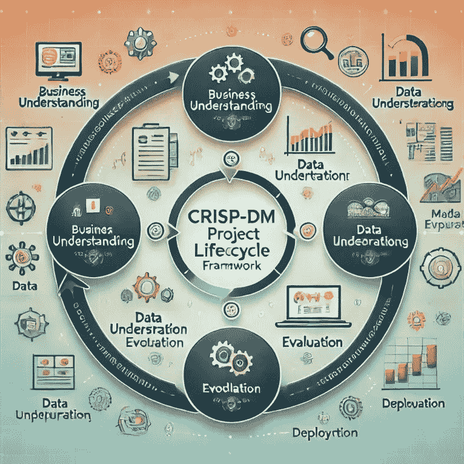

# 我如何按照 CRISP-DM 生命周期创建数据科学项目

> 原文：[`towardsdatascience.com/how-i-created-a-data-science-project-following-a-crisp-dm-lifecycle-8c0f5f89bba1?source=collection_archive---------3-----------------------#2024-11-13`](https://towardsdatascience.com/how-i-created-a-data-science-project-following-a-crisp-dm-lifecycle-8c0f5f89bba1?source=collection_archive---------3-----------------------#2024-11-13)

## 一个使用 CRISP-DM 框架的端到端项目

 [Gustavo R Santos](https://gustavorsantos.medium.com/?source=post_page---byline--8c0f5f89bba1--------------------------------)

·发表于 [Towards Data Science](https://towardsdatascience.com/?source=post_page---byline--8c0f5f89bba1--------------------------------) ·22 分钟阅读·2024 年 11 月 13 日

--

由 AI 生成的图像。OpenAI。*CRISP-DM 数据科学项目生命周期框架*。DALL-E，2024 年。

# 介绍

CRISP-DM 代表**跨行业数据挖掘标准过程**，这是一个开放的数据挖掘框架，任何人都可以使用它。

它的第一个版本由 SPSS、戴姆勒-奔驰和 NCR 创建。后来，一组公司开发并演变成了 CRISP-DM，如今它已经成为数据科学领域最著名和最广泛采用的框架之一。

该过程由 6 个阶段组成，且具有灵活性。它更像是一个*活的有机体*，你可以（而且可能应该）在各个阶段之间来回迭代与改进，提升结果。

该过程包括以下几个阶段：

> 业务理解
> 
> 数据理解
> 
> 数据准备
> 
> 建模
> 
> 评估
> 
> 部署

小箭头展示了从业务理解到部署的自然路径——直接发生交互的地方——而圆圈则表示阶段之间的循环关系。这意味着项目并不会在部署后结束，而是可以因为项目触发的新业务问题而重新启动，或者…
