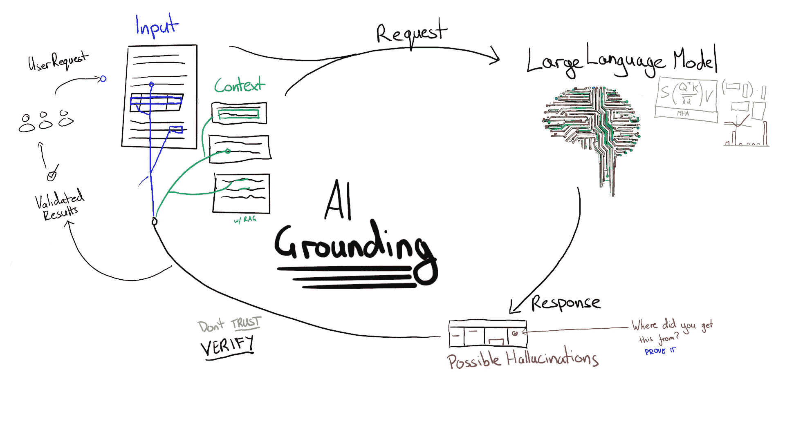

# 我如何应对 AI 初创公司中的幻觉问题

> 原文：[`towardsdatascience.com/how-i-deal-with-hallucinations-at-an-ai-startup-9fc4121295cc?source=collection_archive---------0-----------------------#2024-09-22`](https://towardsdatascience.com/how-i-deal-with-hallucinations-at-an-ai-startup-9fc4121295cc?source=collection_archive---------0-----------------------#2024-09-22)

## 以及弱基础与强基础的区别

 [Tarik Dzekman](https://medium.com/@TarikDzekman?source=post_page---byline--9fc4121295cc--------------------------------)

·发表于[Towards Data Science](https://towardsdatascience.com/?source=post_page---byline--9fc4121295cc--------------------------------) ·6 分钟阅读·2024 年 9 月 22 日

--

图片由作者提供

我是一名 AI 工程师，专注于一个特定的细分领域：文档自动化和信息提取。在我的行业中，使用大型语言模型在应对幻觉问题时遇到了一些挑战。想象一下，当 AI 将发票金额错误地解读为 $100,000 而不是 $1,000，导致支付超额 100 倍。当面对这种风险时，防止幻觉成为构建稳健 AI 解决方案的关键方面。这些是我在设计可能容易产生幻觉的解决方案时专注的一些关键原则。

# 使用验证规则和“人类介入”。

有多种方法可以将人工监督融入 AI 系统中。有时，提取的信息总是会展示给人工进行审核。例如，解析后的简历可能会在提交给申请人跟踪系统（ATS）之前展示给用户。更常见的是，提取的信息会自动添加到系统中，只有在出现潜在问题时才会标记并供人工审核。

任何 AI 平台的关键部分之一是确定何时需要加入人工监督。这通常涉及不同类型的验证规则：

1\. 简单规则，例如确保行项目总额与发票总额匹配。

2\. 查找和集成，例如在会计系统中验证总金额是否与采购订单一致，或验证付款细节是否与供应商的历史记录匹配。

需要人工介入时的一个示例验证错误。来源：Affinda

这些过程是好事。但是，我们也不希望一个 AI 总是触发安全保障并迫使人工干预。如果 AI 不断触发这些安全措施，幻觉就会破坏使用 AI 的目的。

# 小型语言模型

防止幻觉的一个解决方案是使用小型语言模型（SLM），这些模型是“提取式的”。这意味着模型会标记文档的部分内容，我们将这些标签收集成结构化的输出。我建议尽可能使用 SLM，而不是每个问题都默认使用 LLM。例如，在简历解析中，等待超过 30 秒让 LLM 处理一份简历通常是不可接受的。对于这种用例，我们发现 SLM 可以在 2 到 3 秒内提供比像 GPT-4o 这样的较大模型更高的准确性。

## 我们流程中的一个例子

在我们的初创公司中，一份文档可以由最多 7 个不同的模型处理——其中只有 2 个可能是大型语言模型（LLM）。这是因为大型语言模型并不总是完成任务的最佳工具。一些步骤，例如检索增强生成（Retrieval Augmented Generation），依赖于一个小型的多模态模型来创建有用的嵌入用于检索。第一步——检测某个内容是否为文档——使用一个小型且超快速的模型，该模型的准确率达到 99.9%。将问题分解成小块，然后弄清楚哪些部分最适合由 LLM 来处理，这是至关重要的。这样，你就能减少幻觉发生的几率。

## 区分幻觉与错误

我特别区分幻觉（模型编造信息）和错误（模型误解现有信息）。例如，选择错误的金额作为收据总额是一个错误，而生成一个不存在的金额则是幻觉。提取式模型只能犯错误，而生成式模型则可能同时犯**错误**和幻觉。

# 风险容忍度与基础

在使用生成模型时，我们需要一种方法来消除幻觉现象。

*基础*指的是任何迫使生成 AI 模型通过参考某些权威信息来为其输出提供证明的技术。如何管理基础问题取决于每个项目的风险容忍度。

例如——一个具有通用收件箱的公司可能会试图识别需要执行的任务。通常，要求执行的电子邮件会直接发送给账户经理。一个充满发票、垃圾邮件和简单回复（“谢谢”，“好的”等）的通用收件箱，包含了太多的邮件，人工很难逐一检查。当任务错误地被发送到这个通用收件箱时，会发生什么呢？任务经常会被忽略。如果一个模型犯了错误但总体上准确，它已经比什么都不做要好。在这种情况下，容忍错误/幻觉的程度可以较高。

其他情况下可能要求特别低的风险容忍度——例如财务文档和“直通处理”。这是指提取的信息会在没有人工审核的情况下自动添加到系统中。例如，一家公司可能不允许自动将发票添加到会计系统，除非（1）支付金额与采购订单中的金额完全匹配，并且（2）支付方式与供应商的上一笔支付方式一致。

即使风险较低，我仍然倾向于谨慎行事。每当我专注于信息提取时，我会遵循一个简单的规则：

> **如果从文档中提取文本，则必须与文档中找到的文本完全一致。**

当信息是结构化的（例如表格）时，这变得很棘手，尤其是因为 PDF 文件没有任何关于页面上单词顺序的信息。例如，某个条目的描述可能会跨越多行，因此目标是围绕提取的文本绘制一个连贯的框，而不考虑单词的左右顺序（或在一些语言中是从右到左的顺序）。

强制模型指向文档中的精确文本被称为“强绑定”。强绑定不限于信息提取。例如，客户服务聊天机器人可能需要从内部知识库中的标准化回复中逐字引用（照搬）。鉴于标准化回复可能无法真正回答客户的问题，这种做法并不总是理想的。

另一个棘手的情况是当信息需要从上下文中推断时。例如，医疗助手 AI 可能会根据症状推断出某种疾病的存在，而没有明确指出该疾病。识别出这些症状提到的地方将是一种“弱绑定”。回应的理由必须存在于上下文中，但确切的输出只能从提供的信息中合成。进一步的绑定步骤可能是强制模型查找医疗状况，并证明这些症状是相关的。即使如此，仍可能需要弱绑定，因为症状通常可以以多种方式表达。

# 复杂问题的绑定

使用 AI 解决日益复杂的问题可能使得使用绑定变得困难。例如，如果模型需要进行“推理”或从上下文中推断信息，如何进行绑定呢？以下是向复杂问题添加绑定时的一些考虑事项：

1.  识别可以分解成一组规则的复杂决策。与其让模型生成最终决策的答案，不如让它生成该决策的组成部分。然后，使用规则来显示结果。（警告——这有时会加剧幻觉问题。向模型提出多个问题会给它多个产生幻觉的机会。只问一个问题可能会更好。但我们发现目前的模型在复杂的多步骤推理中通常表现较差。）

1.  如果某个内容可以用多种方式表达（例如症状的描述），第一步可以是让模型对文本进行标注并标准化它（通常称为“编码”）。这可能为更强的基础打下基础。

1.  为模型设置“工具”以调用，约束输出到非常特定的结构。我们不希望执行 LLM 生成的任意代码。我们希望创建模型可以调用并对这些工具中的内容设定限制的工具。

1.  在可能的情况下，包括工具使用的基础支持——例如，在将响应发送到下游系统之前，先验证它们与上下文的一致性。

1.  有没有方法验证最终输出？如果手工规则不可行，我们是否可以为验证构建一个提示？（并且同样遵循上述规则来验证模型）。

# 主要结论

+   在信息提取方面，我们不容忍输出中没有原始上下文的信息。

+   我们随后会进行验证步骤，以捕捉错误和幻觉。

+   我们所做的一切，超出此范围的内容，都是关于风险评估和风险最小化。

+   将复杂问题分解成更小的步骤，并识别是否需要 LLM。

+   对于复杂问题，使用系统化的方法来识别可验证的任务：

— 强基础支持迫使 LLM 从可信来源逐字引用。总是首选使用强基础支持。

— 弱基础支持迫使 LLM 引用可信来源，但允许合成和推理。

— 当一个问题可以分解成更小的任务时，尽可能在任务上进行强基础支持。

# **Affinda AI 平台**

我们已经构建了一个强大的[AI 文档处理](https://www.affinda.com/platform)平台，全球各地的组织都在使用它。

# 关于作者

我是 Affinda 的首席 AI 工程师。我花了 10 年时间做出职业转型，从 UX 转向 AI。[关于我从 UX 到 AI 的职业转型](https://medium.com/@TarikDzekman/my-career-change-to-ai-from-ux-b1ed6690c09a)。想深入了解生成式 AI 吗？阅读我的深度分析：[大型语言模型实际上理解什么](https://medium.com/towards-data-science/what-do-large-language-models-understand-befdb4411b77)。
