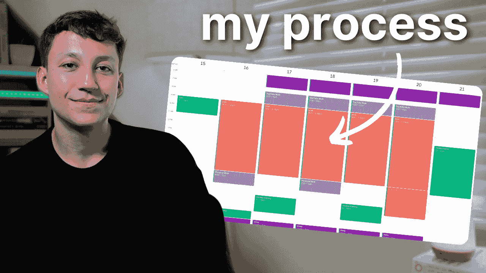

# 如何在一份全职工作中为一切腾出时间

> 原文：[`towardsdatascience.com/how-i-make-time-for-everything-even-with-a-full-time-job-d459e169646f?source=collection_archive---------0-----------------------#2024-09-14`](https://towardsdatascience.com/how-i-make-time-for-everything-even-with-a-full-time-job-d459e169646f?source=collection_archive---------0-----------------------#2024-09-14)

## 我是如何在全职担任数据科学家的同时，每周制作 YouTube 视频、写博客，并发布新闻通讯的

 [Egor Howell](https://medium.com/@egorhowell?source=post_page---byline--d459e169646f--------------------------------)

·发布于 [Towards Data Science](https://towardsdatascience.com/?source=post_page---byline--d459e169646f--------------------------------) ·阅读时长 8 分钟·2024 年 9 月 14 日

--

图片由作者提供。

我曾经说过：“我没有足够的时间。” 但实际上，我只是把优先级搞错了，之后我显著提高了我的时间管理技巧。

甚至有好几次有人问我，如何在全职工作之外，持续发布 YouTube 视频和博客文章，每周写一份新闻通讯，并几乎每天锻炼身体。

好吧，在这篇文章中，我想分享一下我的过程，并希望为那些在管理所有优先事项时感到困扰的人提供一些建议。

# 我还有多少时间？

我总是从审查我的日程开始，看看我到底还有多少时间可以真正支配。

由于我有一份全职数据科学家的工作，周一到周五，早上 9 点到下午 5:30，我的时间完全被占用。当然，可能会有一些空隙…
