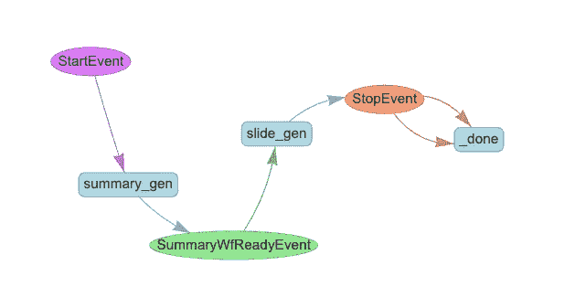
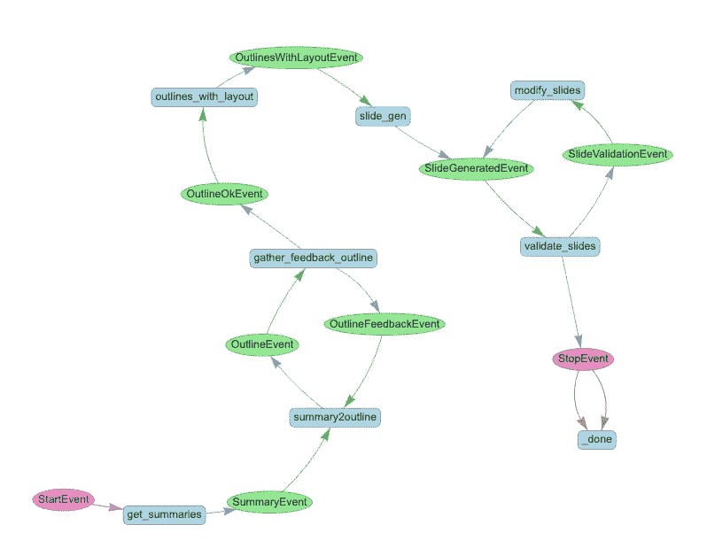
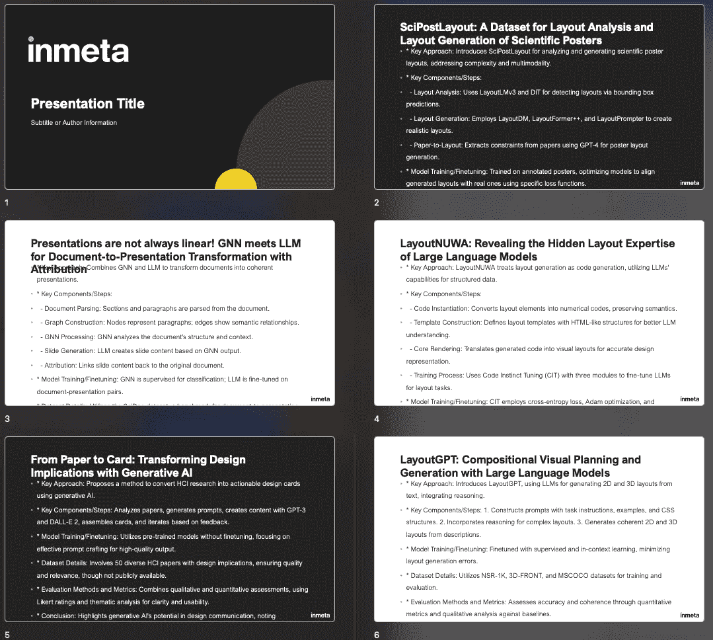
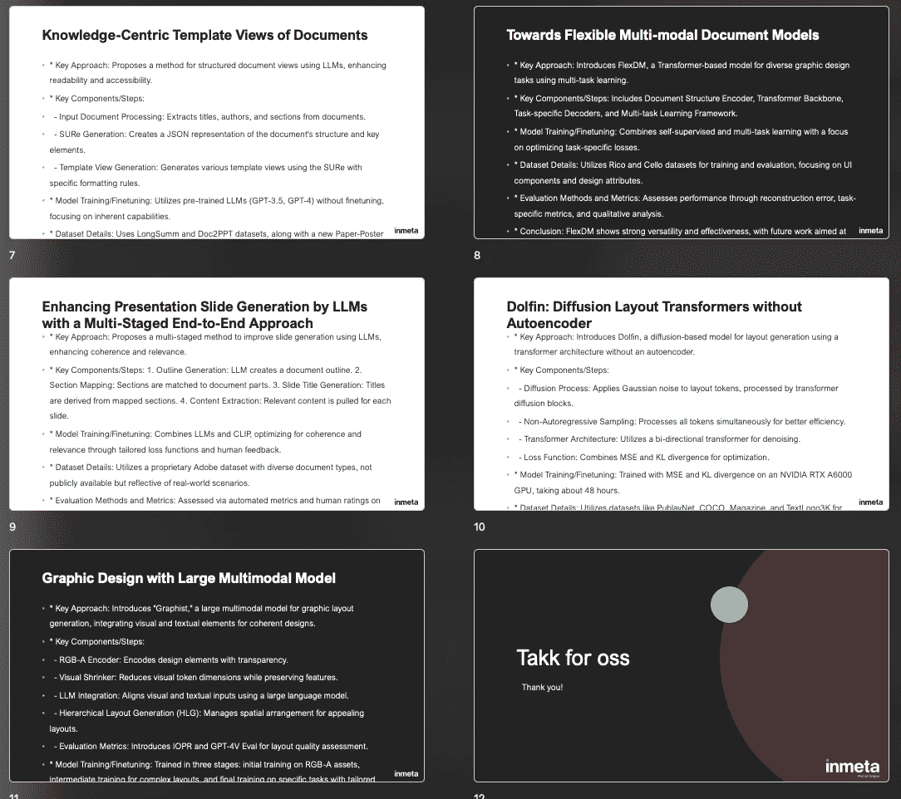

# 我如何使用 LlamaIndex 工作流简化我的研究和演示过程

> 原文：[`towardsdatascience.com/how-i-streamline-my-research-and-presentation-with-llamaindex-workflows-3d75a9a10564?source=collection_archive---------3-----------------------#2024-09-10`](https://towardsdatascience.com/how-i-streamline-my-research-and-presentation-with-llamaindex-workflows-3d75a9a10564?source=collection_archive---------3-----------------------#2024-09-10)

## 一个通过 AI 工作流实现可靠性、灵活性和可控性的示例

[](https://medium.com/@lzchen.cs?source=post_page---byline--3d75a9a10564--------------------------------)[](https://towardsdatascience.com/?source=post_page---byline--3d75a9a10564--------------------------------) [Lingzhen Chen](https://medium.com/@lzchen.cs?source=post_page---byline--3d75a9a10564--------------------------------)

·发表于 [Towards Data Science](https://towardsdatascience.com/?source=post_page---byline--3d75a9a10564--------------------------------) ·16 分钟阅读·2024 年 9 月 10 日

--

LlamaIndex 最近推出了一项新功能：工作流。对于那些希望创建既可靠又灵活的 AI 解决方案的人来说，这非常有用。为什么呢？因为它允许你定义具有控制流的自定义步骤。它支持循环、反馈和错误处理。它就像一个 AI 驱动的管道。但与通常实现为有向无环图（DAG）的典型管道不同，工作流还支持循环执行，使其成为实现代理式和其他更复杂过程的良好候选。

[](https://www.llamaindex.ai/blog/introducing-workflows-beta-a-new-way-to-create-complex-ai-applications-with-llamaindex?source=post_page-----3d75a9a10564--------------------------------) [## Introducing workflows beta: a new way to create complex AI applications with LlamaIndex …

### LlamaIndex 是一个简单灵活的数据框架，用于将自定义数据源连接到大型语言模型（LLMs）。

www.llamaindex.ai](https://www.llamaindex.ai/blog/introducing-workflows-beta-a-new-way-to-create-complex-ai-applications-with-llamaindex?source=post_page-----3d75a9a10564--------------------------------)

在这篇文章中，我将展示如何使用 LlamaIndex 工作流简化我的研究过程，帮助我研究某个主题的最新进展，然后将这些研究成果转化为 PowerPoint 演示文稿。

当涉及到查找新的研究出版物或论文时，[ArXiv.org](http://ArXiv.org)是我主要的来源。然而，网站上的论文非常多。截至 2024 年 9 月，ArXiv 上大约有 250 万篇论文，其中 17,000 篇是仅在 8 月份提交的（统计数据[在这里](https://arxiv.org/stats/monthly_submissions)）。即使限制在一个特定主题下，要阅读的内容依然非常庞大。但这并不是一个新问题。长期以来，学术研究人员必须浏览大量的文献以进行自己的研究。过去两年大型语言模型（LLM）的兴起为我们提供了诸如[ResearchGPT](https://www.researchgpt.com/)、[papersGPT](https://jessezhang.org/llmdemo?via=topaitools)和许多在[OpenAI](https://chatgpt.com/gpts)平台上为特定研究目的构建的定制 GPT 工具，这些工具有助于文献搜索、摘要提取和展示。

尽管这些工具很有用，但我选择使用 LlamaIndex 工作流来构建自己的工作流，原因有几个关键点：

+   我已经有一个特定的研究过程，并希望保持它，但提高效率。

+   我想利用 LLM 和代理行为，并保持对大多数步骤的控制。

+   我的目标不仅仅是获得最终的 PowerPoint 演示文稿；我还希望能访问中间结果，以便在整个过程中观察、调整和排除故障。

+   我需要一个一体化的解决方案，能够端到端处理所有任务，而无需在不同的工具之间切换来进行摘要或创建幻灯片等任务。

+   如果我的需求发生变化，我可以轻松地扩展或修改工作流。

我将设置一个工作流，用户提供一个研究主题（例如：“*使用 GenAI 制作 PowerPoint 幻灯片*”），然后从 arxiv.org 网站拉取几篇论文，并使用 LLM 对每篇论文进行总结。更具体地说，我希望总结的一些关键信息包括：方法类型、模型的组件、预训练或微调方法、数据集、评估方法指标和结论。所有这些的输出将是一个 PowerPoint 演示文稿，每篇论文一张幻灯片，包含来自总结的关键洞见。

在我解释如何实现这个工作流之前，理解 LlamaIndex 工作流中的两个关键概念非常重要：`事件`和`步骤`。

+   `步骤`：步骤是工作流的构建块。它们是代表工作流各个组件的 Python 函数。每个步骤执行特定任务，如发送网页查询、获取 LLM 响应或处理数据。步骤可以通过接收和发出事件与其他步骤进行交互。步骤还可以访问共享的上下文，从而实现跨不同步骤的状态管理。

+   `Event`：事件作为数据承载体和工作流的流程控制器，以 Pydantic 对象的形式实现。它们控制工作流的执行路径，使工作流具有动态性和灵活性。用户可以自定义事件的属性。两个预定义的特殊事件类型`StartEvent`和`StopEvent`控制工作流的开始和结束点。

LlamaIndex 提供了[几个笔记本示例](https://docs.llamaindex.ai/en/stable/understanding/workflows/)和[视频系列](https://www.youtube.com/@LlamaIndex/videos)，详细介绍了这些概念。

除了基本组件外，我的工作流还使用了：

+   **异步和并行执行**：为了提高效率，能够并发地完成多个任务。

+   **嵌套工作流**：工作流中更复杂的层级结构。

+   **LLM 的结构化输出**：为了确保数据在步骤之间传递时是结构化的。

+   **不同的 LLM 模型**：为了在步骤之间使用具有不同能力和推理速度的模型（`gpt-4o`和`gpt-4o-mini`）。

+   **代码执行的动态会话**：为了允许在隔离环境中执行代码。

+   **不同步骤的独立代理**：在过程中使用特定的代理来处理特定任务。

你可以在[Github](https://github.com/lz-chen/research-agent)上找到这个工作流的完整代码。要运行它，你需要 Tavily 搜索、Semantic Scholar 和 Azure OpenAI 的 API 密钥（由于这个实现使用了 Azure 资源，但你可以很容易地将其切换为 OpenAI 或其他模型，使用 LlamaIndex）。在接下来的部分，我将介绍一些构建这个工作流的关键细节和步骤。

# 主工作流

主工作流由两个嵌套的子工作流组成：

+   `summary_gen`：这个子工作流会查找给定主题的研究论文并生成摘要。它通过网页查询进行文献检索，并利用 LLM 根据指示获取见解和摘要。

+   `slide_gen`：这个子工作流负责使用前一步的摘要生成 PowerPoint 幻灯片。它使用提供的 PowerPoint 模板格式化幻灯片，并通过创建和执行 Python 代码（使用`python-pptx`库）生成幻灯片。



主工作流概述（作者提供的图像）

# 摘要生成子工作流

让我们仔细看看这些子工作流。首先是`summary_gen`工作流，它相当简单。它遵循一个简单的线性过程。它基本上作为一个“数据处理”工作流，某些步骤会向 LLM 发送请求。


摘要生成工作流（作者提供的图像）

工作流首先通过获取用户输入（一个研究主题）开始，并经过以下步骤：

+   `tavily_query`：使用 Tavily API 查询与主题相关的学术论文，并返回结构化的响应。

+   `get_paper_with_citations`：对于从 Tavily 查询返回的每篇论文，此步骤使用 SemanticScholar API 获取论文元数据以及被引用论文的元数据。

+   `filter_papers`：由于并非所有检索到的引用都与原始主题直接相关，因此此步骤对结果进行精炼。每篇论文的标题和摘要会被发送到 LLM，以评估它们的相关性。此步骤定义如下：

```py
@step(num_workers=4)
async def filter_papers(self, ev: PaperEvent) -> FilteredPaperEvent:
    llm = new_gpt4o_mini(temperature=0.0)
    response = await process_citation(ev.paper, llm)
    return FilteredPaperEvent(paper=ev.paper, is_relevant=response)
```

在`process_citation()`函数中，我们使用[LlamaIndex 的 FunctionCallingProgram](https://docs.llamaindex.ai/en/stable/examples/output_parsing/function_program/)来获取结构化的响应：

```py
IS_CITATION_RELEVANT_PMT = """
You help a researcher decide whether a paper is relevant to their current research topic: {topic}
You are given the title and abstract of a paper.
title: {title}
abstract: {abstract}

Give a score indicating the relevancy to the research topic, where:
Score 0: Not relevant
Score 1: Somewhat relevant
Score 2: Very relevant

Answer with integer score 0, 1 or 2 and your reason.
"""

class IsCitationRelevant(BaseModel):
    score: int
    reason: str

async def process_citation(citation, llm):
    program = FunctionCallingProgram.from_defaults(
        llm=llm,
        output_cls=IsCitationRelevant,
        prompt_template_str=IS_CITATION_RELEVANT_PMT,
        verbose=True,
    )
    response = await program.acall(
        title=citation.title,
        abstract=citation.summary,
        topic=citation.topic,
        description="Data model for whether the paper is relevant to the research topic.",
    )
    return response
```

+   `download_papers`：此步骤收集所有筛选后的论文，根据相关性得分和在 ArXiv 上的可用性对它们进行优先级排序，并下载最相关的论文。

+   `paper2summary_dispatcher`：每篇下载的论文都会为生成摘要进行准备，通过设置存储图像和摘要的路径。此步骤使用`self.send_event()`来启用每篇论文的`paper2summary`步骤并行执行。它还通过变量`ctx.data[“n_pdfs”]`设置工作流上下文中的论文数量，以便后续步骤知道需要处理的论文总数。

```py
@step(pass_context=True)
async def paper2summary_dispatcher(
    self, ctx: Context, ev: Paper2SummaryDispatcherEvent
) -> Paper2SummaryEvent:
    ctx.data["n_pdfs"] = 0
    for pdf_name in Path(ev.papers_path).glob("*.pdf"):
        img_output_dir = self.papers_images_path / pdf_name.stem
        img_output_dir.mkdir(exist_ok=True, parents=True)
        summary_fpath = self.paper_summary_path / f"{pdf_name.stem}.md"
        ctx.data["n_pdfs"] += 1
        self.send_event(
            Paper2SummaryEvent(
                pdf_path=pdf_name,
                image_output_dir=img_output_dir,
                summary_path=summary_fpath,
            )
        )
```

+   `paper2summary`：对于每篇论文，它将 PDF 转换为图像，然后将图像发送到 LLM 进行摘要生成。一旦生成摘要，它会保存在一个 Markdown 文件中，以供将来参考。特别地，这里生成的摘要非常详细，像一篇小文章，因此还不太适合直接放入演示文稿中。但它会被保留下来，以便用户查看这些中间结果。在后续的步骤中，我们将使这些信息更具可展示性。提供给 LLM 的提示包含关键指令，以确保生成准确且简明的摘要：

```py
SUMMARIZE_PAPER_PMT = """
You are an AI specialized in summarizing scientific papers.
 Your goal is to create concise and informative summaries, with each section preferably around 100 words and 
 limited to a maximum of 200 words, focusing on the core approach, methodology, datasets,
 evaluation details, and conclusions presented in the paper. After you summarize the paper,
 save the summary as a markdown file.

Instructions:
- Key Approach: Summarize the main approach or model proposed by the authors.
 Focus on the core idea behind their method, including any novel techniques, algorithms, or frameworks introduced.
- Key Components/Steps: Identify and describe the key components or steps in the model or approach.
 Break down the architecture, modules, or stages involved, and explain how each contributes to the overall method.
- Model Training/Finetuning: Explain how the authors trained or finetuned their model.
 Include details on the training process, loss functions, optimization techniques, 
 and any specific strategies used to improve the model’s performance.
- Dataset Details: Provide an overview of the datasets used in the study.
 Include information on the size, type and source. Mention whether the dataset is publicly available
 and if there are any benchmarks associated with it.
- Evaluation Methods and Metrics: Detail the evaluation process used to assess the model's performance.
 Include the methods, benchmarks, and metrics employed.
- Conclusion: Summarize the conclusions drawn by the authors. Include the significance of the findings, 
any potential applications, limitations acknowledged by the authors, and suggested future work.

Ensure that the summary is clear and concise, avoiding unnecessary jargon or overly technical language.
 Aim to be understandable to someone with a general background in the field.
 Ensure that all details are accurate and faithfully represent the content of the original paper. 
 Avoid introducing any bias or interpretation beyond what is presented by the authors. Do not add any
 information that is not explicitly stated in the paper. Stick to the content presented by the authors.

"""
```

+   `finish`：此工作流收集所有生成的摘要，验证它们是否正确存储，并记录流程的完成情况，并返回`StopEvent`作为最终结果。

如果此工作流独立运行，执行将在此处结束。然而，由于这是主流程的一个子工作流，完成后将触发下一个子工作流——`slide_gen`。

# 幻灯片生成子工作流

此工作流基于前一步骤中创建的摘要生成幻灯片。以下是`slide_gen`工作流的概述：



幻灯片生成工作流（图片来自作者）

当前一个子工作流完成且摘要 Markdown 文件准备好时，启动以下工作流：

+   `get_summaries`：此步骤读取摘要文件的内容，针对每个文件触发`SummaryEvent`，再次使用`self.send_event()`以便启用并行执行，促进更快速的处理。

+   `summary2outline`：此步骤通过使用 LLM 将摘要转化为幻灯片大纲文本。它将摘要缩短为句子或项目符号，以便放入演示文稿中。

+   `gather_feedback_outline`：在此步骤中，它将提议的幻灯片大纲与论文摘要一起呈现给用户以供他们审阅。用户提供反馈，如果需要修改，可能会触发`OutlineFeedbackEvent`。这个反馈循环会继续进行，直到用户批准最终大纲为止，届时会触发`OutlineOkEvent`。  

```py
@step(pass_context=True)
async def gather_feedback_outline(
    self, ctx: Context, ev: OutlineEvent
) -> OutlineFeedbackEvent | OutlineOkEvent:
    """Present user the original paper summary and the outlines generated, gather feedback from user"""
    print(f"the original summary is: {ev.summary}")
    print(f"the outline is: {ev.outline}")
    print("Do you want to proceed with this outline? (yes/no):")
    feedback = input()
    if feedback.lower().strip() in ["yes", "y"]:
        return OutlineOkEvent(summary=ev.summary, outline=ev.outline)
    else:
        print("Please provide feedback on the outline:")
        feedback = input()
        return OutlineFeedbackEvent(
            summary=ev.summary, outline=ev.outline, feedback=feedback
        )
```

+   `outlines_with_layout`：它通过包括来自给定 PowerPoint 模板的页面布局细节，使用 LLM 增强每个幻灯片大纲。在这个阶段，所有幻灯片页面的内容和设计都会保存在一个 JSON 文件中。  

+   `slide_gen`：它使用**ReAct 代理**根据给定的大纲和布局细节制作幻灯片文档。这个代理具有一个[代码解释器工具](https://llamahub.ai/l/tools/llama-index-tools-azure-code-interpreter?from=all)，可以在隔离环境中运行和修正代码，还具有一个布局检查工具，用来查看给定的 PowerPoint 模板信息。该代理会使用`python-pptx`来创建幻灯片，并能观察并修正错误。  

```py
 @step(pass_context=True)
async def slide_gen(
    self, ctx: Context, ev: OutlinesWithLayoutEvent
) -> SlideGeneratedEvent:
    agent = ReActAgent.from_tools(
        tools=self.azure_code_interpreter.to_tool_list() + [self.all_layout_tool],
        llm=new_gpt4o(0.1),
        verbose=True,
        max_iterations=50,
    )

    prompt = (
        SLIDE_GEN_PMT.format(
            json_file_path=ev.outlines_fpath.as_posix(),
            template_fpath=self.slide_template_path,
            final_slide_fname=self.final_slide_fname,
        )
        + REACT_PROMPT_SUFFIX
    )
    agent.update_prompts({"agent_worker:system_prompt": PromptTemplate(prompt)})

    res = self.azure_code_interpreter.upload_file(
        local_file_path=self.slide_template_path
    )
    logging.info(f"Uploaded file to Azure: {res}")

    response = agent.chat(
        f"An example of outline item in json is {ev.outline_example.json()},"
        f" generate a slide deck"
    )
    local_files = self.download_all_files_from_session()
    return SlideGeneratedEvent(
        pptx_fpath=f"{self.workflow_artifacts_path}/{self.final_slide_fname}"
    )
```

+   `validate_slides`：检查幻灯片文档，确保它符合给定的标准。这个步骤包括将幻灯片转化为图像，并让 LLM 根据指南对其进行视觉检查，以确保内容正确且风格一致。根据 LLM 的发现，如果有问题，它会发送`SlideValidationEvent`，如果一切看起来良好，则会发送`StopEvent`。  

```py
@step(pass_context=True)
async def validate_slides(
    self, ctx: Context, ev: SlideGeneratedEvent
) -> StopEvent | SlideValidationEvent:
    """Validate the generated slide deck"""
    ctx.data["n_retry"] += 1
    ctx.data["latest_pptx_file"] = Path(ev.pptx_fpath).name
    img_dir = pptx2images(Path(ev.pptx_fpath))
    image_documents = SimpleDirectoryReader(img_dir).load_data()
    llm = mm_gpt4o
    program = MultiModalLLMCompletionProgram.from_defaults(
        output_parser=PydanticOutputParser(SlideValidationResult),
        image_documents=image_documents,
        prompt_template_str=SLIDE_VALIDATION_PMT,
        multi_modal_llm=llm,
        verbose=True,
    )
    response = program()
    if response.is_valid:
        return StopEvent(
            self.workflow_artifacts_path.joinpath(self.final_slide_fname)
        )
    else:
        if ctx.data["n_retry"] < self.max_validation_retries:
            return SlideValidationEvent(result=response)
        else:
            return StopEvent(
                f"The slides are not fixed after {self.max_validation_retries} retries!"
            )
```

用于验证的标准是：  

```py
SLIDE_VALIDATION_PMT = """
You are an AI that validates the slide deck generated according to following rules:
- The slide need to have a front page 
- The slide need to have a final page (e.g. a 'thank you' or 'questions' page)
- The slide texts are clearly readable, not cut off, not overflowing the textbox
 and not overlapping with other elements

If any of the above rules are violated, you need to provide the index of the slide that violates the rule,
 as well as suggestion on how to fix it. 

"""
```

+   `modify_slides`：如果幻灯片未通过验证检查，上一阶段会发送`SlideValidationEvent`事件。在这里，另一个**ReAct 代理**会根据验证反馈更新幻灯片，更新后的幻灯片将被保存并返回进行再次验证。根据`SlideGenWorkflow`类的`max_validation_retries`变量属性，这个验证循环可能会多次发生。  

为了运行完整的端到端工作流，我们通过以下步骤启动过程：  

```py
class SummaryAndSlideGenerationWorkflow(Workflow):
    @step
    async def summary_gen(
        self, ctx: Context, ev: StartEvent, summary_gen_wf: SummaryGenerationWorkflow
    ) -> SummaryWfReadyEvent:
        print("Need to run reflection")
        res = await summary_gen_wf.run(user_query=ev.user_query)
        return SummaryWfReadyEvent(summary_dir=res)

    @step
    async def slide_gen(
        self, ctx: Context, ev: SummaryWfReadyEvent, slide_gen_wf: SlideGenerationWorkflow
    ) -> StopEvent:
        res = await slide_gen_wf.run(file_dir=ev.summary_dir)
        return StopEvent()

async def run_workflow(user_query: str):
    wf = SummaryAndSlideGenerationWorkflow(timeout=2000, verbose=True)
    wf.add_workflows(
        summary_gen_wf=SummaryGenerationWorkflow(timeout=800, verbose=True)
    )
    wf.add_workflows(slide_gen_wf=SlideGenerationWorkflow(timeout=1200, verbose=True))
    result = await wf.run(
        user_query=user_query,
    )
    print(result)

@click.command()
@click.option(
    "--user-query",
    "-q",
    required=False,
    help="The user query",
    default="powerpoint slides automation",
)
def main(user_query: str):
    asyncio.run(run_workflow(user_query))

if __name__ == "__main__":
    draw_all_possible_flows(
        SummaryAndSlideGenerationWorkflow, filename="summary_slide_gen_flows.html"
    )
    main()
```

# 结果  

现在让我们看一下为论文[*LayoutGPT: 基于大语言模型的组合视觉规划与生成*](https://arxiv.org/abs/2305.15393)生成的一个中间总结示例：  

```py
 # Summary of "LayoutGPT: Compositional Visual Planning and Generation with Large Language Models"

## Key Approach
The paper introduces LayoutGPT, a framework leveraging large language models (LLMs) for compositional visual planning and generation. The core idea is to utilize LLMs to generate 2D and 3D scene layouts from textual descriptions, integrating numerical and spatial reasoning. LayoutGPT employs a novel prompt construction method and in-context learning to enhance the model's ability to understand and generate complex visual scenes.

## Key Components/Steps
1\. **Prompt Construction**: LayoutGPT uses detailed task instructions and CSS-like structures to guide the LLMs in generating layouts.
2\. **In-Context Learning**: Demonstrative exemplars are provided to the LLMs to improve their understanding and generation capabilities.
3\. **Numerical and Spatial Reasoning**: The model incorporates reasoning capabilities to handle numerical and spatial relationships in scene generation.
4\. **Scene Synthesis**: LayoutGPT generates 2D keypoint layouts and 3D scene layouts, ensuring spatial coherence and object placement accuracy.

## Model Training/Finetuning
LayoutGPT is built on GPT-3.5 and GPT-4 models, utilizing in-context learning rather than traditional finetuning. The training process involves providing the model with structured prompts and examples to guide its generation process. Loss functions and optimization techniques are not explicitly detailed, as the focus is on leveraging pre-trained LLMs with minimal additional training.

## Dataset Details
The study uses several datasets:
- **NSR-1K**: A new benchmark for numerical and spatial reasoning, created from MSCOCO annotations.
- **3D-FRONT**: Used for 3D scene synthesis, containing diverse indoor scenes.
- **HRS-Bench**: For evaluating color binding accuracy in generated scenes.
These datasets are publicly available and serve as benchmarks for evaluating the model's performance.

## Evaluation Methods and Metrics
The evaluation involves:
- **Quantitative Metrics**: Precision, recall, and F1 scores for layout accuracy, numerical reasoning, and spatial reasoning.
- **Qualitative Analysis**: Visual inspection of generated scenes to assess spatial coherence and object placement.
- **Comparative Analysis**: Benchmarking against existing methods like GLIGEN and ATISS to demonstrate improvements in layout generation.

## Conclusion
The authors conclude that LayoutGPT effectively integrates LLMs for visual planning and scene generation, achieving state-of-the-art performance in 2D and 3D layout tasks. The framework's ability to handle numerical and spatial reasoning is highlighted as a significant advancement. Limitations include the focus on specific scene types and the need for further exploration of additional visual reasoning tasks. Future work suggests expanding the model's capabilities to more diverse and complex visual scenarios.
```

毋庸置疑，总结对于 LLM 来说并不是一个特别具有挑战性的任务。只需提供论文的图像，LLM 便能有效地捕捉到提示中概述的所有关键内容，并且相当好地遵循了样式要求。  

至于最终结果，以下是生成的几张演示文稿幻灯片示例：  

  

生成的幻灯片（图片由作者提供）  

  

生成的幻灯片（图片由作者提供）

在填写摘要内容时，按照模板的布局保持文本风格，将总结要点以项目符号格式呈现，并包含幻灯片中所需的所有相关论文时，工作流程运行得很好。唯一的问题是，有时主内容占位符中的文本没有调整大小以适应文本框，文本溢出幻灯片边界。这类错误可能通过使用更有针对性的幻灯片验证提示来修复。

# 最后的想法

在本文中，我展示了如何使用 LlamaIndex 工作流程来简化我的研究和展示过程，从查询学术论文到生成最终的 PowerPoint 幻灯片。以下是我在实施该工作流程时的一些想法和观察，以及我认为可能改进的方面。

`**gpt-4o**` **模型与** `**gpt-4o-mini**` **模型**：虽然声称`gpt-4o-mini`的性能与`gpt-4o`相当，但我发现`gpt-4o-mini`在完成复杂任务时明显存在问题，如在工作流程中作为 ReAct 代理进行规划和修正错误。然而，它在简单任务（如内容摘要）中表现得足够好。

**创建中间文件**：生成中间文件（摘要的 Markdown 文件和摘要布局的 JSON 文件）是一个有用的方法，它减轻了代理必须跟踪内容和幻灯片样式的负担，同时生成幻灯片的代码。

**处理边缘案例**：从头到尾运行工作流程揭示了许多边缘案例，特别是在验证幻灯片样式时。目前，通过迭代修改相关提示来处理这些问题。但我认为，促进某种类型的协作和人类参与机制将大大有助于此，同时也能提供更高的准确性。

**python-pptx 的局限性**。工作流程受限于 python-pptx 在 PowerPoint 幻灯片中能够实际渲染和操作的内容。因此，值得进一步考虑其他高效的幻灯片生成方式，例如使用 VBA。

**用于摘要生成的代理和工具**：与严格的逐步摘要生成过程不同，使用一个或多个具有工具访问权限的代理（目前是步骤函数）可以使工作流程更灵活，更适应未来的变化。

**增强人类参与的互动**。目前的实现不允许太多用户交互。让最终用户更多地参与工作流程，尤其是在涉及用户判断的任务中，如内容验证和精炼，这非常有益。一个方法是增加更多步骤，工作流程可以向用户请求验证，并考虑用户的反馈。人类的参与对于实时修复错误和进行更改是无价的。

**论文查询引擎**。还可以为每篇论文构建[查询引擎](https://docs.llamaindex.ai/en/stable/module_guides/deploying/query_engine/)，使用户能够提出问题并根据需要修改摘要。这有助于工作流结果的个性化。

综上所述，LlamaIndex 工作流是一个非常灵活且可定制的工具，用于构建复杂且量身定制的 AI 解决方案。它让我可以自由定义我的流程，同时具备可控性和灵活性，并能够利用库中的许多内置工具。

# 下一步是什么？

如前所述，主要的改进将是**实现更多人机协作（human-in-the-loop）**类型的功能。例如，允许设置更多的交互式检查点，用户可以在需要时覆盖步骤执行，将交互步骤集成到工作流中，并提供用户在任何阶段检查工作流是否产生满意输出的机会。与提供更好用户体验的目标一致，构建**Streamlit 前端**也是一个不错的补充，可以提供更多关于工作流执行的深入信息。拥有前端将使得用户能够实时监控工作流的进展，并根据需要更快速地调整轨迹。此外，获取用户反馈和验证、可视化中间结果和最终输出将为工作流增加透明度。所以请关注下一篇文章，了解这些变化！😃

感谢阅读！查看我的[GitHub](https://github.com/lz-chen/research-agent)以获取完整实现。我期待听到你的想法、意见和反馈。我目前在[Inmeta](https://inmeta.no/)担任数据科学顾问，Inmeta 是[Crayon Group](https://www.crayon.com/no/)的一部分。欢迎在[LinkedIn](https://www.linkedin.com/in/lingzhen-chen-76720680/)与我建立联系。😊
