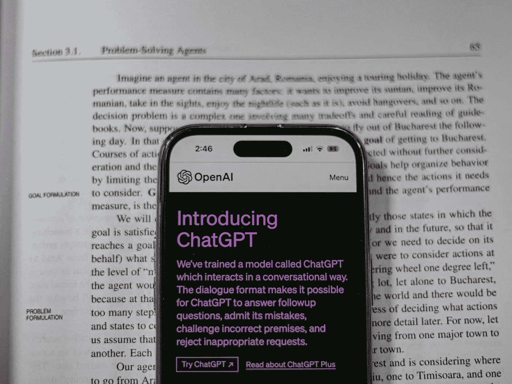

# 我如何作为数据科学家使用 ChatGPT

> 原文：[`towardsdatascience.com/how-i-use-chatgpt-as-a-data-scientist-0730fa1e21c2?source=collection_archive---------0-----------------------#2024-06-02`](https://towardsdatascience.com/how-i-use-chatgpt-as-a-data-scientist-0730fa1e21c2?source=collection_archive---------0-----------------------#2024-06-02)

## ChatGPT 如何提高了我作为数据科学家的工作效率

 [Egor Howell](https://medium.com/@egorhowell?source=post_page---byline--0730fa1e21c2--------------------------------)

·发表于[Towards Data Science](https://towardsdatascience.com/?source=post_page---byline--0730fa1e21c2--------------------------------) ·阅读时间 8 分钟·2024 年 6 月 2 日

--

摄影：Shantanu Kumar：[`www.pexels.com/photo/chatgpt-webpage-open-on-iphone-16474955/`](https://www.pexels.com/photo/chatgpt-webpage-open-on-iphone-16474955/)

全世界都听说过 ChatGPT，但根据最近的[新闻](https://www.bbc.co.uk/news/articles/c511x4g7x7jo)[研究](https://www.bbc.co.uk/news/articles/c511x4g7x7jo)，只有 2%的人每天使用它。

作为数据科学家，我每天都会用它做很多事情。老实说，它在某些领域让我生产力翻倍。

在这篇文章中，我想解释一下我如何使用 ChatGPT，希望能给你一些新思路，帮助你更频繁地使用它，以提高你的产出，无论你是不是数据科学家。

# 学习与研究

我最喜欢的提示之一是“像我 5 岁那样解释”（ELI5）。它基本上让 ChatGPT 用一种非常简单的方式向我解释一个话题，往往比许多在线资源还要清晰。

例如，如果我们输入“像我 5 岁那样解释递归神经网络”。
