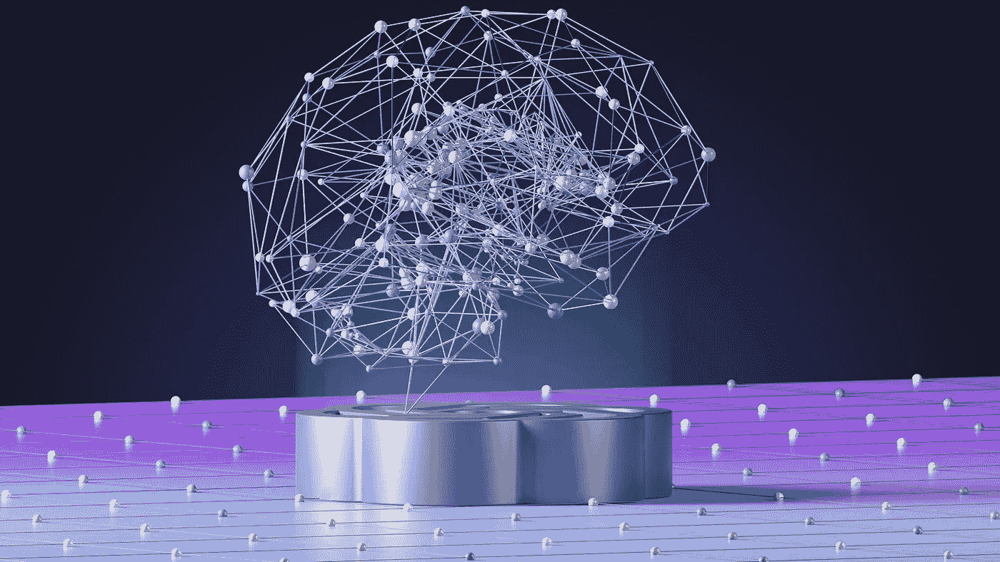

# 如何学习人工智能（路线图）

> 原文：[`towardsdatascience.com/how-id-learn-ai-if-i-could-start-over-b220872bc118?source=collection_archive---------1-----------------------#2024-08-05`](https://towardsdatascience.com/how-id-learn-ai-if-i-could-start-over-b220872bc118?source=collection_archive---------1-----------------------#2024-08-05)

## 一份关于如何有效学习人工智能的完整分解

 [Egor Howell](https://medium.com/@egorhowell?source=post_page---byline--b220872bc118--------------------------------)

·发表于[Towards Data Science](https://towardsdatascience.com/?source=post_page---byline--b220872bc118--------------------------------) ·阅读时间 10 分钟·2024 年 8 月 5 日

--

照片由[Growtika](https://unsplash.com/@growtika?utm_source=medium&utm_medium=referral)提供，来源于[Unsplash](https://unsplash.com/?utm_source=medium&utm_medium=referral)

人工智能无处不在；我们在新闻中听到它，工作中接触到它，甚至在与家人交谈时也会提到它。显然，它将继续存在，并将在可预见的未来影响我们的生活。

如果你和我一样，我总是对新技术及其工作原理充满好奇，所以在本文中，我将介绍一份路线图，帮助你从零开始学习人工智能。

***让我们开始吧！***

***注意：你也可以观看这个博客文章的视频版，并在我的 YouTube 频道下载完整的路线图 PDF：***

# 什么是人工智能，为什么要学习它？

自从 2022 年 ChatGPT 发布以来，人工智能引发了大量的炒作。然而，人工智能作为一个概念已经存在很长时间，按照目前的形式可以追溯到 1950 年代，当时[神经网络的起源](https://medium.com/gitconnected/intro-perceptron-architecture-neural-networks-101-2a487062810c?sk=a738fb46cf55825c3dd47f91b26ad5e7)就已经出现。

最近的爆发可以归因于许多因素，比如计算资源的增加、更多可用的数据，以及……
