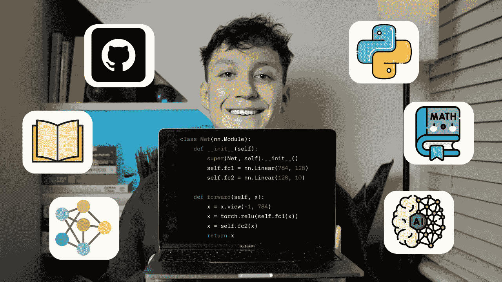

# 我如何学习机器学习（如果我可以重新开始）

> 原文：[`towardsdatascience.com/how-id-learn-machine-learning-if-i-could-start-over-c68d697e6a8a?source=collection_archive---------1-----------------------#2024-01-27`](https://towardsdatascience.com/how-id-learn-machine-learning-if-i-could-start-over-c68d697e6a8a?source=collection_archive---------1-----------------------#2024-01-27)

## 如何在今年有效学习机器学习的详细步骤

 [Egor Howell](https://medium.com/@egorhowell?source=post_page---byline--c68d697e6a8a--------------------------------)

·发表于 [Towards Data Science](https://towardsdatascience.com/?source=post_page---byline--c68d697e6a8a--------------------------------) ·阅读时间：8 分钟·2024 年 1 月 27 日

--

作者提供的图片。

我已经作为数据科学家工作超过两年了。随着时间的推移，我学习并主要研究了机器学习（ML）。对我来说，这可能是工作中最迷人的部分。

ML 是一个**庞大的**领域，有很多内容需要学习和理解。然而，一步一步来会使整个过程不那么令人生畏，而且更容易处理。

在这篇文章中，我想回顾一下，如果我需要从零开始学习机器学习，我会采取哪些步骤。让我们开始吧！

# 数学

机器学习围绕算法展开，算法本质上是一系列数学运算。这些算法可以通过各种方法和多种编程语言实现，但它们的基本数学原理是相同的。

一个常见的论点是，学习机器学习不需要数学，因为大多数现代……
