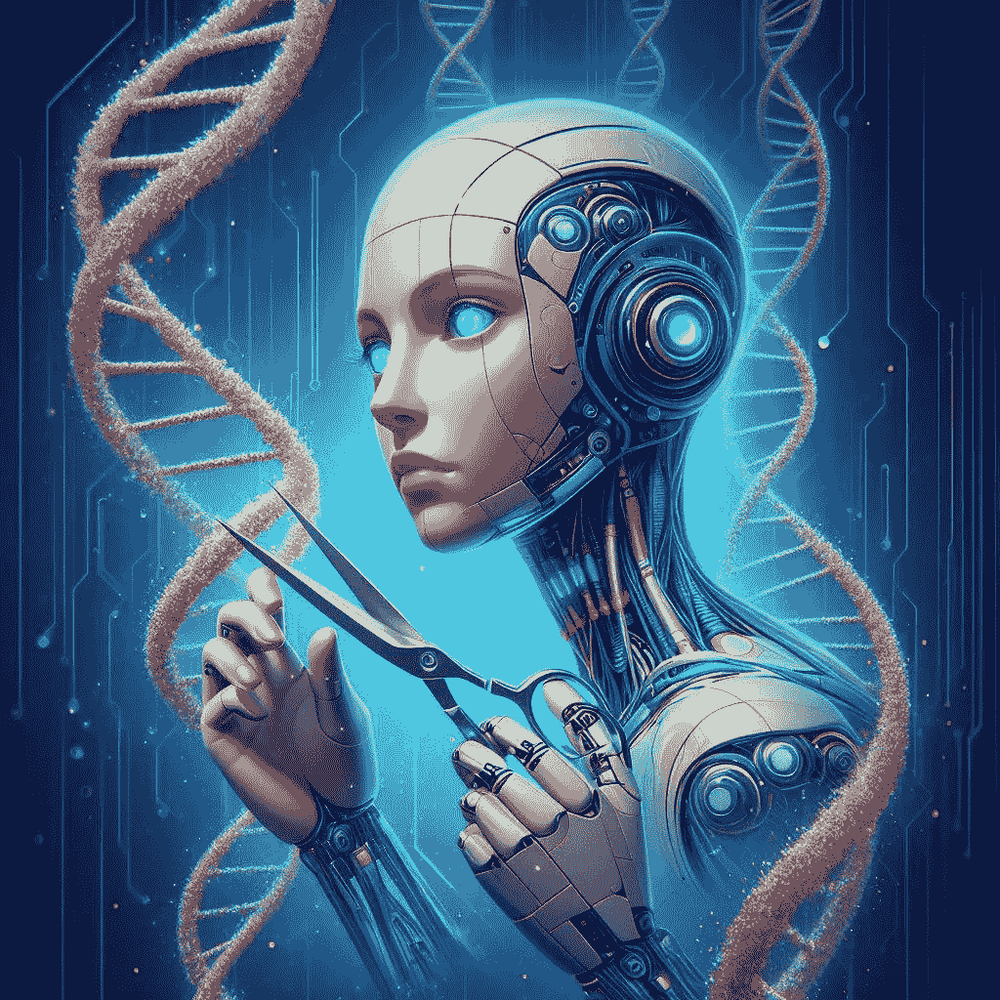

# 如何利用大型语言模型推动基因编辑革命

> 原文：[`towardsdatascience.com/how-llms-can-fuel-gene-editing-revolution-1b15663f697c?source=collection_archive---------7-----------------------#2024-05-09`](https://towardsdatascience.com/how-llms-can-fuel-gene-editing-revolution-1b15663f697c?source=collection_archive---------7-----------------------#2024-05-09)

## |人工智能| 大型语言模型（LLM）| 基因编辑| 医学中的 AI|

## 基因编辑有可能治愈大多数疾病，而大型语言模型可以加速这一梦想的实现

 [Salvatore Raieli](https://salvatore-raieli.medium.com/?source=post_page---byline--1b15663f697c--------------------------------)

·发表于[Towards Data Science](https://towardsdatascience.com/?source=post_page---byline--1b15663f697c--------------------------------) ·9 分钟阅读·2024 年 5 月 9 日

--

由作者使用 AI 生成的图像

> 基因就像故事，而 DNA 则是写故事的语言。——山姆·基恩

生成性 AI 可以创作诗歌、代码、博客文章等。这一切都是通过对文本的训练实现的。我们常常忘记，文本其实是字符的序列，这些字符可以以复杂的方式组合，进而产生无限且复杂的意义。同样，生命也由少数几个基本字符组成（[DNA](https://en.wikipedia.org/wiki/DNA)只有 4 种，[蛋白质](https://en.wikipedia.org/wiki/Protein)只有 20 种），这些字符的无限组合使得我们今天能拥有如此惊人的生物多样性。

> 如果我们是由序列构成的，而语言模型能够分析这些序列，那为什么不利用语言模型来分析 DNA 和蛋白质序列呢？

**这就是过去两年革命的基础。** 这场革命始于[AlphaFold2](https://www.nature.com/articles/s41586-021-03819-2)，研究人员通过使用一个训练有素的蛋白质序列语言模型，成功解决了一个困扰了 100 年的问题……
