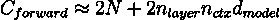

# 从零开始训练 LLM 需要多长时间？

> 原文：[`towardsdatascience.com/how-long-does-it-take-to-train-the-llm-from-scratch-a1adb194c624?source=collection_archive---------1-----------------------#2024-10-28`](https://towardsdatascience.com/how-long-does-it-take-to-train-the-llm-from-scratch-a1adb194c624?source=collection_archive---------1-----------------------#2024-10-28)

## 估算训练 X 亿个 LLM、Y 万亿个 tokens 以及 Z 个 GPU 计算所需时间的指南

 [Max Shap](https://medium.com/@maxshapp?source=post_page---byline--a1adb194c624--------------------------------)

·发表于[Towards Data Science](https://towardsdatascience.com/?source=post_page---byline--a1adb194c624--------------------------------) ·阅读时间：5 分钟·2024 年 10 月 28 日

--

图片由作者提供

## **简介**

每个从事 LLM 训练的机器学习工程师都曾面临过来自经理或产品负责人提出的问题：*“训练这个 LLM 需要多长时间？”*

当我第一次尝试在网上找到答案时，我遇到了许多涵盖通用话题的文章——训练技巧、模型评估等。但没有一篇文章解决了我核心的问题：*我该如何估算训练所需的时间？*

因为缺乏明确的实用指导，我决定自己创建一套方法。在这篇文章中，我将带你了解一种简单的估算方法，帮助你快速估算基于 LLM 的训练所需的时间，这个估算基于模型的规模、数据量以及可用的 GPU 算力。

## **方法**

目标是量化训练过程中处理数据和更新模型参数所需的计算要求，以**FLOPs**（浮点运算次数）表示。接下来，我们基于所选 GPU 的类型和数量，估算系统的吞吐量，以**FLOPS**（每秒浮点运算次数）表示。一旦所有内容都在相同的尺度上表达，我们就可以轻松计算训练模型所需的时间。

所以最终的公式是相当直接的：

让我们深入了解如何估算这些变量。

## 数据和模型的 FLOPs

基于 Transformer 的 LLM 在正向传播过程中，每个 token 的大致加减乘除运算量约为以下的 FLOPs：

从 [论文](https://arxiv.org/pdf/2001.08361)中估算 Transformer 模型在前向传播时每个 token 的 FLOP 数

其中，乘法累加操作在矩阵乘法中引入了二的因素。

反向传播所需的计算量大约是前向传播的两倍。这是因为在反向传播过程中，我们需要计算每个权重的梯度以及相对于中间激活值的梯度，特别是每一层的激活值。

**考虑到这一点，每个训练 token 的浮动点运算量可以估算为：**

从 [论文](https://arxiv.org/pdf/2001.08361)中估算 Transformer 模型大小为 N 在前向和反向传播时每个 token 的 FLOP 数

计算这些估算值的更详细数学推导可以在作者的论文中找到，链接见 [这里](https://arxiv.org/pdf/2001.08361)。

总结一下，训练大小为 N 的 Transformer 模型和包含 P 个 token 的数据集的 FLOPS 可以估算为：

## 训练基础设施的 FLOPS

今天，大多数大型语言模型（LLM）都是使用 GPU 加速器进行训练的。每种 GPU 模型（如 Nvidia 的 H100、A100 或 V100）都有其自己的 FLOPS 性能，具体取决于所使用的数据类型（形态）。例如，使用 FP64 进行的运算比使用 FP32 的运算要慢，依此类推。特定 GPU 的峰值理论 FLOPS 通常可以在其产品规格页面上找到（例如，[这里](https://www.nvidia.com/en-gb/data-center/h100/) 是 H100 的页面）。

然而，对于 GPU 的理论最大 FLOPS，通常在训练大型语言模型时并不那么相关。这是因为这些模型通常在成千上万的互联 GPU 上进行训练，其中网络通信效率变得至关重要。如果设备之间的通信成为瓶颈，它可能会大幅降低整体速度，使得系统的实际 FLOPS 远低于预期。

为了解决这个问题，重要的是跟踪一个叫做模型 FLOPS 利用率（MFU）的指标——即观察到的吞吐量与理论最大吞吐量的比率，假设硬件在没有内存或通信开销的情况下以峰值效率运行。在实践中，随着参与训练的 GPU 数量增加，MFU 通常会下降。使用当前的设置，要实现超过 50% 的 MFU 是具有挑战性的。

例如，LLaMA 3 [论文](https://arxiv.org/pdf/2407.21783)的作者报告称，在使用 16,000 个 GPU 进行训练时，MFU 为 38%，即每个 GPU 的吞吐量为 380 太 FLOPS。

在 [论文](https://arxiv.org/pdf/2407.21783)中报告了不同配置下每个 GPU 训练 Llama3 模型时的 TFLOPs 吞吐量。

总结一下，当进行模型训练的简易计算时，遵循以下步骤：

1.  确定你的选择的 GPU 支持的数据类型的理论峰值 FLOPS。

1.  根据 GPU 的数量和网络拓扑结构，通过基准测试或参考开源数据（如 Meta 工程师的报告，见上表）估算 MFU（模型 FLOPS 利用率）。

1.  将理论 FLOPS 乘以 MFU，得到每个 GPU 的平均吞吐量。

1.  将步骤 3 的结果乘以参与训练的 GPU 总数。

## Llama 3 405B 的案例研究

现在，让我们用我们粗略的计算来估算训练一个 405B 参数模型需要多长时间。

LLaMA 3.1 (405B)使用 15.6 万亿个标记进行训练——一个巨大的数据集。训练如此规模的模型所需的总 FLOPs 可以按如下方式计算：

作者使用了 16,000 块 H100 GPU 进行训练。根据论文，平均吞吐量为每个 GPU 400 teraflops。这意味着训练基础设施可以提供总吞吐量：

最后，通过将所需的总 FLOPs 除以可用吞吐量并将结果转换为天数（因为我们真正关心的是训练天数），我们得到：

## 奖励：训练 Llama 3.1 405B 的费用是多少？

一旦知道了训练设置中每个 GPU 的 FLOPS，你就可以计算出训练给定规模和数据集的模型所需的总 GPU 小时数。然后，你可以将这个数字乘以云服务提供商的 GPU 每小时费用（或你自己的 GPU 每小时费用）。

例如，如果一块 H100 GPU 的费用大约是每小时 2 美元，那么训练这个模型的总费用大约为 5200 万美元！下面的公式解释了这个数字是如何得出的：

## 参考文献

[1] [神经语言模型的扩展法则](https://arxiv.org/pdf/2001.08361) 由 Jared Kaplan 等人编写。

[2] [Llama 3 模型群体](https://arxiv.org/pdf/2407.21783) 由 Meta AI 团队编写
