# 一碗幸运魅力麦片有多幸运？

> 原文：[`towardsdatascience.com/how-lucky-is-a-bowl-of-lucky-charms-9040fe2cc560?source=collection_archive---------5-----------------------#2024-03-16`](https://towardsdatascience.com/how-lucky-is-a-bowl-of-lucky-charms-9040fe2cc560?source=collection_archive---------5-----------------------#2024-03-16)

[](https://medium.com/@gjkernsysu?source=post_page---byline--9040fe2cc560--------------------------------)[](https://towardsdatascience.com/?source=post_page---byline--9040fe2cc560--------------------------------) [G. Jay Kerns](https://medium.com/@gjkernsysu?source=post_page---byline--9040fe2cc560--------------------------------)

·发表于 [Towards Data Science](https://towardsdatascience.com/?source=post_page---byline--9040fe2cc560--------------------------------) ·阅读时间 16 分钟·2024 年 3 月 16 日

--

`**tl;dr**` **版本：** 一组学生帮助设计并进行了一项实验，以确定一盒幸运魅力麦片中每碗是否都同样“幸运”。结果发现，并非如此。我们估计每增加一碗，平均减少约 2.7 个魅力糖果。这意味着从第一碗到最后一碗，糖果数量下降了超过 50%。麦片的重量似乎也起到了作用，保持碗恒定的情况下，每增加 1 克麦片，我们估计大约多出 0.5 个糖果。碗和重量之间的相互作用在统计上并不显著。

请参阅[这个 GitHub 仓库](https://github.com/gjkerns/luckyCharms)获取数据、代码、照片、*等等*。

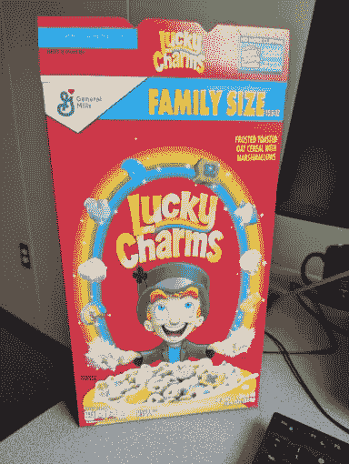

图 1：它们神奇地美味！(*图片由作者提供*)

## 背景

在 2010 年代初期，互联网上发生了一场关于“双重夹心”奥利奥是否真的是双重夹心的调查风波。（答案是否定的。）这是一个引人入胜的想法，从那时起，关于这一主题已经写了大量的资料，[可以从这里开始了解](http://blog.recursiveprocess.com/2013/03/03/oreo-original-vs-double-vs-mega/)。这一讨论引起了足够的关注，以至于一些老师显然将这个实验作为课堂活动重复进行，而当地学生也报告说，在超过 10 年后的今天，他们在自己的学校进行过类似的实验。

## 引言

2023 年夏天的一个早晨，我正吃着一碗幸运符号做早餐。盒子几乎空了，我叹了口气自言自语：“真希望这盒快点吃完，好让我能打开新的一盒……”如果你和我一样，或者和其他数百万喜爱幸运符号的人一样，那你一定很喜欢它，并且从你记事起就一直喜欢，毕竟它已经存在了[60 年](https://en.wikipedia.org/wiki/Lucky_Charms)。它们真的*神奇美味*。可是，坐在那个不满的夏日早晨，手里拿着勺子，我突然意识到，我吃的这碗麦片似乎没有以前的那么*神奇*。它好像缺少了些什么。（当然是那些符号了。）这是我的想象吗？这种效果真的存在吗？如果有的话，能测量吗？

那时我正好在教一门本科的概率与统计课程，和四名学生一起，我们决心要弄明白这个问题。

# 实验和数据

经过一些讨论，团队决定采用以下材料和方法。

## 材料

+   六（6）盒家庭装幸运符号（18.6 盎司，527 克）

+   电子厨房秤

+   两个塑料“碗”，容器 A 和容器 B，分别为 40.125 克和 28.375 克。

+   大碗用于丢弃物，一些垃圾袋，其他配件

幸运符号是从我们当地的零售商沃尔玛购买的。*n* = 6 盒并没有什么特别的，它仅仅是一个人能用双手一次性携带到卡法罗大厅 6 楼的盒数。厨房秤是用来称量麦片的，团队认为这可能很重要，而且秤还会帮助数据收集，因为我们不想过于专注于每次取相同数量的麦片。

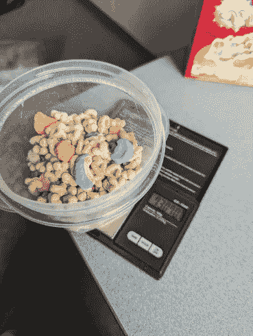

图 2：称重中。(*图片由作者提供*)

# 方法

为了本次实验，“碗”被定义为大约 1 份麦片，按照盒子上的推荐（1 杯或 36 克），尽管除了一个小小的魔法妖精之外，没人会用 36 克幸运符号作为早餐。团队对碗的大小并没有特别挑剔，任何接近 1 杯的量都算合适。反正我们是通过厨房秤来计算麦片的质量的，目标是得到一组健康的观察重量范围。

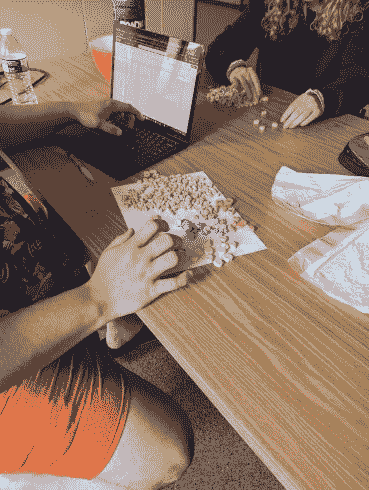

图 3：加文·杜韦（左）和布雷娜·布罗克（右） (*图片由作者提供*)

每碗麦片直接从盒子倒入塑料容器中称重，然后倒在桌面上进行计数。将烤燕麦和棉花糖分开并丢弃。接下来，识别出以下八（8）种符号，并记录它们的数量：粉红色心形、彩虹、紫色马蹄铁、蓝色月亮、绿色三叶草、独角兽、美味的红色气球和橙色星星。

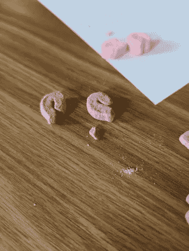

图 4。这被计为 3 个紫色马蹄铁。 (*图像由作者提供*)

偶尔碗里会有一些小棉花糖块；并非每个符号都保持 100%完好。为了解决这个问题，团队尝试将这些小块归类为某种符号类型（绿色四叶草、蓝色月亮、*等等*），如果能够确定类型，那么该小块会被计入相应类别。如果该小块无法辨识或者太小无法确定类型，则会被丢弃。

# 数据

数据在两次独立的课堂会议中收集。学生们两人一组，负责倒符号和计数。我负责使用秤并记录称重数据，帮助学生输入计算机。团队进入了数据收集的状态，实验结束时，所有 4 名学生都能独立倒符号和计数。

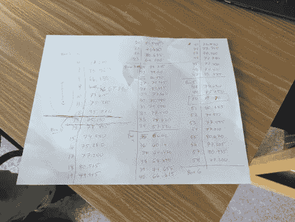

图 5。数据几乎是最原始的形式。 (*图像由作者提供*)

每一轮中，塑料容器和谷物一起称重，并从观察到的总重量中减去容器的重量（在实验开始时测量）。然后，将符号输入到各自的列中并汇总。

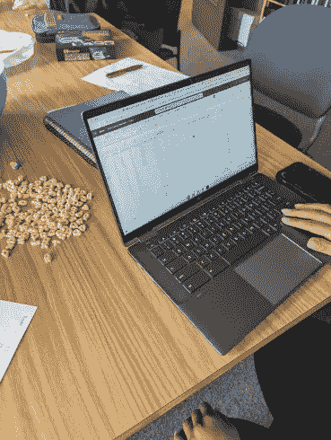

图 6。图片中的人：Kate Coppola (*图像由作者提供*)

# 测量变量

+   `Box`：盒子编号（1 至 6）

+   `Bowl`：每个盒子的顺序碗（范围从 1 到 13）

+   `Observation`：跨盒子的碗的观察顺序（1 至 69）

+   `Totweight`：塑料容器和谷物的总重量，单位为克

+   `Weight`：谷物的重量，单位为克，减去容器的重量

+   `Hearts`，`Stars`，*等等*：该碗中某种符号的数量

+   `Totcharms`：各种符号的总和

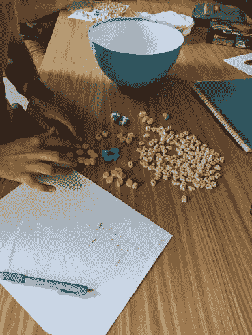

图 7。图片中的人：Haziq Rabbani (*图像由作者提供*)

这里有一些[R](https://www.r-project.org/)代码，用于读取并显示数据集的顶部（前 6 行）。数据和所有代码都共享在[这个 GitHub 仓库](https://github.com/gjkerns/luckyCharms)中。

```py
library(readxl)
Lucky <- read_excel("Lucky.xlsx")
Lucky$Box <- as.factor(Lucky$Box)
head(Lucky)
```

幸运符数据集的前 6 行。

拥有这些数据后，我们可以报告一些信息，例如，观察到的`Weight`的平均值约为 46.3 克，任一碗中某种符号的最大数量为 15（粉色心形符号与紫色马蹄铁并列），等等。实际上，我们可以花一整天时间计算这个数据集的统计数据，尽情享受我们对粉色心形符号的热爱，但目前我们主要关注的是`Totcharms`及其与`Bowl`的关系，可能还有`Weight`的较小影响。

这是`Totcharms`与`Bowl`的图表，按`Box`着色：

```py
Lucky |> ggplot(aes(x = Bowl, y = Totcharms, color = Box)) + 
  geom_point(size = 3) +
  labs(y = '# Charms') -> p1
p1
```

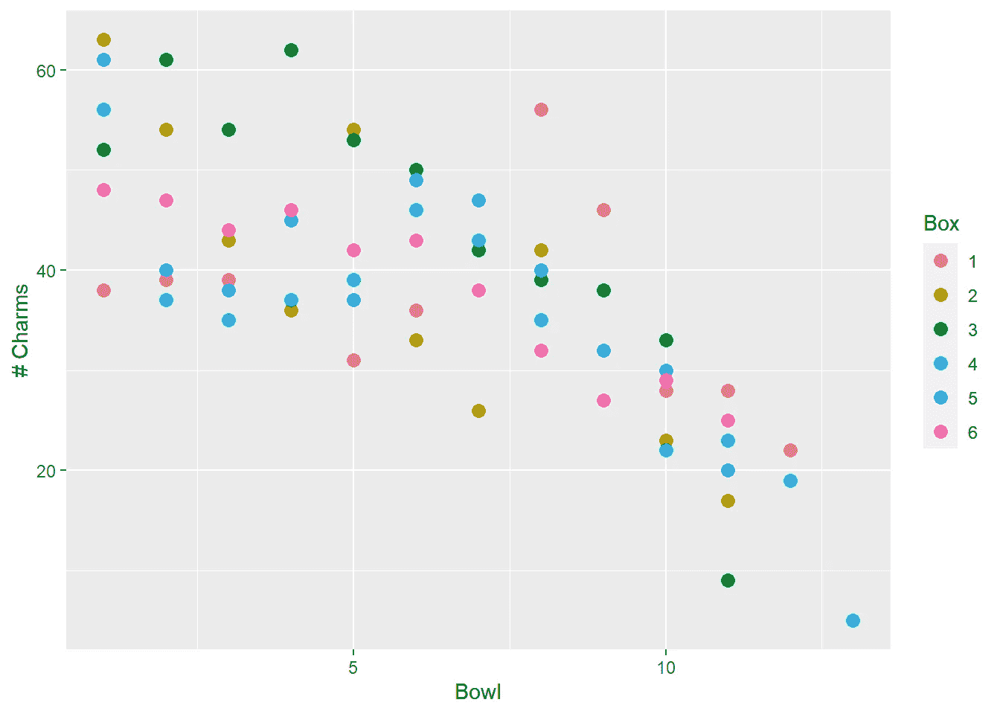

图 8。Totcharms 与碗的散点图，按盒子颜色区分

在这里，我们看到随着`Bowl`的增加，`Totcharms`呈现出明显的下降趋势，而且这种模式出奇地线性。可能存在轻微的曲率。由于颜色较难分辨，我们可以制作一张线图并突出显示几条系列：

```py
sizes <- c(2, 1, 2, 1, 1, 1)
alphas <- c(1, 0.2, 1, 0.2, 0.2, 0.2)
Lucky |> ggplot(aes(x = Bowl, y = Totcharms)) +
  geom_line(aes(colour = Box, linewidth = Box, alpha = Box)) +
  scale_discrete_manual("linewidth", values = sizes) +
  scale_alpha_manual(values = alphas, guide = "none")
```

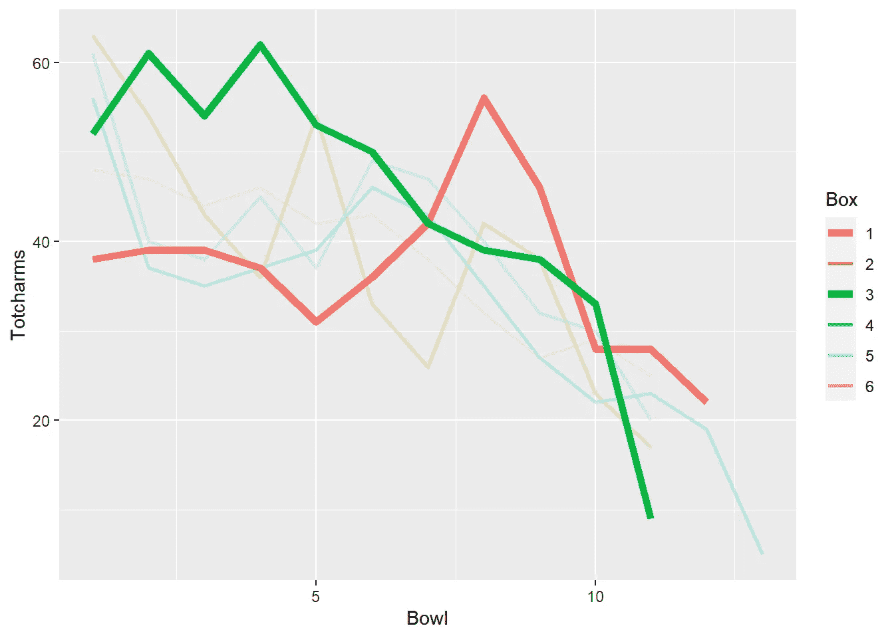

图 9．按盒子着色的选定系列幸运符号的折线图

所有系列整体呈下降趋势，但不同的盒子到达这一趋势的路径各不相同。注意第 3 盒是如何从高处开始，并在几个碗后保持高位，之后平稳下降到碗 10，随即急剧下滑。再看看第 1 盒是如何从最底部开始，在碗 5 之后逐渐增加，直到碗 8 达到顶峰，然后急剧下降到碗 12。数据表明，第 3 盒的幸运符号更集中在顶部附近，而第 1 盒的幸运符号则更集中在中间部分。某些盒子呈现出上下波动的趋势，而其他盒子则更倾向于沿着直线下降。总的来说，趋势是递减的且接近线性。请注意，每个盒子至少到达了`Bow1 = 11`，但只有两个盒子有 12 个碗，且只有一个盒子（第 4 盒）持续到了`Bow1 = 13`。

现在让我们来看一下`幸运符号总数`与`重量`的关系：

```py
Lucky |> ggplot(aes(x = Weight, y = Totcharms, color = Box)) + 
  geom_point(size = 3) +
  labs(x = 'Weight (g)', y = '# Charms') -> p2
p2
```

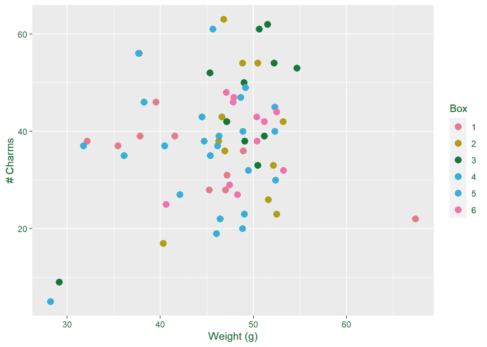

图 10．按盒子着色的幸运符号数量与谷物重量的散点图。

这个图表很杂乱，正如我们可能猜到的那样。我们有一个不错的重量范围，从不到 30 克到接近 70 克。请注意，有一个碗的重量异常沉重。这个离群值没有明显的解释，但如果我们稍微深入一点，绘制`重量`与`碗数`的关系图，可能能得到一些启示：

```py
Lucky |> ggplot(aes(x = Bowl, y = Weight, color = Box)) + 
  geom_point(size = 3) + ylim(5, 75) +
  labs(y = 'Weight (g)') -> p3
p3
```

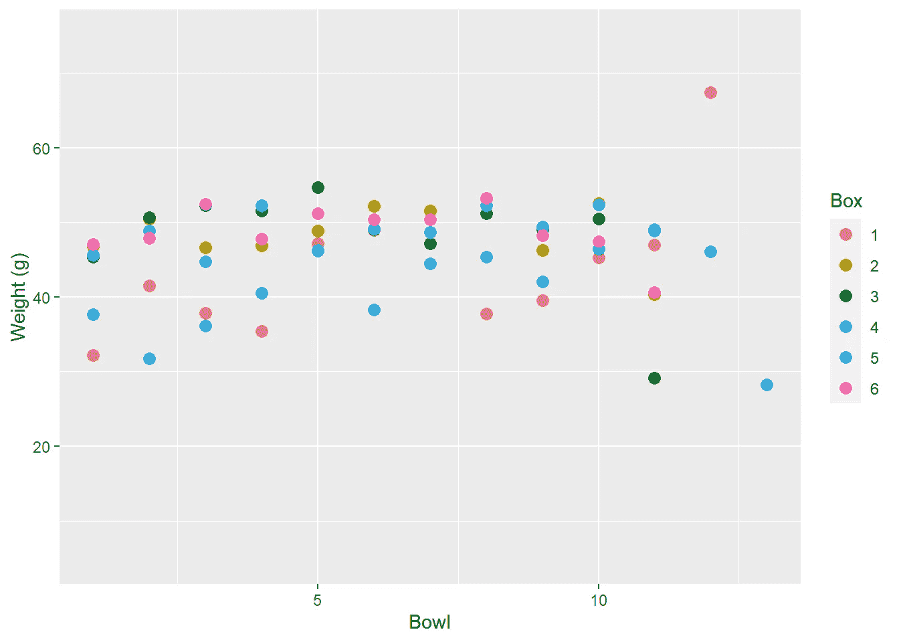

图 11．按盒子着色的重量与碗数的散点图

我们看到，这个特别沉重的碗是第 1 盒的最后一个碗`Bow = 12`。那个特定数据点的来源遗憾地已经随时间消逝，但考虑到它是团队第一次完成的盒子，接近最后时，可能很难判断剩余的谷物有多少，也许所有剩余的谷物都被倒入了最后一个碗——我在早餐时也经常做这种事，当接近一个谷物盒的尾声时。如果那第 12 碗的 70 克被分成（比如）两碗，分别为 40 克和 30 克，那么可能会有两个盒子都能坚持到 13 碗，而不仅仅是一个，或许下面的模型就能更好地拟合数据。唉！我们永远也不知道了。科学的进程就是如此。

尽管`幸运符号总数`与`重量`之间没有明显的线性关系，但`幸运符号总数`、`碗数`和`重量`之间存在一种隐藏的关系，最适合通过 3D 可视化来探讨：

```py
library(plotly)
fig <- plot_ly(Lucky, x = ~Bowl, y = ~Weight, z = ~Totcharms, color = ~Box) |>
  add_markers() |>
  layout(scene = list(xaxis = list(title = 'Bowl'),
                                   yaxis = list(title = 'Weight (g)'),
                                   zaxis = list(title = '# Charms')),
                      legend=list(title=list(text='Box')))
fig
```

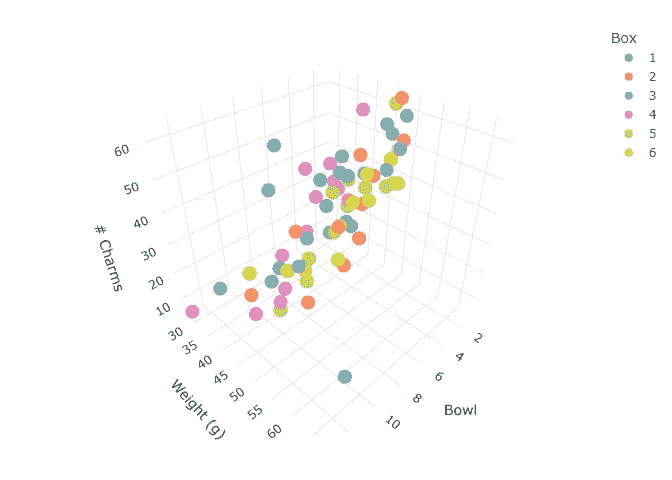

图 13．（静态）幸运符号的 3D 散点图。快去试试互动版本吧！

3D 图表非常酷，但上面的静态展示无法充分表现数据。我已在以下链接设置了[互动版本的图表](https://gkerns.people.ysu.edu/lucky3D.html)，它在大多数手机和桌面浏览器中应该都能正常工作：

[## 互动幸运 3D 散点图

### 幸运麦片数据的交互式 3D 散点图

[gkerns.people.ysu.edu](https://gkerns.people.ysu.edu/lucky3D.html?source=post_page-----9040fe2cc560--------------------------------)

请*到那里*去，旋转数据，缩放，平移——查看一下。如果你旋转得正好，你会看到点在三维空间中的平面上松散地散布开来。这正是我们在多元线性回归模型中寻找的那种关系（稍后我们会讨论这个）。

# 模型拟合

现在让我们尝试量化这些变量之间的线性关系。我们将从一个简单的线性回归模型开始，关联 `Totcharms` 和 `碗`。

# 对于碗

这是模型：

```py
mod1 <- lm(Totcharms ~ Bowl, data = Lucky)
summary(mod1)
```

```py
## 
## Call:
## lm(formula = Totcharms ~ Bowl, data = Lucky)
## 
## Residuals:
##      Min       1Q   Median       3Q      Max 
## -16.7629  -5.7629  -0.4327   6.2277  22.2277 
## 
## Coefficients:
##             Estimate Std. Error t value Pr(>|t|)    
## (Intercept)  55.1309     2.1237  25.960  < 2e-16 ***
## Bowl         -2.6698     0.2985  -8.945 4.81e-13 ***
## ---
## Signif. codes:  0 '***' 0.001 '**' 0.01 '*' 0.05 '.' 0.1 ' ' 1
## 
## Residual standard error: 8.313 on 67 degrees of freedom
## Multiple R-squared:  0.5442, Adjusted R-squared:  0.5374 
## F-statistic: 80.01 on 1 and 67 DF,  p-value: 4.807e-13
```

我们看到 `碗` 与 `Totcharms` 之间存在强烈的线性关系。`碗`的斜率约为 −2.7，也就是说，每多吃一碗幸运麦片，我们估计 `Totcharms` 平均会减少 2.7 个 charms。我们的决定系数为 *R²* = 0.5442，也就是说，约 54% 的 `Totcharms` 方差可以通过以 `碗` 为预测因子的回归模型来解释。接下来，我们本应进行适当的残差分析，但我们将跳过这一部分。可以简单地说，残差图相对良好。让我们查看一个带置信区间带的回归线拟合线图（默认）：

```py
p1 + geom_smooth(method = "lm", aes(group=1), colour="black")
```

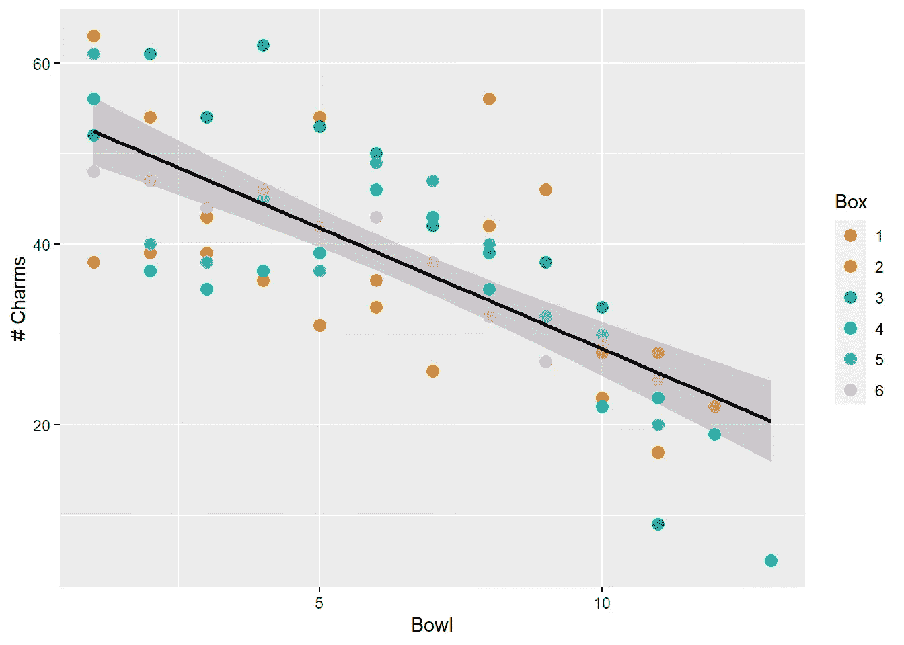

图 14\. 具有置信区间带的拟合线图，表示 Totcharms 与碗的关系

这是一个具有明显递减趋势的良好关系。

# 对于体重

我们将对 `体重` 做相同的事情，暂时忽略 `碗` 变量。开始吧：

```py
mod2 <- lm(Totcharms ~ Weight, data = Lucky)
summary(mod2)
```

```py
## 
## Call:
## lm(formula = Totcharms ~ Weight, data = Lucky)
## 
## Residuals:
##      Min       1Q   Median       3Q      Max 
## -27.0151  -8.7745   0.6901   7.8328  24.4701 
## 
## Coefficients:
##             Estimate Std. Error t value Pr(>|t|)  
## (Intercept)  22.1370    10.5650   2.095   0.0399 *
## Weight        0.3502     0.2256   1.552   0.1254  
## ---
## Signif. codes:  0 '***' 0.001 '**' 0.01 '*' 0.05 '.' 0.1 ' ' 1
## 
## Residual standard error: 12.1 on 67 degrees of freedom
## Multiple R-squared:  0.0347, Adjusted R-squared:  0.02029 
## F-statistic: 2.409 on 1 and 67 DF,  p-value: 0.1254
```

我们发现 `体重` 作为单独的预测变量并不是一个很有用的 `Totcharms` 预测因子，这与我们之前看到的散点图一致。我们注意到，`体重`的斜率估计值为 0.3502，也就是说，每增加 1 克的幸运麦片，`Totcharms` 平均增加 0.35 个 charms。这听起来合理：麦片越多，charms 越多。决定系数相当差：*R²* = 0.0347，换句话说，约 *没有*% 的 `Totcharms` 方差可以通过以 `体重` 为预测因子的回归模型来解释。没关系；`体重` 更像是一个辅助工具，用来控制麦片数量的变异性。这里的残差分析结果实际上并不像想象的那么糟糕，这让人宽慰，考虑到体重数据的高端和低端存在极端观测值，我们本来就应该预期会有一些问题。为了完整性，我们再包括一个拟合线图：

```py
p2 + geom_smooth(method = "lm", aes(group=1), colour="black")
```

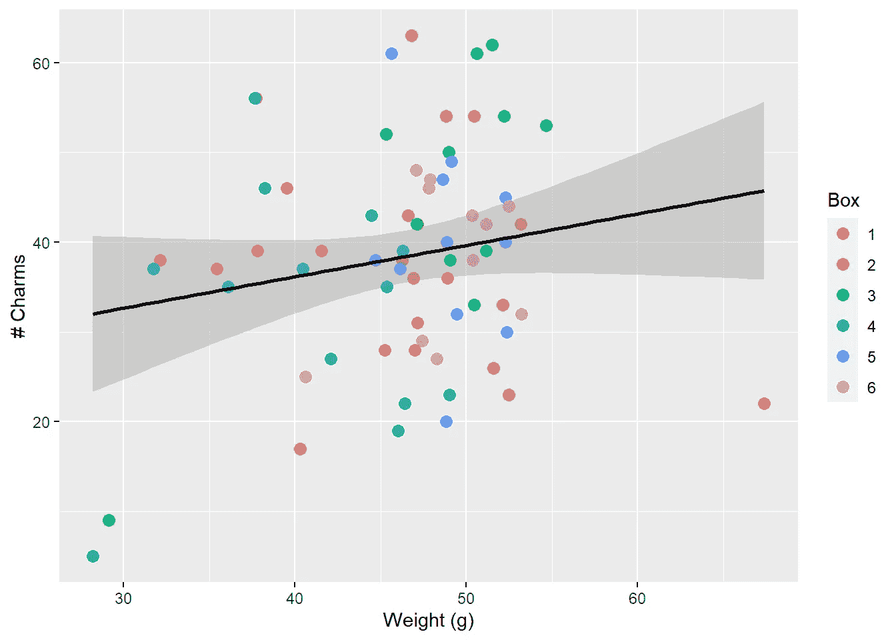

图 15\. Totcharms 与体重的拟合线图，按盒子着色

我最初打算使用`ggpubr`包将这些拟合线图组合在一起，并尽量节省讨论中的空间，但图表显得很拥挤，并且不太具有信息性。无论如何，这就是我原本打算做的：

```py
library(ggpubr)
ggarrange(p1 + geom_smooth(method = "lm", aes(group=1), colour="black"),
          p2 + geom_smooth(method = "lm", aes(group=1), colour="black"),
          align = 'h', labels=c('A', 'B'), legend = "right",
          common.legend = TRUE)
```

# 多元回归

现在进入有趣的部分：我们分别探讨了`Totcharms ~ Bowl`和`Totcharms ~ Weight`的关系，但如果将它们结合起来会怎样呢？让我们一起看看：

```py
mod3 <- lm(Totcharms ~ Bowl + Weight, data = Lucky)
summary(mod3)
```

```py
## 
## Call:
## lm(formula = Totcharms ~ Bowl + Weight, data = Lucky)
## 
## Residuals:
##      Min       1Q   Median       3Q      Max 
## -12.8825  -5.4425  -0.9975   5.2475  26.5304 
## 
## Coefficients:
##             Estimate Std. Error t value Pr(>|t|)    
## (Intercept)  33.3168     6.8655   4.853 7.78e-06 ***
## Bowl         -2.7552     0.2796  -9.855 1.35e-14 ***
## Weight        0.4819     0.1452   3.318  0.00148 ** 
## ---
## Signif. codes:  0 '***' 0.001 '**' 0.01 '*' 0.05 '.' 0.1 ' ' 1
## 
## Residual standard error: 7.754 on 66 degrees of freedom
## Multiple R-squared:  0.6094, Adjusted R-squared:  0.5976 
## F-statistic: 51.49 on 2 and 66 DF,  p-value: 3.363e-14
```

看看这个！现在`Bowl`和`Weight`**都**与`Totcharms`呈强线性关联。`Bowl`的斜率几乎与之前相同，仍为−2.7，但`Weight`的估计斜率现在已增加到每增加 1 克谷物大约 0.5 个幸运符号。我们的（调整后的）多重*R²*已跃升至接近 60%—考虑到样本量小（*n* = 6）、数据集的普遍噪声水平以及可能存在的一些可疑设计选择（每个小棉花糖算作 1，*等等*），这实在是非常了不起。回想起来，数据竟然没有变得更糟，真是挺令人惊讶的。手工收集的真实数据在野外很少这么“温顺”。

# 添加回归平面

这个可视化的代码比其他示例要复杂一些，因此为了简洁起见没有展示，但你可以在[这个 GitHub Gist](https://gist.github.com/gjkerns/8636439f9e6afdea1ba9d301b2b38947)中查看完整代码。接下来让我们继续绘图：

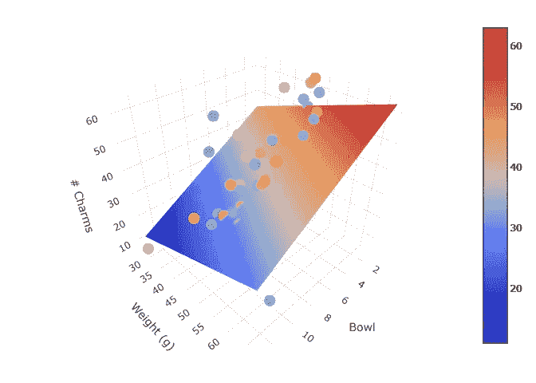

图 16\. 带有回归平面的幸运符号 3D 散点图

再次提醒：这是一个超级酷的图表，但静态版本并不能充分展示数据的价值。请查看[互动版](https://gkerns.people.ysu.edu/lucky3Dplane.html)：

[## 互动版幸运符号 3D 与回归平面

### 添加回归平面的幸运符号 3D 散点图

gkerns.people.ysu.edu](https://gkerns.people.ysu.edu/lucky3Dplane.html?source=post_page-----9040fe2cc560--------------------------------)

互动式 3D 图表非常有趣。我希望你能像我一样享受玩这个图表。最后提一句，在`tl;dr`的声明中，我们说过`Bowl`和`Weight`之间的交互作用并不显著。读者可以通过以下（输出省略）来验证这一点：

```py
summary(lm(Totcharms ~ Bowl * Weight, data = Lucky))
```

# 讨论与问题

我最初以为，整个实验要么会是我的想象产物，要么效应太小，根本无法在没有大量幸运符号的情况下检测到。我在这两方面都错了。这个效应是真的，而且足够大，即便只有几盒，也能检测到，真的就像两只手装的那么多。

# 幸运符号的下降趋势

完整的模型迅速带我们得出了一些令人吃惊的结论。例如，我们估算在一盒幸运符号的第一碗中大约有多少个幸运符号？我们之前看到，这项研究中的平均`Weight`是 46.3 克。当`Box = 1`时，模型估算平均`Totcharms`是

```py
33.3168 + (-2.7552)*1 + 0.4819*46.3
```

```py
## [1] 52.87357
```

也就是说，在第一碗谷物中大约有 53 个幸运符号—嗯，嘴巴已经开始流口水了。那最后一碗呢？好吧，并不是每个盒子都到了`Bowl 13`，但它们都达到了`Bowl = 11`。那么有多少个幸运符号？

```py
33.3168 + (-2.7552)*11 + 0.4819*46.3
```

```py
## [1] 25.32157
```

**哇。** 平均每盒有 25.3 颗幸运宝石。这意味着从第一碗到第十一碗，幸运宝石数量减少了 52%。不，这绝对不是我的想象。忘掉多元线性回归模型和花哨的 3D 图表，一个饥饿的幼儿戴着眼罩也能察觉到这种差异。

下一个问题：*为什么*会出现下降？从物理角度进行分析可能是这样的：将一盒幸运宝石看作是由涂霜的烤燕麦和棉花糖组成的简单机械混合物。在其生命周期中，许多外部力量会影响这盒子，比如运输过程中的摇晃、商店货架上的摆放以及运输到家中的过程，更不用说在橱柜内外的活动了。这不可避免地会导致内容物的变化，较轻的棉花糖会向盒子顶部迁移，而较重的烤燕麦则会沉积到底部。

这个理由至少是合乎逻辑的。但是，它留下了一些相关问题没有回答：

1.  这种模式对各类单独的幸运宝石也适用吗？（匆忙看了一眼，似乎是“不适用”）。

1.  这种关联真的是线性的，还是更复杂的模型能更好地描述这种关系？

1.  我们忽略了哪些其他重要因素？

1.  有没有什么策略可以减缓幸运宝石的下降速度？

+   我们能不能巧妙地摇动盒子（某种方式）来更好地混合棉花糖？

+   那么，存储方法如何呢？如果盒子倒置存放，是否有帮助？

+   还是平放在一旁？

+   等等。

这些未解的问题只能留待以后再讨论。

# 下一步

自 2023 年夏天的第一次实验以来，我已经和其他学生小组进行了几次实验。第一次是在 2023 年 11 月，与初中生一起在[YSU MegaMath Day](https://megamath.ysu.edu/)上进行的。我没有给 MegaMath 学生们非常具体的指示，结果不久后所有小组都把塑料袋从盒子里取出来，并在桌面上摊开袋子中间的麦片进行舀取。我不能怪他们；在袋子展开的情况下，从中间舀取麦片确实更容易。不幸的是，这种做法完全破坏了可能存在的任何自然密度排序，而这种排序正是我们怀疑起作用的关键因素，从而损害了实验的完整性。而且，我怀疑没有哪个家长会允许孩子这样吃他们的幸运宝石。

第二次是在 2024 年 2 月，与高中生一起在[YSU 数学节](https://mathfest.ysu.edu/)的两个工作坊系列中进行的。这次我为他们做好了准备。我整理并分发了一个数据收集表格（[你可以在这里找到](https://gkerns.people.ysu.edu/LuckyCharmsDataCollectionSheet.docx)），提供了更详细的指导。你可以在 GitHub 上查看额外的数据集，位于[在](https://github.com/gjkerns/luckyCharms/tree/master/extraData) `[extraData](https://github.com/gjkerns/luckyCharms/tree/master/extraData)` [目录](https://github.com/gjkerns/luckyCharms/tree/master/extraData)。

展望未来，我们需要更多的数据来更好地估计幸运符号的掉落情况，同时测试在盒子中更均匀分布幸运符号的策略也很有趣。如果成功了，盒子的第一个碗可能不那么神奇，但另一方面，也许那些最后的碗在等待打开下一个全新盒子时就不会觉得那么枯燥乏味了！

# 致谢

这个实验和这些结果如果没有 2023 年夏季 STAT 3743 课程的四位学生：Brenna Brocker、Kate Coppola、Gavin Duwe 和 Haziq Rabbani 的热情感染和对细节的不懈关注，是不可能实现的。我感谢他们与我一起走上了这条统计学道路。我还要感谢扬斯敦州立大学数学与统计学系支持这项研究以及在 YSU MegaMath Day 和 YSU MathFest 期间进行的额外数据收集。

# 免责声明

如果还没有足够明显，作者是幸运符号的粉丝，四位学生也是如此。这里报告的结果并不，也不是为了批评通用磨坊公司及其子公司、它们的工厂生产标准，或那些在那里勤奋工作的好人和机器人。我们都受同样的物理法则制约，这包括早餐麦片的盒子。

完整披露：我已经查看了在实验重新进行时收集的额外数据。从我所知，效果仍然存在，但不如之前那么戏剧化。我不知道这是否意味着效果比我们最初估计的要小，还是与中学/高中环境中的数据收集协议有关。只有时间——和更多的数据——才能揭晓答案。

# 参考文献和代码示例

在撰写这篇文章时，我尽量记录了我访问过的地方，以便找到构建我想要的图表的代码，以下是一个几乎完整的列表，但也许我漏掉了一些链接。如果你发现我遗漏了什么，请在评论中提醒我，我会修正。

+   [`stackoverflow.com/questions/74750478/correct-syntax-for-manually-scaling-the-width-of-lines-in-ggplot`](https://stackoverflow.com/questions/74750478/correct-syntax-for-manually-scaling-the-width-of-lines-in-ggplot)

+   [`www.statology.org/ggplot-default-colors/`](https://www.statology.org/ggplot-default-colors/)

+   [`stackoverflow.com/questions/37348719/ggplot2-single-regression-line-when-colour-is-coded-for-by-a-variable`](https://stackoverflow.com/questions/37348719/ggplot2-single-regression-line-when-colour-is-coded-for-by-a-variable)

+   [`blog.recursiveprocess.com/2013/03/03/oreo-original-vs-double-vs-mega/`](http://blog.recursiveprocess.com/2013/03/03/oreo-original-vs-double-vs-mega/)

+   [`stackoverflow.com/questions/38331198/add-regression-plane-to-3d-scatter-plot-in-plotly`](https://stackoverflow.com/questions/38331198/add-regression-plane-to-3d-scatter-plot-in-plotly)

+   [`stackoverflow.com/questions/38593153/plotly-regression-line-r`](https://stackoverflow.com/questions/38593153/plotly-regression-line-r)

+   [`stackoverflow.com/questions/15633714/adding-a-regression-line-on-a-ggplot`](https://stackoverflow.com/questions/15633714/adding-a-regression-line-on-a-ggplot)
