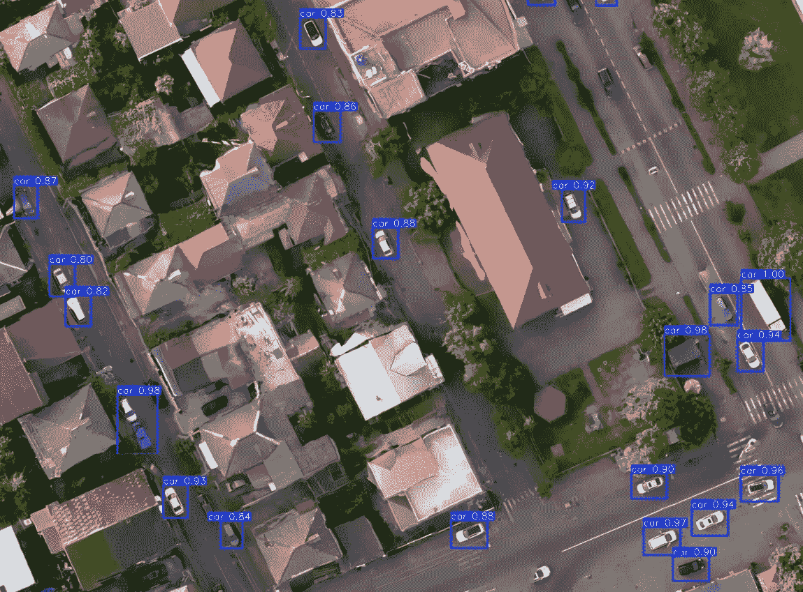

# 这张航拍图像中有多少辆车？让我们从头开始用 YOLOv8 来统计它们！

> 原文：[`towardsdatascience.com/how-many-cars-are-in-this-aerial-imagery-lets-count-them-with-yolov8-from-scratch-7c24a3919d21?source=collection_archive---------4-----------------------#2024-07-08`](https://towardsdatascience.com/how-many-cars-are-in-this-aerial-imagery-lets-count-them-with-yolov8-from-scratch-7c24a3919d21?source=collection_archive---------4-----------------------#2024-07-08)

## 从头到尾的步骤指南，教你如何在自定义数据库上部署 YOLOv8 进行物体检测和计数。

 [Mahyar Aboutalebi, Ph.D. 🎓](https://medium.com/@mahyar.aboutalebi?source=post_page---byline--7c24a3919d21--------------------------------)

·发布在 [Towards Data Science](https://towardsdatascience.com/?source=post_page---byline--7c24a3919d21--------------------------------) ·阅读时长 12 分钟·2024 年 7 月 8 日

--

通过 YOLO 检测到的航拍图像中的车辆，图像由作者提供

# 目录

1.  **🌟 介绍**

1.  🚀 **设置 Google Colab**

1.  🛰️ **在哪里可以找到免费的航拍图像**

1.  🔄 **将 GeoTIFF 转换为 JPG**

1.  📐 **将图像拆分为子图像**

1.  🏷️ **标注子图像中的车辆**

1.  **🛠️ 准备训练和测试数据库**

1.  **🧠 训练 YOLOv8**

1.  **🖼️ 在整个图像上部署 YOLOv8**

1.  **📄 结论**

1.  **📚 参考文献**

## **🌟 介绍**

几乎一个月前，我在一篇著名报纸上读到一篇文章，分析了使用超高分辨率图像（分辨率低于 20 厘米）统计每个库存中特斯拉汽车的数量。文章旨在估算特斯拉在 2024 年第二季度交付的汽车数量。读完之后，我认为这可以成为一个很好的物体检测算法应用，用来检测和统计航拍图像中的车辆，评估汽车库存状态……
