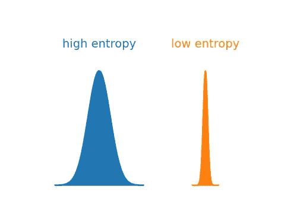
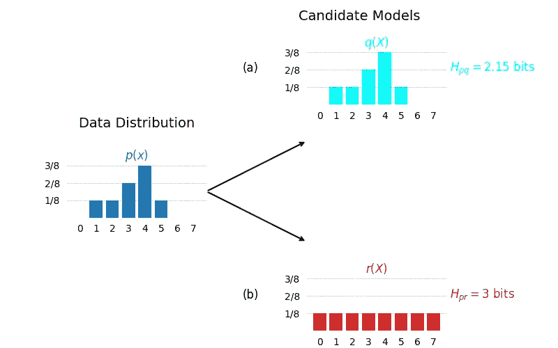
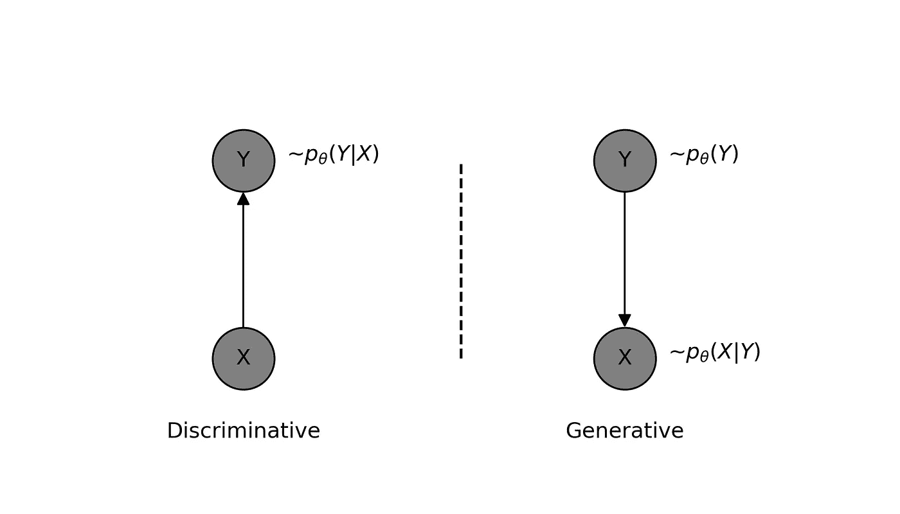

# 神经网络如何学习：一种概率视角

> 原文：[`towardsdatascience.com/how-neural-networks-learn-a-probabilistic-viewpoint-0f6a78dc58e2?source=collection_archive---------1-----------------------#2024-12-26`](https://towardsdatascience.com/how-neural-networks-learn-a-probabilistic-viewpoint-0f6a78dc58e2?source=collection_archive---------1-----------------------#2024-12-26)

## 理解训练神经网络的损失函数

 [Bilal Ahmed](https://medium.com/@bilalhsp?source=post_page---byline--0f6a78dc58e2--------------------------------)

·发表于 [Towards Data Science](https://towardsdatascience.com/?source=post_page---byline--0f6a78dc58e2--------------------------------) ·阅读时间 8 分钟·2024 年 12 月 26 日

--

机器学习是非常实践性的，每个人都在探索自己的路径。它不像传统课程那样有一套标准的学习路径，也没有所谓的“机器学习 101”课程。然而，这也常常会导致理解上的空白。如果你像我一样，这些空白会让人感觉不舒服。例如，我曾经对我们随便做的一些事情感到困惑，比如选择损失函数。我承认，有些做法是通过启发式和经验学到的，但大多数概念都有坚实的数学基础。当然，并不是每个人都有时间或动机深入研究这些基础知识——除非你是一个研究人员。

我试图呈现一些关于如何解决机器学习问题的基本思路。理解这些背景知识将帮助实践者在设计选择上更加自信。我所覆盖的概念包括：

+   使用交叉熵量化概率分布之间的差异。

+   神经网络模型的概率视角。

+   推导并理解不同应用的损失函数。

# 熵

在信息理论中，熵是衡量随机变量取值的不确定性。换句话说，它用于量化分布的扩散程度。分布越狭窄，熵越低，反之亦然。从数学角度来看，分布 ***p(x)*** 的熵定义为：

通常使用以 2 为底的对数，在这种情况下，熵以比特为单位进行度量。下图比较了两种分布：蓝色的分布具有较高的熵，而橙色的分布具有较低的熵。

分布具有高熵和低熵的可视化示例 — 该图由作者使用 Python 创建。

我们还可以测量两个分布之间的熵。例如，假设我们观察到某些数据具有分布***p(x)***，并且有一个分布***q(x)***，它可能作为观察数据的模型。在这种情况下，我们可以计算数据分布***p(x)***与模型分布***q(x)***之间的交叉熵***Hpq​(X)***。从数学上讲，交叉熵可以表示为：

通过使用交叉熵，我们可以比较不同的模型，交叉熵最小的模型更适合数据。以下图所示，我们有两个候选模型，想要决定哪个模型更适合观察到的数据。正如我们所看到的，与数据分布完全匹配的模型的交叉熵低于略有偏差的模型。

比较数据分布 p(x)与两个候选模型的交叉熵。（a）候选模型完全匹配数据分布，交叉熵较低。（b）候选模型与数据分布不匹配，因此交叉熵较高 — 该图由作者使用 Python 创建。

另一种表述相同内容的方式是：当模型分布偏离数据分布时，交叉熵增加。在尝试将模型拟合到数据时，即训练一个机器学习模型时，我们的目标是最小化这种偏差。由于偏离数据分布而导致的交叉熵增加被定义为相对熵，通常被称为**KL 散度**，或简称为**KL-Divergence**。

因此，我们可以使用交叉熵或 KL 散度来量化两个概率分布之间的差异。为了训练一个模型，我们可以调整模型的参数，使其最小化交叉熵或 KL 散度。请注意，最小化交叉熵或 KL 散度会得到相同的解决方案。KL 散度有一个更好的解释，因为其最小值为零，这种情况发生在模型与数据完全匹配时。

另一个重要的考虑因素是我们如何选择模型分布？这一点由两个因素决定：我们要解决的问题和我们偏好的解决问题的方式。假设我们有一个分类问题，其中有***(X, Y)***数据对，***X***表示输入特征，***Y***表示真实的类别标签。我们的目标是训练一个模型来正确分类输入数据。我们可以通过两种方式来解决这个问题。

# 判别模型与生成模型

生成方法是指建模联合分布***p(X,Y)***，使其学习数据生成过程，因此得名“生成式”。在当前讨论的示例中，模型学习类别标签的先验分布***p(Y)***，并且在给定类别标签***Y***的情况下，学习使用***p(X|Y)***生成特征***X***。

应该清楚的是，学习到的模型能够生成新的数据***(X,Y)***。然而，可能不太明显的是，它也可以使用贝叶斯定理对给定的特征***X***进行分类，尽管根据模型的复杂性，这可能并不总是可行。可以说，使用这种方法进行分类任务可能不是一个好主意，因此我们应该采取直接的方法。

判别式与生成式建模方法 — 作者使用 Python 创建。

判别方法是指直接建模输入特征***X***和输出标签***Y***之间的关系，即建模条件分布***p(Y|X)***。因此，学习到的模型不必捕捉特征***X***的所有细节，而只需关注其类别区分特征。正如我们之前所看到的，可以通过最小化观测数据和模型分布之间的交叉熵来学习模型的参数。判别模型的交叉熵可以写成如下形式：

其中最右侧的求和是样本平均值，它近似于数据分布的期望。由于我们的学习规则是最小化交叉熵，我们可以将其称为我们的通用损失函数。

学习的目标（训练模型）是最小化这个损失函数。从数学上讲，我们可以将同样的陈述写成如下形式：

现在让我们考虑一些具体的判别模型示例，并将通用损失函数应用到每个示例中。

# 二分类

正如名称所示，这种问题的类别标签***Y***要么是***0***，要么是***1***。这可能适用于人脸检测器、猫狗分类器或预测疾病是否存在的模型。我们如何建模二元随机变量？没错——它是一个伯努利随机变量。伯努利变量的概率分布可以写成如下形式：

其中***π***是获取***1***的概率，即***p(Y=1) = π***。

由于我们想要建模***p(Y|X)***，让我们将***π***表示为***X***的函数，即模型的输出***π(X)***依赖于输入特征***X***。换句话说，我们的模型接受特征***X***并预测***Y***=1 的概率。请注意，为了在模型输出端获得有效的概率，它必须被限制在***0***和***1***之间。这是通过在输出端应用 sigmoid 非线性函数来实现的。

为了简化，我们将其明确重写为真实标签和预测标签的形式，如下所示：

我们可以将此特定条件分布的一般损失函数写成如下形式：

这通常被称为二元交叉熵（BCE）损失。

# 多类分类

对于一个多类问题，目标是为每个输入特征***X***从***C***个类别中预测一个类别。在这种情况下，我们可以将输出***Y***建模为一个类别随机变量，一个从所有可能的***C***个状态中选择一个状态的随机变量。作为类别随机变量的例子，可以想象一个六面骰子，它可以在每次掷骰时取六个可能状态之一。

我们可以将上述表达式看作是将二元随机变量的情况扩展到具有多个类别的随机变量。我们可以通过将***λ***表示为输入特征***X***的函数来建模条件分布***p(Y|X)***。基于此，让我们将条件类别分布***Y***用预测概率的形式表示如下：

使用这个条件模型分布，我们可以利用之前推导出的交叉熵的通用损失函数写出损失函数，如下所示：

这在 PyTorch 中被称为交叉熵损失。需要注意的是，我是根据每个类别的预测概率来写这个公式的。为了在所有***C***个类别中得到一个有效的概率分布，我们在模型的输出端应用了 softmax 非线性函数。softmax 函数写作如下：

# 回归

考虑数据***(X, Y)***的情况，其中***X***表示输入特征，***Y***表示可以取任意实数值的输出。由于***Y***是实值的，我们可以使用高斯分布来建模其分布。

再次强调，由于我们对建模条件分布***p(Y|X)***感兴趣。我们可以通过将***Y***的条件均值表示为***X***的函数来捕捉对***X***的依赖关系。为了简化，我们将方差设为 1。条件分布可以写成如下形式：

我们现在可以将这个条件模型分布的通用损失函数写成如下形式：

这是用于训练回归模型的著名 MSE 损失。请注意，这里的常数因子是无关紧要的，因为我们只关注最小值的位置，可以忽略不计。

# 总结

在这篇简短的文章中，我介绍了熵、交叉熵和 KL 散度的概念。这些概念对于计算分布之间的相似性（或散度）至关重要。通过使用这些思想，以及模型的概率解释，我们可以定义通用损失函数，也称为目标函数。训练模型或“学习”则归结为最小化与模型参数相关的损失。这个优化过程通常通过梯度下降来完成，大多数深度学习框架如 PyTorch 会处理这个过程。希望这对你有帮助——祝你学习愉快！
