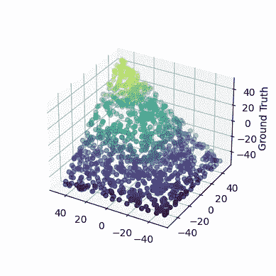

# 小型神经网络如何表示基本函数

> 原文：[`towardsdatascience.com/how-tiny-neural-networks-represent-basic-functions-8a24fce0e2d5?source=collection_archive---------4-----------------------#2024-09-10`](https://towardsdatascience.com/how-tiny-neural-networks-represent-basic-functions-8a24fce0e2d5?source=collection_archive---------4-----------------------#2024-09-10)

## 通过简单的算法示例，温和地介绍机械解释性

[](https://medium.com/@taubenfeld9?source=post_page---byline--8a24fce0e2d5--------------------------------)[](https://towardsdatascience.com/?source=post_page---byline--8a24fce0e2d5--------------------------------) [Amir Taubenfeld](https://medium.com/@taubenfeld9?source=post_page---byline--8a24fce0e2d5--------------------------------)

·发布于 [Towards Data Science](https://towardsdatascience.com/?source=post_page---byline--8a24fce0e2d5--------------------------------) ·阅读时长 9 分钟 ·2024 年 9 月 10 日

--


# 介绍

本文展示了小型人工神经网络（NN）如何表示基本函数。目标是提供关于神经网络如何工作的基本直觉，并作为[机械解释性](https://transformer-circuits.pub/2022/mech-interp-essay/index.html)的温和介绍——这是一个旨在逆向工程神经网络的领域。

我展示了三个基本函数示例，使用简单算法描述每个示例，并展示这些算法如何“编码”到神经网络的权重中。然后，我探讨了网络是否能通过反向传播学习这些算法。我鼓励读者将每个示例视为一个谜题，在阅读解答之前稍作思考。

# 机器学习拓扑

本文试图将神经网络（NN）分解为离散操作，并将其描述为算法。另一种可能更常见且自然的方法是，观察不同层中线性变换的连续拓扑解释。

以下是一些有助于增强拓扑直觉的优秀资源：

+   [Tensorflow Playground](https://playground.tensorflow.org/#activation=tanh&batchSize=10&dataset=circle&regDataset=reg-plane&learningRate=0.03&regularizationRate=0&noise=0&networkShape=4,2&seed=0.91521&showTestData=false&discretize=false&percTrainData=50&x=true&y=true&xTimesY=false&xSquared=false&ySquared=false&cosX=false&sinX=false&cosY=false&sinY=false&collectStats=false&problem=classification&initZero=false&hideText=false) — 一个用于建立分类任务基本直觉的简单工具。

+   [ConvnetJS 演示](https://cs.stanford.edu/people/karpathy/convnetjs//demo/classify2d.html) — 一个更复杂的工具，用于可视化神经网络在分类任务中的表现。

+   [神经网络、流形与拓扑](http://colah.github.io/posts/2014-03-NN-Manifolds-Topology/) — 一篇很好的文章，帮助建立神经网络如何工作的拓扑直觉。

# 三个基本函数

在以下所有示例中，我将“神经元”一词用于神经网络计算图中的单个节点。每个神经元只能使用一次（没有循环；例如，不能是 RNN），它执行以下三个操作，顺序如下：

1.  与输入向量的内积。

1.  添加偏置项。

1.  运行一个（非线性）激活函数。


我仅提供最简洁的代码片段，以便阅读更加流畅。这个 [Colab 笔记本](https://colab.research.google.com/drive/1zt9lVUH9jH2zx5nsFA_4Taq6Ic-ve09C?usp=sharing) 包含了完整的代码。

# < 操作符

需要多少个神经元来学习“x < 10”的函数？编写一个神经网络，当输入小于 10 时返回 1，否则返回 0。

## 解决方案

让我们从创建一个符合我们想要学习的模式的示例数据集开始

```py
X = [[i] for i in range(-20, 40)]
Y = [1 if z[0] < 10 else 0 for z in X]
```


创建并可视化“< 操作符”的训练数据

这个分类任务可以使用 [逻辑回归](https://en.wikipedia.org/wiki/Logistic_regression) 和 [Sigmoid](https://en.wikipedia.org/wiki/Sigmoid_function) 作为输出激活函数来解决。使用一个神经元，我们可以将函数写成 *Sigmoid(ax+b)*。*b*，偏置项，可以被认为是神经元的阈值。直观地，我们可以设定 *b = 10* 和 *a = -1*，得到 F=Sigmoid(10-x)

让我们使用 PyTorch 实现并运行 F

```py
model = nn.Sequential(nn.Linear(1,1), nn.Sigmoid())
d = model.state_dict()
d["0.weight"] = torch.tensor([[-1]]).float()
d['0.bias'] = torch.tensor([10]).float()
model.load_state_dict(d)
y_pred = model(x).detach().reshape(-1)
```


Sigmoid(10-x)

看起来是正确的模式，但我们能做出更精确的近似吗？例如，F(9.5) = 0.62，我们希望它接近 1。

对于 Sigmoid 函数，当输入接近 -∞ / ∞ 时，输出分别接近 0 / 1。因此，我们需要让我们的 10 - x 函数返回较大的数值，这可以通过将其乘以一个更大的数，比如 100，来实现，得到 F=Sigmoid(100(10-x))，现在我们会得到 F(9.5) =~1。


Sigmoid(100(10-x))

的确，当使用一个神经元训练网络时，它会收敛到 F=Sigmoid(M(10-x))，其中 M 是一个标量，在训练过程中不断增大，使得近似更加精确。


Tensorboard 图 — X 轴表示训练轮次，Y 轴表示网络的偏置和权重值。偏置和权重成反比例增加/减少。也就是说，网络可以写成 M(10-x)，其中 M 是一个在训练过程中不断增长的参数。

为了澄清，我们的单神经元模型仅仅是“<10”函数的一个近似。我们永远无法达到零损失，因为神经元是一个连续函数，而“<10”不是一个连续函数。

# Min(a, b)

编写一个神经网络，输入两个数字，返回它们之间的最小值。

## 解决方案

如前所述，让我们先创建一个测试数据集并进行可视化

```py
X_2D = [
[random.randrange(-50, 50),
 random.randrange(-50, 50)]
 for i in range(1000)
]
Y = [min(a, b) for a, b in X_2D]
```



可视化 Min(a, b) 的训练数据。两个横轴表示输入的坐标。垂直轴标记为“Ground Truth”，即预期输出——即两个输入坐标的最小值

在这种情况下，ReLU 激活是一个不错的选择，因为它本质上是一个最大值函数（ReLU(x) = max(0, x)）。事实上，使用 ReLU 可以将最小值函数写成如下形式

```py
min(a, b) = 0.5 (a + b -|a - b|) = 0.5 (a + b - ReLU(b - a) - ReLU(a - b))
```

***[方程 1]***

现在，让我们构建一个小型网络，能够学习*方程 1*，并尝试使用梯度下降训练它

```py
class MinModel(nn.Module):
  def __init__(self):
      super(MinModel, self).__init__()

      # For ReLU(a-b)
      self.fc1 = nn.Linear(2, 1)
      self.relu1 = nn.ReLU()
      # For ReLU(b-a)
      self.fc2 = nn.Linear(2, 1)
      self.relu2 = nn.ReLU()
      # Takes 4 inputs
      # [a, b, ReLU(a-b), ReLU(b-a)]
      self.output_layer = nn.Linear(4, 1)

  def forward(self, x):
      relu_output1 = self.relu1(self.fc1(x))
      relu_output2 = self.relu2(self.fc2(x))
      return self.output_layer(
          torch.cat(
             (x, Relu_output1, relu_output2),
             dim=-1
          )
      )
```


MinModel 计算图的可视化。绘图使用了 [Torchview](https://github.com/mert-kurttutan/torchview) 库

训练 300 个周期足以收敛。让我们看看模型的参数

```py
>> for k, v in model.state_dict().items():
>>   print(k, ": ", torch.round(v, decimals=2).numpy())

fc1.weight :  [[-0\. -0.]]
fc1.bias :  [0.]
fc2.weight :  [[ 0.71 -0.71]]
fc2.bias :  [-0.]
output_layer.weight :  [[ 1\.    0\.    0\.   -1.41]]
output_layer.bias :  [0.]
```

许多权重被归零，我们剩下的结果看起来相当不错

```py
model([a,b]) = a - 1.41 * 0.71 ReLU(a-b) ≈ a - ReLU(a-b)
```

这不是我们预期的解决方案，但它是一个有效的解决方案，甚至比*方程 1*更**简洁**！通过观察这个网络，我们学到了一个新的、看起来不错的公式！证明：

证明：

+   如果 *a <= b: model([a,b]) = a — ReLU(a-b) = a — 0 = a*

+   如果 *a > b: a — ReLU(a-b) = a — (a-b) = b*

# 是否为偶数？

创建一个神经网络，输入一个整数 x，返回 x mod 2。也就是说，如果 x 是偶数，输出 0；如果 x 是奇数，输出 1。

这个看起来相当简单，但出人意料的是，使用标准的非周期性激活函数（如 ReLU），无法创建一个有限大小的网络，正确分类 (-∞, ∞) 范围内的每个整数。

## ***定理：is_even 需要至少 log 个神经元***

*一个带有 ReLU 激活函数的网络至少需要 n 个神经元，才能正确地将每个 2^n 连续自然数分类为偶数或奇数（即解决 is_even 问题）。*

## ***证明：使用归纳法***

**基础：n == 2：** 直观地说，单个神经元（形如 *ReLU(ax + b)*）无法解决 *S = [i + 1, i + 2, i + 3, i + 4]*，因为它不是线性可分的。例如，假设 *a > 0* 且 *i + 2* 是偶数。如果 *ReLU(a(i + 2) + b) = 0,* 那么 *ReLU(a(i + 1) + b) = 0*（单调函数），但 *i + 1* 是奇数。

更多的[细节](https://en.wikipedia.org/wiki/Perceptrons_(book)#The_XOR_affair)可以在经典的《感知机》书中找到。

**假设对于 n，观察 n+1：** *设 S = [i + 1, …, i + 2^(n + 1)]*，并假设为了矛盾，*S* 可以用大小为 *n* 的网络解决。从第一层的输入神经元 *f(x) = ReLU(ax + b)* 开始，其中 *x* 是网络的输入。*WLOG a > 0*。根据 ReLU 的定义，存在一个 *j*，使得：

*S’ = [i + 1, …, i + j], S’’ = [i + j + 1, …, i + 2^(n + 1)]*

f(x ≤ i) = 0

f(x ≥ i) = ax + b*

需要考虑两种情况：

+   情况 *|S’| ≥ 2^n*：删除 *f* 及其所有边缘不会改变网络在 S’ 上的分类结果。因此，存在一个大小为 *n-1* 的网络解决了 S’。矛盾。

+   情况 *|S’’|≥ 2^n*：对于每个神经元 *g*，它将 *f* 作为输入 *g(x) =* *ReLU(cf(x) + d + …) = ReLU(c ReLU(ax + b) + d + …)*，删除神经元 *f* 并直接将 *x* 连接到 *g*，得到 *ReLU(cax + cb + d + …)*。一个大小为 *n — 1* 的网络解决了 *S’’*。矛盾。

## 对数算法

*需要多少个神经元才能分类 [1, 2^n]？我已经证明了 n 个神经元是必要的。接下来，我将证明 n 个神经元也是足够的。*

一个简单的实现是一个不断加减 2 的网络，并检查是否在某一时刻达到 0。这将需要 O(*2^n*) 个神经元。一个更高效的算法是加减 2 的幂，这将只需要 O(n) 个神经元。更正式地：

*f_i(x) := |x — i|*

f(x) := f_1∘ f_1∘ f_2 ∘ f_4∘ … ∘ f_(2^(n-1)) (|x|)*

证明：

+   根据定义：*∀ x ϵ[0, 2^i]: f_(2^(i-1)) (x) ≤ 2^(i-1)。

    即，将区间一分为二。*

+   递归地 *f_1∘ f_1∘ f_2 ∘ … ∘ f_(2^(n-1)) (|x|)* ≤ 1

+   对于每个偶数 *i: is_even(f_i(x)) = is_even(x)*

+   同样，*is_even(f_1( f_1(x))) = is_even(x)*

+   我们得到了 *f(x) ϵ {0,1}* 且 *is_even(x) =is_even(f(x))*。证毕。

## 实现

让我们尝试使用神经网络在一个小的范围内实现这个算法。我们再次从定义数据开始。

```py
X = [[i] for i in range(0, 16)]
Y = [z[0] % 2 for z in X]
```


在小范围 [0, 15] 上的 is_even 数据和标签

因为该范围包含 2⁴ 个整数，所以我们需要使用 6 个神经元。5 个用于 *f_1∘ f_1∘ f_2 ∘ f_4∘ f_8,* + 1 个输出神经元。让我们构建网络并硬编码权重。

```py
def create_sequential_model(layers_list = [1,2,2,2,2,2,1]):
  layers = []
  for i in range(1, len(layers_list)):
      layers.append(nn.Linear(layers_list[i-1], layers_list[i]))
      layers.append(nn.ReLU())
  return nn.Sequential(*layers)

# This weight matrix implements |ABS| using ReLU neurons.
# |x-b| = Relu(-(x-b)) + Relu(x-b)
abs_weight_matrix = torch_tensor([[-1, -1],
                                  [1, 1]])
# Returns the pair of biases used for each of the ReLUs.
get_relu_bias = lambda b: torch_tensor([b, -b])

d = model.state_dict()
d['0.weight'], d['0.bias'] = torch_tensor([[-1],[1]]), get_relu_bias(8)
d['2.weight'], d['2.bias'] = abs_weight_matrix, get_relu_bias(4)
d['4.weight'], d['4.bias'] = abs_weight_matrix, get_relu_bias(2)
d['6.weight'], d['6.bias'] = abs_weight_matrix, get_relu_bias(1)
d['8.weight'], d['8.bias'] = abs_weight_matrix, get_relu_bias(1)
d['10.weight'], d['10.bias'] = torch_tensor([[1, 1]]), torch_tensor([0])
model.load_state_dict(d)
model.state_dict()
```

如预期的那样，我们可以看到该模型在 [0,15] 范围内做出了完美的预测。


正如预期的那样，它无法推广到新的数据点。


我们看到我们可以硬编码该模型，但使用梯度下降法时，模型是否会收敛到相同的解呢？


答案是——并非如此简单！相反，它卡在了一个局部最小值——预测均值。

这是一个已知现象，其中梯度下降可能会卡在局部最小值。它在非光滑的错误面上，特别是对于高度非线性的函数（如 is_even）更为常见。

更多细节超出了本文的范围，但为了获得更多直观理解，可以参考许多研究经典 XOR 问题的工作。即使是这样一个简单的问题，我们也可以看到梯度下降法在找到解决方案时可能会遇到困难。特别是，我推荐理查德·布兰德的短篇[书籍](https://www.cs.stir.ac.uk/~kjt/techreps/pdf/TR148.pdf)《学习 XOR：探索经典问题的空间》——这是对 XOR 问题误差表面的严谨分析。

## 结语

希望这篇文章帮助你理解了小型神经网络的基本结构。分析大型语言模型要复杂得多，但这是一个快速发展的研究领域，充满了引人入胜的挑战。

在使用大型语言模型时，很容易专注于提供数据和计算能力，以实现令人印象深刻的结果，而不理解它们的运作方式。然而，解释性提供了关键的洞察力，能够帮助解决公平性、包容性和准确性等问题，这些问题在我们越来越依赖 LLM 做决策时变得愈加重要。

为了进一步探索，我推荐关注[AI 对齐论坛](https://www.alignmentforum.org/)。

*所有图片均由作者创作。介绍图是使用 ChatGPT 创作的，其余图像是使用 Python 库创建的。
