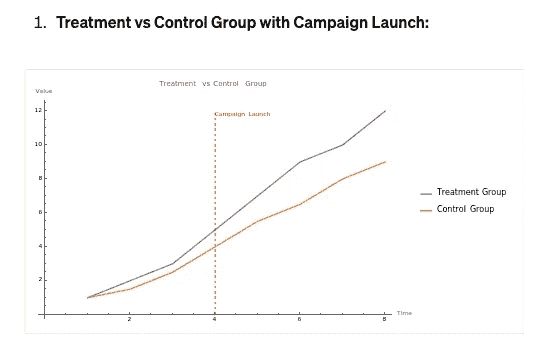
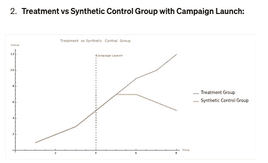
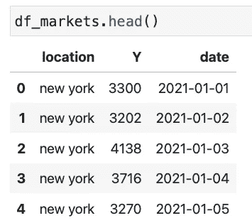
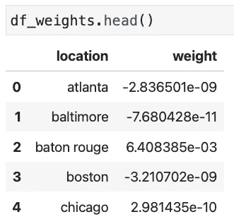
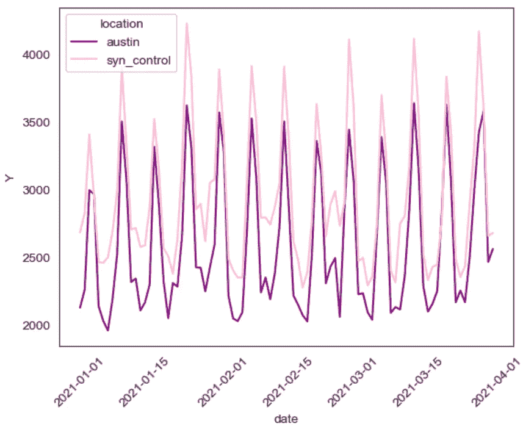
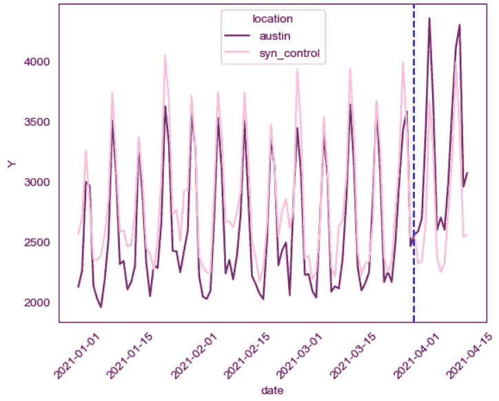

# 市场营销科学 101：如何使用合成控制分析基于地理的活动

> 原文：[`towardsdatascience.com/how-to-analyze-geo-based-campaigns-with-synthetic-control-a90b839479a8?source=collection_archive---------8-----------------------#2024-05-22`](https://towardsdatascience.com/how-to-analyze-geo-based-campaigns-with-synthetic-control-a90b839479a8?source=collection_archive---------8-----------------------#2024-05-22)

## 使用 Meta 的 GeoLift 库

[](https://medium.com/@mandymliu?source=post_page---byline--a90b839479a8--------------------------------)[](https://towardsdatascience.com/?source=post_page---byline--a90b839479a8--------------------------------) [Mandy Liu](https://medium.com/@mandymliu?source=post_page---byline--a90b839479a8--------------------------------)

·发表于 [Towards Data Science](https://towardsdatascience.com/?source=post_page---byline--a90b839479a8--------------------------------) ·6 分钟阅读·2024 年 5 月 22 日

--


图片来自 [Z](https://unsplash.com/@dead____artist?utm_source=medium&utm_medium=referral) 在 [Unsplash](https://unsplash.com/?utm_source=medium&utm_medium=referral)

*(如果你不是 Medium 会员，可以在* [*这里*](https://medium.com/towards-data-science/how-to-analyze-geo-based-campaigns-with-synthetic-control-a90b839479a8?sk=41d22feddba967359a2c1471215a6212)*) 阅读完整文章*

导航基于位置的测试的复杂性可能是一个挑战。

幸运的是，[GeoLift](https://facebookincubator.github.io/GeoLift/docs/intro) 在这里可以优化这个过程。

由 Meta 的市场营销科学团队开发，这个开源库旨在进行基于地理位置的实验。它使我们能够：

1.  轻松选择测试市场，且

1.  生成一个合成控制市场，用来与选定的测试地点进行基准对比

虽然 GeoLift 文档提供了关于选择测试市场的全面指南，但本文将重点介绍**如何创建和使用合成控制市场**。

让我们深入了解。

# 合成控制方法（SCM）

这些图表展示了“差异中的差异”方法与合成控制方法（SCM）之间的比较。



由作者使用 ChatGPT x Wolfram 生成

根据维基百科，SCM

> 该方法旨在估算在没有实施干预的情况下，处理组可能的结果。与差异中的差异方法不同，SCM 通过加权控制组，使其在干预前尽可能接近处理组，从而调整时间变化的混杂因素。

简单来说，SCM 构建了一个“平行宇宙”，使您能够**观察如果没有启动活动，潜在的结果会是什么**，从而清晰地比较和衡量活动的真实增量效果。

# 精简版合成对照创建指南

**1\. 处理数据**

**2\. 生成权重**

**3\. 可视化合成对照**

**4\. 测量增量效果**

前两步在 GeoLift 文档中有详细说明。为了保持一致性，我会在这里包括代码和输出。

我们将在 R 中执行初步步骤，并在 Python 中执行最后两步。

如果您主要使用 Python，请不要担心——R 代码简单易懂，我保证这将非常容易跟随！

# 1\. 处理数据

**您的数据应该是什么样子的：**

+   日常或每周粒度

+   至少是测试持续时间的 4-5 倍的前期活动历史数据

+   至少 20 个或更多的地理单元

+   更多[最佳实践](https://facebookincubator.github.io/GeoLift/docs/Best%20Practices/BestPractices)

**安装包：**

+   安装 R 和 RStudio [这里](https://posit.co/download/rstudio-desktop/)

+   安装 GeoLift 包 [这里](https://facebookincubator.github.io/GeoLift/docs/GettingStarted/InstallingR)

**加载数据：**

+   将 GeoLift 包中包含的 GeoLift 数据加载到 R 中。这些数据是基于 40 个美国城市在 90 天内的模拟数据，时间范围是 2021 年 1 月 1 日到 2021 年 3 月 31 日。

```py
library(GeoLift)

data(GeoLift_PreTest)
```

+   检查数据

```py
> head(GeoLift_PreTest)
  location    Y       date
1 new york 3300 2021-01-01
2 new york 3202 2021-01-02
3 new york 4138 2021-01-03
4 new york 3716 2021-01-04
5 new york 3270 2021-01-05
6 new york 3260 2021-01-06
```

+   格式化数据

```py
GeoTestData_PreTest <- GeoDataRead(data = GeoLift_PreTest,
                                   date_id = "date",
                                   location_id = "location",
                                   Y_id = "Y",
                                   X = c(), #empty list as we have no covariates
                                   format = "yyyy-mm-dd",
                                   summary = TRUE)

##################################
#####       Summary       #####
##################################
* Raw Number of Locations: 40
* Time Periods: 90
* Final Number of Locations (Complete): 40
```

+   *Y_id* 是您的关键绩效指标，如收入或活跃用户数。

+   *X = c()* 允许您包含与目标指标动态相关的可选协变量，例如用户留存，而不是像城市人口或中位收入这样的静态指标。

# 2\. 生成权重

假设我们的实验将在德克萨斯州的奥斯汀市进行。我们的目标是创建一个合成对照，它在实验开始之前尽可能地反映奥斯汀的实际情况。

**创建权重：**

+   指定奥斯汀作为测试城市

```py
weights <- GetWeights(Y_id = "Y",
                          location_id = "location",
                          time_id = "time",
                          data = GeoTestData_PreTest,
                          locations = c("austin"),
                          pretreatment_end_time = 90,
                          fixed_effects = TRUE)
```

+   *pretreatment_end_time = 90* 使用测试开始前 90 天的历史数据来合成对照城市。根据需要调整此持续时间以适应您的实验。

+   要在多个城市进行测试，请在*locations*中指定它们，例如，*locations = c(“austin”, “dallas”)*

**排除任何市场不作为对照：**

```py
exclude_markets <- c("honolulu","washington")
GeoTestData_PreTest_Excl <- subset(GeoTestData_PreTest, !location %in% exclude_markets)
```

然后将*GeoTestData_PreTest_Excl*传入上面的*GetWeights*函数。

**显示前几名权重：**

```py
> head(dplyr::arrange(weights, desc(weight)))
     location     weight
1  cincinnati 0.35232541
2     detroit 0.27955009
3    honolulu 0.12960818
4 minneapolis 0.10951033
5    portland 0.06265098
6 san antonio 0.01844960
```

**下载权重和市场数据到 csv：**

```py
write.csv(weights, "/Users/mandyliu/Documents/R/geolift_weights.csv", row.names=FALSE)
write.csv(GeoLift_PreTest, "/Users/mandyliu/Documents/R/market_data.csv", row.names=FALSE)
```

# 3\. 可视化合成对照

现在我们已经有了权重文件，我们将创建一个合成对照地理对象，与我们的测试市场——奥斯汀进行比较。

**设置：**

+   在 Python 中导入包

```py
import pandas as pd
import seaborn as sns
import matplotlib.pyplot as plt
from datetime import datetime, timedelta, date
```

+   读取数据

```py
df_weights = pd.read_csv('/Users/mandyliu/Documents/R/geolift_weights.csv')  
df_markets = pd.read_csv('/Users/mandyliu/Documents/R/market_data.csv')
```



作者在 Jupyter notebook 中创建

**将权重和城市结合在一起，创建一个单一的对照：**

```py
# convert to pandas datetime
df_markets['date']=pd.to_datetime(df_markets['date'],format = '%Y-%m-%d')

# combine control markets with weights
df_markets_weights = df_markets.merge(df_weights, on='location')
df_markets_weights['weighted_Y'] = df_markets_weights['Y'] * df_markets_weights['weight']

# sum weighted_Y by date to create a single synthetic control city
df_syn_control = df_markets_weights.groupby('date').sum('weighted_Y')\
.reset_index()[['date','weighted_Y']].rename(columns = {'weighted_Y':'Y'})
df_syn_control['location'] = 'syn_control'

# append Austin data to syn control
df_markets_austin = df_markets[df_markets['location']=='austin'].reset_index(drop = True)
df_syn_control_austin = pd.concat([df_markets_austin,df_syn_control],ignore_index = True)
```

**可视化奥斯汀与合成对照**

```py
sns.lineplot(data=df_syn_control_austin, x="date", y="Y",hue = 'location',palette=['purple', 'pink'])
plt.xticks(rotation=45)
```



作者在 Jupyter notebook 中创建

**检查相关性：**

```py
df_corr = df_syn_control[['date','Y']].merge(df_markets_austin[['date','Y']],on = 'date')
df_corr['Y_x'].corr(df_corr['Y_y'])
```

奥斯汀与合成对照的相关性为*0.950*——非常稳固！

# 测量增量效果

有一点小的变化。

尽管奥斯丁及其对照组显示出高度的相关性，图表揭示了对照组始终呈现更高的值。

为了方便直接比较，我们可以应用一个乘数来对齐启动前的数值。

**创建乘数：**

```py
# create multiplier
austin_Y = df_markets_austin.loc[df_markets_austin['date']==df_markets_austin['date'].max(),'Y'].iloc[0]
syn_control_Y = df_syn_control.loc[df_syn_control['date']==df_syn_control['date'].max(),'Y'].iloc[0]

M = austin_Y/syn_control_Y
```

*M = 0.9556415990151904*

**模拟启动后的数据：**

+   在 2021 年 4 月 1 日启动日期后创建两周的数据

```py
# create a list of dates
date_list = []
start_date = df_markets_austin['date'].max()

k = 15
for day in range(1,k):
    date = start_date + timedelta(days=day)
    date_list.append(date)

# create fake austin data post-launch
data_austin_new = {
    "date":date_list, 
    "Y":   df_markets_austin.tail(14)['Y'].values*1.2, #assuming a 20% lift
    "location":  ['austin'] * 14
}
df_austin_new = pd.DataFrame(data_austin_new)
df_markets_austin_test = pd.concat([df_markets_austin,df_austin_new])

# create fake synthetic control data post-launch
data_syn_control_new = {
    "date":date_list, 
    "Y":   df_syn_control.tail(14)['Y'].values, 
    "location":  ['syn_control'] * 14
}
df_syn_control_new = pd.DataFrame(data_syn_control_new)
df_syn_control_test = pd.concat([df_syn_control,df_syn_control_new])

#adjust synthetic control with multiplier M
df_syn_control_adj = df_syn_control_test.copy()
df_syn_control_adj['Y'] = df_syn_control_adj['Y']*M

# combine austin and adjusted control data
df_syn_control_austin_adj = pd.concat([df_markets_austin_test,df_syn_control_adj]\
                                      ,ignore_index = True)
```

**可视化奥斯丁与调整后的对照组：**

```py
ax = sns.lineplot(data=df_syn_control_austin_adj, x="date", y="Y",hue = 'location',palette=['purple', 'pink'])
ax.axvline(x = date(2021,3,31),c='b', linestyle = "dashed")
plt.xticks(rotation=45)
```



作者在 Jupyter notebook 中创建

我们创建了一张引人注目的图表，完美展示了启动前后的不同！

# 收获

尽管现实数据可能更为复杂，但通过比较测试市场与合成对照，我们能够观察到随时间推移的增量提升

由于我们使用历史数据将对照组在干预前紧密地校准到处理组，合成方法通常比差异中的差异方法提供更可靠且更具可解释性的结果。

# 资源

+   Github [链接](https://github.com/mandymliu/geolift) 供参考本文中的所有内容

+   Meta GeoLift [博客](https://facebookincubator.github.io/GeoLift/blog)

+   Meta GeoLift [github](https://github.com/facebookincubator/GeoLift/tree/GeoLiftPython)

+   GeoLift 用户 Facebook [群组](https://www.facebook.com/groups/1225502237950330)

你可能也会喜欢这个：

[](/3-painful-mistakes-i-made-as-a-junior-data-scientist-df06b9513b47?source=post_page-----a90b839479a8--------------------------------) ## 我作为初级数据科学家犯的 3 个痛苦错误

### 今天就从他们那里学习，快速推进你的职业生涯

towardsdatascience.com

*联系我：* [*Twitter/X*](https://x.com/Mandy_L_) *|* [*LinkedIn*](https://www.linkedin.com/in/mandy-liu-2551724a/)
