# 如何在 Power BI 中基于多个列应用 RLS

> 原文：[`towardsdatascience.com/how-to-apply-rls-based-on-multiple-columns-in-power-bi-2c67f980983f?source=collection_archive---------10-----------------------#2024-05-23`](https://towardsdatascience.com/how-to-apply-rls-based-on-multiple-columns-in-power-bi-2c67f980983f?source=collection_archive---------10-----------------------#2024-05-23)

## *通常，RLS 数据访问是基于单列的数据。但有时，数据访问必须由多个列来控制。我们该如何做到这一点呢？*

[](https://medium.com/@salvatorecagliari?source=post_page---byline--2c67f980983f--------------------------------)[](https://towardsdatascience.com/?source=post_page---byline--2c67f980983f--------------------------------) [Salvatore Cagliari](https://medium.com/@salvatorecagliari?source=post_page---byline--2c67f980983f--------------------------------)

·发布于[Towards Data Science](https://towardsdatascience.com/?source=post_page---byline--2c67f980983f--------------------------------) ·10 分钟阅读·2024 年 5 月 23 日

--


图片由[Patrick Robert Doyle](https://unsplash.com/@teapowered?utm_source=medium&utm_medium=referral)提供，来自[Unsplash](https://unsplash.com/?utm_source=medium&utm_medium=referral)

# 介绍

在之前的文章中，我详细介绍了如何使用行级安全性（RLS）在 Power BI 中进行数据访问。我探讨了基础知识，并深入研究了高级技巧，现在我想讨论如何基于多个列来实现 RLS。

在“正常”情况下，我可以根据某一列中的数据控制对数据的访问。

在这种情况下，RLS 角色可能相对简单，正如我在之前的关于 RLS 的文章中所描述的那样：

[](/explore-all-ways-to-implement-rls-rules-ee4a402db39a?source=post_page-----2c67f980983f--------------------------------) ## 探索实现 RLS 规则的所有方法

### 在 Power BI 中实现行级安全性是开发人员常遇的任务。让我们来看看实现这一目标的技巧……

towardsdatascience.com

即使我们需要检查 RLS 角色中的多个列，我们也可以创建一个 RLS 表达式来通过[LOOKUPVALUE()](https://dax.guide/lookupvalue/)函数来处理此问题。

然而，我想在本文中进一步讨论，加入一种建模技巧，简化 RLS 角色中的 DAX 表达式。

目标是如何准备数据，将 RLS 角色简化到最小：

```py
Email = USERPRINCIPALNAME()
```

但首先，我必须向你展示数据和其中的挑战：

# 场景和我们的数据

首先，让我们看看我的数据。

我的公司，Evergreen Products，有一份员工列表，列出了他们在组织层级中的职位：

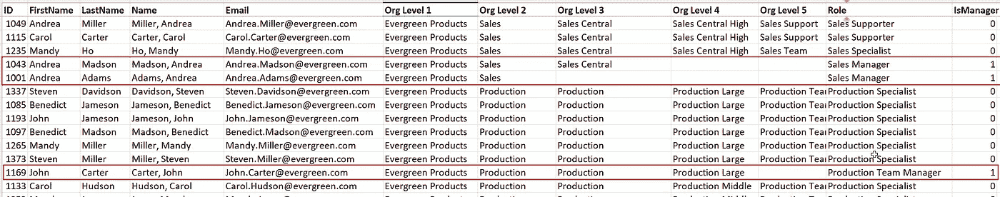

图 1 — 我的数据摘录，展示了不同层级的几位经理（作者绘制）

看看这三位标记的经理。三位经理都负责一个层级中的分支，从不同的层级开始。

+   Andrea Adams 负责整个销售团队。

+   Andrea Madson 负责中央地区的销售。

+   John Carter 负责大宗产品的生产。

每位经理必须能够访问组织内整个分支。

这里的挑战是如何高效地实现这一点。

我可以编写一个漂亮的 DAX 表达式，并用一些魔法来实现这个 RLS 角色中的功能。

但是每当用户访问这个数据模型时，这个魔术般复杂的 DAX 表达式会被执行，可能会大大减慢报告的速度。

我想避免这个问题。

# 准备数据模型

好的，我该如何解决这个挑战？

我必须添加计算表和列，以将每位经理与他以及所有下属的组织单位在层级中的映射起来。

逻辑目标数据模型如下所示：

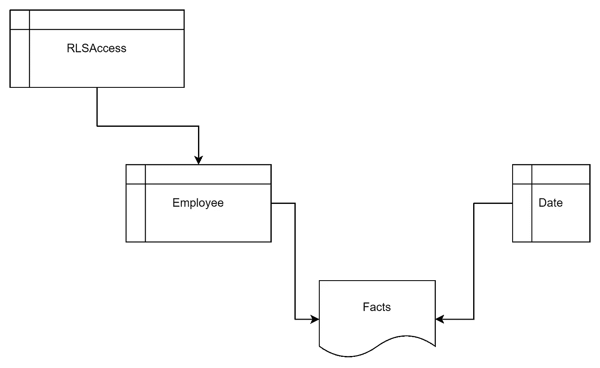

图 2 — 逻辑目标数据模型（作者绘制）

RLS-Access 表是我将在其中应用 DAX 表达式的 RLS 角色表。

我写下了“逻辑目标数据模型”，因为最终的数据模型将包含一个额外的表格。不过稍后会详细介绍。

我将使用 Power Query 创建这些表，而不是 DAX，因为这种方法能更高效地存储数据模型中的数据。

首先，我需要一个包含每个层级的“Key”列。

为此，我将把每个层级连接成一个键列。每个层级的列通过下划线分隔，使用以下 M 表达式：

```py
[Org Level 1] & "_" &
(if [Org Level 2] = null then "" else [Org Level 2]) & "_" &
(if [Org Level 3] = null then "" else [Org Level 3]) & "_" &
(if [Org Level 4] = null then "" else [Org Level 4]) & "_" &
(if [Org Level 5] = null then "" else [Org Level 5])
)
```

我必须添加多个“if”语句，以覆盖空单元格。

这是因为我从 SQL Server 数据库中获取数据，表达式被转换为 SQL 并发送到源数据库（参见 [查询折叠](https://medium.com/towards-data-science/exploring-query-folding-in-power-query-8288fb3c9c2f)）。

在 SQL 中将数据与空数据（NULL）连接会导致结果为空。

接下来，我将通过引用员工表创建一个新表，但只保留必要的列：

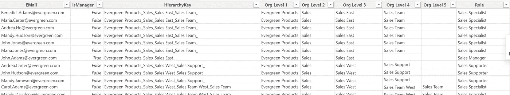

图 3 — RLS-Access 表摘录（作者绘制）

然后，我过滤此表格，只保留经理，通过将 IsManager 列过滤为 True。

不幸的是，这还不够。

我仍然无法基于多个层级控制数据访问。

为了解决这个问题，我需要一个映射表，将 RLS-Access 表和员工表连接起来，映射每个层级与每个角色组合之间的关系。

我通过将 RLS-Access 表相乘并附加每个变体，形成一个大型映射表来实现这一点。

这个映射表是我上面将数据模型称为“逻辑”的原因，因为它只是一个技术上的必要性，而不是一个与业务相关的表。

完整的技术数据模型如下：

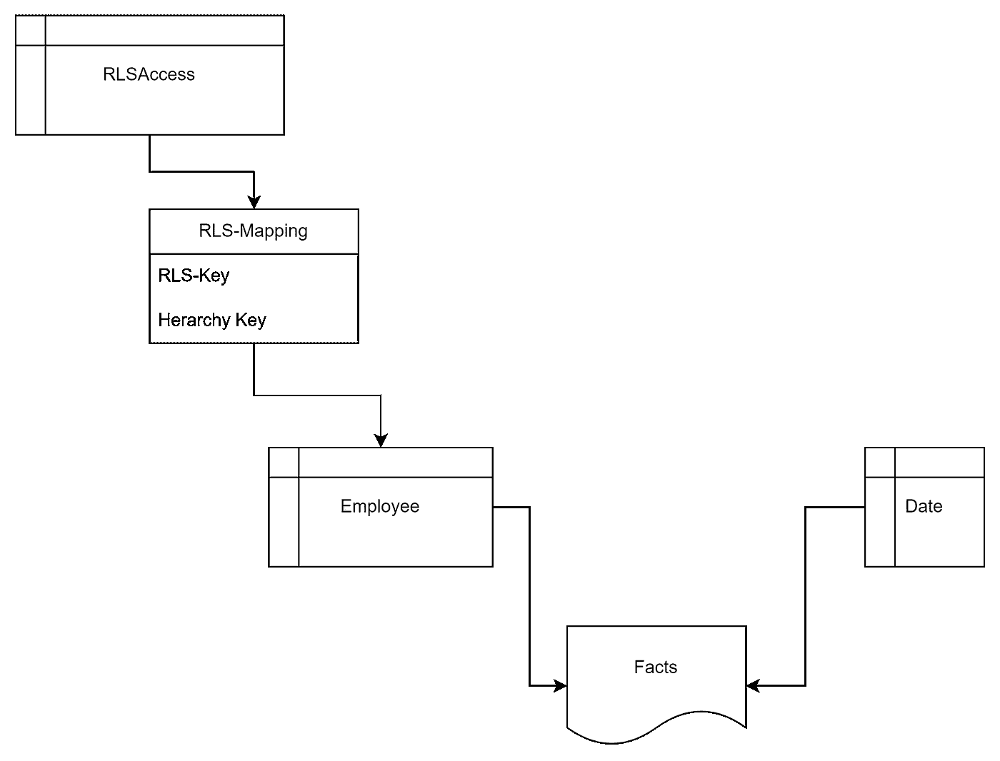

图 4 — 完整技术数据模型（图源：作者）

# 创建映射表

我需要做的是为每个层级创建一张表，其中每个层级有一组行。

例如，我将为整个层级创建一组映射到 CEO 顶层的映射。

然后，我将为 CEO 以下的管理层创建一组，以此类推。

我在 Power Query 中创建一个名为 CEOLevel 的新引用，来源于员工表。

接下来，我删除“ID”、“FirstName”、“LastName”、“Name”和“EMail”列。

然后，我添加一个新的计算列，称为 RLS-Key，使用以下 M 表达式：

```py
[Org Level 1] & "_CEO___"
```

最后，我删除所有列，保留层级键和新的 RLS-Key 列。

表格现在看起来是这样的：

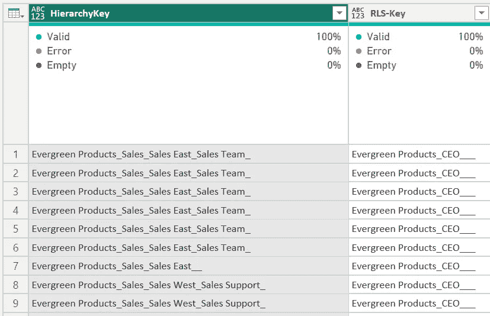

图 5 — 从 CEO 层级表中提取数据（图源：作者）

该表包含每个现有组织单元的行，以便 CEO 可以访问所有这些单元。稍后我将解释其机制。

该表设置为不加载到 Power BI 中：

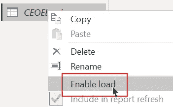

图 6 — 禁用 CEOLevel 表的加载（图源：作者）

这是因为它是一个中介表，将作为构建最终“RLS-Mapping”表的构建块使用。

现在，我重复这些步骤，创建一个名为 OrgLevel2 的另一个中介表。

但创建 RLS-Key 列的表达式是不同的：

```py
[Org Level 1] & "_" &
(if [Org Level 2] = null then "" else [Org Level 2]) & "___"
```

如您所见，结果中我通过这个表达式包括了组织的第二级：

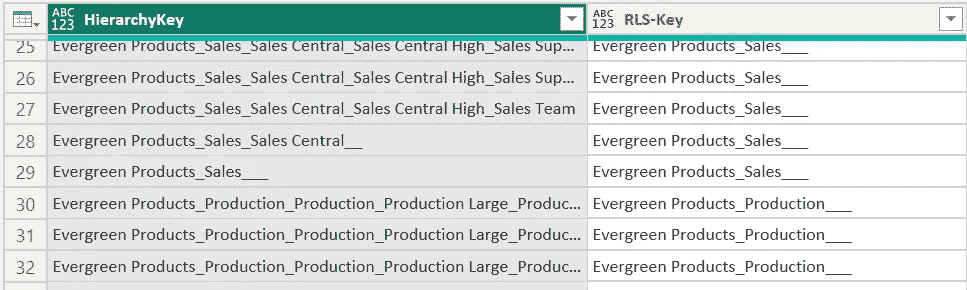

图 7 — OrgLevel2 表的提取数据（图源：作者）

基于这些步骤，我复制 CEOLevel 表并重复这些步骤，为 OrgLevel3–5 创建另外三个中介表。

对于每个表，我修改 RLS-Key 列的表达式，加入层级中的另一级：

对于 OrgLevel3，我使用以下表达式：

```py
[Org Level 1] & "_" &
(if [Org Level 2] = null then "" else [Org Level 2])
& "_" &
(if [Org Level 3] = null then "" else [Org Level 3])
& "__"
```

请注意，我每次在代码的最后一行中删除一个下划线，因为它包含在表达式的前一部分中。

这是 OrgLevel4 的情况：

```py
[Org Level 1] & "_" &
(if [Org Level 2] = null then "" else [Org Level 2])
& "_" &
(if [Org Level 3] = null then "" else [Org Level 3])
& "_" &
(if [Org Level 4] = null then "" else [Org Level 4])
& "_"
```

最后，对于 OrgLevel5，不会有最终的下划线，因为第五级是层级中的最后一级：

```py
[Org Level 1] & "_" &
(if [Org Level 2] = null then "" else [Org Level 2])
& "_" &
(if [Org Level 3] = null then "" else [Org Level 3])
& "_" &
(if [Org Level 4] = null then "" else [Org Level 4])
& "_" &
(if [Org Level 5] = null then "" else [Org Level 5])
```

现在，我可以创建最终的 RLS 映射表：

我点击 CEOLevel 表，然后点击追加查询来创建一个新表：

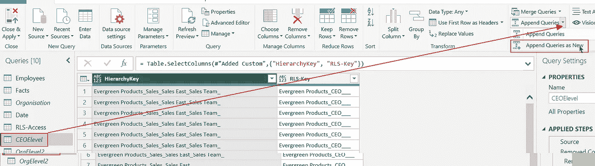

图 8 — 调用“追加查询”功能来创建 RLS-mapping 表（图源：作者）

现在，我将把所有五个表合并成一个新表：

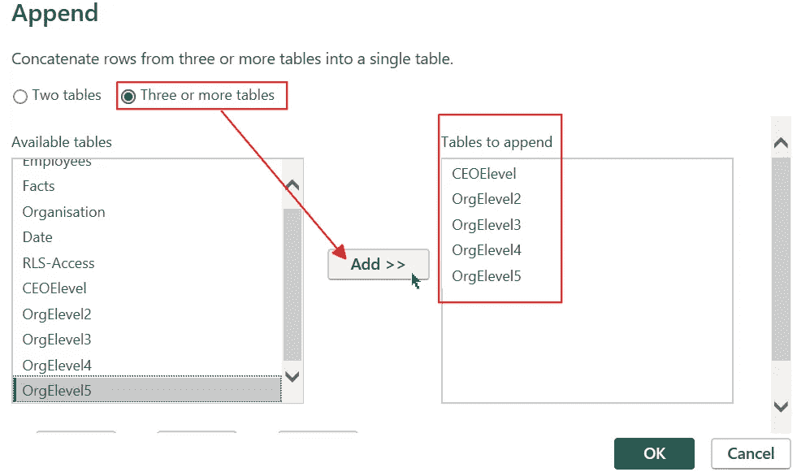

图 9 — 将所有中介表添加到新表中（图源：作者）

新的表格叫做“Append1”，我将其重命名为 RLS-Mapping。

最后，我将通过选择这两列并执行“删除重复项”来删除表中的所有重复项：

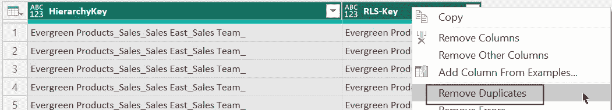

图 10 — 从 RLS-Mapping 表中删除重复项（图示作者提供）

为了使一切看起来干净整洁，我将这两列的数据显示类型改为文本。

现在，我可以将这个表格整合到我的数据模型中并实现 RLS 角色。

# 实现 RLS

在将新表加载到 Power BI 后，我必须像上面所描述的那样将其添加到数据模型中。

我删除了“RLS-Access”表与“Employees”表之间的关系，并添加了两个新关系：

+   RLS-Mapping[RLS-Key]到 RLS-Access[HierarchyKey]。 多对一

+   Employees[HierarchyKey]到 RLS-Mapping[HierarchyKey]。 多对多。RLS-Mapping 过滤 Employees

接下来，我可以将一个新的 RLS 角色添加到数据模型中：

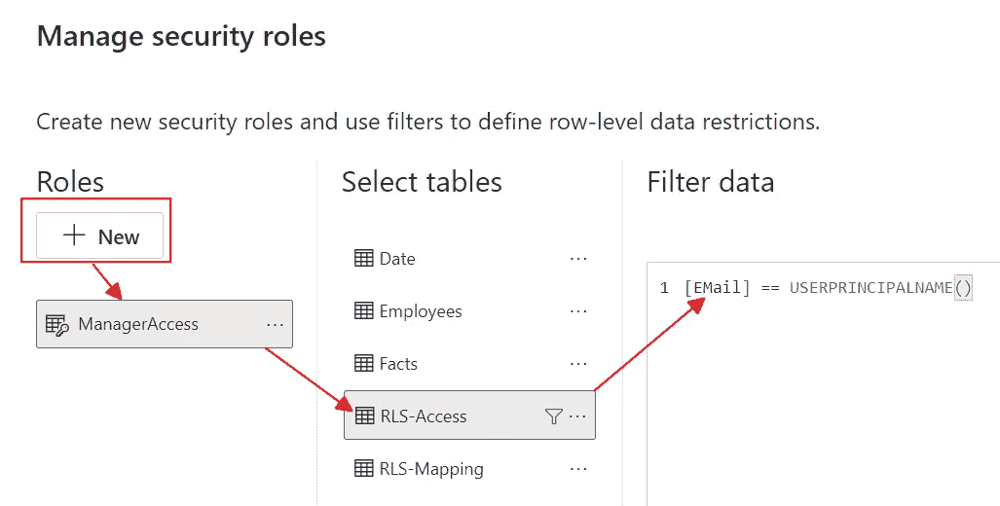

图 11 — 将新的 RLS 角色添加到数据模型中（图示作者提供）

就这样。

我可以为 Andrea Madson 测试该功能：

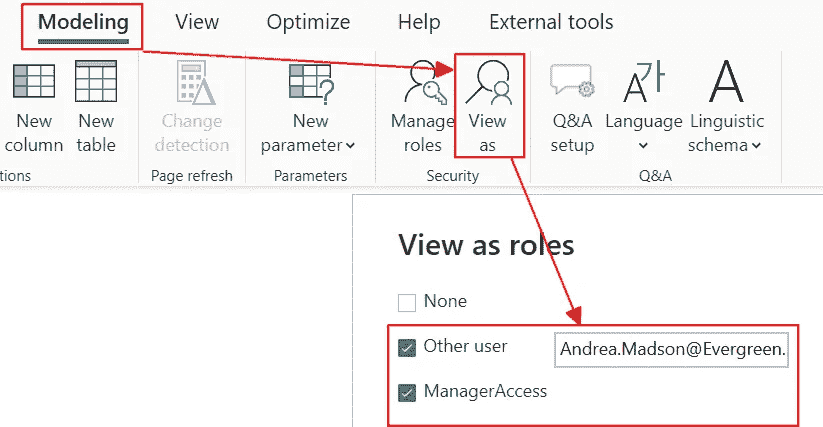

图 12 — 测试 RLS 角色（图示作者提供）

这是结果（记住，Andrea Madson 负责中央区域的销售）：

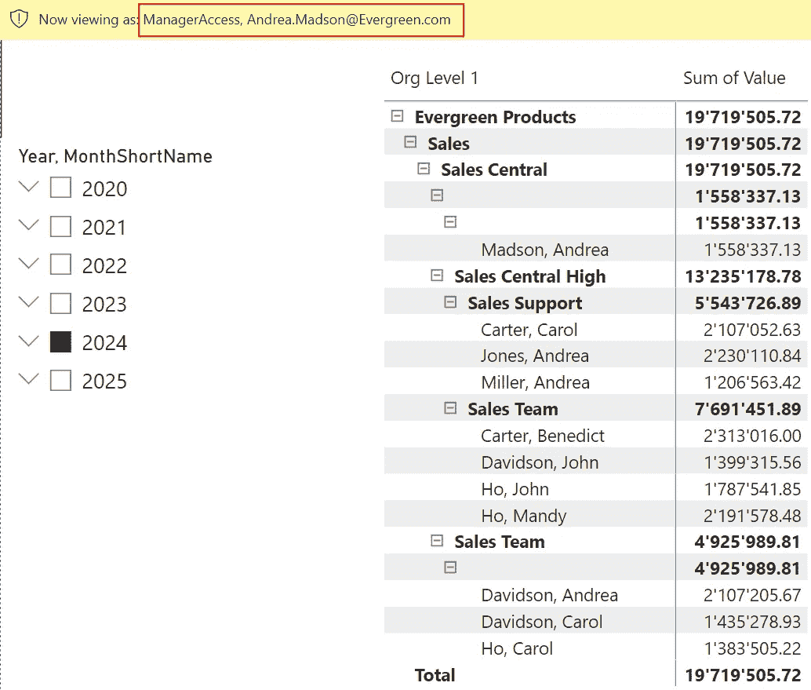

图 13 — 测试 RLS 角色的结果，针对 Andrea Madson（图示作者提供）

空级别的问题可以通过用上一级的内容填充它们来解决。某些可视化工具可以在层次结构中折叠重复的级别（如 Zebra BI）。

但标准的矩阵可视化无法做到这一点。

因此，我们只能接受这种效果。

# 它是如何工作的？

那么，它是如何工作的？

让我们看一下 Andrea Madson 的示例。

在 Employees 表中，她的行具有 HierarchyKey“Evergreen Products_Sales_Sales Central__”。

这与 RLS-Access 表中的值相同。

当我们将 RLS 角色应用到 RLS-Access 表时，这个过滤器会通过关系应用到 RLS-Mapping 表的 RLS-Key 列：

这个过滤器导致以下行保留在 RLS-Mapping 表中：

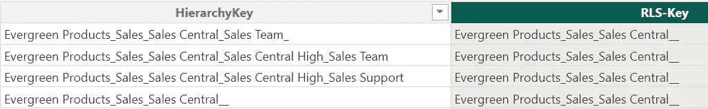

图 14 — 在为 Andrea Madson 应用 RLS-Key 列过滤器后剩余的行（图示作者提供）

HierarchyKey 列中的剩余值然后通过关系传递到 Employees 表，剩余的行是组织中 Sales Central 单位的一部分：

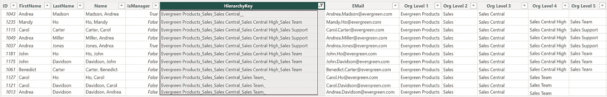

图 15 — 过滤后的 Andrea Madson 组织单元的行（图示作者提供）

这个机制适用于所有其他单位，因为我已经为 RLS-Mapping 表复制了行。

# 结论

这种方法使我能够在 RLS 角色中实现一个非常简单的 DAX 表达式。

如我在上一篇关于 RLS 的文章中所解释的（该文章位于下面参考部分的链接列表中），简化 RLS 角色中的 DAX 表达式是非常重要的。

原因是，这些 DAX 表达式会添加到每个发送到数据模型的 DAX 查询中。复杂的 DAX 表达式可能会导致报告性能变差。

因此，以此方式建模数据的积极效果是，我可以遵循这条规则。

即使这意味着在 Power BI 和 Power Query 中建模数据时要付出额外的努力。

你的用户可能不会感谢你，但他们也不会抱怨，这更好。


图片来源：[Brett Jordan](https://unsplash.com/@brett_jordan?utm_source=medium&utm_medium=referral)于[Unsplash](https://unsplash.com/?utm_source=medium&utm_medium=referral)

# 参考资料

数据是通过虚构的名字自生成的。

我通过将一份名字和姓氏的列表相乘，生成了这个完整的列表。

然后，我基于随机数字生成了一个事实表。

以下是我关于数据访问和 RLS 的其他文章链接：

[](/4-2-security-features-in-power-bi-4c5a21968e53?source=post_page-----2c67f980983f--------------------------------) ## Power BI 中的 4+2 安全功能

### 在我发表的第一篇关于这个主题的文章一年后，这里有关于 Power BI 中新安全功能的更新

[towardsdatascience.com [](/develop-and-test-rls-rules-in-power-bi-9dc705945feb?source=post_page-----2c67f980983f--------------------------------) ## 在 Power BI 中开发和测试 RLS 规则

### 很多时候，并不是所有的用户都应该有权限访问报告中的所有数据。在这里，我将解释如何开发 RLS……

[towardsdatascience.com [](/calculate-the-percentage-of-the-total-with-rls-in-place-in-power-bi-1ea5c3ab1fac?source=post_page-----2c67f980983f--------------------------------) [## 在 Power BI 中实现 RLS 后，计算总百分比

### 在实施 RLS 之后，某些用户只能看到数据集的部分内容。但当他们必须进行比较时，会发生什么呢……

[探索实现 RLS 规则的所有方法](https://towardsdatascience.com/calculate-the-percentage-of-the-total-with-rls-in-place-in-power-bi-1ea5c3ab1fac?source=post_page-----2c67f980983f--------------------------------) [](/explore-all-ways-to-implement-rls-rules-ee4a402db39a?source=post_page-----2c67f980983f--------------------------------) ## 探索实现 RLS 规则的所有方法

### 在 Power BI 中实现行级安全性是开发人员的一个常见任务。让我们来看看这些技术……

towardsdatascience.com [](https://medium.com/@salvatorecagliari/subscribe?source=post_page-----2c67f980983f--------------------------------) [## 每当 Salvatore Cagliari 发布新内容时，您将收到电子邮件。

### 每当 Salvatore Cagliari 发布新内容时，您将收到电子邮件。通过注册，您将创建一个 Medium 账户，如果您还没有的话……

medium.com](https://medium.com/@salvatorecagliari/subscribe?source=post_page-----2c67f980983f--------------------------------)

我使我的文章对所有人可访问，即使 Medium 有付费墙。这让我能够从每个读者那里赚取一些收入，但我关闭了付费墙，您可以免费阅读我的文章。

您可以通过

[`buymeacoffee.com/salvatorecagliari`](https://buymeacoffee.com/salvatorecagliari)

或扫描此二维码：


任何支持都将不胜感激，并帮助我找到更多时间为你创作更多内容。

非常感谢您。
