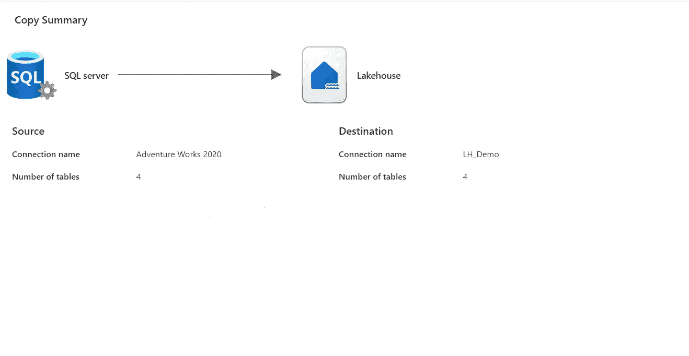

# 如何将 SQL Server 数据导入 Microsoft Fabric

> 原文：[`towardsdatascience.com/how-to-bring-sql-server-data-into-microsoft-fabric-975ff540ae54?source=collection_archive---------10-----------------------#2024-12-04`](https://towardsdatascience.com/how-to-bring-sql-server-data-into-microsoft-fabric-975ff540ae54?source=collection_archive---------10-----------------------#2024-12-04)

## 选项，选项……在本文中，你将了解将本地 SQL Server 数据导入 Microsoft Fabric 的各种可能性。

 [Nikola Ilic](https://datamozart.medium.com/?source=post_page---byline--975ff540ae54--------------------------------)

·发布于 [Towards Data Science](https://towardsdatascience.com/?source=post_page---byline--975ff540ae54--------------------------------) ·10 分钟阅读·2024 年 12 月 4 日

--

图片来自作者

选项，选项，选项……能够以多种不同方式执行某个任务，通常是一个很棒的“问题”，尽管很常见的情况是并非每个选项都同样有效。而且，Microsoft Fabric 就是关于“选项”的……你想导入数据吗？没问题，你可以使用笔记本、管道、数据流或 T-SQL。需要数据转换吗？一点也不担心——同样，你可以利用笔记本、T-SQL、数据流……需要数据处理吗？湖仓（Spark）、数据仓库（SQL）、实时智能（KQL）、Power BI……再次选择权在你手中。

简而言之，几乎在 Microsoft Fabric 中，每个任务都可以通过多种方式完成，没有“正确”或“错误”的工具，只要它能完成工作（当然，尽可能高效）。

因此，本文不是关于以“正确”的方式将本地 SQL Server 数据导入 Fabric，而是概述了我们目前可以使用的选项。探讨这些选项并写作的主要动机是我最近几个月常被问到的问题：“我们有我们的……
