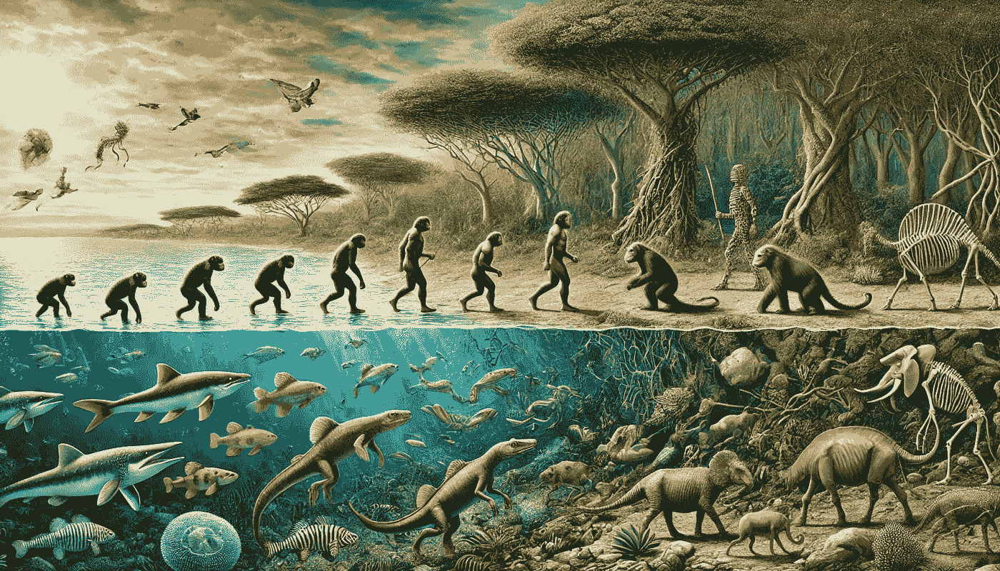

# 如何从头开始用 Python 构建遗传算法

> 原文：[`towardsdatascience.com/how-to-build-a-genetic-algorithm-from-scratch-in-python-289d895787e2?source=collection_archive---------6-----------------------#2024-08-30`](https://towardsdatascience.com/how-to-build-a-genetic-algorithm-from-scratch-in-python-289d895787e2?source=collection_archive---------6-----------------------#2024-08-30)

## 一步步讲解如何从头开始用 Python 构建遗传算法，并附带实际用例

 [Jacob Ingle](https://medium.com/@jaingle77?source=post_page---byline--289d895787e2--------------------------------)

·发表于 [Towards Data Science](https://towardsdatascience.com/?source=post_page---byline--289d895787e2--------------------------------) ·15 分钟阅读·2024 年 8 月 30 日

--

图像由 DALL-E 生成

# 介绍

遗传算法的美妙之处在于它们直接受到自然的启发，特别是自然选择的过程：

> 自然选择是指通过选择性地繁殖基因型或遗传构成的变化，使得生物体能够适应其 [环境](https://www.britannica.com/science/environment)的过程 [1]。

更广泛地说，自然选择是进化的主要机制之一。我对这个机制感到着迷，它在数百万年的时间里改变了自然界。更令人兴奋的是，我们可以通过遗传算法利用自然选择的力量。

遗传算法模拟了自然选择在非自然环境中的过程，通常类似于商业资源优化。然而，它的应用并不限于这些类型的用例。

在本文中，我将向读者展示如何用 Python 构建自己的遗传算法，并将其应用于实际用例。

# 为什么要使用遗传算法？
