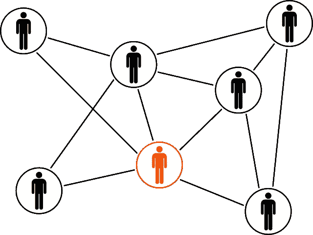

# 如何在 6 步内构建一个基于图的神经网络进行异常检测

> 原文：[`towardsdatascience.com/how-to-build-a-graph-based-neural-network-for-anomaly-detection-in-6-steps-a7dc47723788?source=collection_archive---------0-----------------------#2024-02-12`](https://towardsdatascience.com/how-to-build-a-graph-based-neural-network-for-anomaly-detection-in-6-steps-a7dc47723788?source=collection_archive---------0-----------------------#2024-02-12)

## 学习构建一个能够处理异构图数据的图卷积网络，以进行链接预测

 [Claudia Ng](https://ds-claudia.medium.com/?source=post_page---byline--a7dc47723788--------------------------------)

·发布于 [Towards Data Science](https://towardsdatascience.com/?source=post_page---byline--a7dc47723788--------------------------------) ·阅读时间 17 分钟·2024 年 2 月 12 日

--

图片来自 [Pixabay](https://pixabay.com/vectors/linked-connected-network-team-men-152575/)

本文是关于如何构建一个强大的模型，用于处理包含不同类型实体的图数据（异构图数据）进行异常检测的详细技术深度分析。

你将学习的模型基于一篇题为《[在二分节点和边属性图上聚焦交互的异常检测](https://engineering.grab.com/files/GraphBEAN_IJCNN_2023.pdf)》的论文，该论文由亚洲科技公司 Grab 在 2023 年国际联合神经网络会议（IJCNN）上展示。

这个图卷积网络（GCN）模型可以处理异构图数据，意味着节点和边是不同类型的。这些图结构复杂，因为它们表示不同类型的实体或节点之间的关系。

可以处理异构图数据的图卷积网络（GCNs）是一个活跃的研究领域。该模型中的卷积操作已经适应了处理不同节点类型及其关系的挑战，特别是在异构图中。

相比之下，同质图包含相同类型的节点和边。这种图的结构相对简单…
