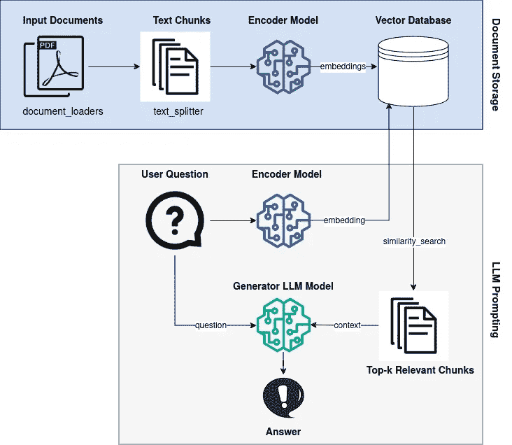

# 如何构建一个本地开源的 LLM 聊天机器人，结合 RAG 技术

> 原文：[`towardsdatascience.com/how-to-build-a-local-open-source-llm-chatbot-with-rag-f01f73e2a131?source=collection_archive---------1-----------------------#2024-03-31`](https://towardsdatascience.com/how-to-build-a-local-open-source-llm-chatbot-with-rag-f01f73e2a131?source=collection_archive---------1-----------------------#2024-03-31)

## 与谷歌的 Gemma-2b-it、LangChain 和 Streamlit 一起与 PDF 文档对话

 [Dr. Leon Eversberg](https://medium.com/@leoneversberg?source=post_page---byline--f01f73e2a131--------------------------------)

·发布于 [Towards Data Science](https://towardsdatascience.com/?source=post_page---byline--f01f73e2a131--------------------------------) ·阅读时间 12 分钟·2024 年 3 月 31 日

--

本文中我们将构建一个结合 RAG 的 LLM 聊天机器人，它使用洗衣机用户手册回答具体问题。图片由作者提供

# 介绍

大型语言模型（LLM）在将世界知识压缩到它们数十亿个参数中非常出色。

然而，LLM 有两个主要的局限性：它们只能获取到上次训练迭代时的最新知识。而且在被问及具体问题时，它们有时会“编造”知识（出现幻觉）。

使用 RAG 技术，我们可以让预训练的 LLM 在回答问题时，访问非常具体的信息作为额外的上下文。

在这篇文章中，我将通过理论与实践，演示如何利用 Hugging Face 的 transformers 库、LangChain 以及 Faiss 向量数据库，实现谷歌的 LLM Gemma，并增加 RAG 功能。

下图展示了 RAG 管道的概述，我们将一步一步地实现它。

RAG 管道实现概述。图片由作者提供

# 检索增强生成（RAG）
