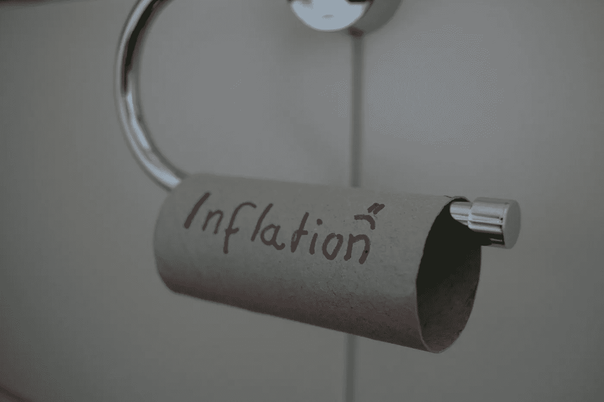

# 如何构建一个多目标回归模型进行宏观经济预测

> 原文：[`towardsdatascience.com/how-to-build-a-multi-target-regression-model-for-macroeconomic-prediction-940109d1d364?source=collection_archive---------3-----------------------#2024-10-16`](https://towardsdatascience.com/how-to-build-a-multi-target-regression-model-for-macroeconomic-prediction-940109d1d364?source=collection_archive---------3-----------------------#2024-10-16)

## **逐步指南：预测多个经济指标。**

 [Leo Anello 💡](https://medium.com/@panData?source=post_page---byline--940109d1d364--------------------------------)

·发表于[Towards Data Science](https://towardsdatascience.com/?source=post_page---byline--940109d1d364--------------------------------) ·21 分钟阅读·2024 年 10 月 16 日

--

图片来源：[Joachim Schnürle](https://unsplash.com/@joa70?utm_source=medium&utm_medium=referral) via [Unsplash](https://unsplash.com/?utm_source=medium&utm_medium=referral)

我现在带来的是一个**数据科学**项目，应用于**经济学**，通过**多目标回归**预测几个宏观经济指标。我现在需要学习经济学吗？嗯，无论你是否从事数据科学工作，了解一些**经济学**知识总是个好主意，对吧？它影响着地球上每个个体的生活。

你是一个属于城市、州、国家，最终属于全球经济的社区的一部分。因此，**经济学**以某种方式影响着你的生活。至少了解一些基本概念，已经是个很好的主意。

对于任何公司而言，处理**宏观经济指标**通常是必要的。公司需要做出**投资决策**。理解这些指标并做出预测是非常有用的。公司可能会计划将业务扩展到其他城市或州。

通过宏观经济指标来理解**GDP**——**国内生产总值**——不仅是为了整个国家，也包括各个州，这会很有趣，对吧？这直接影响着公司如何做出日常决策。
