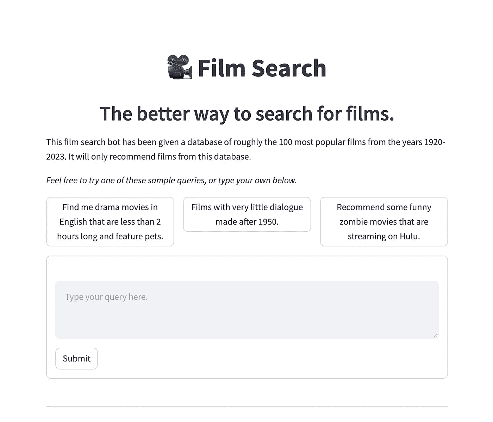
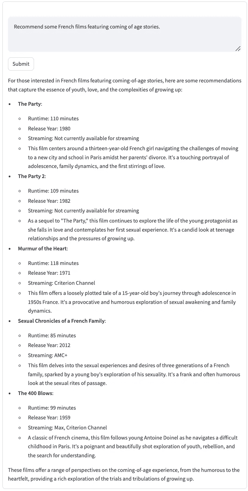

# 如何构建一个带自查询检索器的 RAG 系统

> 原文：[`towardsdatascience.com/how-to-build-a-rag-system-with-a-self-querying-retriever-in-langchain-16b4fa23e9ad?source=collection_archive---------0-----------------------#2024-04-25`](https://towardsdatascience.com/how-to-build-a-rag-system-with-a-self-querying-retriever-in-langchain-16b4fa23e9ad?source=collection_archive---------0-----------------------#2024-04-25)

## RAG + 元数据过滤 = 极好的电影推荐 🍿

[](https://medium.com/@ed.izaguirre?source=post_page---byline--16b4fa23e9ad--------------------------------)[](https://towardsdatascience.com/?source=post_page---byline--16b4fa23e9ad--------------------------------) [Ed Izaguirre](https://medium.com/@ed.izaguirre?source=post_page---byline--16b4fa23e9ad--------------------------------)

·发表于 [Towards Data Science](https://towardsdatascience.com/?source=post_page---byline--16b4fa23e9ad--------------------------------) ·阅读时间 12 分钟·2024 年 4 月 25 日

--


电视观看者的图片。图片由 DALL·E 3 创建。

## 目录

+   检索数据

+   将文档上传到 Pinecone

+   创建自查询检索器

+   创建聊天模型

+   演示

## 链接

+   编辑：我更新了电影搜索，并将其重新命名为 Rosebud。我还将其改为免费使用！ [在这里查看网站。](https://filmsearch.azurewebsites.net/)

+   还可以查看我关于改进这个应用程序的新文章！ 链接.

+   [GitHub 上的代码链接](https://github.com/EdIzaguirre/Rosebud)

最近，我在浏览 Max，试图找到一部电影观看。通常这包括浏览呈现给我的各种列表，阅读几个描述，然后挑选出听起来略微有趣的东西。有时候这是一个不错的选择，有时候则不尽如人意。如果我知道自己想看的电影标题或演员的名字，我通常才会使用搜索功能。否则，搜索功能就不太有用了。

我突然有了一个想法：为什么我不能使用自然语言，根据电影的*氛围*或*内容*来查询电影，而不仅仅是基于标题或演员呢？例如，为什么我不能打开 Max、Netflix 或 Hulu，然后在搜索栏中输入以下查询之一：

+   *帮我找一些英文的戏剧电影，时长不超过 2 小时，并且有宠物。*

+   *推荐僵尸电影，但要确保它们是有趣的。*

+   *我喜欢《瞬息全宇宙》。给我一部类似的电影，但更黑暗一些。*

这种方法的美妙之处不仅仅在于提供了更自然的搜索电影方式。这种方法还保护了用户的隐私。**这个系统完全不使用任何用户数据**。所需的唯一内容就是一个查询。

所以我构建了电影搜索系统。这是一个基于 RAG（检索增强生成）的系统，它接收用户查询，将其嵌入并进行相似性搜索，找到类似的电影。但它不仅仅是一个普通的 RAG 系统。这个系统使用了所谓的**自查询检索器**。这使得在进行相似性搜索之前，能够通过电影的元数据对其进行筛选。所以，如果用户的查询是“*推荐 1980 年后制作的恐怖电影，并且包含大量爆炸场面*”，搜索会首先过滤掉所有不是“1980 年后制作的恐怖电影”的影片，然后再进行关于“包含大量爆炸场面”的相似性搜索。

在本文中，我将提供一个关于如何构建这个系统的高层次概述。如果你想深入了解，完整的代码可以通过上面的链接获取。

让我们深入探讨。

# 获取数据

这个项目的数据来自于[The Movie Database (TMDB)](https://developer.themoviedb.org/docs/getting-started)，并且得到了所有者的许可。他们的 API 简单易用，维护良好，并且限制不多。我从他们的 API 中提取了以下电影属性：

+   片名

+   片长（分钟）

+   语言

+   概述

+   上映年份

+   类型

+   描述电影的关键词

+   演员

+   导演

+   流媒体播放地点

+   购买地点

+   租赁地点

+   制作公司列表

以下是如何使用 TMDB API 和 Python 的响应库提取数据的片段：

```py
def get_data(API_key, Movie_ID, max_retries=5):
    """
    Function to pull details of your film of interest in JSON format.

    parameters:
    API_key (str): Your API key for TMBD
    Movie_ID (str): TMDB id for film of interest

    returns:
    dict: JSON formatted dictionary containing all details of your film of
    interest
    """

    query = 'https://api.themoviedb.org/3/movie/' + Movie_ID + \
        '?api_key='+API_key + '&append_to_response=keywords,' + \
            'watch/providers,credits'
    for i in range(max_retries):
        response = requests.get(query)
        if response.status_code == 429:
            # If the response was a 429, wait and then try again
            print(
                f"Request limit reached. Waiting and retrying ({i+1}/{
                    max_retries})")
            time.sleep(2 ** i)  # Exponential backoff
        else:
            dict = response.json()
            return dict
```

请注意，查询需要电影 ID（这些 ID 也是通过 TMDB 获得的），以及`append_to_response`，它允许我拉取多种类型的数据，例如关键词、观看提供者、信用信息（导演和演员）以及一些关于电影的基本信息。这里还包括一些基本的框架代码，以防我遇到速率限制，尽管我从未遇到过这种情况。

接下来，我们需要解析 JSON 响应。以下是一个片段，展示了如何解析参与电影制作的演员和导演信息：

```py
credits = dict[‘credits’]
actor_list, director_list = [], []

# Parsing cast
cast = credits['cast']
NUM_ACTORS = 5
for member in cast[:NUM_ACTORS]:
    actor_list.append(member["name"])

# Parsing crew
crew = credits['crew']
for member in crew:
    if member['job'] == 'Director':
        director_list.append(member["name"])

actor_str = ', '.join(list(set(actor_list)))
director_str = ', '.join(list(set(director_list)))
```

请注意，我将每部电影的演员数量限制在前五名。我还必须指定只关心导演，因为响应中还包含了其他类型的工作人员，比如剪辑师、服装设计师等。

所有这些数据随后被汇总成了 CSV 文件。上面列出的每个属性都变成了一个列，而每一行现在代表一部特定的电影。以下是从`2008_movie_collection_data.csv`文件中提取的一小段电影数据，这个文件是通过编程生成的。在这个项目中，我大约获取了 1920 年至 2023 年间的 100 部顶级电影。

用于演示的电影数据片段。作者提供。

信不信由你，我至今还没有看过《功夫熊猫》。或许在这个项目之后我得去看一看。

# 上传文档到 Pinecone

接下来，我需要将 csv 数据上传到 Pinecone。在 RAG 系统中，通常需要对数据进行分块，但这里每个“文档”（CSV 文件中的一行）都相对较短，因此不需要分块。我首先将每个 CSV 文件转换为 LangChain 文档，然后指定哪些字段应该是主要内容，哪些字段应该是 metadata。

下面是用于构建这些文档的代码片段：

```py
# Loading in data from all csv files
loader = DirectoryLoader(
    path="./data",
    glob="*.csv",
    loader_cls=CSVLoader,
    show_progress=True)

docs = loader.load()

metadata_field_info = [
    AttributeInfo(
        name="Title", description="The title of the movie", type="string"),
    AttributeInfo(name="Runtime (minutes)",
                  description="The runtime of the movie in minutes", type="integer"),
    AttributeInfo(name="Language",
                  description="The language of the movie", type="string"),
    ...
]

for doc in docs:
    # Parse the page_content string into a dictionary
    page_content_dict = dict(line.split(": ", 1)
                             for line in doc.page_content.split("\n") if ": " in line)

    doc.page_content = 'Overview: ' + page_content_dict.get(
        'Overview') + '. Keywords: ' + page_content_dict.get('Keywords')
    doc.metadata = {field.name: page_content_dict.get(
        field.name) for field in metadata_field_info}

    # Convert fields from string to list of strings
    for field in fields_to_convert_list:
        convert_to_list(doc, field)      

    # Convert fields from string to integers
    for field in fields_to_convert_int:
        convert_to_int(doc, field)
```

来自 LangChain 的`DirectoryLoader`负责将所有 csv 文件加载为文档。然后，我需要指定什么内容应该是`page_content`，什么内容应该是`metadata`。这是一个重要的决定。`page_content`将被嵌入并在检索阶段用于相似度搜索。`metadata`仅在相似度搜索之前用于过滤。 我决定将`overview`和`keywords`属性嵌入到`page_content`中，而其他属性则作为 metadata。进一步调整应考虑是否将`title`也包含在`page_content`中，但我发现这个配置对于大多数用户查询效果很好。

然后，文档需要上传到 Pinecone。这是一个相当直接的过程：

```py
# Create empty index
PINECONE_KEY, PINECONE_INDEX_NAME = os.getenv(
    'PINECONE_API_KEY'), os.getenv('PINECONE_INDEX_NAME')

pc = Pinecone(api_key=PINECONE_KEY)

# Uncomment if index is not created already
pc.create_index(
    name=PINECONE_INDEX_NAME,
    dimension=1536,
    metric="cosine",
    spec=PodSpec(
        environment="gcp-starter"
    )
)

# Target index and check status
pc_index = pc.Index(PINECONE_INDEX_NAME)
print(pc_index.describe_index_stats())

embeddings = OpenAIEmbeddings(model='text-embedding-ada-002')

vectorstore = PineconeVectorStore(
    pc_index, embeddings
)

# Create record manager
namespace = f"pinecone/{PINECONE_INDEX_NAME}"
record_manager = SQLRecordManager(
    namespace, db_url="sqlite:///record_manager_cache.sql"
)

record_manager.create_schema()

# Upload documents to pinecome
index(docs, record_manager, vectorstore,
      cleanup="full", source_id_key="Website")
```

在这里，我只想强调几点：

+   使用`SQLRecordManager`可以确保如果这段代码运行多次，重复的文档不会被上传到 Pinecone。如果文档被修改，只有该文档会在向量存储中被更新。

+   我们使用的是 OpenAI 的经典`text-embedding-ada-002`嵌入模型。

# 创建自查询检索器

自查询检索器将允许我们通过之前定义的 metadata 过滤在 RAG 过程中检索的电影。这将大大提高我们电影推荐系统的实用性。

选择向量存储时，一个重要的考虑因素是确保它支持通过 metadata 进行过滤，因为并非所有向量存储都支持。[这是 LangChain 支持自查询检索的数据库列表](https://python.langchain.com/docs/integrations/retrievers/self_query)。另一个重要的考虑因素是每个向量存储允许哪些类型的比较器。比较器是我们通过 metadata 进行过滤的方法。例如，我们可以使用`eq`比较器来确保我们的电影属于科幻类型：`eq('Genre', 'Science Fiction')`。并非所有向量存储都允许所有比较器。作为例子，请查看[Weaviate 中允许的比较器](https://weaviate.io/developers/weaviate/api/graphql/filters#filter-structure)，以及它们与[Pinecone 中的比较器](https://docs.pinecone.io/guides/data/filtering-with-metadata#metadata-query-language)的差异。我们需要告诉模型允许哪些比较器，以防止它意外地写出不允许的查询。

除了告诉模型存在哪些比较器，我们还可以给模型提供一些用户查询的示例和相应的筛选条件。这被称为**少量样本学习**，它对于帮助指导你的模型非常宝贵。

为了看看这有什么帮助，看看以下两个用户查询：

+   *“推荐一些由约尔戈斯·兰西莫斯导演的电影。”*

+   *“类似于约尔戈斯·兰西莫斯电影的电影。”*

对于我的元数据筛选模型来说，即使我希望它们被不同对待，也很容易为每个示例编写相同的筛选查询。第一个应该只返回由**兰西莫斯**导演的电影，而第二个则应该返回与兰西莫斯电影有相似**氛围**的电影。为了确保这种行为，我向模型提供了我期望的行为示例。语言模型的美妙之处在于，它们可以利用其“推理”能力和世界知识，从这些少量的示例中推广到其他用户查询。

```py
document_content_description = "Brief overview of a movie, along with keywords"

        # Define allowed comparators list
        allowed_comparators = [
            "$eq",  # Equal to (number, string, boolean)
            "$ne",  # Not equal to (number, string, boolean)
            "$gt",  # Greater than (number)
            "$gte",  # Greater than or equal to (number)
            "$lt",  # Less than (number)
            "$lte",  # Less than or equal to (number)
            "$in",  # In array (string or number)
            "$nin",  # Not in array (string or number)
            "$exists", # Has the specified metadata field (boolean)
        ]

        examples = [
            (
                "Recommend some films by Yorgos Lanthimos.",
                {
                    "query": "Yorgos Lanthimos",
                    "filter": 'in("Directors", ["Yorgos Lanthimos]")',
                },
            ),
            (
                "Films similar to Yorgos Lanthmios movies.",
                {
                    "query": "Dark comedy, absurd, Greek Weird Wave",
                    "filter": 'NO_FILTER',
                },
            ),
            ...
        ]

        metadata_field_info = [
            AttributeInfo(
                name="Title", description="The title of the movie", type="string"),
            AttributeInfo(name="Runtime (minutes)",
                          description="The runtime of the movie in minutes", type="integer"),
            AttributeInfo(name="Language",
                          description="The language of the movie", type="string"),
            ...
        ]

        constructor_prompt = get_query_constructor_prompt(
            document_content_description,
            metadata_field_info,
            allowed_comparators=allowed_comparators,
            examples=examples,
        )

        output_parser = StructuredQueryOutputParser.from_components()
        query_constructor = constructor_prompt | query_model | output_parser

        retriever = SelfQueryRetriever(
            query_constructor=query_constructor,
            vectorstore=vectorstore,
            structured_query_translator=PineconeTranslator(),
            search_kwargs={'k': 10}
        )
```

除了示例，模型还必须了解每个元数据字段的描述。这有助于它理解可能的元数据筛选。

最后，我们构建我们的链条。这里的`query_model`是使用 OpenAI API 的 GPT-4 Turbo 实例。我建议使用 GPT-4 而不是 3.5 来编写这些元数据筛选查询，因为这是一个关键步骤，而 3.5 在这一点上更容易出错。`search_kwargs={'k':10}`告诉检索器根据用户查询拉取最相似的 10 部电影。

# 创建聊天模型

最后，在构建自查询检索器之后，我们可以在其基础上构建标准的 RAG 模型。我们从定义聊天模型开始。我称之为总结模型，因为它接受一个上下文（检索到的电影 + 系统消息），并以每个推荐的摘要进行回应。如果你想降低成本，可以使用 GPT-3.5 Turbo，或者如果你想要最好的结果，可以使用 GPT-4 Turbo。

在系统消息中，我告诉机器人它的目标是什么，并提供一系列建议和限制，其中**最重要的是不要推荐任何没有通过自查询检索器提供的电影**。在测试中，当用户查询没有从数据库中检索到电影时，我遇到了问题。例如，查询：*“推荐一些由马特·达蒙主演、韦斯·安德森导演的恐怖片，且是在 1980 年之前制作的”*会导致自查询检索器无法检索到任何电影（因为虽然听起来很棒，但这样的电影并不存在）。在没有电影数据的上下文中，模型会使用它自己的（错误的）记忆来尝试推荐一些电影。这种行为不好。我不希望 Netflix 推荐系统讨论数据库中不存在的电影。下面的系统消息成功阻止了这种行为。我确实注意到，GPT-4 比 GPT-3.5 更善于遵循指令，这是预期之中的。

```py
chat_model = ChatOpenAI(
    model=SUMMARY_MODEL_NAME,
    temperature=0,
    streaming=True,
)

prompt = ChatPromptTemplate.from_messages(
    [
        (
            'system',
            """
            Your goal is to recommend films to users based on their 
            query and the retrieved context. If a retrieved film doesn't seem 
            relevant, omit it from your response. If your context is empty
            or none of the retrieved films are relevant, do not recommend films
            , but instead tell the user you couldn't find any films 
            that match their query. Aim for three to five film recommendations,
            as long as the films are relevant. You cannot recommend more than 
            five films. Your recommendation should be relevant, original, and 
            at least two to three sentences long.

            YOU CANNOT RECOMMEND A FILM IF IT DOES NOT APPEAR IN YOUR 
            CONTEXT.

            # TEMPLATE FOR OUTPUT
            - **Title of Film**:
                - Runtime:
                - Release Year:
                - Streaming:
                - (Your reasoning for recommending this film)

            Question: {question} 
            Context: {context} 
            """
        ),
    ]
)

def format_docs(docs):
    return "\n\n".join(f"{doc.page_content}\n\nMetadata: {doc.metadata}" for doc in docs)

# Create a chatbot Question & Answer chain from the retriever
rag_chain_from_docs = (
    RunnablePassthrough.assign(
        context=(lambda x: format_docs(x["context"])))
    | prompt
    | chat_model
    | StrOutputParser()
)

rag_chain_with_source = RunnableParallel(
    {"context": retriever, "question": RunnablePassthrough()}
).assign(answer=rag_chain_from_docs)
```

`format_docs` 用于格式化呈现给模型的信息，以便它易于理解和解析。我们将 `page_content`（概述和关键词）以及 `metadata`（所有其他电影属性）同时呈现给模型；任何它可能需要的信息，以便更好地向用户推荐电影。

`rag_chain_from_docs` 是一个链条，它接受检索到的文档，通过 `format_docs` 格式化，然后将格式化后的文档输入模型上下文中，模型基于这些内容回答问题。最后，我们创建了 `rag_chain_with_source`，这是一个 `RunnableParallel`，顾名思义，它同时执行两个操作：自查询检索器去检索相似的文档，而查询则通过 `RunnablePassthrough()` 直接传递给模型。然后，来自并行组件的结果被组合，`rag_chain_from_docs` 用来生成答案。这里的 `source` 指的是检索器，它访问所有的‘源’文档。

因为我希望答案是逐步流式传输的（例如，像 ChatGPT 一样逐块展示给用户），我们使用以下代码：

```py
for chunk in rag_chain_with_source.stream(query):
    for key in chunk:
        if key == 'answer':
            yield chunk[key]
```

# 演示

现在是有趣的部分：与模型互动。如前所述，Streamlit 被用来创建前端并托管应用程序。我在这里不讨论 UI 的代码；有关实现的详细信息，请参见原始代码。它相当直接，而且在[Streamlit 网站](https://docs.streamlit.io/knowledge-base/tutorials/build-conversational-apps)上有很多其他示例。



电影搜索界面。作者提供。

有几个建议可以使用，但让我们尝试我们自己的查询：



示例查询和模型响应。作者提供。

在后台，自查询检索器确保过滤掉任何非法语的电影。然后，它执行了一个“成长故事”的相似性搜索，结果是上下文中有十部电影。最后，摘要机器人选择了五部电影进行推荐。请注意推荐的电影范围：一些电影的上映日期早至 1959 年，最晚的为 2012 年。为了方便起见，我确保机器人包括电影的片长、上映年份、流媒体提供商，以及由机器人精心制作的简短推荐。

*(附注：如果你还没有看过* [*400 击*](https://en.wikipedia.org/wiki/The_400_Blows)*，立刻停下你正在做的事情，去* [*立即观看*](https://www.youtube.com/watch?v=PvjUhgtn_-U)*。)*

在大型语言模型中，通常被视为负面的特性，比如其响应的非确定性，现在变成了积极的。你如果向模型问同一个问题两次，可能会得到略有不同的推荐。

需要注意当前实现的一些限制：

+   不支持保存推荐。用户可能希望重新访问以前的推荐。

+   手动更新来自电影数据库的原始数据。将其自动化并每周更新一次是一个不错的主意。

+   自查询检索中的元数据过滤不准确。例如，查询“Ben Affleck films”可能会出现问题。这可能指的是由本·阿弗莱克**主演**的电影，或者是由本·阿弗莱克**执导**的电影。这是一个需要澄清查询的例子。

对这个项目的可能改进之一是在检索后进行[文档重新排序](https://python.langchain.com/docs/integrations/retrievers/cohere-reranker)。还可以有一个聊天模型，可以进行多轮对话，而不仅仅是一个问答机器人。还可以创建一个[推荐代理](https://python.langchain.com/docs/integrations/tools/human_tools)，如果查询不明确，可以向用户提出澄清问题。

玩得开心，搜索电影吧！
