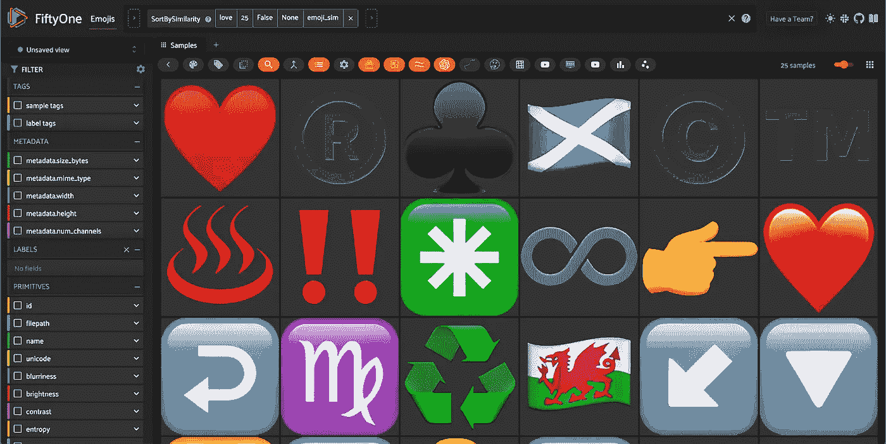

# 如何构建一个语义搜索引擎来搜索表情符号

> 原文：[`towardsdatascience.com/how-to-build-a-semantic-search-engine-for-emojis-ef4c75e3f7be?source=collection_archive---------8-----------------------#2024-01-10`](https://towardsdatascience.com/how-to-build-a-semantic-search-engine-for-emojis-ef4c75e3f7be?source=collection_archive---------8-----------------------#2024-01-10)

## 寻找你想要的情感 🔍🤔😀🚀

[](https://medium.com/@jacob_marks?source=post_page---byline--ef4c75e3f7be--------------------------------)[](https://towardsdatascience.com/?source=post_page---byline--ef4c75e3f7be--------------------------------) [Jacob Marks, Ph.D.](https://medium.com/@jacob_marks?source=post_page---byline--ef4c75e3f7be--------------------------------)

·发表于[Towards Data Science](https://towardsdatascience.com/?source=post_page---byline--ef4c75e3f7be--------------------------------) ·阅读时间 15 分钟·2024 年 1 月 10 日

--


使用自定义表情符号搜索引擎进行“halloween”的语义搜索。

如果你曾经使用过 Google Docs 或 Slack，你可能注意到，当你输入一个“:”紧接着另一个字符时，会弹出一个表情符号列表：


自从我发现这个功能以来，我就一直在*大量*使用它。我在我的消息、博客文章和其他书面作品中添加了比我曾经想象的更多的表情符号。事实上，我已经习惯了这种添加表情符号的方式，以至于我安装了[Rocket](https://matthewpalmer.net/rocket/)——一款免费应用程序，它将相同的表情符号搜索功能带入到电脑上的所有文本框和文本编辑器中。这真是一个改变游戏规则的工具。

但是，随着我使用这些表情符号搜索引擎的次数越来越多，我注意到一个令人沮丧的限制：所有搜索都基于你查询中的*精确*文本，以及表情符号的名称和描述。实际上，你需要非常精确地搜索某个词，才能显示出任何结果。

这里有一个例子：如果我们搜索“audio”，一个结果都不会显示出来：


这并不是因为表情符号集合中缺少音频类的表情符号。如果我们输入“music”或“speaker”，我们会得到一长串结果。实际上，这与“audio”这个特定文本串的名称或描述中并没有出现任何表情符号相关的事实有关。


这个相对较小的不便让我感到如此困扰，以至于我决定构建这个：

“这个”指的是一个开源的语义表情符号搜索引擎，具有基于 UI 和 CLI 两个版本。Python CLI 库可以在[这里](https://github.com/jacobmarks/emoji_search)找到，基于 UI 的版本可以在[这里](https://github.com/jacobmarks/emoji-search-plugin)找到。你还可以在线尝试一个托管的（也是免费的）UI 表情符号搜索引擎，点击[这里](https://try.fiftyone.ai/datasets/emojis/samples)。


*语义表情符号搜索引擎的命令行版本*

构建这个过程并不像我最初希望的那样简单或直接。这花了很多实验，很多我认为相当聪明的想法最终都失败了。但最终，我成功地创建了一个相当好用的表情符号搜索引擎。

下面是我如何构建它、哪些方面有效、哪些方面无效，以及在过程中学到的经验教训。

+   什么是表情符号

+   数据

+   表情符号与图片和文本

+   弥合模态差距

+   使用表情符号搜索引擎

# 什么是表情符号

在构建一个表情符号语义搜索引擎之前，值得简要解释一下什么是表情符号。*emoji* 这个词源自日语汉字絵（eh），意思是*图片*，以及文字（mōji），意思是字母或字符。从词源学的角度来看，emoji 本质上是一种象形文字，虽然它与英语单词*emotion*（情感）有关，但它并不是“情感图标”——这才是[表情符号](https://en.wikipedia.org/wiki/Emoticon)。

与[字母数字字符](https://en.wikipedia.org/wiki/List_of_Unicode_characters#Latin_script)、[非洲点击音](https://en.wikipedia.org/wiki/Latin_Extended-B#African_letters_for_clicks)、[数学符号](https://en.wikipedia.org/wiki/List_of_Unicode_characters#Mathematical_symbols)和[几何符号](https://en.wikipedia.org/wiki/List_of_Unicode_characters#Geometric_Shapes)、[装饰符号](https://en.wikipedia.org/wiki/List_of_Unicode_characters#Dingbats)以及[计算机控制序列](https://en.wikipedia.org/wiki/List_of_Unicode_characters#Control_codes)一起，表情符号可以作为 Unicode 字符表示，从而使它们可以被计算机读取。然而，与字母数字字符和其他符号不同，表情符号由[Unicode 联盟](https://home.unicode.org/)进行*维护*。该联盟会征集新表情符号的提案，并定期选择哪些表情符号将被加入到标准中。

截至写作时，2023 年 11 月，已经有[超过 3600 个被认可的表情符号](https://home.unicode.org/emoji/about-emoji/)，它们象征着各种各样的思想和情感。有些表情符号由单一的 Unicode 字符或*编码点*表示。例如，“露齿而笑的脸”表情符号，😀，在 Unicode 中表示为 U+1F600。

其他的则通过代码点序列表示。这些序列将单个代码点表情符号与零宽度连接符 unicode 字符结合，称为 ZWJ 序列，允许将概念组合在一起，就像[汉字部首](https://en.wikipedia.org/wiki/Kangxi_radical)可以组合成一个讲述故事的字符一样。例如，表情符号👨‍👩‍👧就是通过 ZWJ 代码点 U+200D 连接的*男人*👨（U+1F468）、*女人*👩（U+1F469）和*女孩*👧（U+1F467）表情符号：

```py
👨‍👩‍👧 = U+1F468 U+200D U+1F469 U+200D U+1F467
```

根据 Unicode 联盟的统计，全球 92%的在线用户在通信中使用表情符号，2021 年使用频率最高的十个表情符号是：😂 ❤️ 🤣 👍 😭 🙏 😘 🥰 😍 😊。

# 从数据开始

由于表情符号在某种程度上是象形文字，我希望在搜索过程中同时利用文本信息和视觉信息。我的初步假设是，对于许多表情符号来说，名称——用于调出表情符号的文本字符串——只传达了其含义的一部分。这可能是由于多种原因，包括自然语言的局限性，以及文化和视觉相似性所赋予的附加含义。为了真正展现表情符号的完整本质，我需要利用视觉信息。

我找到了一份 2021 年的[Kaggle Emojis 数据集](https://www.kaggle.com/datasets/subinium/emojiimage-dataset)，其中包含 1816 个表情符号的数据，包括表情符号的表示、与之相关的文本、unicode 编码（或编码）和一个[base64](https://en.wikipedia.org/wiki/Base64)编码的图像。以下是该数据集的前几行，加载为 pandas DataFrame 后呈现的样子：


由于表情符号的渲染方式取决于计算机、网站或应用程序，因此存在名为`Apple`、`Google`、`Facebook`等的单独列。我从 base64 解码这些图像并将其转换为[Pillow](https://pypi.org/project/Pillow/)图像。以下是 Kaggle 数据集中的第一张图像（露齿笑脸）：

```py
import base64
from io import BytesIO
from PIL import Image

## decode and convert first row Apple image
im_str = df.Apple[0].replace('data:image/png;base64,', '')
im = Image.open(BytesIO(base64.b64decode(im_str)))
im
```


然而，在转换后很明显，这些图像的分辨率非常低。例如，这张图像仅为 72x72 像素。为了提高将要传递给下游模型的图像质量，并且为了改善最终基于 UI 的应用程序中的体验，我将所有这些低分辨率图像传递到[Real-ESRGAN](https://replicate.com/nightmareai/real-esrgan)，将分辨率提高了 10 倍。

结果图像看起来是这样的：


由于并非所有表情符号在 pandas DataFrame 中的所有图像列都有图像，因此我为每一行使用了第一个有效的 base64 编码。

# 表情符号与图像和文本

在深入探讨之前，我想强调表情符号的一个关键元素，它使得表情符号如此特别，并且值得拥有自己的语义搜索引擎：从某种意义上说，它们*既*是图像也是文本。从人类的角度来看，我们可以将每个表情符号表示为一个 Unicode 字符，与文本字符处于同一层面，同时也可以将其表示为一个独立的图像，这两者在前一节中都已经看到。换句话说，如果我们用一只眼睛眯起，我们可以把象形符号看作是一张图片，而如果我们用另一只眼睛眯起，我们可以将同一个象形符号看作是文本。

然而，计算机并不以其眯眼能力而闻名。尽管计算机可以将一个 Unicode 码点显示为表情符号，但机器学习模型可能没有很好的方法将该表情符号解释为文本或图像。

每当我在进行连接图像和文本的语义搜索应用时，我都会从一个被称为 [对比语言图像预训练](https://github.com/openai/CLIP)（CLIP）的一组模型开始。这些模型通过对图像-文本对进行训练，生成图像及其标题的相似向量表示或 *嵌入*，当图像与其他文本字符串配对时，生成不相似的向量。有多种 CLIP 风格的模型，包括 [OpenCLIP](https://github.com/mlfoundations/open_clip) 和 [MetaCLIP](https://github.com/facebookresearch/metaclip)，但为了简便起见，我们将重点关注 OpenAI 的原始 CLIP 模型。没有任何模型是完美的，在根本层面上，也没有*正确*的方式来比较图像和文本，但 CLIP 无疑提供了一个很好的起点。

# 将表情符号解释为文本

在高层次上，语言模型通过将输入文本转换为一个有序的*标记*序列，然后*编码*这些标记和位置信息为一个密集的数值向量。每个语言模型都有自己的*词汇表*，用于将文本字符串分解为标记，涵盖了从单个字母到完整单词的范围。一些标记对于人类来说很容易理解，而另一些则不容易理解，在 CLIP 的情况下，词汇表包含了 49,408 个条目。

让我们看一个明确的例子。假设已安装 CLIP 库，我们可以使用以下方式对文本字符串“a dog”进行*分词*处理：

```py
import clip
text_tokens = clip.tokenize("a dog")
print(text_tokens)
```

```py
tensor([[49406,   320,  1929, 49407,     0,     0,     0,     0,     0,     0,
             0,     0,     0,     0,     0,     0,     0,     0,     0,     0,
             0,     0,     0,     0,     0,     0,     0,     0,     0,     0,
             0,     0,     0,     0,     0,     0,     0,     0,     0,     0,
             0,     0,     0,     0,     0,     0,     0,     0,     0,     0,
             0,     0,     0,     0,     0,     0,     0,     0,     0,     0,
             0,     0,     0,     0,     0,     0,     0,     0,     0,     0,
             0,     0,     0,     0,     0,     0,     0]], dtype=torch.int32)
```

输出张量包含四个非零条目：49406、320、1929 和 49407。为了理解这些条目的含义，我们可以将这些值映射回 [CLIP 词汇字典](https://huggingface.co/openai/clip-vit-base-patch32/resolve/main/vocab.json)中的键。第一个数字 49406 对应于键“<|startoftext|>”，最后一个数字 49407 对应于键“<|endoftext|>”。这些是表示要编码的文本字符串开始和结束的特殊标记。第二个数字 320 映射回“a</w>”，表示字符“a”后跟一个新单词。最后，1929 是键“dog</w>”的值。

然而，如果我们尝试标记化包含表情符号的字符串，我们会很快遇到问题：表情符号不像其他字符那样被标记化。让我们从狗表情符号🐶开始：

```py
clip.tokenize("🐶")
## [49406, 10631, 49407, 0, ...]
```

对与 10,631 相关的键进行反向查找时，我们得到标记“ðŁIJ¶</w>”。但是如果我们将这个字符串传入分词器，我们会得到一组完全不同的标记 ID：

```py
clip.tokenize("ðŁIJ¶")
## [49406, 127, 108, 40419, 72, 329, 126, 370, 49407, 0, ...]
```

一个更为有趣的案例是关于国旗表情符号的。如果我们以喀麦隆国旗的表情符号为例，我们得到：

```py
clip.tokenize("🇨🇲")
## [49406, 8989, 366, 49407, 0, ...]
```

这里的两个非开始/结束标记对应于“ðŁĩ¨ðŁĩ”和“²</w>”。如果我们将第一个标记重新输入分词器，我们会得到一组完全不同的标记 ID，但第二个标记会映射回其自身。

当我们开始比较文本字符串的嵌入与通过这个分词器解析为文本字符串的表情符号嵌入时，情况变得更加复杂。毕竟，我们希望根据*文本查询*找到最相关的表情符号。我们可以使用[余弦距离](https://medium.com/@milana.shxanukova15/cosine-distance-and-cosine-similarity-a5da0e4d9ded)来衡量两个向量的相似性或差异性——间接地，衡量生成这些嵌入向量的输入之间的差异。0 的距离意味着两个向量完全对齐，而 1 的距离则意味着两个向量正交。如果我们想把表情符号当作文本处理，我们希望表情符号的名称与嵌入空间中的标记化表情符号相对接近，但这并不总是如此！

以下工具将比较一个表情符号和一系列文本提示：

```py
!pip install fiftyone

from scipy.spatial.distance import cosine
import fiftyone.zoo as foz

model = foz.load_zoo_model("clip-vit-base32-torch")

def compare_emoji_to_texts(emoji, texts):
    emoji_embedding = model.embed_prompt(emoji)
    text_embeddings = model.embed_prompts(texts)

    for text, text_embedding in zip(texts, text_embeddings):
        print(f"Dist b/w {emoji} and {text}: {cosine(emoji_embedding, text_embedding):.4f}")
```

这是一个示例，根据 CLIP 的结果，"生日"表情符号🎂的编码更接近“男人”而非“生日”，更接近“狗”而非“生日礼物”，更接近“车”而非“蜡烛”、“约会”或“假期”：

```py
texts=​​["birthday", "birthday present", "cake", "candle", "car", "date", "dog", "holiday", "man"]

compare_emoji_to_texts("🎂", texts)
```

```py
Dist b/w 🎂 and birthday: 0.1205
Dist b/w 🎂 and birthday present: 0.1385
Dist b/w 🎂 and cake: 0.1238
Dist b/w 🎂 and candle: 0.2030
Dist b/w 🎂 and car: 0.1610
Dist b/w 🎂 and date: 0.1921
Dist b/w 🎂 and dog: 0.1344
Dist b/w 🎂 and holiday: 0.1844
Dist b/w 🎂 and man: 0.0849
```

有时，表情符号及其名称（以及类似的概念）在嵌入空间中彼此接近，但有时它们显然并非如此。

我们也可以反过来，检索出与输入文本提示的嵌入最匹配的表情符号。例如，对于输入“爱”，我们得到以下结果：



当然，我们可以做得比这更好！

# 将表情符号解释为图像

我们使用 Real-ESRGAN 生成的高分辨率表情符号图像提供了一条替代的表情符号搜索路径：将表情符号视为*图像*。我们可以使用 CLIP 的视觉编码器将这些图像嵌入到相同的向量空间中，然后通过输入文本提示查询这些图像嵌入。

对于跨模态检索（或通过文本搜索图像）等应用，CLIP 通常在将图像嵌入与包含用户查询的文本提示“一个关于<query>的照片”进行比较时表现最佳。例如，一张狗的照片的图像嵌入与“一个关于狗的照片”的嵌入之间的距离会比与原始查询“狗”的嵌入之间的距离更近（从向量之间的角度来看）。

然而，当我使用这个模板时，结果并不理想。例如，以下是查询“狗的照片”时的前 25 个结果：


因为表情符号并不完全是*照片*，所以我决定深入挖掘这一点，并尝试几种模板或包装策略。为了全面测试，我测试了五种文本提示格式：

1.  <emoji_name>

1.  一张<emoji_name>表情符号的照片

1.  一个<emoji_name>的表情符号

1.  一张<emoji_name>表情符号的照片

1.  一个<emoji_name>表情符号

我用这些方法为所有 1816 个表情符号生成了嵌入，并计算了这些向量与相应图像嵌入向量的 CLIPScore（余弦相似度乘以 100）。

这里是综合结果：

```py
Method        Min       Mean     Max
A             16.96     29.04    37.49
B             15.85     29.47    38.43
C             18.94     33.25    44.60
D             19.47     32.59    42.57
E             18.95     31.83    43.35
```

根据这些统计数据，我认为“An emoji of”描述最适合，因为它们具有最高的均值和最大值。但当我尝试使用这个时，结果依然不理想。它们似乎偏好面部表情（例如😄😢🙃👦👧），忽视了其他表情符号，如符号、动物和旗帜。在语义表情符号搜索时，我发现直接输入原始文本通常效果最好。换句话说，“dog”这个词的 CLIP 嵌入效果比“A photo of a dog”或“An emoji of a dog”要好。

这里有几点收获：

+   图像-文本的“对齐”整体上对语义搜索不一定重要

+   表情符号的图像在某种程度上编码了它们不是照片的事实

+   “emoji”这个词使 CLIP 偏向面部

# 弥合模态差距

到此为止，我已经得出结论，将表情符号仅视为图像或仅视为文本会遗漏很多丰富的信息。为了构建一个强大的语义表情符号搜索引擎，我希望结合文本和图像信息，弥合这两种模态之间的差距。

我尝试使用 Adept 的多模态模型[Fuyu-8b](https://www.adept.ai/blog/fuyu-8b)生成表情符号图像的描述，但这些描述过于详细；我尝试使用其他类似 CLIP 的模型，如[MetaCLIP](https://github.com/facebookresearch/metaclip)，但表现与 CLIP 相同；我甚至尝试使用[GPT-4V](https://openai.com/research/gpt-4v-system-card)生成表情符号图像的标题，但由于模型的查询频率限制为每天 100 次，我被 OpenAI 中断了。

最终，我能够将表情符号的 Unicode 字符传递到基础的 GPT-4 API 中，提示为：

```py
QUERY_TEXT = """
Your task is to write a brief description of the emoji {emoji}, in the format 'A photo of a ...'.  For example, 'A photo of a dog'. Do not include the emoji name or unicode in your description. Do not include the skin tone of the emoji. Do not include the word yellow in your response.  You may include the word 'emoji' in your description, but it is not necessary. Your description should be a single phrase, of no more than 10 words.
"""
```

在对这些标题进行后处理后，我删除了“A photo of”前缀，并将这些描述用于语义搜索管道中。

表情符号搜索引擎的工作原理如下，输入*query*：

1.  生成 100 个候选表情符号（从 1816 个中选择），使用图像相似度搜索将图像嵌入与查询嵌入进行比较。保存此排序，*clip_image_ordering*。

1.  按照表情符号名称的 CLIP 嵌入与查询嵌入的相似度对这些候选表情符号进行排序（*clip_name_ordering*）。

1.  使用 [cross-encoder](https://ai.plainenglish.io/decoding-sentence-representations-a-comprehensive-guide-to-cross-encoders-and-bi-encoders-67c4ac16e35f)，根据表情符号名称的相似性（*cross_encoder_name_ordering*）和由 GPT-4 生成的描述（*cross_encoder_description_ordering*）对表情符号进行排序。

1.  使用 [互惠排名融合](https://www.elastic.co/guide/en/elasticsearch/reference/current/rrf.html) 将四种排序结合起来，并返回排名靠前的结果！

结果搜索引擎虽然不完美，但在结合文本和视觉信息方面做得不错。由于使用 cross-encoder 计算开销较大（且延迟较高），因此它仅用于简化后的候选集。我使用的是 `distilroberta-base` 检查点，并配合 [Sentence Transformers](https://www.sbert.net/index.html) 库中的 `CrossEncoder` 类。

当所有这些步骤结合在一起时，结果如下：


再次强调，它不是完美的，但它还不错！

# 使用表情符号搜索引擎

有三种方式可以使用这个表情符号搜索引擎：托管版（免费）、通过用户界面在本地使用（开源）或者通过命令行在本地使用（同样是开源的）。这三种方式都非常简单！

# 在线版

访问 [try.fiftyone.ai/datasets/emojis](https://try.fiftyone.ai/datasets/emojis/samples)，登录（免费），然后点击网格上方菜单中的表情符号按钮。就是这样！

# 通过用户界面本地使用

如果你想在本地使用相同的视觉界面进行表情符号搜索，可以使用 [Emoji Search 插件](https://github.com/jacobmarks/emoji-search-plugin) 进行 [FiftyOne](https://github.com/voxel51/fiftyone) 搜索。

首先，安装 FiftyOne：

```py
pip install fiftyone
```

然后下载 Emoji Search 插件并安装其依赖：

```py
fiftyone plugins download https://github.com/jacobmarks/emoji-search-plugin
fiftyone plugins requirements @jacobmarks/emoji_search --install
```

启动 FiftyOne 应用：

```py
fiftyone app launch
```

点击“浏览操作”文本，搜索“emoji”，然后点击“创建 Emoji 数据集”条目。这将下载表情符号的高清图像、嵌入以及所有相关数据。在应用的左上角，点击“选择数据集”框，选择“Emojis”。现在，你应该看到与托管版本相同的用户界面。

# 通过 CLI 本地使用

最后，你可以通过命令行使用 [Emoji Search](https://github.com/jacobmarks/emoji_search) Python CLI 库进行搜索。可以通过以下命令从 GitHub 仓库安装该软件包：

```py
pip install git+https://github.com/jacobmarks/emoji_search.git
```

然后，你可以使用 `emoji-search` 命令进行搜索，后面跟上文本查询（带不带引号均可）。

```py
emoji-search beautiful sunset
```

```py
+-------+-----------------+---------+
| Emoji |       Name       Unicode  |
+-------+-----------------+---------+
|  🌞   |   sun with face | U+1F31E |
|  🌇   |      sunset     | U+1F307 |
|  🌅   |      sunrise    | U+1F305 |
|  🔆   |   bright button | U+1F506 |
|  🌆   |cityscape at dusk| U+1F306 |
+-------+-----------------+---------+
```

第一次执行搜索时，如果需要，会将嵌入下载到你的设备上。

所有三个版本都支持通过 [pyperclip](https://pypi.org/project/pyperclip/) 复制表情符号到剪贴板。在用户界面中，点击表情符号的图像，你会看到菜单中出现一个复制按钮。在命令行界面中，使用 `-c` 参数将顶部结果复制到剪贴板。

# 结论

表情符号可能看起来是一个无聊的主题，让人感到过度关注。但实际上，语义表情符号搜索引擎相比于词汇表情符号搜索，其实用性可能有限。这个工作的真正价值在于理解我们传统上认为是独立的两种模式——图像和文本——之间的边界和重叠。表情符号恰好位于这个交汇点，因此，它们让我们能够探究今天多模态模型的优缺点——它们的能力与局限。

我最终构建的语义表情符号搜索引擎远非完美。坦率来说，表情符号具有主观性，代表不同的人可能有不同的含义，这一点是无法精确地封装的。但回到激发这个想法的例子，当我输入“一个音频播放器”时，我得到了几个不错的结果：


我将以哈佛大学甘尼迪学院教授、前《时代》杂志执行编辑[南希·吉布斯](https://en.wikipedia.org/wiki/Nancy_Gibbs)的一句话作为结尾：

> *表情符号之所以特别，是因为[它们]帮助了数百万人比牛津词典中广泛的词汇还要更好地表达自己。*
> 
> 南希·吉布斯

*注意：文章中的所有图像由作者创作，除非另有说明*
