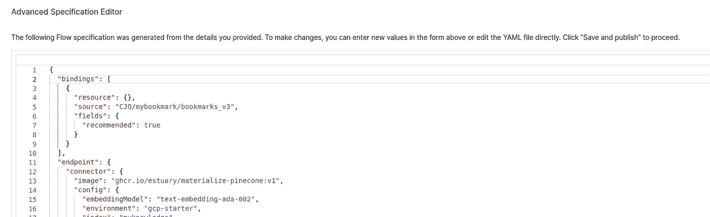

# 如何构建自己的书签搜索 AI 助手？

> 原文：[`towardsdatascience.com/how-to-build-your-own-ai-assistant-for-bookmark-searching-7e3dcc17e3fc?source=collection_archive---------11-----------------------#2024-04-09`](https://towardsdatascience.com/how-to-build-your-own-ai-assistant-for-bookmark-searching-7e3dcc17e3fc?source=collection_archive---------11-----------------------#2024-04-09)

## 自动化基于 GPT 的书签搜索管道逐步指南

[](https://medium.com/@swsychen?source=post_page---byline--7e3dcc17e3fc--------------------------------)[](https://towardsdatascience.com/?source=post_page---byline--7e3dcc17e3fc--------------------------------) [Jiaqi Chen](https://medium.com/@swsychen?source=post_page---byline--7e3dcc17e3fc--------------------------------)

·发表于 [Towards Data Science](https://towardsdatascience.com/?source=post_page---byline--7e3dcc17e3fc--------------------------------) ·阅读时长 9 分钟·2024 年 4 月 9 日

--


图像来自作者。

你是否曾在 Chrome 浏览器中搜索特定书签时，发现自己被数量庞大的书签淹没？在面对庞大的书签收藏时，逐一筛选变得相当繁琐且消耗精力。


书签海洋 — 来自作者 Google Chrome 书签的快照。

事实上，我们可以简单地把这件事交给 ChatGPT，它是目前最流行的 AI 模型，几乎能回答我们所问的一切。试想一下，如果它能够访问我们拥有的书签，那么问题就解决了！我们可以要求它从整个书签存储中提供我们想要的特定链接，就像下面的 GIF 一样：


展示 AI 助手的使用 — 来自屏幕录制的 GIF。

为了实现这一目标，我建立了一个实时管道，将 Chrome 书签更新到一个向量数据库中，ChatGPT 将使用这个数据库作为我们提问时的上下文。本文将逐步解释如何构建这样的管道，最终你也将拥有自己的管道！

# 特性

在开始之前，让我们先总结一下它的优势：

1.  与传统的搜索引擎（如 Chrome 书签管理器中的搜索）不同，AI 模型可以很好地理解每个标题的语义。如果你在搜索书签时忘记了确切的关键词，你只需提供一个大致的框架，ChatGPT 就能找到它！它甚至可以理解不同语言的标题，真是令人惊叹。


ChatGPT 能做什么 — 来自 AI 助手界面的快照。


当 Chrome 书签搜索引擎失败时。 — 来自作者的 Google Chrome 书签管理器截图

2\. 一切都自动保持最新。每个新添加的书签将在几分钟内自动反映在 AI 知识数据库中。

# 管道概览


管道中的所有组件。 — 图片由作者提供。

在这里，您可以看到我们管道中每个组件的作用。Chrome 书签通过我们定制的 Chrome 插件提取到 Google 表格的行中。Estuary Flow 获取（或捕获）所有的表格数据，然后通过 OpenAI API 使用嵌入模型将其向量化（或物化）。所有嵌入（每个向量对应表格中的一行——即每个单独的书签）将被检索并存储在 Pinecone 向量数据库中。之后，用户可以使用 Streamlit 和 LangChain 向构建的应用程序发出提示（例如：“dinov2 的链接是什么？”）。它将首先从 Pinecone 中检索一些相似的嵌入（获取上下文/几个潜在的书签选项），并将它们与用户的问题一起作为输入提供给 ChatGPT。然后 ChatGPT 将考虑每个可能的书签，并给出最终的答案。这一过程也被称为 RAG：检索增强生成。

在接下来的部分中，我们将逐步展示如何构建这样的管道。

# 用于书签检索的 Chrome 插件

代码：[`github.com/swsychen/Boomark2Sheet_Chromeplugin`](https://github.com/swsychen/Boomark2Sheet_Chromeplugin)

为了将书签传输到 Google 表格中以供进一步处理，我们首先需要构建一个定制的 Chrome 插件（或扩展）。


Chrome 插件的代码结构概览。 — 来自作者的 vscode 截图。

Chrome 扩展的最重要文件是*manifest.json*，它定义了插件的高级结构和行为。在这里，我们添加了必要的*权限*来使用 Google Chrome 的书签 API，并跟踪书签的变化。我们还设置了一个*oauth2* 认证字段，因为我们将使用 Google 表格 API。您需要在此字段中填写自己的*client_id*。您可以主要参考此[链接](https://developers.google.com/sheets/api/quickstart/js)中的**设置您的环境**部分来获取*client_id*和 Google 表格 API 密钥（稍后我们会使用它）。有一点需要注意的是：

1.  在**OAuth 同意屏幕**中，您需要将自己（Gmail 地址）添加为测试用户。否则，您将无法使用这些 API。

1.  在**创建 OAuth 客户端 ID**时，您应该选择的应用类型是*Chrome 扩展*（而不是快速入门链接中的 Web 应用）。需要指定的*项目 ID*是插件 ID（我们在加载插件时会获得它，您可以在扩展管理器中找到它）。


模糊的部分是项目 ID。— 来自作者的 Google Chrome 扩展管理器截图。

核心功能文件是 *background.js*，它可以在后台执行所有的同步操作。我已经为您准备了 GitHub 链接中的代码，您需要做的唯一修改是在 JavaScript 文件的开头更改 *spreadsheetId*。这个 ID 您可以通过创建的 Google 表格的分享链接来识别（位于 d/ 和 /edit 之间，是的，您需要先手动创建一个 Google 表格！）：

[`docs.google.com/spreadsheets/d/{**spreadsheetId}**/edit#gid=`](https://docs.google.com/spreadsheets/d/spreadsheetId/edit#gid=)0

代码的主要逻辑是监听书签中的任何更改，并在插件触发时（例如，当您添加新的书签时），刷新（清除 + 写入）您的 Google 表格，更新所有书签。它将每个书签的 ID、标题和 URL 写入您指定的 Google 表格中的单独一行。


这就是在您的 Google 表格中的样子。— 来自作者的 Google 表格截图。

最后的文件 *popup.html* 基本上并不太有用，因为它只是定义了在您点击浏览器插件按钮时，弹出窗口显示的内容。

在确保所有文件都在同一个文件夹后，现在您可以准备上传您的插件：

1.  打开 Chrome 浏览器，进入 **Extensions>Manage Extensions**，并在页面右上角启用 **Developer mode**。

1.  点击 **Load unpacked** 并选择代码文件夹。然后您的插件将上传并开始运行。点击超链接 *service worker* 来查看代码打印的日志信息。

上传后，只要 Chrome 浏览器处于打开状态，插件就会保持运行。而且当您重新打开浏览器时，它也会自动启动。

# 设置 Estuary Flow 和 Pinecone

Estuary Flow 本质上是一个连接器，用于将数据库与您提供的数据源进行同步。在我们的案例中，当 Estuary Flow 将数据从 Google 表格同步到向量数据库 Pinecone 时，它还会调用嵌入模型，将数据转换为嵌入向量，然后将其存储在 Pinecone 数据库中。

关于 Estuary Flow 和 Pinecone 的设置，YouTube 上已经有一个相当全面的视频教程：[`youtu.be/qyUmVW88L_A?si=xZ-atgJortObxDi-`](https://youtu.be/qyUmVW88L_A?si=xZ-atgJortObxDi-)

但请注意！由于 Estuary Flow 和 Pinecone 正在快速开发中，视频中的一些内容已经发生了变化，这可能会导致一些困惑。在这里，我列出了一些视频更新，以便您可以轻松地复制所有操作：

1. **(Estuary Flow>create Capture)** 在行批量大小中，您可以根据 Google 表格中书签的总行数设置较大的数字。（例如，如果您已经有 400 多行书签，可以设置为 600）

2\. **(Estuary Flow>创建捕获)** 设置**目标集合**时，删除光标字段“row_id”，并像以下截图一样添加一个新的“ID”。你可以将命名空间保持为空。


更改光标字段。— 来自[Sources](https://dashboard.estuary.dev/captures)的快照，拍摄于 Estuary Flow（2024 年 4 月）

3\. **(Estuary Flow>创建捕获)** 然后切换到**COLLECTION**子标签，点击**编辑**将 Key 从/row_id 更改为/ID。同时，你还应该像下面这样将架构代码中的“required”字段更改为“ID”：


更改密钥和架构。— 来自[Sources](https://dashboard.estuary.dev/captures)的快照，拍摄于 Estuary Flow（2024 年 4 月）

```py
 //...skipped
    "URL": {
      "type": "string"
    },
    "row_id": {
      "type": "integer"
    }
  },
  "required": [
    "ID"
  ],
  "type": "object"
}
```

在“保存并发布”后，你可以看到**Collections>{你的集合名称}>概览>数据预览**会显示每个书签的正确 ID。

4\. **(Estuary Flow>创建捕获)** 在最后一步，你可以看到一个**高级规格编辑器**（在页面底部）。在这里，你可以添加一个字段“interval”：10m，将刷新频率降至每 10 分钟一次（如果未指定，默认设置为每 5 分钟一次）。每次刷新都会调用 OpenAI 嵌入模型重新做所有嵌入，这会产生一些费用。降低刷新频率可以节省一半的费用。你可以忽略“backfill”字段。


指定间隔。— 来自[Sources](https://dashboard.estuary.dev/captures)的快照，拍摄于 Estuary Flow（2024 年 4 月）

```py
 //...skipped
        "syncMode": "full_refresh"
      },
      "target": "CJQ/mybookmark/bookmarks_v3"
    }
  ],
  "interval": "10m"
}
```

5\. **(Estuary Flow>创建物化)** 对于免费的 Pinecone 索引，Pinecone 环境通常是“gcp-starter”，或者对于标准计划用户是“us-east-1-aws”（我不使用 Pinecone 的无服务器模式，因为 Estuary Flow 尚未为 Pinecone 无服务器模式提供连接器）。Pinecone 索引是你在 Pinecone 中创建索引时指定的索引名称。

6\. **(Estuary Flow>创建物化)** 这里有一些难点。

+   首先，你应该使用蓝色按钮“从捕获中选择源”来选择源捕获，然后在“配置”中将 Pinecone 命名空间保持**为空**（Pinecone 的免费层必须使用空命名空间）。

+   第二步，在点击“下一步”后，在弹出的**高级规格编辑器**中，必须确保“bindings”字段不是空的。如果为空或该字段不存在，请根据以下截图填写内容，否则将无法发送任何数据到 Pinecone。此外，还需要使用你自己的集合路径更改“source”字段（与前面截图中的“target”相同）。如果点击“下一步”后出现错误，在看到编辑器之前，请再次点击“下一步”，你将看到**高级规格编辑器**。然后你可以指定“bindings”并点击“保存并发布”。这一步完成后，一切应该没问题。错误出现的原因是我们之前没有指定“bindings”。

+   如果在你发布一切并返回到 Destination 页面后，出现另一个错误信息，告诉你没有添加集合，只要你看到 OVERVIEW 的直方图中使用量不为零，就可以忽略它（见下图）。这个直方图基本上表示它向 Pinecone 发送了多少数据。



确保“bindings”字段像这样填写。— 来自[Destinations](https://dashboard.estuary.dev/materializations)的快照，来自 Estuary Flow（2024 年 4 月）

```py
"bindings": [
    {
      "resource": {},
      "source": "CJQ/mybookmark/bookmarks_v3",
      "fields": {
        "recommended": true
      }
    }
  ],
```


不要因错误而慌张，再次点击“下一步”。— 来自[Destinations](https://dashboard.estuary.dev/materializations)的快照，来自 Estuary Flow（2024 年 4 月）


确保 OVERVIEW 中的使用量不是空的。— 来自[Destinations](https://dashboard.estuary.dev/materializations)的快照，来自 Estuary Flow（2024 年 4 月）

7\. **(Pinecone>创建索引)** Pinecone 已推出无服务器索引模式（免费，但 Estuary Flow 目前尚不支持），但我在这个项目中没有使用它。这里我们仍然使用基于 pod 的选项（自 2024 年 4 月 14 日以来不再免费），但它足以满足我们书签嵌入存储的需求。创建索引时，你只需要设置索引名称和维度。

8\. (**Pinecone>索引>{你的索引}**) 完成 Pinecone 索引的创建后，并确保 Estuary Flow 中的物化（materialization）中正确填写了索引名称和环境，你就完成了。在 Pinecone 控制台中，转到 **索引>{你的索引}**，你应该能看到显示你书签总数的向量数量。可能需要几分钟，直到 Pinecone 从 Estuary Flow 接收信息并显示正确的向量数量。


这里我有 402 个书签，因此向量数量显示为 402。— 来自[Pinecone](https://app.pinecone.io/organizations)的快照（2024 年 4 月）

# 使用 Streamlit 和 Langchain 构建你自己的应用

代码：[`github.com/swsychen/BookmarkAI_App`](https://github.com/swsychen/BookmarkAI_App)

我们快到了！最后一步是构建一个漂亮的界面，就像原版的 ChatGPT 一样。在这里，我们使用了一个非常方便的框架，叫做 Streamlit，利用它我们可以用几行代码就构建一个应用。Langchain 也是一个非常易于使用的框架，可以用最少的代码来操作任何大型语言模型。

我也为这个应用准备了代码。请按照 GitHub 链接中的安装和使用指南进行操作，享受吧！

代码的主要逻辑是：

获取用户提示 → 创建一个包含 ChatGPT 和 Pinecone 的检索链 → 将提示输入到链中并获取响应 → 将结果流式传输到 UI


代码的核心部分。— 来自作者的 vscode 快照。

请注意，由于 Langchain 仍在开发中，如果您使用的版本与 requirements.txt 中指定的版本不同，代码可能会被弃用。如果您想深入了解 Langchain 并使用其他 LLM 进行书签搜索，可以随时查看 Langchain 的[官方文档](https://python.langchain.com/docs/get_started/introduction/)。

# 结语

这是我写的第一篇教程文章。如果有任何不清楚的地方需要改进或澄清，欢迎留言。
