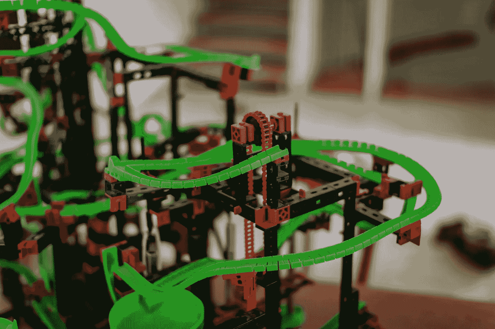

# 如何为成功的数据科学职业生涯构建自己的路线图

> 原文：[`towardsdatascience.com/how-to-build-your-own-roadmap-for-a-successful-data-science-career-c0369ee58eda?source=collection_archive---------2-----------------------#2024-09-19`](https://towardsdatascience.com/how-to-build-your-own-roadmap-for-a-successful-data-science-career-c0369ee58eda?source=collection_archive---------2-----------------------#2024-09-19)

 [TDS 编辑](https://towardsdatascience.medium.com/?source=post_page---byline--c0369ee58eda--------------------------------)

·发表于 [Towards Data Science](https://towardsdatascience.com/?source=post_page---byline--c0369ee58eda--------------------------------) ·发送为 电子通讯 ·4 分钟阅读·2024 年 9 月 19 日

--

> 是否有了写下你第一篇 TDS 文章的灵感？[我们始终欢迎新作者的投稿](http://bit.ly/write-for-tds)。

在过去几年中，获得你的第一个数据科学或机器学习工作的过程和要求发生了显著变化。你在现有职位上取得卓越表现的定义也发生了变化。我们可以将此归因于许多因素：大语言模型（LLMs）和人工智能工具的崛起、不利的经济状况（以及随之而来的裁员和招聘冻结）以及远程工作环境的变化等都浮现在脑海中。

过渡期和不确定性时期可能很难应对，尤其是当你进入这个领域时，曾期待在这个蓬勃发展的、高回报的行业中顺利前行。然而，没有理由绝望：个体的数据专业人员可能无法单独扭转局面，但他们*可以*采取行动，变得更加职业韧性强，并为自己的职业轨迹提供抗冲击能力。

本周我们为你精选的文章集中在你应当发展的核心技能，以便在面对不可预测的趋势时能变得更加免疫——并列出了你可以采取的具体步骤来培养这些技能。从为近期毕业生提供的如何抓住第一份实习的建议，到如何有效管理数据团队的见解，它们面向各类从业者，无论是职位新手还是资深专家。让我们深入了解一下。

+   **我将在 2024 年如何学习成为一名数据分析师** “每天，我都会在 LinkedIn 收件箱里收到数十条来自候选人的信息，尽管他们已经获得了必要的分析技能，但还是难以找到工作。”[Natassha Selvaraj](https://medium.com/u/6a2ef1b1f09d?source=post_page---user_mention--c0369ee58eda--------------------------------)回顾了自 2020 年开始作为数据分析师以来，她在招聘过程中所见到的变化，并分享了对于希望更新方法、在当前环境中脱颖而出并取得成功的求职者的一些有用建议。

+   **通向成功的路径：如何获得机器学习和数据科学实习机会** 迈出职业生涯的第一步往往是最艰难的——在竞争激烈的就业市场中更是如此。[Sara Nóbrega](https://medium.com/u/7606b796c9df?source=post_page---user_mention--c0369ee58eda--------------------------------)刚刚完成了两次实习，拥有最新的第一手经验，分享了她如何克服这一初期障碍，并通过一份结构清晰、内容全面的指南为求职者提供了宝贵的经验。

+   **作为数据科学家个体贡献者如何请求反馈** 即使你已经有了几年职业经验，依然总有成长的机会——以及与公司上下层同事培养更强沟通习惯的机会。[Jose Parreño](https://medium.com/u/8572724a5d2c?source=post_page---user_mention--c0369ee58eda--------------------------------)为那些希望获得建设性、宝贵且具体反馈的个体贡献者提供了详细的建议，并包含了数十个可以根据自身需求调整的示例问题。

+   **领导数据科学团队走向成功** 变动的截止日期、多学科的队友、技术复杂性……领导一个数据科学项目需要跟踪众多动态的部分，但正如[Hans Christian Ekne](https://medium.com/u/ab0bff3c2cc9?source=post_page---user_mention--c0369ee58eda--------------------------------)所解释的那样，经理可以利用多种技巧来确保项目顺利进行：“应对这些问题的关键在于了解每个团队成员的能力、弱点和优势，做好规划，并专注于目标的实现。”

图片来自[Sandra Grünewald](https://unsplash.com/@elmuff?utm_source=medium&utm_medium=referral)在[Unsplash](https://unsplash.com/?utm_source=medium&utm_medium=referral)上的作品

准备探索一些其他话题吗？以下是过去几周中的几篇亮眼文章：

+   如果你曾经考虑过为开源项目做贡献，不要错过[Siavash Yasini](https://medium.com/u/17613cac9c65?source=post_page---user_mention--c0369ee58eda--------------------------------)对他最近经历的反思以及他在此过程中学到的实用经验。

+   在一篇详细且耐心解释的指南中，[Xichu Zhang](https://medium.com/u/4bc88b1b8f22?source=post_page---user_mention--c0369ee58eda--------------------------------)拆解了泰勒级数的内部机制和其基础数学原理。

+   [Ian Xiao](https://medium.com/u/a0eb4622a0ca?source=post_page---user_mention--c0369ee58eda--------------------------------)在数据科学与商业战略交汇处的写作中，他的最新文章探讨了一个棘手的问题：为什么如此多的客户个性化项目失败？

+   如果你想深入了解当前关于 AI 支持残障人士潜力的辩论（及研究）及其如何解决各种可访问性问题的内容，别错过[Stephanie Kirmer](https://medium.com/u/a8dc77209ef3?source=post_page---user_mention--c0369ee58eda--------------------------------)的概述，其中还讨论了数据隐私和文化抹除等领域的权衡。

+   跟进最新的时间序列预测进展 — [Marco Peixeiro](https://medium.com/u/741c1c8fcfbd?source=post_page---user_mention--c0369ee58eda--------------------------------)深入探讨了可逆 KAN 混合模型（RMoK）的细节，分析了其架构，并通过 Python 演示了它的强大功能。

+   要让 AI 代理“记住”需要什么？基于她自己的实验，[Sandi Besen](https://medium.com/u/23260bfdf2e?source=post_page---user_mention--c0369ee58eda--------------------------------)回报了关于代理在处理简单和复杂记忆任务中的潜力和局限性的研究，并概述了应对一些主要挑战的有效方法。

感谢您支持我们作者的工作！正如我们之前提到的，我们非常喜欢发表新作者的文章，因此，如果您最近写了一篇有趣的项目教程、教程或关于我们核心话题的理论反思，请毫不犹豫地[与我们分享](http://bit.ly/write-for-tds)。

直到下一期 Variable，

TDS 团队
