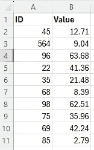
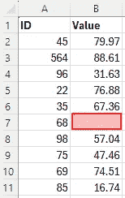
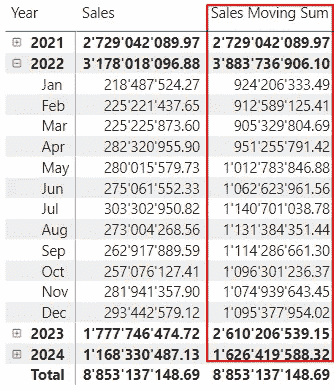
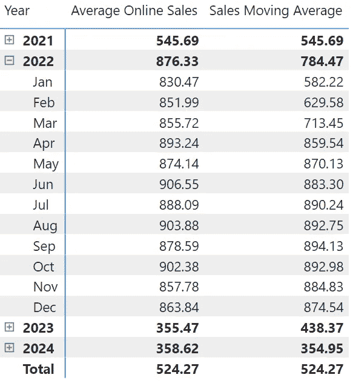
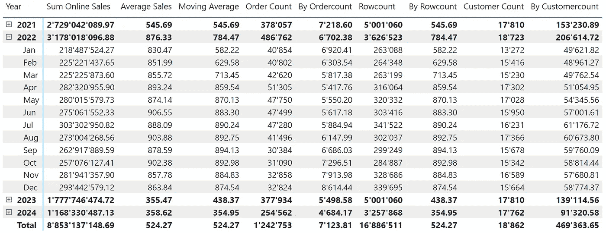
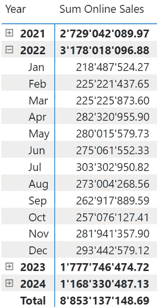
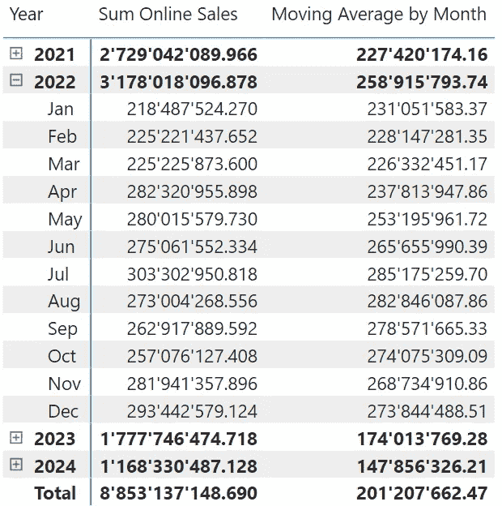

# 如何计算 DAX 中多个周期的移动平均

> 原文：[`towardsdatascience.com/how-to-calculate-a-moving-average-over-multiple-periods-in-dax-2a6a8105850a?source=collection_archive---------13-----------------------#2024-10-01`](https://towardsdatascience.com/how-to-calculate-a-moving-average-over-multiple-periods-in-dax-2a6a8105850a?source=collection_archive---------13-----------------------#2024-10-01)

## *在 DAX 中计算移动聚合是很简单的。然而，当计算跨时间的移动平均时，会有一些陷阱。由于其中一些陷阱涉及定义的问题，我们必须小心不要选择错误的方法。让我们来看看具体细节。*

[](https://medium.com/@salvatorecagliari?source=post_page---byline--2a6a8105850a--------------------------------)[](https://towardsdatascience.com/?source=post_page---byline--2a6a8105850a--------------------------------) [Salvatore Cagliari](https://medium.com/@salvatorecagliari?source=post_page---byline--2a6a8105850a--------------------------------)

·发表于 [Towards Data Science](https://towardsdatascience.com/?source=post_page---byline--2a6a8105850a--------------------------------) ·8 分钟阅读·2024 年 10 月 1 日

--


图片由 [Antoine Dautry](https://unsplash.com/@antoine1003?utm_source=medium&utm_medium=referral) 提供，来源 [Unsplash](https://unsplash.com/?utm_source=medium&utm_medium=referral)

# 首先，先来做一些数学计算。

计算平均数很简单：将值的总和除以实例的数量。

虽然值的总和很容易计算，但实例的数量并不像你想象的那样简单。

例如，让我们看一下以下的表格：



图 1 — 数字列表（图源：作者）

计算值列的平均数很简单：

<值的总和> / <行数> = 534.68 / 10 = 53.47

现在，让我们删除一个值，这会改变结果。



图 2 — 带有间隙的数字列表（图源：作者）

突然间，我有两种计算平均数的方法：

<值的总和> / <值的数量> = 547.23 / 9 = 60.8

或者

<值的总和> / <行数> = 547.23 / 10 = 54.72

第二种方法仅仅是不同的定义。

比如，假设第一列是客户 ID，我想计算所有客户的平均销售额或活跃客户的数量等情况，在这种情况下，第二种计算平均数的方法可能是更好的选择。

现在，让我们将其转换为 DAX。

# 移动聚合 — 起点

首先，让我们构建移动聚合的典型案例。

我想要获取过去四个月的移动销售数据。

目前，我使用 [SUM()](https://dax.guide/sum/) 的销售数据，因为比起计算平均值，验证四个月的结果要容易得多。

```py
Sales Moving Sum =
VAR MaxDate = MAX( 'Date'[Date] )

VAR MinDate =
    CALCULATE(
        MIN('Date'[Date])
        , DATEADD( 'Date'[Date], - 3, MONTH )
        )

VAR  DateRange =
 CALCULATETABLE(
    DATESBETWEEN( 'Date'[Date]
        ,MinDate
        ,MaxDate
    )
)

VAR Result = CALCULATE([Sum Online Sales]
                        ,DateRange
                    )

RETURN
    Result
```

首先，我获取当前筛选上下文（例如当前月份）的最后日期

第二，我使用 [DATEADD()](https://dax.guide/dateadd/) 来回退三个月。我只回退三个月，因为我包括了当前月。

如果我想排除当前月份，我必须以不同的方式操作。在这种情况下，我需要获取第一个日期，并回退一天来获取上个月的最后日期（或者使用 [EOMONTH(MAX(‘Date’[Date), -1) )](https://dax.guide/eomonth/)，然后使用 DATEADD() 回退四个月）。

第三，我使用 [DATESBETWEEN()](https://dax.guide/datesbetween/) 获取两个变量之间的日期列表。

最后，我将日期列表传递给 [CALCULATE()](https://dax.guide/calculate/) 来返回最终结果。

这是结果：



图 3 — 四个月移动总和的表格（图由作者提供）

我可以通过移除 DATESBETWEEN() 函数，并将两个变量直接传递给 CALCULATE() 来简化度量值：

```py
VAR MaxDate = MAX( 'Date'[Date] )

VAR MinDate =
    CALCULATE(
        MIN('Date'[Date])
        , DATEADD( 'Date'[Date], - 1, MONTH )
        )

VAR Result = CALCULATE([Sum Online Sales]
                        ,'Date'[Date] >= MinDate
                        && 'Date'[Date] <= MaxDate
                    )

RETURN
    Result
```

结果是相同的，但使用 DATESBETWEEN() 的性能略好（我的事实表中有 1700 万行数据）。

由于多种因素可能会影响性能，我建议你使用自己的数据和使用场景尝试这两种变体，并检查差异。

你可以在这里阅读更多关于在 Power BI 中衡量性能的内容：

[](/how-to-get-performance-data-from-power-bi-with-dax-studio-b7f11b9dd9f9?source=post_page-----2a6a8105850a--------------------------------) ## 如何通过 DAX Studio 从 Power BI 获取性能数据

### 有时我们会遇到报告加载缓慢的情况，我们需要找出原因。接下来我们将看到如何收集性能数据，以及……

[towardsdatascience.com

# 我们来做平均值

现在，最终，我将开始计算平均值。

我使用与我的 Sum Online Sales 度量值相同的逻辑，并使用 AVERAGEX() 来计算平均销售额：

```py
Average Online Sales = AVERAGEX('Online Sales'
    ,('Online Sales'[UnitPrice] * 'Online Sales'[SalesQuantity]) - 'Online Sales'[DiscountAmount]
)
```

接下来，我复制了上述度量值来计算销售移动平均值，结果如下：



图 4 — 基本平均值和移动平均值的结果（图由作者提供）

我可以在这里结束并写道，“任务完成。”但请停一下。

在开始时，我提到了计算平均值的不同方法。

所以，我开始编写度量值来进行测试。

我编写了以下度量值，作为分母，而使用了[Sum Online Sales]作为分子：

+   计算在线销售数量 = COUNTROWS(‘Online Sales’)

+   客户数量 = DISTINCTCOUNT(‘Online Sales’[CustomerKey])

+   在线订单数量 = DISTINCTCOUNT(‘Online Sales’[SalesOrderNumber])

结果变量的代码如下（以[在线销售计数]为例）：

```py
VAR Result = CALCULATE([Sum Online Sales] / [Count Online Sales]
                        ,DateRange
                    )
```

我可以想到更多的变体（例如，计算所有客户的平均值，包括那些在该期间没有订单的客户）。但我决定在此停止，以避免混淆。

毫不奇怪，每个都得出了不同的结果：



图 5 — 所有变体的平均值结果（图表由作者提供）

结果之间的差异非常明显。

你可能会遇到其他计算平均值的方法。

因此，我强烈建议你清楚地定义如何计算平均值。否则，你可能会向你的受众提供意外的甚至错误的结果。

# 按月销售额的平均值

计算平均值时还有一种变体：作为按月销售额的平均值。

让我们再看一下包含月度销售额的结果：



图 6 — 仅月度销售额（图表由作者提供）

我想计算四个月的月度销售平均值。

例如，在九月，我想计算六月、七月、八月和九月的月度销售平均值：

(275’061’552.33 + 303’302’950.82 + 273’004’268.56 + 262’971’889.59) / 4 = ~278’585’165.3

(~ 因为由于四舍五入差异，我们可能会得到稍有不同的结果)

为了满足这个需求，我必须思考如何做。

我需要提前计算每个月的销售额。然后仅考虑每行所需的四个月。最后，计算这四个值的平均值。

这意味着我必须首先生成一个包含所有月度结果的表格，并仅使用计算平均值所需的值，这样效率低下。然后 Power BI 会为表格中的每一行计算这个值，以可视化结果。

当我从每行的过滤器上下文的角度来看时，我可以做得更好。

为什么不只为每行在可视化中相关的那些月份计算销售总和呢？

基于这种方法，我编写了以下度量：

```py
Moving Average by Month = 
// 1\. Get the first and last Date for the current Filter Context
VAR MaxDate = MAX( 'Date'[Date] )

VAR MinDate =
    CALCULATE(
        MIN('Date'[Date])
        , DATEADD( 'Date'[Date], - 3, MONTH )
        )

// 2\. Generate the Date range needed for the Moving average (Four months)
VAR  DateRange =
 CALCULATETABLE(
    DATESBETWEEN( 'Date'[Date]
        ,MinDate
        ,MaxDate
    )
)

// 3\. Generate a table filtered by the Date Range generated at step 2
// This table contains only four rows
VAR SalesByMonth = 
    CALCULATETABLE(
        SUMMARIZECOLUMNS(
            'Date'[MonthKey]
            , "#Sales", [Sum Online Sales]

        )
        ,DateRange
    )

RETURN
    // 4\. Calculate the Average over the four values in the table generated in Step 3
    AVERAGEX(SalesByMonth, [#Sales])
```

这次，我添加了内联注释来解释那里的情况。

结果如下：



图 7 — 按月平均值的结果（图表由作者提供）

我在 Excel 中检查了结果，它们是正确的。

如果你正在考虑为每个月创建一个预计算表格，再考虑一下吧。

你将被迫向所有维度添加引用，并增加数据的粒度，直到你不得不编写这个度量来满足受众按所有维度筛选数据的需求。

这个解决方案非常高效，因为计算结果花费的时间不到 0.4 秒。

即使扩展所有月份，计算结果也不需要更多的时间。

顺便提一下，这种方法在计算平均值的平均数时也很适用。

# 结论

平均值不等于平均值。我想这点很清楚。

但更重要的是，必须理解应该计算什么，以及如何计算。

理解为什么需要计算一个数字，有助于你选择正确的计算逻辑。

当逻辑清晰时，编写 DAX 代码的方法应当被确定。记住，从筛选上下文的角度来做。有时这可能不直观，但它将有助于开发高效的代码。

希望你今天学到了新东西。

下次见。


图片由[Tim Mossholder](https://unsplash.com/@timmossholder?utm_source=medium&utm_medium=referral)拍摄，来自[Unsplash](https://unsplash.com/?utm_source=medium&utm_medium=referral)

# 参考文献

像我之前的文章一样，我使用的是 Contoso 示例数据集。你可以从微软[这里](https://www.microsoft.com/en-us/download/details.aspx?id=18279)免费下载 ContosoRetailDW 数据集。

如[这里](https://github.com/microsoft/Power-BI-Embedded-Contoso-Sales-Demo)所述，Contoso 数据可以在 MIT 许可下自由使用。

我更改了数据集，将数据移动到当代日期。

[](https://medium.com/@salvatorecagliari/subscribe?source=post_page-----2a6a8105850a--------------------------------) [## 当 Salvatore Cagliari 发布新文章时，获取电子邮件通知。

### 当 Salvatore Cagliari 发布新文章时，你会收到电子邮件通知。通过注册，你将创建一个 Medium 账户，如果你还没有的话……

medium.com](https://medium.com/@salvatorecagliari/subscribe?source=post_page-----2a6a8105850a--------------------------------)

尽管 Medium 设置了付费墙，我仍让我的文章对所有人可读。这让我能从每个读者那里赚取一些费用，但我关闭了它，所以你可以免费阅读我的文章。

我在晚上和周末写这些文章，这是一项繁重的工作。

你可以通过以下方式支持我的工作：

[`buymeacoffee.com/salvatorecagliari`](https://buymeacoffee.com/salvatorecagliari)

或扫描此二维码：


任何支持都将不胜感激，并帮助我找到更多时间为你创作更多内容。

非常感谢。
