# 如何挑战自己的分析，避免他人挑战

> 原文：[`towardsdatascience.com/how-to-challenge-your-own-analysis-so-others-wont-b3745919d098?source=collection_archive---------2-----------------------#2024-07-03`](https://towardsdatascience.com/how-to-challenge-your-own-analysis-so-others-wont-b3745919d098?source=collection_archive---------2-----------------------#2024-07-03)

## 掌握合理性检查的艺术，提升你的工作质量

 [Torsten Walbaum](https://medium.com/@twalbaum?source=post_page---byline--b3745919d098--------------------------------)

·发表于 [Towards Data Science](https://towardsdatascience.com/?source=post_page---byline--b3745919d098--------------------------------) ·12 分钟阅读·2024 年 7 月 3 日

--

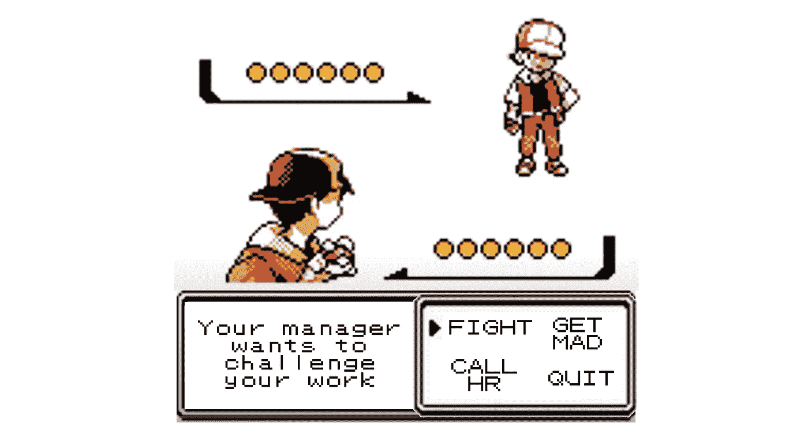

作者提供的图片

你是否曾经做过一个分析，然后被经理一顿批评？或者在演讲中被问到一个问题，让你觉得“为什么我之前没有检查这个？”

有时候，你会觉得经理和高管们有一种神奇的能力，能够迅速找出你工作中的***一个***薄弱环节。他们是如何如此迅速地发现问题的，尤其是当他们是第一次看到你的工作时？

> ***看似像超能力的东西其实是任何人都能学会的，这篇文章将告诉你如何做到***。

通过定期对你的工作进行“合理性检查”，你可以主动识别出薄弱环节，并在与更广泛的受众分享之前确保结果是合乎逻辑的。

**我将要讲解：**

+   什么是合理性检查，它为什么重要

+   合理性检查与大多数人检查工作的方式有何不同

+   如何进行合理性检查

+   如何使用合理性检查来提升你的可信度

+   如何利用人工智能来为你的工作进行合理性检查

我们有很多内容要覆盖，所以让我们开始吧。

# 什么是合理性检查，为什么它很重要？

想象一下你正在从零开始构建一个详细的模型，仔细选择每一个假设并将它们结合起来，最终得出你的输出（例如：预测、公司估值等）。

每个假设看起来都合情合理，你检查了两次数学运算，所以输出应该是可靠的。对吧？对吧？？

在过去十年的经验中，我发现我们在构建模型或进行分析时，常常会忽略整体，只关注局部。我们将太多的假设叠加在一起，以至于最终的结果会迅速从合理变得荒谬。

这就是健全性检查的作用：***健全性检查帮助我们判断我们分析结果的正确性。***

我们都会犯错，偶尔会有。没关系；现实并不总是按照我们预期的方式发展。但你应该尽量做到*大多数时候都正确*。

让我们深入了解如何做到这一点。

 [## 每当 Torsten Walbaum 发布文章时，获取一封电子邮件。

### 每当 Torsten Walbaum 发布文章时，获取一封电子邮件。通过注册，如果你还没有 Medium 账户，你将创建一个…

[medium.com](https://medium.com/@twalbaum/subscribe?source=post_page-----b3745919d098--------------------------------)

# 健全性检查与其他方法有什么不同？

在检查我们的工作时，大多数时候我们是逐步检查的，看看是否有错误。单元格是否正确链接？我是否把公式拉到底部？我的 SQL 中的所有连接是否正确？

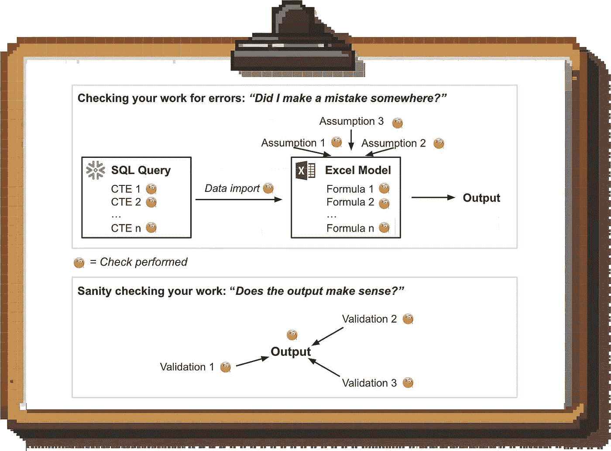

作者提供的图片

这种机械的“质量控制”方法可以帮助我们发现问题，但它并不能确保输出结果符合直观的商业逻辑。

而“健全性检查”则是***从另一个角度回顾并验证输出结果***。如果你通过两种方式得出相同的结论，你可以对自己的工作更有信心。

# 如何进行健全性检查

健全性检查有三大类：自下而上与自上而下、基准测试和直觉。我将详细介绍每一类，并展示如何在工作中应用它们。

## 自下而上与自上而下

我们的分析通常是自上而下***或者***自下而上。那么这是什么意思呢？

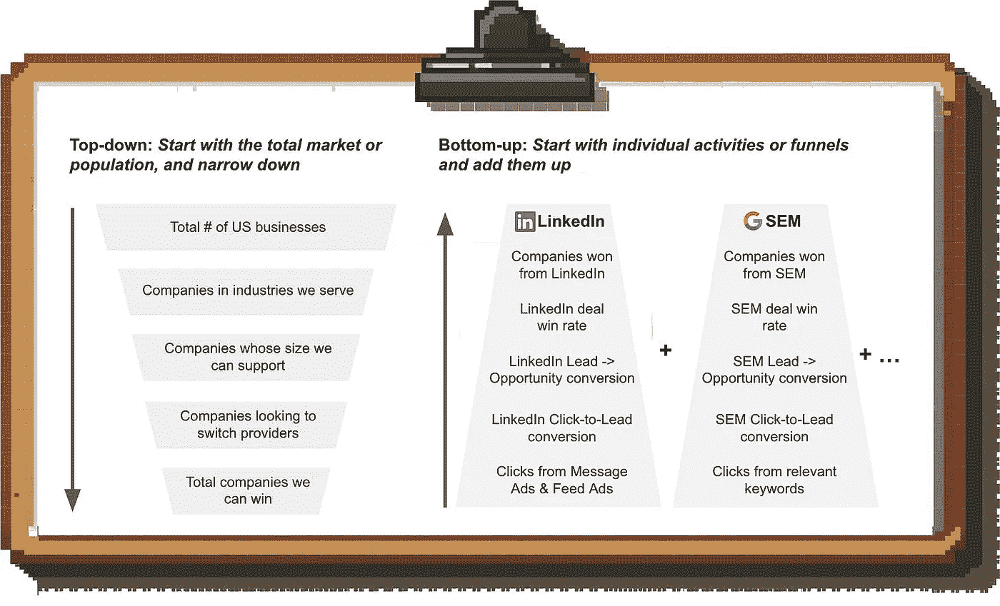

作者提供的图片

**让我们看一个（简化的）例子**。假设你在一家 B2B SaaS 公司工作，想要了解你能够为即将推出的新产品吸引多少客户。

+   在***自上而下***的方法中，我们试图了解我们能赢得多少市场份额。因此，我们会从查看美国总企业数量开始，排除我们不针对的行业和我们无法支持的公司规模，假设有多少比例的公司正在寻求更换软件供应商，最后假设我们能够赢得这些公司中多少比例（与我们的竞争对手相比）。

+   在***自下而上***的方法中，我们试图根据我们可用的渠道了解能吸引多少公司。因此，我们会查看以往的发布，看看从 LinkedIn 获得多少潜在客户，分析关键词来确定预期的 SEM 量，基于我们可以瞄准的公司数量和预期的转化率等来预测电子邮件潜在客户数量。

这两种方法都能为我们提供一个大致的方向感，**但它们各自都有一个致命的弱点。**

自上而下的方法并未考虑*我们将如何获取这些客户*，而自下而上的方法忽略了目标市场的规模。

> ***因此，确保你的工作合理性检查的最佳方式是结合自上而下与自下而上的分析。***

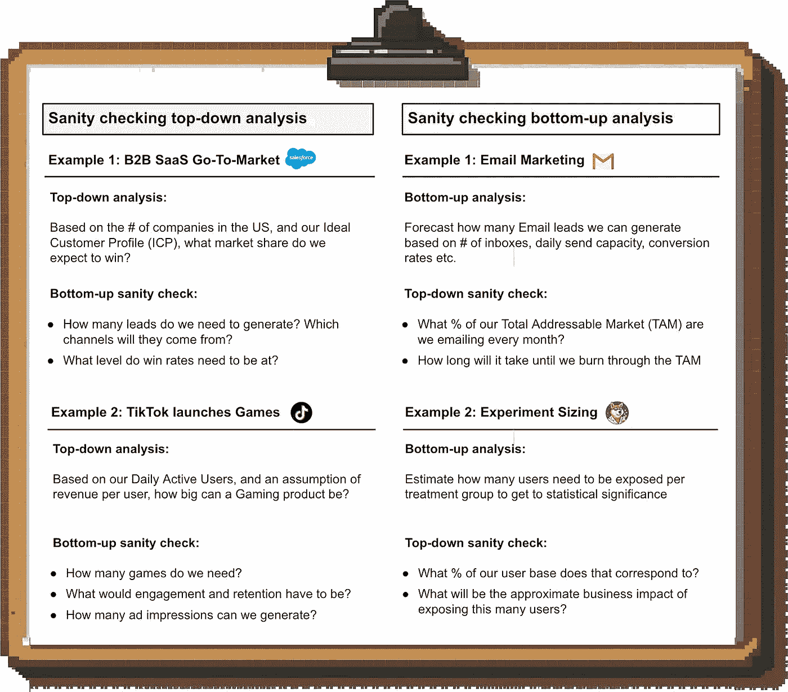

作者提供的图片

## 基准对比

确保一个计划或预测合理的最佳方式是将其与基准进行对比。例如，如果你正在预测一个新市场的表现，比较其与类似国家的过去发布会有所帮助。

> ***如果你的分析大幅偏离基准，你需要能够解释为什么。***

你应该检查任何模型、预测或预测中的几个常见事项：

+   **规模：** 最终结果与基准如何对比？例如，你是否预测法国会成为公司比英国更大的市场？

+   **增长假设：** 你预测的趋势是什么？例如，新的产品预计相比过去的发布会增长得更快吗？

+   **季节性：** 你的预测是否显示出与基准相同的重复模式？例如，如果其他市场在 12 月假期期间出现放缓，你为什么预测新国家不会有这个趋势？

这并不意味着你总是必须按照基准来建模；**但你总是需要能够解释为什么会有所偏离。**

## 基准对比示例 1：新市场发布

**场景：** 你计划进入英国市场，并预测用户增长

**✅ 合理性检查：** 你将预测与最近的两次发布（德国和法国）进行比较。你的预测比最近两次发布更加激进，并且没有显示任何季节性波动。

**❓ 你需要能够回答的问题：**

+   什么让你有信心认为这是可能的？英国市场是否在结构上有所不同（例如，市场更大）？我们的产品是否更适合英国市场？我们是否采用了不同的市场进入策略？

+   为什么法国没有季节性波动？假期期间是否有所不同？B2B 买家的季节性购买模式是否不同？

👉 如果你无法充分说明新市场与过去发布的差异，最好将预测保持一致。

## 基准对比示例 2：营销计划

**场景：** 你正在预测按渠道划分的营销支出和表现指标。计划是将营销预算按年翻倍。

**✅ 合理性检查：** 你将预测的营销效率与过去的趋势进行比较。你的预测显示，随着我们增加营销投入，效率（每条潜在客户成本）会提高，但过去的数据却显示出相反的趋势。

**❓ 你需要能够回答的问题：**

+   为什么你期望效率更好？

+   我们在每个营销渠道中部署了哪些具体改进将推动这一变化？

+   我们是否做了任何能够改善整体营销表现的事情，例如投资品牌建设？

👉 如果你没有明确的计划来提高营销效率，你应该假设历史上支出与效率之间的关系依然有效。

## 与直觉对比

很多时候，你可以用常识来进行理智检查。你的直觉并不总是正确的，但它通常能揭示需要进一步验证的潜在问题。

**以下是一些例子：**

+   你建立了一个贴现现金流（DCF）财务模型，而终端增长率远高于国内生产总值（GDP）；这意味着你***隐含假设公司将永远超越更广泛的经济***。这合理吗？

+   你正在建立一个账户评分模型，而该模型将销售认为是浪费时间的公司评为“适合”。这并不意味着销售是对的（毕竟，你建立模型是为了发现新的见解），但你应该考虑他们的经验，因为***违背直觉的结果往往揭示了模型的弱点***

# 使用理智检查来提高你的可信度

理智检查不仅是为了防止别人挑毛病。它们还是一个可以提升你可信度的工具。

不要仅仅在幕后完成这些工作，然后再分享改进后的成果，而是将理智检查的过程一并分享。通过展示你如何验证分析结果，你将赢得听众的信任。***如果你不分享你做的理智检查，听众就不得不假设他们需要当场检查你的工作。***

你可以在幻灯片上通过展示上下游方法如何得出相同结果，或者将你的数据与基准进行对比，来直观地完成这一过程。

但你也可以通过口头方式进行：

> *✅ “我们计划到十月在英国增加到 50 个邮件潜在客户；这个目标基于与加拿大相似的转化假设，并对应于我们总可寻址市场中 3% 的每月渗透率。*

# 如何使用 AI 来进行理智检查

理智检查可能非常耗时；毕竟，你需要从多个角度来解决同一个问题。幸运的是，AI 工具可以为你节省大量时间。

***这不是替代你理智检查技能的工具***；ChatGPT 需要你的指导才能做好工作，因此你仍然需要知道如何进行有力的理智检查。AI 的任务只是为你完成繁重的工作，并提出一些你可能遗漏的点。

这里有一个逐步指南，讲解如何使用 ChatGPT 完成这个过程；所有截图来自我与 ChatGPT 的实际对话，我在对话中要求 ChatGPT 对我的新市场发布预测进行理智检查。

***免责声明：在上传任何专有数据之前，请始终检查你雇主关于使用像 ChatGPT 这样的 AI 工具的政策。***

## 第 1 步：将你的工作上传到 ChatGPT

第一步是上传你希望 ChatGPT 进行理智检查的工作。ChatGPT 可以处理多种文件类型，包括 PDF、Excel、CSV 文件等。

你还可以直接与多个工具集成；例如，在这个例子中，我链接了包含我的预测的 Google 表格：

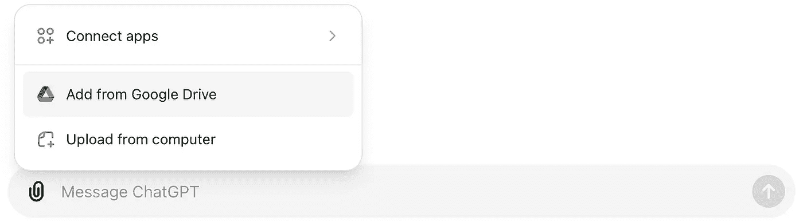

作者提供的图片

即使你的实际模型不在电子表格中（例如在 Python 中），我也建议将输出导入 Google Sheets 进行合理性检查；毕竟，你想要的是 ChatGPT 验证你的输出，而不是验证你模型的机制。

对于这个示例，我给了 ChatGPT 一个简单的[市场推广预测](https://docs.google.com/spreadsheets/d/1cQqYd19eCaYld_q1YwIwTJ--tWgb0ROtMfRbRFcO2U8/edit?usp=sharing)，用于新国家的市场推广启动（你可以复制该文件并进行自己的合理性检查）。

我经历了四次合理性检查；以下是日志：

1.  [第一次尝试](https://chatgpt.com/share/2f30933c-2621-4e48-81ef-88c5243c3864)（评分：实习生）

1.  [第二次尝试](https://chatgpt.com/share/77bd39b9-507d-4b18-9d6d-bd2a888ac616)（评分：实习生）

1.  [第三次尝试](https://chatgpt.com/share/61da15ca-ec6b-47cb-94d1-d2ed79cb8554)（评分：初级分析师）

1.  [第四次尝试](https://chatgpt.com/share/5927f094-d54a-4ec2-a11d-be56682dc29a)（评分：过于自信的初级分析师）

+   第一次尝试和第二次尝试还可以，但我觉得我需要提供很多指导，并且并不总是能得到我想要的结果。

+   第三次尝试相当不错，但 ChatGPT 和我都忘记了深入研究市场渠道组合（几天后我想起来时，ChatGPT 无法从我们停下的地方继续）。

+   第四次尝试很有前景，但在重新预测以包含季节性时，最初调整了错误的月份。

你可能需要尝试几次，直到得到一个非常好的表现。记住：

> *不要盲目使用 AI 生成的任何内容；它可能（并且确实会）犯错误，最终结果由你负责。AI 可以提供有用的输入并节省时间，但它不能替代批判性思维。*

## 第 2 步：写一个提示，要求 ChatGPT 进行合理性检查。

在读取你的文件后，你需要写一个提示，要求 ChatGPT 对你的工作进行合理性检查。

这是我用来合理性检查我上面链接的市场推广计划的内容：

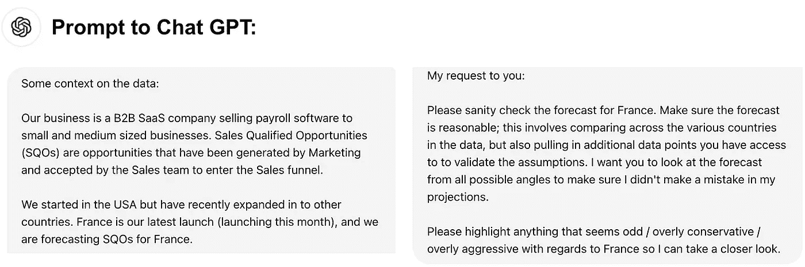

作者提供的图片

我发现，提供一些数据集的背景信息是有帮助的（尽管不是绝对必要的）。另外，别忘了说“请”和“谢谢”，以防 AI 变得有意识；这样可以避免你进入“坏孩子”名单。

你也可以给 ChatGPT 这篇文章，或者另一篇关于如何进行合理性检查的总结，这样就不需要在提示中包含太多的说明。

## 第 3 步：确保 ChatGPT 正确读取了数据。

在读取文件后，ChatGPT 通常会简要总结它所看到的内容以及它认为数据所代表的含义，并列出它进行分析的步骤：

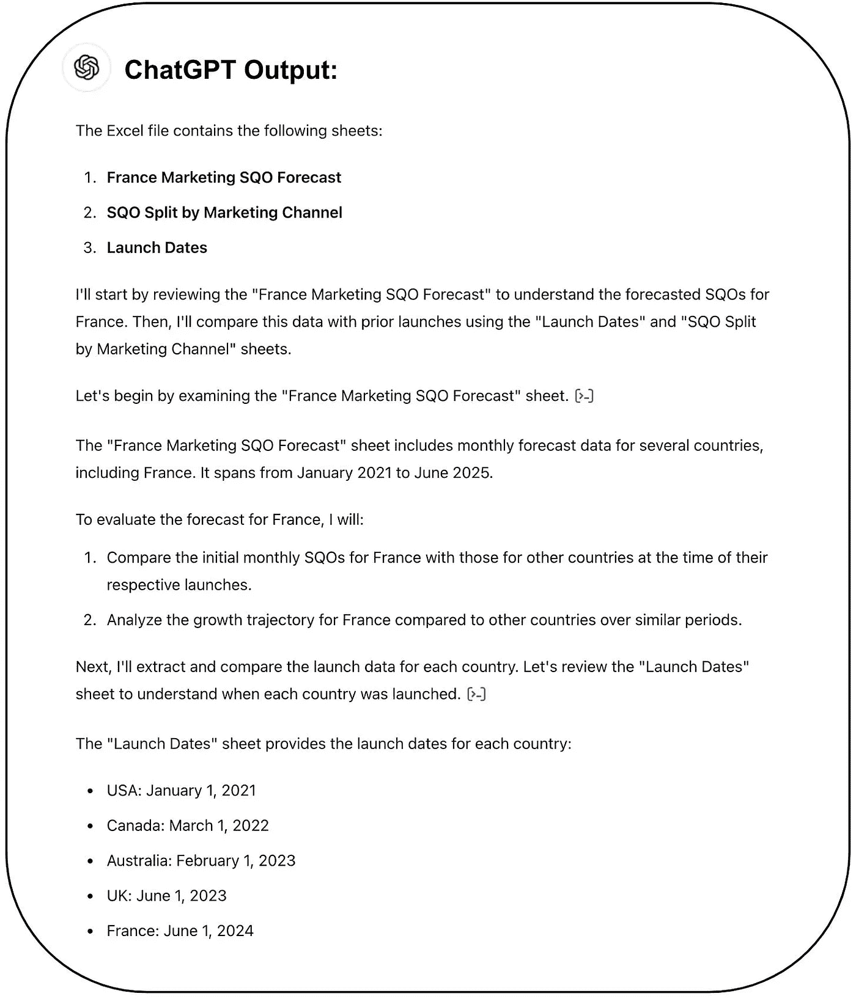

来自我的[第三次尝试截图](https://chatgpt.com/share/61da15ca-ec6b-47cb-94d1-d2ed79cb8554)；图片来源：作者

ChatGPT 还经常在聊天中重新陈述一些数据，这有助于确保它正确提取了数据：

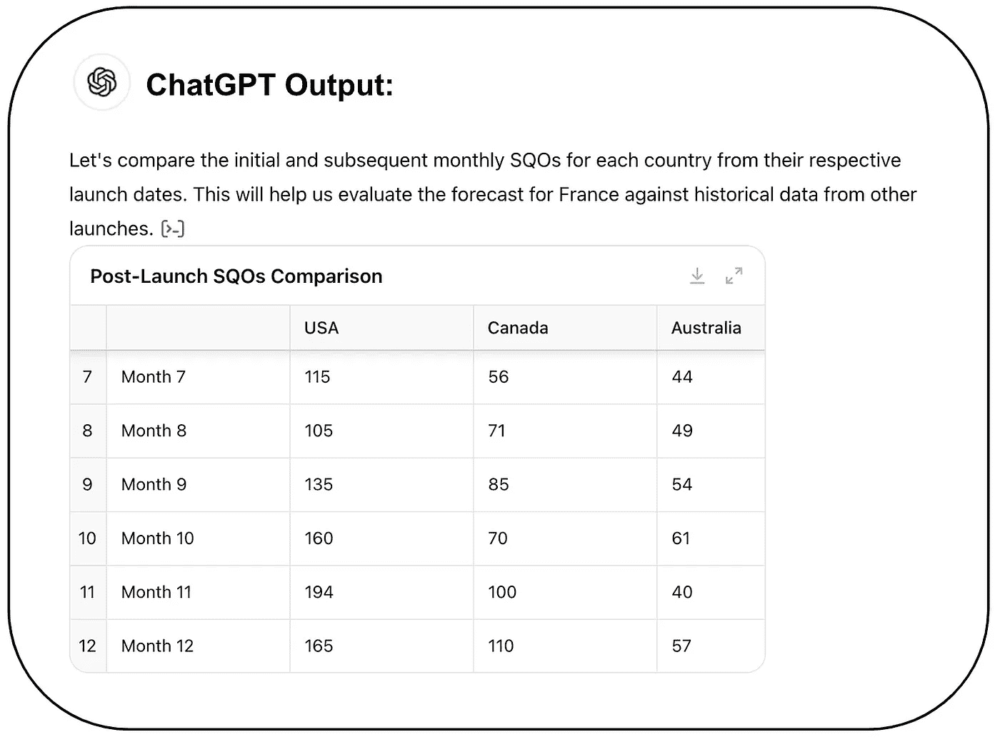

来自我的[第三次尝试截图](https://chatgpt.com/share/61da15ca-ec6b-47cb-94d1-d2ed79cb8554)；图片来源：作者

**备注：** 最初，ChatGPT 在处理我的电子表格时遇到了一些问题。**以下是如何进行故障排除：**

+   如果 ChatGPT 出现错误或显然没有正确获取数据，你可以通过点击 ♻️ 图标要求它重新处理。

+   如果它在处理你的文件时反复出现问题，你可能需要清理文件。例如，我发现如果我删除了非必要的行和列（例如章节标题、注释等），错误会显著减少。如果文件只包含相关的表格，ChatGPT 更容易将它们转换为 Python 中的数据框。给列和行提供描述性标题也有助于 ChatGPT 理解数据。

## 步骤 4：与 ChatGPT 一起进行合理性检查

接下来，ChatGPT 会开始提供一些初步观察，像这样：

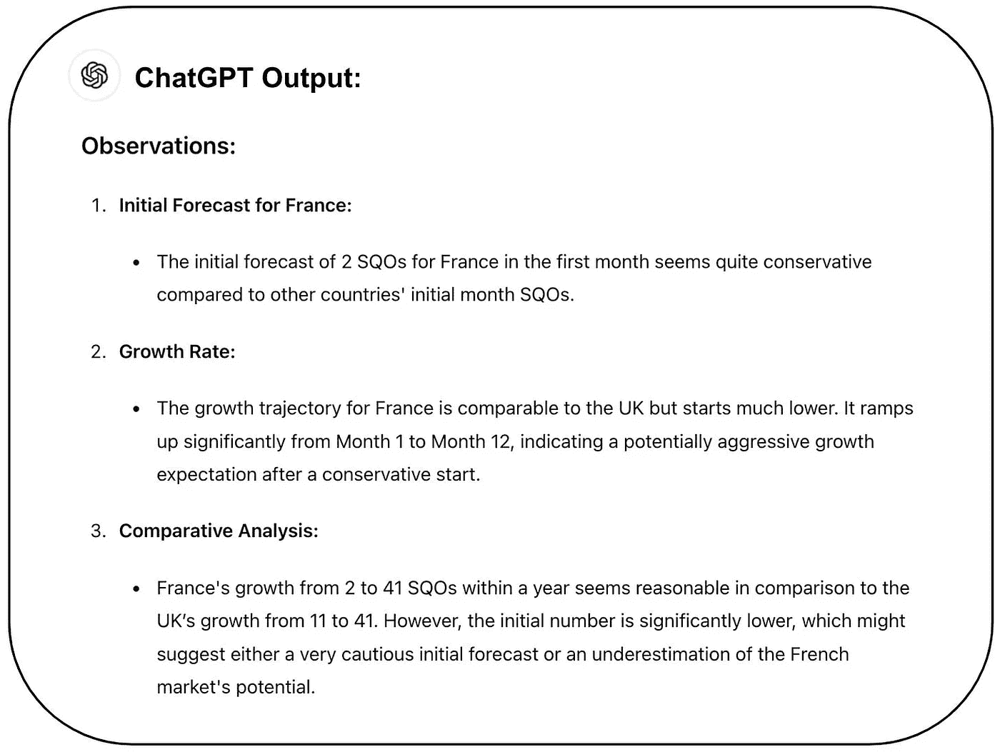

来自我的[第三次尝试截图](https://chatgpt.com/share/61da15ca-ec6b-47cb-94d1-d2ed79cb8554)；图片来源：作者

ChatGPT 正确识别出该预测是保守的，并且最终会追赶上英国，尽管开始时比较慢。如果它能够拉取一些统计数据来进行验证，比如每个国家的小型企业数量，那会更好，但根据我的经验，你需要明确要求它这样做。

有时它还会主动可视化关键趋势；其他时候，你需要提示它做这件事。

以下是对话的继续部分：

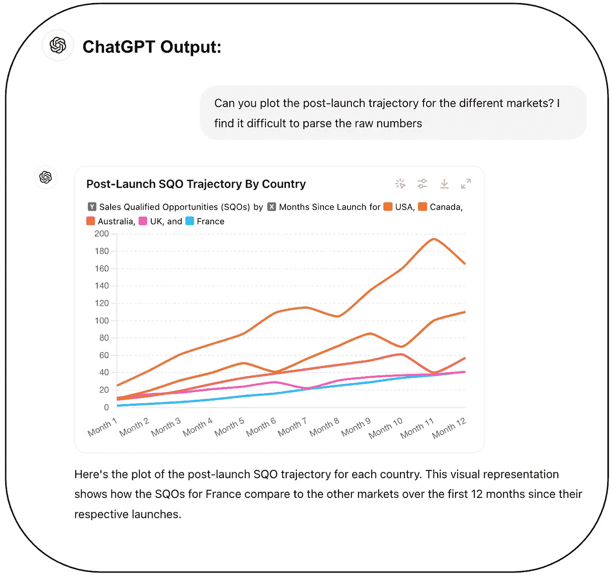

来自我的第三次尝试截图；图片来源：作者

很高兴看到 ChatGPT 能够从单独的标签页中提取启动日期，并根据启动日期为每个国家绘制性能图表。

然后我们开始讨论季节性；正如你所看到的，我需要提供初步的推动，并且进行了几轮反复对话，但 ChatGPT 完成了识别正确模式的工作：

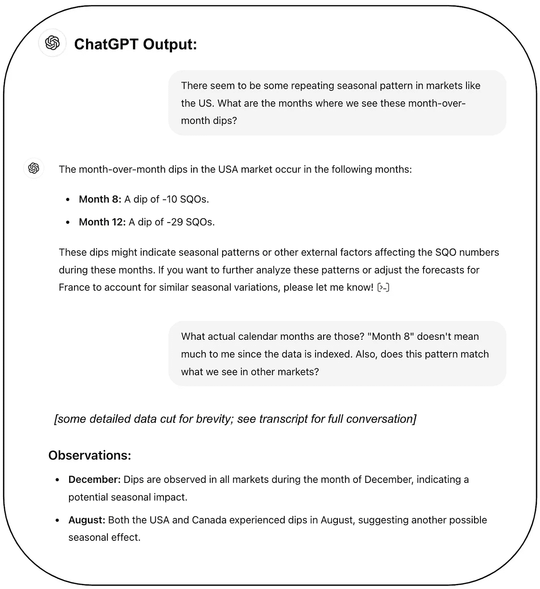

来自我的[第三次尝试截图](https://chatgpt.com/share/61da15ca-ec6b-47cb-94d1-d2ed79cb8554)；图片来源：作者

在我的几次尝试中，ChatGPT 还简要地总结了市场营销组合的要点，像这样：

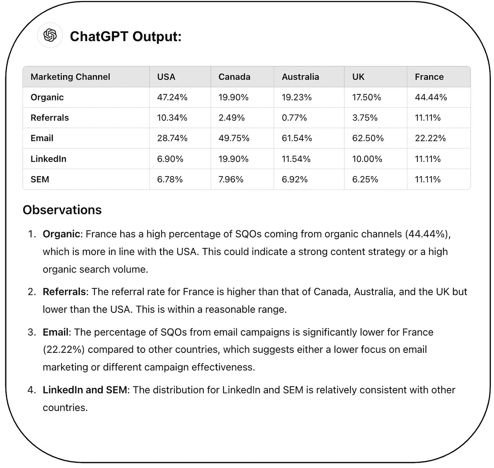

来自我的[第四次尝试截图](https://chatgpt.com/share/5927f094-d54a-4ec2-a11d-be56682dc29a)；图片来源：作者

我认为总体上这是可以的。

它正确地强调了有机营销和电子邮件营销是值得进一步关注的关键领域。不幸的是，它也得出了一些奇怪的结论；考虑到法国是一个新市场，没有建立的客户基础，推荐系统在法国的表现与美国一样高似乎不太合理。

## 步骤 5：[可选] 请 ChatGPT 重新做一遍你的工作

如果你使用 ChatGPT 来进行预测的合理性检查，它有时会根据你的讨论提供重新预测的建议。

在我的情况下，我让它加入了季节性因素：

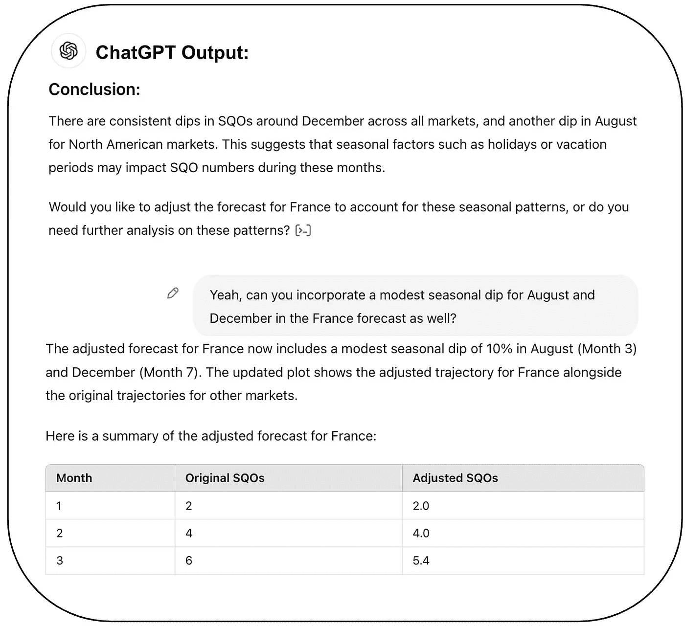

图片来源：作者

# 最后的思考

如果你投入大量精力进行分析，却被别人彻底推翻，那真的很让人沮丧。在分享之前进行合理性检查，可以大大降低这种情况发生的几率。

这也是与更高级别的利益相关者建立信任的好方法，并且能展示你像高管一样思考。

若想获取更多实际的分析建议，可以考虑在 Medium 上关注我，或者在[LinkedIn](http://www.linkedin.com/comm/mynetwork/discovery-see-all?usecase=PEOPLE_FOLLOWS&followMember=torsten-walbaum) 或[Substack](https://www.operatorshandbook.com/)上关注我。
