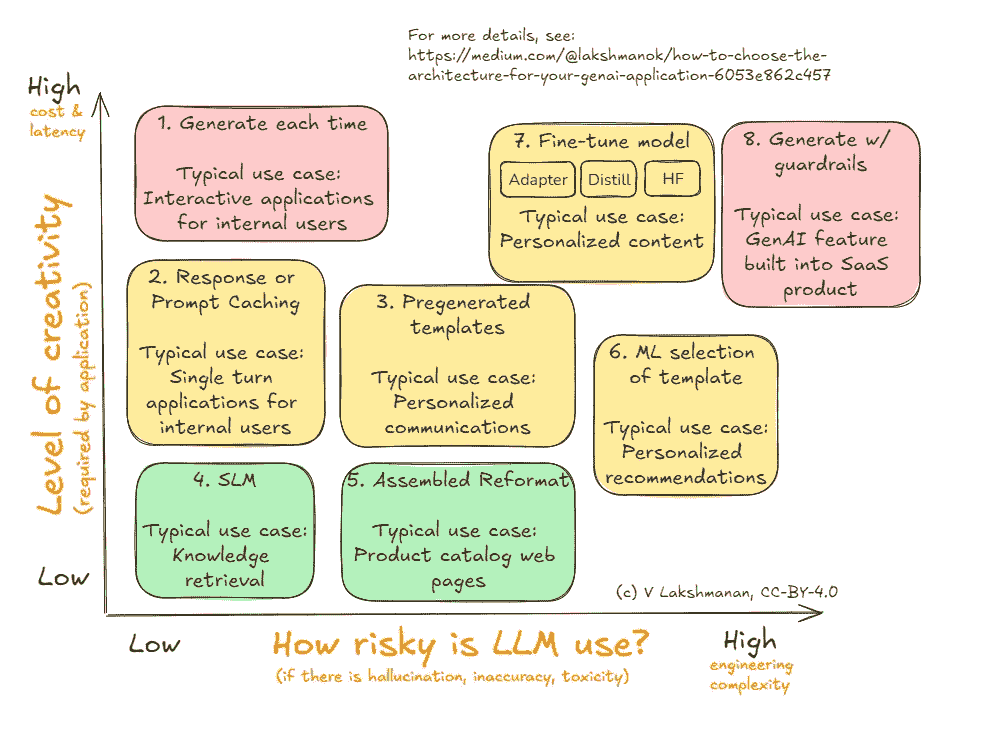
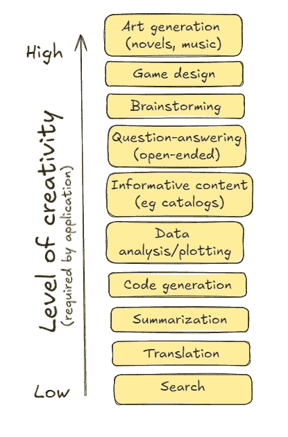
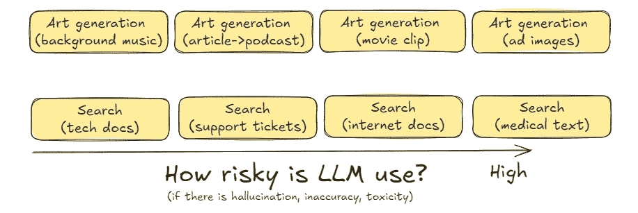
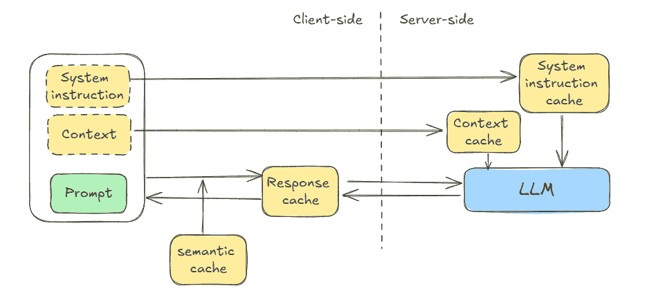
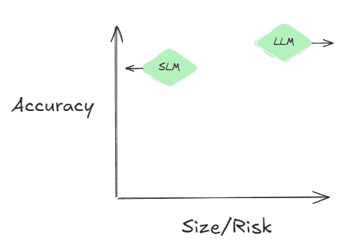
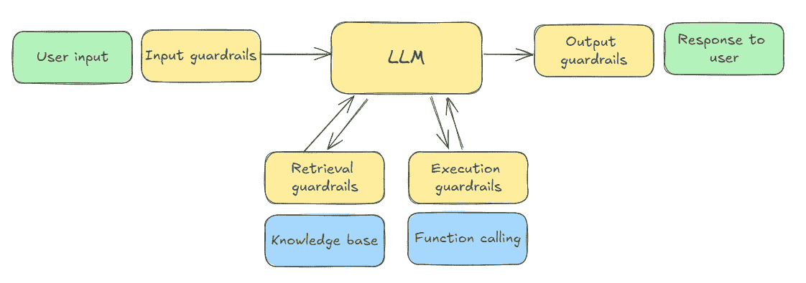

# 如何为你的 GenAI 应用选择架构

> 原文：[`towardsdatascience.com/how-to-choose-the-architecture-for-your-genai-application-6053e862c457?source=collection_archive---------1-----------------------#2024-10-03`](https://towardsdatascience.com/how-to-choose-the-architecture-for-your-genai-application-6053e862c457?source=collection_archive---------1-----------------------#2024-10-03)

## 一个框架，用于选择最简单、最快、最便宜的架构，以平衡 LLM 的创造力和风险。

[](https://lakshmanok.medium.com/?source=post_page---byline--6053e862c457--------------------------------)[](https://towardsdatascience.com/?source=post_page---byline--6053e862c457--------------------------------) [Lak Lakshmanan](https://lakshmanok.medium.com/?source=post_page---byline--6053e862c457--------------------------------)

·发表于 [Towards Data Science](https://towardsdatascience.com/?source=post_page---byline--6053e862c457--------------------------------) ·阅读时间：16 分钟 ·2024 年 10 月 3 日

--

看任何 LLM 教程时，建议的使用方法是调用 API，发送提示，并使用其响应。假设你希望 LLM 生成一封感谢信，你可以这样做：

```py
import openai
recipient_name = "John Doe"
reason_for_thanks = "helping me with the project"
tone = "professional"
prompt = f"Write a thank you message to {recipient_name} for {reason_for_thanks}. Use a {tone} tone."
response = openai.Completion.create("text-davinci-003", prompt=prompt, n=1)
email_body = response.choices[0].text
```

虽然这种方式适用于概念验证（PoC），但如果直接将这种架构投入生产，将 LLM 仅仅当作另一个文本到文本（或文本到图像/音频/视频）的 API 使用，最终会导致一个在风险、成本和延迟方面都设计不足的应用。

解决方案不是走向另一个极端，通过微调 LLM 和每次添加保护措施等方式过度设计你的应用。目标，和任何工程项目一样，是找到合适的平衡点，兼顾复杂性、适用性、风险、成本和延迟，以适应每个用例的具体需求。在本文中，我将描述一个框架，帮助你找到这个平衡点。

## LLM 应用架构的框架

这是我建议你用来决定你的 GenAI 应用或代理架构的框架。我将在接下来的部分中详细讲解图中展示的八种替代方案。



为你的 GenAI 应用选择合适的应用架构。图示来自作者。

这里的轴（即决策标准）是风险和创造力。对于每个将要使用 LLM 的用例，首先要识别你需要的 LLM 创造力以及该用例所承载的风险。这有助于你缩小选择范围，找到最适合你的平衡点。

请注意，是否使用代理系统与此完全是正交的决策——当任务过于复杂，单个 LLM 调用无法完成，或者任务需要非 LLM 能力时，可以使用代理系统。在这种情况下，你需要将复杂任务拆解成更简单的任务，并在代理框架中协调它们。本文将向你展示如何构建一个 GenAI 应用（或代理），以执行这些简单任务之一。

## 为什么第一个决策标准是创造力

为什么创造力和风险是轴线？LLM 是一种非确定性技术，如果你不需要在创建的内容中有太多独特性，它带来的麻烦远大于其价值。

例如，如果你正在生成一堆产品目录页面，它们到底需要有多大的不同？你的客户希望获得准确的产品信息，可能并不关心所有 SLR 相机页面是否都以相同的方式解释 SLR 技术的优势——实际上，一定程度的标准化可能更有利于便于比较。这是一个 LLM 的创造力要求非常低的例子。

事实证明，减少非确定性的方法也减少了 LLM 调用的总次数，因此也有减少使用 LLM 总成本的副作用。由于 LLM 调用比典型的 Web 服务要慢，这也有减少延迟的良好副作用。这就是为什么 y 轴代表创造力，并且我们在该轴上还展示了成本和延迟的原因。



说明性：按创造力排序的使用案例。图表由作者提供

你可以查看上图中列出的说明性使用案例，并辩论它们是否需要低创造力或高创造力。这实际上取决于你的业务问题。如果你是一个杂志或广告公司，即使是你的资讯内容网页（与产品目录页不同）可能也需要有创造力。

## 为什么第二个决策标准是风险

LLM 有时会产生幻觉，反映其训练数据中的偏见和毒性。鉴于此，直接将 LLM 生成的内容发送给最终用户存在风险。解决这个问题需要增加大量的工程复杂性——你可能需要引入人类审查环节，来审核内容，或者为应用添加防护措施，以验证生成的内容是否违反政策。

如果你的使用案例允许最终用户向模型发送提示，并且应用程序在后台采取行动（这是许多 SaaS 产品中的常见情况）生成面向用户的响应，那么与错误、幻觉和毒性相关的风险相当高。

相同的用例（艺术生成）可能根据上下文承担不同级别和种类的风险，如下图所示。例如，如果你正在为电影生成背景器乐音乐，可能会面临不小心重现版权音符的风险，而如果你正在生成广告图片或视频并向数百万用户广播，你可能会担心有害内容。这些不同类型的风险与不同程度的风险相关。另一个例子是，如果你正在构建一个企业搜索应用程序，该应用程序从公司的文档库或技术文档中返回文档片段，LLM 相关的风险可能会很低。如果你的文档库包含医学教科书，搜索应用程序返回的上下文不符的内容的风险可能会很高。



示例：按风险排序的用例。图表由作者提供

就像按创造力排序的用例列表一样，你可以对按风险排序的用例排序提出异议。但一旦你识别出与用例相关的风险及其所需的创造力，建议的架构可以作为起点考虑。然后，如果你理解了这些架构模式背后的“为什么”，你就能选择一个平衡需求的架构。

在本文的其余部分，我将描述从图中#1 开始的架构。

## 1\. 每次生成（适用于高创造力、低风险任务）

这是作为默认架构使用的模式——每次需要生成内容时，调用已部署的大型语言模型（LLM）API。这是最简单的方式，但每次都需要进行 LLM 调用。

通常，你会使用 PromptTemplate，并根据运行时参数将你发送给 LLM 的提示进行模板化。使用一个允许更换 LLM 的框架是个不错的主意。

在我们根据提示发送电子邮件的示例中，我们可以使用 langchain：

```py
prompt_template = PromptTemplate.from_template(
    """
    You are an AI executive assistant to {sender_name} who writes letters on behalf of the executive.
    Write a 3-5 sentence thank you message to {recipient_name} for {reason_for_thanks}.
    Extract the first name from {sender_name} and sign the message with just the first name.
    """
)
...
response = chain.invoke({
    "recipient_name": "John Doe",
    "reason_for_thanks": "speaking at our Data Conference",
    "sender_name": "Jane Brown",
})
```

因为每次都在调用 LLM，它只适用于需要极高创造力的任务（例如，你希望每次都收到不同的感谢信）并且你不担心风险的情况（例如，如果最终用户可以在点击“发送”之前阅读并编辑信件）。

这种模式常用于交互式应用程序（因此需要响应各种提示），这些应用程序是为内部用户设计的（因此风险较低）。

## 2\. 响应/提示缓存（适用于中等创造力、低风险任务）

你可能不希望向同一个人再次发送相同的感谢信。你希望每次都不一样。

但是，如果你正在构建一个基于过去工单的搜索引擎，例如为了帮助内部客户支持团队，该怎么办？在这种情况下，你确实希望重复的问题每次都生成相同的答案。

大幅降低成本和延迟的一种方法是缓存过去的提示和响应。你可以使用 langchain 在客户端进行这样的缓存：

```py
from langchain_core.caches import InMemoryCache
from langchain_core.globals import set_llm_cache

set_llm_cache(InMemoryCache())

prompt_template = PromptTemplate.from_template(
    """
    What are the steps to put a freeze on my credit card account?
    """
)
chain = prompt_template | model | parser
```

当我尝试时，缓存的回应只用了 1/1000 的时间，完全避免了 LLM 调用。

缓存不仅限于客户端缓存精确的文本输入和相应的回应（见下图）。Anthropic 支持“[提示缓存](https://www.anthropic.com/news/prompt-caching)”，通过这种方式，您可以要求模型在服务器端缓存部分提示（通常是系统提示和重复的上下文），同时在每次后续查询中继续发送新的指令。使用提示缓存可以减少每次查询的成本和延迟，同时不影响创意性。在 RAG（检索增强生成）、文档提取和少量示例提示中，当示例变得庞大时，这尤其有帮助。



响应缓存减少了 LLM 调用的次数；上下文缓存减少了每次调用中处理的令牌数量。两者结合起来，减少了总体令牌数量，从而降低了成本和延迟。图示由作者提供。

Gemini 将此功能分为[上下文缓存](https://ai.google.dev/gemini-api/docs/caching?lang=python)（减少成本和延迟）和[系统指令](https://cloud.google.com/vertex-ai/generative-ai/docs/learn/prompts/system-instructions)（虽然不减少令牌数量，但能减少延迟）。OpenAI 最近宣布支持提示缓存，其实现会自动缓存先前发送到 API 的[最长前缀](https://openai.com/index/api-prompt-caching/)，只要提示超过 1024 个令牌。这类服务器端缓存不会降低模型的能力，仅会减少延迟和/或成本，因为即便是相同的文本提示，您仍然可能获得不同的结果。

内置的缓存方法需要精确的文本匹配。然而，可以通过一种利用具体情况微妙差异的方式来实现缓存。例如，您可以将提示重写为规范化形式，以增加缓存命中的机会。另一个常见的技巧是存储最常见的 100 个问题，对于任何相似的问题，您可以将提示重写为询问存储的问题。在多轮对话的聊天机器人中，您可以通过用户确认来验证这种语义相似性。像这样的语义缓存技术会稍微降低模型的能力，因为即便是相似的提示也会得到相同的回应。

## 3. 预生成模板（适用于中等创意性、低中风险任务）

有时候，您并不介意对每个处于相同情况的人生成相同的感谢信。也许您正在写感谢信给购买了某个产品的客户，您并不介意对任何购买了该产品的客户生成相同的感谢信。

与此同时，这种使用场景也存在较高的风险，因为这些通信将直接发送给最终用户，且没有内部工作人员能够在发送之前编辑每封生成的信件。

在这种情况下，预生成模板化的响应可能会很有帮助。例如，假设你是一家旅行社，并提供 5 种不同的套餐。你所需要的，只是为每种套餐准备一条感谢信息。也许你希望为独自旅行者、家庭旅行者和团队旅行者提供不同的信息。但你所需要的消息数量仍然是套餐数量的三倍。

```py
prompt_template = PromptTemplate.from_template(
    """
    Write a letter to a customer who has purchased a tour package.
    The customer is traveling {group_type} and the tour is to {tour_destination}.
    Sound excited to see them and explain some of the highlights of what they will see there
    and some of the things they can do while there.
    In the letter, use [CUSTOMER_NAME] to indicate the place to be replaced by their name
    and [TOUR_GUIDE] to indicate the place to be replaced by the name of the tour guide.
    """
)
chain = prompt_template | model | parser
print(chain.invoke({
    "group_type": "family",
    "tour_destination": "Toledo, Spain",
}))
```

结果是针对特定团体类型和旅游目的地的消息，如下所示：

```py
Dear [CUSTOMER_NAME],

We are thrilled to welcome you to Toledo on your upcoming tour! We can't wait to show you the beauty and history of this enchanting city.

Toledo, known as the "City of Three Cultures," boasts a fascinating blend of Christian, Muslim, and Jewish heritage.  You'll be mesmerized by the stunning architecture, from the imposing Alcázar fortress to the majestic Toledo Cathedral. 

During your tour, you'll have the opportunity to:

* **Explore the historic Jewish Quarter:** Wander through the narrow streets lined with ancient synagogues and traditional houses. 
* **Visit the Monastery of San Juan de los Reyes:** Admire the exquisite Gothic architecture and stunning cloisters.
* **Experience the panoramic views:** Take a scenic walk along the banks of the Tagus River and soak in the breathtaking views of the city.
* **Delve into the art of Toledo:** Discover the works of El Greco, the renowned painter who captured the essence of this city in his art.

Our expert tour guide, [TOUR_GUIDE], will provide insightful commentary and share fascinating stories about Toledo's rich past. 

We know you'll have a wonderful time exploring the city's treasures. Feel free to reach out if you have any questions before your arrival.

We look forward to welcoming you to Toledo!

Sincerely,

The [Tour Company Name] Team 
```

你可以生成这些消息，进行人工审核，然后将它们存储在数据库中。

如你所见，我们要求 LLM 在消息中插入占位符，这样我们就可以动态地进行替换。每当需要发送响应时，只需从数据库中检索消息，并将占位符替换为实际数据。

使用预生成模板将一个原本需要每天审核数百条消息的问题，转变为只需在新增旅游产品时审核少量消息的问题。

## 4\. 小型语言模型（低风险，低创意）

最近的研究表明，**[LLM 中的幻觉现象无法完全消除](https://arxiv.org/abs/2401.11817)**，因为幻觉源于学习我们希望的所有可计算函数之间的矛盾。对于更有针对性的任务，一个较小的 LLM 比一个过于庞大的模型更不容易产生幻觉。你可能会使用一个前沿的 LLM 来处理一些不需要其强大功能和世界知识的任务。

在一些使用场景中，如果你有一个非常简单的任务，且该任务不需要太多创造力，并且对风险的容忍度非常低，你可以选择使用小型语言模型（SLM）。这确实会牺牲准确性——在一项**2024 年 6 月的研究中，微软的研究人员**发现，对于从非结构化文本中提取发票相关的结构化数据，他们的小型文本模型（Phi-3 Mini 128K）能够达到 93%的准确率，而 GPT-4o 可以达到 99%的准确率。

LLMWare 团队[评估了各种 SLM](https://medium.com/@darrenoberst/best-small-language-models-for-accuracy-and-enterprise-use-cases-benchmark-results-cf71964759c8)。在写作时（2024 年），他们发现 Phi-3 是最好的，但随着时间推移，越来越小的模型也在实现这一性能。

通过图示表示这两项研究，SLM（小型语言模型）正越来越以更小的尺寸实现更高的准确性（因此幻觉现象越来越少），而 LLM（大型语言模型）则专注于提高任务能力（因此幻觉现象越来越多）。在像文档提取这样的任务中，这两种方法的准确性差异已经趋于稳定（见图）。



这一趋势是 SLMs 通过越来越小的模型获得相同的准确性，而 LLMs 则通过越来越大的模型专注于更多的能力。在简单任务上的准确性差距已经稳定。图表由作者提供。

如果这一趋势持续下去，预计您将在越来越多的企业任务中使用 SLMs 和非前沿 LLMs，这些任务只需要较低的创造力，并且对风险的容忍度较低。从文档创建嵌入，例如用于知识检索和主题建模，是适合这种情况的用例。对于这些任务，使用小型语言模型。

## 5\. 组装重新格式化（中等风险，低创造力）

组装重新格式化的基本思路是通过预生成来降低动态内容的风险，只使用 LLM 进行提取和总结，这些任务虽然是“实时”完成的，但仅引入较低级别的风险。

假设您是一家机械部件制造商，需要为产品目录中的每个项目创建一个网页。显然，您非常关心准确性。您不想错误地声称某个物品是耐热的，但它实际上并不是。您也不希望 LLM 产生安装该部件所需的工具。

您可能有一个数据库，描述了每个部件的属性。一种简单的方法是使用 LLM 为每个属性生成内容。与预生成的模板（上面的模式#3）一样，请确保在将内容存储到内容管理系统之前，经过人工审查。

```py
prompt_template = PromptTemplate.from_template(
    """
    You are a content writer for a manufacturer of paper machines.
    Write a one-paragraph description of a {part_name}, which is one of the parts of a paper machine.
    Explain what the part is used for, and reasons that might need to replace the part.
    """
)
chain = prompt_template | model | parser
print(chain.invoke({
    "part_name": "wet end",
}))
```

然而，仅仅将所有生成的文本附加起来会导致读起来不太愉快。相反，您可以将所有这些内容组装到提示的上下文中，并要求 LLM 将内容重新格式化为所需的网站布局：

```py
class CatalogContent(BaseModel):
    part_name: str = Field("Common name of part")
    part_id: str = Field("unique part id in catalog")
    part_description: str = Field("short description of part")
    price: str = Field("price of part")

catalog_parser = JsonOutputParser(pydantic_object=CatalogContent)

prompt_template = PromptTemplate(
    template="""
    Extract the information needed and provide the output as JSON.
    {database_info}
    Part description follows:
    {generated_description}
    """,
    input_variables=["generated_description", "database_info"],
    partial_variables={"format_instructions": catalog_parser.get_format_instructions()},
)

chain = prompt_template | model | catalog_parser
```

如果您需要总结评论或与该商品相关的交易文章，您可以通过批处理处理流水线来完成这一任务，并将摘要也输入到上下文中。

## 6\. ML 模板选择（中等创造力，中等风险）

组装重新格式化的方法适用于内容相当静态的网页（例如产品目录页面）。然而，如果您是一家电子商务零售商，且希望创建个性化推荐，则内容将更加动态。您需要 LLM 有更高的创造力。就准确性而言，您的风险容忍度仍然差不多。

在这种情况下，您可以继续使用为每个产品预生成的模板，然后利用机器学习来选择您将使用的模板。

例如，对于个性化推荐，您可以使用传统的推荐引擎来选择展示给用户的产品，并拉取适当的预生成内容（图片+文字）来展示该产品。

结合预生成+机器学习的方法也可以用于根据不同客户旅程定制你的网站。你将预生成着陆页，并使用倾向模型来选择下一个最佳动作。

**7. 微调（高创意，中等风险）**

如果你的创意需求较高，就无法避免使用大型语言模型（LLM）来生成所需的内容。但每次生成内容意味着你无法扩展人工审查。

有两种方式可以解决这个难题。从工程复杂度的角度来看，更简单的方式是教会 LLM 生成你想要的内容，并避免生成你不希望的内容。这可以通过微调来实现。

有三种方法可以微调基础模型：适配器调优、蒸馏和人类反馈。这些微调方法解决了不同的风险：

+   适配器调优保留了基础模型的全部能力，但允许你选择特定风格（例如符合公司语气的内容）。这里解决的风险是品牌风险。

+   蒸馏方法接近基础模型的能力，但仅适用于有限的任务，并使用一个可以在本地或防火墙后部署的较小模型。这里解决的风险是保密性问题。

+   通过 RLHF 或 DPO 获取的人类反馈可以让模型一开始就具备合理的准确性，但通过人类反馈，模型会变得更好。这里解决的风险是适用性问题。

微调的常见使用案例包括能够创建品牌内容、机密信息的摘要和个性化内容。

## 8\. 防护措施（高创意，高风险）

如果你需要全面的能力范围，并且有多种风险需要缓解——也许你担心品牌风险、机密信息泄漏，或者有兴趣通过反馈进行持续改进呢？

到那时，唯一的选择就是全力以赴，构建防护措施。防护措施可能包括预处理输入到模型的信息、后处理模型输出的结果，或根据错误条件迭代提示。

预构建的防护措施（例如 Nvidia 的 NeMo）存在，用于检查越狱、掩码输入中的敏感数据和自查事实等常见功能。



你可能需要自己构建的防护措施。图示由作者提供。

然而，你可能不得不自己实现一些防护措施（见上图）。需要与可编程防护措施一起部署的应用程序是实现 GenAI 应用的最复杂方式。在走这条路之前，确保这种复杂性是合理的。

# 总结

我建议您使用一种平衡创造性和风险的框架，以决定您的 GenAI 应用或代理的架构。创造性指的是生成内容中所需的独特性水平。风险则与 LLM 生成不准确、有偏见或有毒内容的影响相关。应对高风险场景需要更多的工程复杂性，例如人工审核或防护措施。

该框架包括八种架构模式，旨在应对不同的创造性与风险组合：

1\. **每次生成**：每次内容生成请求都调用 LLM API，提供最大的创造性，但成本和延迟较高。适用于风险较低的互动型应用程序，例如内部工具。

2\. **响应/提示缓存**：适用于中等创造性、低风险的任务。缓存过去的提示和响应，以减少成本和延迟。对于需要一致答案的场景非常有用，例如内部客户支持搜索引擎。像提示缓存、语义缓存和上下文缓存等技术可以提高效率，同时不牺牲创造性。

3\. **预生成模板**：采用预生成、经过审查的模板来处理重复性任务，减少持续人工审查的需求。适用于中等创造性、低到中风险的情况，需要标准化但个性化的内容，如旅游公司中的客户沟通。

4\. **小型语言模型（SLM）**：使用较小的模型来减少幻觉现象和成本，相较于更大的 LLM。这对于低创造性、低风险的任务（如知识检索嵌入创建或主题建模）非常理想。

5\. **组装重格式化**：使用 LLM 进行重新格式化和总结，借助预生成的内容确保准确性。适用于如产品目录这类需要在部分内容上保证准确性，而在其他部分需要创意写作的内容。

6\. **机器学习模板选择**：利用机器学习根据用户上下文选择适当的预生成模板，平衡个性化与风险管理。适用于个性化推荐或动态网站内容。

7\. **微调**：涉及对大型语言模型（LLM）进行微调，以生成期望的内容，同时最小化不希望出现的输出，处理与品牌声音、机密性或准确性相关的风险。适配器微调专注于风格调整，蒸馏专注于特定任务，而人类反馈则用于持续改进。

8\. **防护措施**：高创造性、高风险的任务需要防护措施，通过预处理、后处理和迭代提示来减轻多种风险，包括品牌风险和机密性风险。现成的防护措施可以解决诸如破解和敏感数据掩蔽等常见问题，而针对特定行业/应用需求可能需要定制的防护措施。

使用上述框架来构建生成式人工智能（GenAI）应用时，你将能够为每个使用案例平衡复杂性、适用性、风险、成本和延迟。

*(周期性提醒：这些文章仅代表我个人观点，并非我过去或现在雇主的立场。)*
