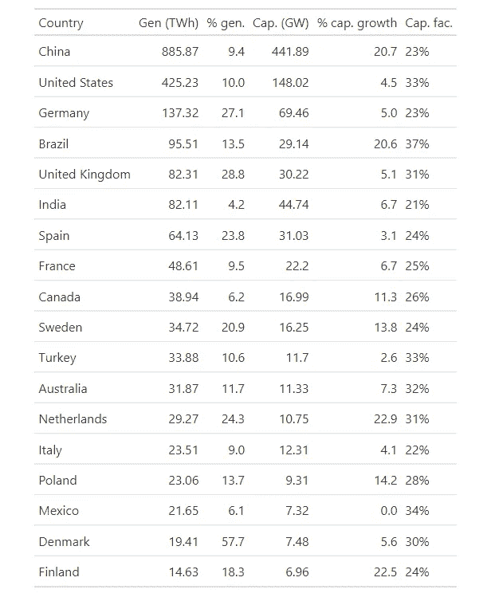
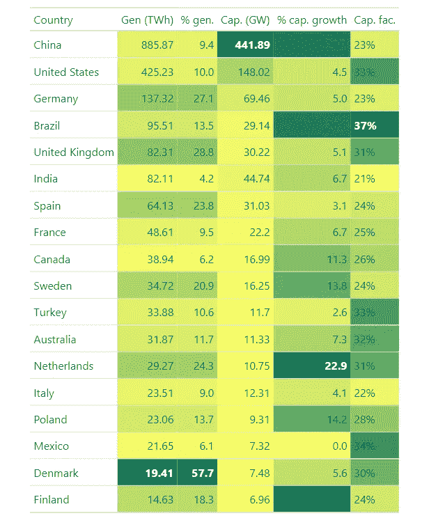

# 如何为 Polars DataFrame 上色

> 原文：[`towardsdatascience.com/how-to-color-polars-dataframe-8ada66161226?source=collection_archive---------10-----------------------#2024-08-27`](https://towardsdatascience.com/how-to-color-polars-dataframe-8ada66161226?source=collection_archive---------10-----------------------#2024-08-27)

## 在继续使用 Polars 库的同时，能够为表格上色并进行样式化

 [Boriharn K](https://medium.com/@borih.k?source=post_page---byline--8ada66161226--------------------------------)

·发布于 [Towards Data Science](https://towardsdatascience.com/?source=post_page---byline--8ada66161226--------------------------------) ·6 分钟阅读·2024 年 8 月 27 日

--

由[ChatGPT](https://chatgpt.com/)生成的 AI 图像。提示：一幅北极熊在雪地中画画的图。

自 2022 年发布以来，Polars 库由于其超高速的 DataFrame 功能而迅速获得了人气。与 Pandas 相比，白熊测试表明其速度远远更快。根据官方[Polars 网站](https://pola.rs/posts/benchmarks/)，它声称可以实现超过 30 倍的性能提升。

然而，没有什么是完美的。Polars 库似乎有一些限制。

在样式化表格时，Polars 提供的选项较少，而 Pandas 有一个[内置的样式工具](https://pandas.pydata.org/docs/user_guide/style.html)。如果你想为 Polars DataFrame 添加颜色，一个简单的解决方案是将表格转换为 Pandas。

等等……如果某些代码稍后需要运行怎么办？

示例展示了文章中 Polars 表格样式化前后的效果。图片由作者提供。

这意味着我们必须运行 Pandas，这可能会导致速度显著变慢。另一个选择是在样式化后将表格转换回 Polars。然后，如果我们想要样式化结果，必须重复相同的过程。尽管这些解决方案有效，但它们相当不便。
