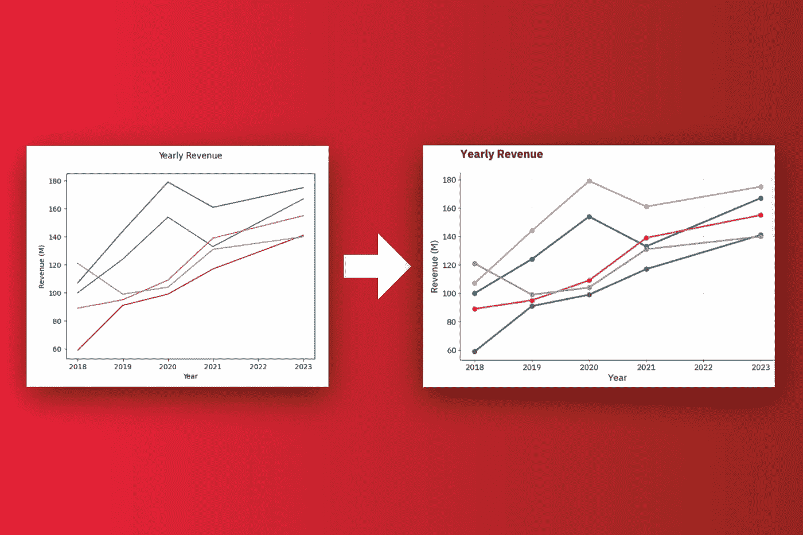

# 如何创建自定义 Matplotlib 主题并让你的图表从乏味变得惊艳

> 原文：[`towardsdatascience.com/how-to-create-a-custom-matplotlib-theme-and-make-your-charts-go-from-boring-to-amazing-bb2998945c8f?source=collection_archive---------5-----------------------#2024-09-05`](https://towardsdatascience.com/how-to-create-a-custom-matplotlib-theme-and-make-your-charts-go-from-boring-to-amazing-bb2998945c8f?source=collection_archive---------5-----------------------#2024-09-05)

## 最棒的是？你只需要做一次。

 [Dario Radečić](https://medium.com/@radecicdario?source=post_page---byline--bb2998945c8f--------------------------------)

·发表于[Towards Data Science](https://towardsdatascience.com/?source=post_page---byline--bb2998945c8f--------------------------------) ·7 分钟阅读·2024 年 9 月 5 日

--

文章缩略图（图片由作者提供）

每一个 Matplotlib 图表都有可能成为病毒式传播的热点。但是，使用默认主题是做不到的。

说实话：默认样式不会让任何人停下脚步。如果你想吸引读者的注意，你需要的不仅仅是[提高分辨率或更换字体](https://darioradecic.substack.com/p/you-need-to-fix-these-3-things-right)。你需要的是一个自定义主题。

这是让你的图表看起来*属于你的*唯一方法。这是让你的读者停下滚动的唯一方法。**好消息是？** Matplotlib 让你从零开始编写自定义样式表变得极其简单。更棒的是——你可以让你的自定义主题在全系统范围内可用！

在今天的文章中，你将学到如何做到这一点。

# 绘制条形图和折线图所需的两个函数

为了确保可重复性，我将为你提供两个函数，用于绘制条形图和折线图。

设置自定义 Matplotlib 主题的目标不是改变底层的 Python 代码——而是保持其不变——看看视觉效果上有什么不同。
