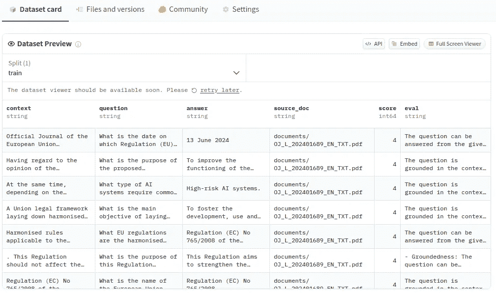
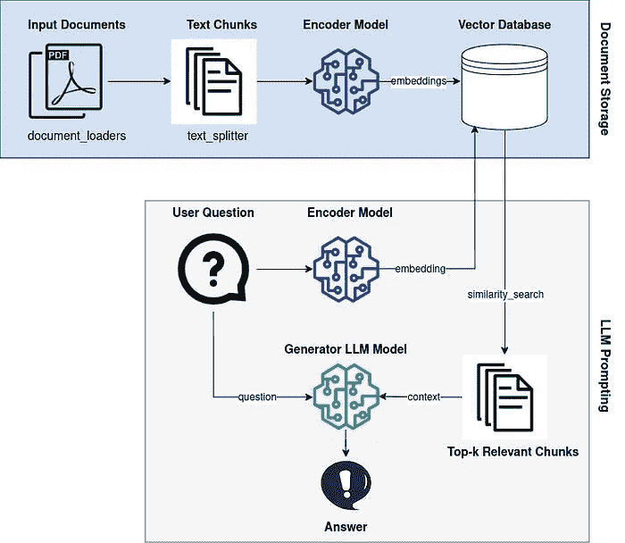

# 如何从文档中创建 RAG 评估数据集

> 原文：[`towardsdatascience.com/how-to-create-a-rag-evaluation-dataset-from-documents-140daa3cbe71?source=collection_archive---------0-----------------------#2024-11-03`](https://towardsdatascience.com/how-to-create-a-rag-evaluation-dataset-from-documents-140daa3cbe71?source=collection_archive---------0-----------------------#2024-11-03)

## 使用 LLM 自动创建任何语言的领域特定数据集

 [Dr. Leon Eversberg](https://medium.com/@leoneversberg?source=post_page---byline--140daa3cbe71--------------------------------)

·发表于[Towards Data Science](https://towardsdatascience.com/?source=post_page---byline--140daa3cbe71--------------------------------) ·12 分钟阅读·2024 年 11 月 3 日

--

我们在 Hugging Face Hub 上自动生成的 RAG 评估数据集（[PDF 输入文件](https://eur-lex.europa.eu/legal-content/EN/TXT/PDF/?uri=OJ%3AL_202401689&qid=1730538361265)来自欧盟，遵循[CC BY 4.0](https://european-union.europa.eu/legal-notice_en)许可）。图片由作者提供

在本文中，我将向你展示如何从任何语言的文档中创建你自己的 RAG 数据集，包括上下文、问题和答案。

检索增强生成（RAG）[1]是一种技术，允许 LLM 访问外部知识库。

通过上传 PDF 文件并将其存储在向量数据库中，我们可以通过向量相似度搜索来检索这些知识，然后将检索到的文本插入到 LLM 的提示中作为附加上下文。

这为 LLM 提供了新的知识，并减少了 LLM 编造事实（幻觉）的可能性。

基本的 RAG 管道。图片由作者提供，来自文章“如何使用 RAG 构建本地开源 LLM 聊天机器人”

然而，在 RAG 管道中有许多参数需要设置，研究人员总是在提出新的改进建议。我们如何知道选择哪些参数，哪些方法能真正提高我们特定用例的性能呢？

这就是为什么我们需要一个验证/开发/测试数据集来评估我们的 RAG 管道。数据集应来自我们感兴趣的领域……
