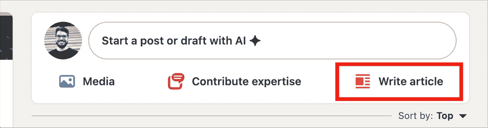

# 如何在数据科学职位申请中创造机会并获得成功

> 原文：[`towardsdatascience.com/how-to-create-opportunities-and-succeed-in-data-science-job-applications-3881a5c86508?source=collection_archive---------7-----------------------#2024-10-29`](https://towardsdatascience.com/how-to-create-opportunities-and-succeed-in-data-science-job-applications-3881a5c86508?source=collection_archive---------7-----------------------#2024-10-29)

## 我从成功与失败中汲取的宝贵经验，将帮助你在职业道路上走得更远

 [Robson Tigre](https://medium.com/@robson.tigre0?source=post_page---byline--3881a5c86508--------------------------------)

·发布于[Towards Data Science](https://towardsdatascience.com/?source=post_page---byline--3881a5c86508--------------------------------) ·阅读时间 8 分钟·2024 年 10 月 29 日

--

图片由[James Lee](https://unsplash.com/@picsbyjameslee?utm_source=medium&utm_medium=referral)提供，来源于[Unsplash](https://unsplash.com/?utm_source=medium&utm_medium=referral)

事实上，是否被招聘人员注意到，往往取决于你在 LinkedIn 上的定位以及你如何准备招聘过程。在本文中，我将分享过去几年中我所学到的一些经验，这些经验让我被像 Mercado Livre、亚马逊、Meta、TikTok、Uber 等公司邀请面试。

# 1\. 显而易见的：让招聘人员看到你

我收到的大部分面试邀请，都是因为我在 LinkedIn 上保持活跃和可见。我开始定期发布内容，至少每两周一次，分享我的故事并与他人的帖子互动。以下是一些关键建议。

**讲述（相关部分）你的故事：** 分享你的过往经历和抱负。保持你的个人资料更新，并确保与你希望从事的领域相关。[这篇文章](https://medium.com/@robson.tigre0/dicas-sobre-busca-ativa-e-linkedin-para-mudar-de-carreira-ou-encontrar-novas-vagas-7bb90b4d74df)提供了一些关于如何提升个人资料的建议（仅提供葡萄牙语版本，但图表自解释）。

**创作内容并保持一致性：** 我收到的所有面试邀请（即当招聘人员主动联系我时）都发生在我开始在 LinkedIn 上创作更多内容之后。而且这并不需要过于复杂。例如，我会像这样写关于我经历的文章，并直接在 LinkedIn 上发布为“个人文章”。这将有助于增加你的互动，并避免分享外部链接（如 Medium、YouTube 等）时出现的可见性下降。

图片由作者提供

# 2\. 寻找机会时不要过于谦虚

保持面试动力的最佳方法是实际安排面试。为了做到这一点，申请那些对你有意义的职位，但不要只局限于那些“完全匹配”的职位。记住：最终决定你是否合格的应该是招聘人员，而不是你。如果你不尝试，你永远不知道！

> 超级重要的额外建议——请求推荐：如果你认识招聘公司的某个人，可以询问他们是否能推荐你。许多公司有内部平台来进行推荐，一个好的推荐可以为你打开大门。我将在下一节中详细讲解。

# 3\. 建立你的社交资本（人脉网络）

建立人脉并不意味着要非常社交，而是意味着要维持有意义的联系。让我举一些例子，说明这如何帮助我：

**示例 1：** 一年后，我在一个训练营中认识的人推荐我申请了他们公司的一份职位。当然，这不是偶然发生的。在训练营期间，我们在 LinkedIn 上建立了联系，并时不时在线互动，讨论数据科学的话题。

**示例 2：** 这就是推荐的力量。我曾在投递简历申请工作后，通过其中一封自动邮件被拒绝，但在一次内部推荐之后，公司重新考虑了我的申请，并邀请我继续参加面试直至最后阶段。

> 与来自会议、训练营以及以前工作单位的同事保持联系。记住不要自私：尽可能帮助别人，因为人脉是双向的。

# 4\. 为招聘过程的每个阶段做好充分准备

面试通常遵循一个模式：首先与 HR 进行初步对话，看看你是否适合该职位，然后是与公司其他人的几轮技术性对话，包括招聘经理。在与 HR 的初步对话后，一些公司会向你发送更详细的招聘过程资料或链接。如果没有，你可以询问他们是否能提供更多的详细信息和指引。

> 我倾向于直接阅读招聘人员发给我的所有资料。此外，我还会写一份可能会被问到的问题脚本，这有助于我为接下来的面试阶段做准备。

## 一些避免浪费机会的小贴士：

**了解你的面试官：** 在 LinkedIn 上查看他们的个人资料，找出共同的兴趣点，并利用这些信息在谈话开始时破冰。通常，这段破冰谈话只会持续几分钟，以免占用太多面试时间。

**讲述正确的故事：** 不要讲述你整个职业生涯的经历——集中讲述与你申请的职位最相关的经历。谈谈什么样的经历会让面试官对你感兴趣，想聘用你来解决该职位的相关问题。在非技术性面试中，避免使用行话——面试官不一定来自你的领域。提供直观的解释，从基础开始，然后深入讲解。

> 一个超级简化的例子：[我做了什么] 我的背景是经济学，曾获得博士学位，专注于影响评估和因果推断（...）。[我现在做的] 在我目前的工作中，我参与了像 x、y 和 z 这样的项目，这些项目让我获得了所需的经验，以便于（...）。[我能做的] 这些经验与该职位需要解决的问题密切相关，原因是 a、b 和 c。

**向面试官提问：** 精心准备的问题展示了你的准备情况和真实的兴趣。询问团队面临的最大挑战、与其他部门的互动方式以及公司内的成长期望。

**练习讲述你的故事：** 很多筛选过程会要求你展示成功项目的例子以及遇到问题的项目。成功的项目展示了你取得积极结果的能力，而失败的项目则展示了你学习和改进的能力。

列出你最重要的项目，解释它们如何与公司的挑战相关，你面临了哪些困难，如何克服它们，以及你为组织带来了什么价值。

**创建应用于公司的假设场景：** 准备一些如何在职位角色中应用重要方法和工具的例子。将这些项目与其应用所需的方法和假设相关联。

比如，在一次面试中，我被问到如何在公司背景下应用“差异中的差异”方法来衡量市场营销活动的效果。

**准备应对不舒服问题的答案：** 要准备好回答一些让人不舒服的问题，比如如何应对负面反馈、如何获得同事的信任、如何承认错误、如何与老板意见不合，或如何面对紧迫的截止日期和模糊的决策。

你的困难不总是通过经典的“你最大的弱点是什么？”这个问题来解决。如果你最近换了职业，面试官可能会想了解更多关于这个转变的情况。

准备一个解释你动机的故事。你也可能会被问及薪资期望。要透明，说明对你来说合理的价值，并准备好为你的期望提供理由。

# 5. STAR 方法：有效地讲述例子和案例研究

许多公司要求你提供成功或面临困难时的具体案例。提前使用 STAR 方法（情境、任务、行动、结果）准备这些案例，以便清晰简洁地组织你的回答。这个方法有助于组织你的思路，并向面试官提供有影响力的答案。让我们详细说明每一步：

图片由作者使用 Chat GPT 生成

**情境：** 首先描述情境的背景。要具体，提到发生的时间和地点。例如：“在我为 XPTO 公司工作期间，我们在一个特定活动中遇到了转化率大幅下降的情况。”

**任务：** 谈谈你在该情境中的责任。需要做什么？要解决什么问题？例如：“我的任务是分析数据，找出导致转化率下降的因素，并提出解决方案来提高转化率。”

**行动：** 详细描述你为解决问题所采取的行动。要清晰并突出你主导的举措。例如：“我使用因果推断方法来理解该活动的效果。我使用‘差异中的差异’技术对问题进行建模，以识别每个活动组件的影响，并模拟了一种新的受众细分格式。此外，我还协调了一支分析团队，在对照组中测试这些新策略。”

**结果：** 解释你所采取的行动的具体结果。如果可能，量化这些结果。例如：“通过分析和实施新策略，我们成功地在接下来的阶段将转化率提高了 15%，并带来了 50 万美元的收入增长。我还将过程进行了文档化，以便团队在未来的活动中可以应用。”

> STAR 方法在许多公司（如亚马逊）面试过程中都有推荐使用（见[此处](https://www.amazon.jobs/en/landing_pages/in-person-interview)的“STAR 回应格式”部分）。它是一个极好的工具，能够确保你涵盖经历的每个重要方面，使你的回答更具清晰度和深度。理想情况下，准备 3-4 个使用 STAR 结构的不同面试问题案例。

**创建假设场景：** 思考如何将你领域中的重要方法应用到公司背景中。例如，如何使用“差异中的差异”来衡量营销活动的影响？这些模拟有助于展示你如何将技术知识应用于实际情况，并且是你 STAR 回答的有力补充。

# 6\. 一系列可能令人不舒服的问题

许多面试会包含具有挑战性的问题，就像我在第四部分最后提到的那些问题。以下是更多可能帮助你准备的问题。同样，依靠 STAR 方法来构建你的回答：

+   在面对负面反馈时，你是如何处理的？讲讲那个案例，描述你是如何应对的，学到了什么，以及如果有机会重新经历那种情况，你今天会怎么做。

+   你是如何赢得那些不太愿意合作的团队的信任的？

+   你曾经在哪些情况下不得不承认错误或与老板意见不合等？

+   你如何处理承诺但未能按时完成的截止日期？以及在面对模糊决策时（例如，当没有明确正确答案时）你是如何做出决定的？

收集真实案例有助于更清晰、自信地回答问题。这些问题的目的是了解你如何应对挑战，以及你是否符合公司的文化。

招聘过程不仅仅是证明你的技术能力：更是展示你适应能力、合作能力和学习能力的过程。记住，每一个环节都是一个学习机会，即使最终没有立刻收到录用通知。我已经经历了很多次这种情况。

如果你需要一些鼓励，或者只是想聊聊关于艰难决定的事，给我发个消息。我很乐意帮助你，毫无附加条件，只是为了回报别人曾经给予我的帮助。

# 感谢阅读。请关注我以便查看后续内容！

如果你想查看更多内容，可以通过[这里](https://www.linkedin.com/in/robson-tigre/)和[这里](https://medium.com/@robson.tigre0)关注我，在那里我分享关于数据科学和职业发展的文章。如果你注意到任何错误或有建议，我会很高兴听到你的意见。
