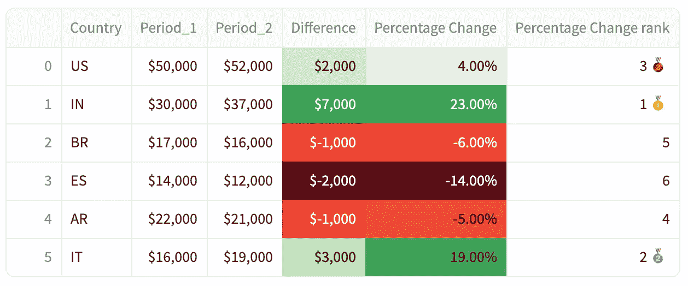

# 如何创建精美样式的 Streamlit 数据框架，第一部分：使用 Pandas Styler

> 原文：[`towardsdatascience.com/how-to-create-well-styled-streamlit-dataframes-part-1-using-the-pandas-styler-e239c0fbe145?source=collection_archive---------6-----------------------#2024-08-14`](https://towardsdatascience.com/how-to-create-well-styled-streamlit-dataframes-part-1-using-the-pandas-styler-e239c0fbe145?source=collection_archive---------6-----------------------#2024-08-14)

## Streamlit 和 pandas 的 Styler 对象并不兼容。但我们将改变这一点！

 [Jose Parreño](https://medium.com/@joparga3?source=post_page---byline--e239c0fbe145--------------------------------)

·发表于[Towards Data Science](https://towardsdatascience.com/?source=post_page---byline--e239c0fbe145--------------------------------) ·阅读时长 7 分钟·2024 年 8 月 14 日

--

我一直是[pandas 中的 styler 方法](https://pandas.pydata.org/docs/user_guide/style.html)的粉丝。当我开始构建 Streamlit 应用时，我很清楚我希望为数据框架添加样式，以帮助可视化数据框架，但……惊喜！截至目前，Streamlit [st.dataframe()](https://docs.streamlit.io/develop/api-reference/data/st.dataframe) **不支持 styler 对象**，只支持数据框架对象。好吧，修正一下，它确实支持它们，但 UI 显示非常糟糕！

这就是为什么我想与大家分享我的解决方法和想法，用于在 Streamlit 中构建一个样式良好的数据框架。我们将涵盖：

1.  **如何在数字中添加千位分隔符。**

1.  **如何将数字显示为百分比**（*将数据中的 0.24 转为 UI 中的 24%*）

1.  **如何添加货币符号。**

1.  **如何为单元格添加颜色。** 更棒的是，我将分享我最喜欢的颜色分级函数。

1.  **如何添加表情符号！** 是的，我们离不开表情符号😊！

# st.dataframe()的默认视图

Streamlit 实际上在根据数据类型推断最佳显示效果方面表现得相当不错。想象一下……
