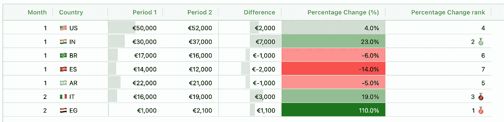

# 如何创建漂亮的 Streamlit 数据框，第二部分：使用 AgGrid

> 原文：[`towardsdatascience.com/how-to-create-well-styled-streamlit-dataframes-part-2-using-aggrid-dbff2d52f6a2?source=collection_archive---------7-----------------------#2024-08-21`](https://towardsdatascience.com/how-to-create-well-styled-streamlit-dataframes-part-2-using-aggrid-dbff2d52f6a2?source=collection_archive---------7-----------------------#2024-08-21)

## pandas Styler 很酷，但 AgGrid 更酷。让你的 Streamlit 数据框更加互动和惊艳。

 [Jose Parreño](https://medium.com/@joparga3?source=post_page---byline--dbff2d52f6a2--------------------------------)

·发布于 [Towards Data Science](https://towardsdatascience.com/?source=post_page---byline--dbff2d52f6a2--------------------------------) ·阅读时间 12 分钟·2024 年 8 月 21 日

--

在我上一篇文章中，我们讲解了如何使用 pandas Styler 对象创建漂亮的数据框。在这篇文章中，我想告诉你第二种选择：**Streamlit AgGrid**。我将分享如何构建像上面展示的那样的数据框。阅读完本文后，你将学到：

1.  **AgGrid 内的关键组件。** 这些包括 `gridOptions()`、`configure_column()`、`configure_default_column()` 和 `configure_side_bar()`*。

1.  启用**通过 UI 直接过滤和聚合表格**的主要选项。再也不需要为简单的转换构建临时查询了！

1.  **通过 Javascript 函数使数据框更美观。** 如果你愿意，你可以将它们复制并粘贴到你的代码中。或者查看我的 Git 仓库。

*免责声明 1：我与 AgGrid 没有任何合作关系或伙伴关系。我只是觉得这个开源产品非常有价值。AgGrid 确实有付费的分层产品，但这篇博客只会使用 AgGrid 的免费组件。*

*免责声明 2：除非另有说明，所有图片和 GIF 均由我本人创作。*
