# 如何使用卫星图像创建你自己的 CV 数据集：来自太空的野火

> 原文：[`towardsdatascience.com/how-to-create-your-own-cv-dataset-using-satellite-imagery-wildfires-from-space-8295c0cca028?source=collection_archive---------6-----------------------#2024-05-09`](https://towardsdatascience.com/how-to-create-your-own-cv-dataset-using-satellite-imagery-wildfires-from-space-8295c0cca028?source=collection_archive---------6-----------------------#2024-05-09)

## 收集图像以训练 CNN

[](https://medium.com/@alexroz?source=post_page---byline--8295c0cca028--------------------------------)[](https://towardsdatascience.com/?source=post_page---byline--8295c0cca028--------------------------------) [Aleksei Rozanov](https://medium.com/@alexroz?source=post_page---byline--8295c0cca028--------------------------------)

·发表于 [Towards Data Science](https://towardsdatascience.com/?source=post_page---byline--8295c0cca028--------------------------------) ·阅读时间：7 分钟·2024 年 5 月 9 日

--

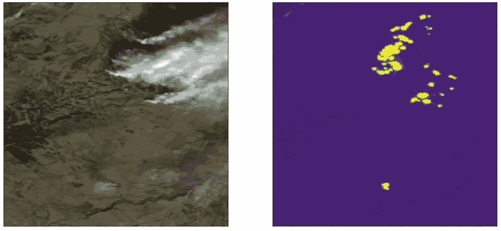

除非另有说明，所有图像均由[作者](https://medium.com/@alexroz)提供，基于 Sentinel-2 数据。

你是否曾想过，基于机器学习（ML）应用于卫星图像的个人项目，可能会显著增强你的数据科学作品集？或者你是否基于别人开发的数据集训练过一些模型，却没有使用过自己的数据集？如果答案是肯定的，我有个好消息要告诉你！

在这篇文章中，我将引导你通过创建一个由高分辨率卫星图像组成的计算机视觉（CV）数据集的过程，这样你就可以使用类似的方法，打造一个扎实的个人项目！

🔥**问题：** 野火检测（二分类任务）。

**🛰️仪器：** Sentinel 2（10/20 米分辨率）。

**⏰时间范围：** 2017/01/01–2024/01/01。

🇬🇧**兴趣区域：** 英国。

**🐍Python 代码：** [GitHub](https://github.com/alexxxroz/Medium/blob/main/WF_Dataset.ipynb)***.***

# I. 收集关于野火的信息。

在获取任何图像之前，了解野火发生的地点和时间至关重要。为了获取此类数据，我们将使用美国国家航空航天局（NASA）的“资源管理火灾信息系统”（[FIRMS](https://firms.modaps.eosdis.nasa.gov/download/)）档案。根据你的需求，你可以在此选择数据源和感兴趣区域，提交请求，并在几分钟内获取数据。

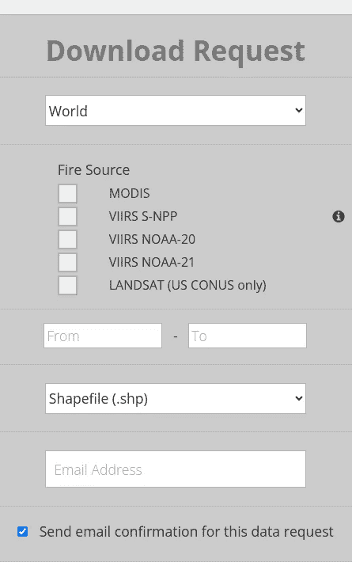

[FIRMS 门户网站。](https://firms.modaps.eosdis.nasa.gov/download/create.php)

我决定使用基于 MODIS 的数据，形式为 csv 文件。数据包含了许多不同的变量，但我们只关心纬度、经度、采集时间、**置信度**和**类型**。最后两个变量对我们尤为重要。如你所料，置信度基本上是指野火发生的概率。因此，为了排除“误报”，我决定过滤掉置信度低于 70% 的数据。第二个重要的变量是类型，基本上它是对野火的分类。我只关心燃烧的植被，因此只保留了类别 0。最终的数据集包含了 **1087** 起野火事件。

```py
df = pd.read_csv('./fires.csv')
df = df[(df.confidence>70)&(df.type==0)]
```

现在我们可以将热点叠加在英国的形状上。

```py
proj = ccrs.PlateCarree()
fig, ax = plt.subplots(subplot_kw=dict(projection=proj), figsize=(16, 9))

shape.geometry.plot(ax=ax, color='black')
gdf.geometry.plot(ax=ax, color='red', markersize=10)

ax.gridlines(draw_labels=True,linewidth=1, alpha=0.5, linestyle='--', color='black')
```

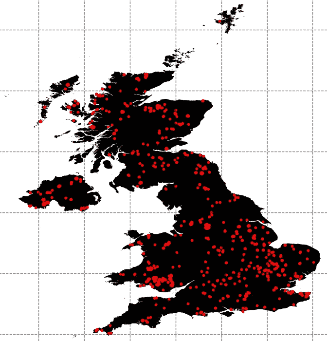

图像由 [作者](https://medium.com/@alexroz) 提供。

# II. 收集 Sentinel-2 图像用于野火事件。

工作的第二阶段涉及我最喜欢的 Google Earth Engine（GEE）及其 Python 版本 *ee*（你可以查看我的其他文章，了解该服务的功能）。

在理想条件下，Sentinel-2 提供的图像具有 5 天的时间分辨率和 10 米的空间分辨率（RGB 波段）以及 20 米的空间分辨率（SWIR 波段）（稍后我们将讨论这些是什么）。然而，这并不意味着我们每 5 天就能获取一次每个位置的图像，因为有许多因素影响图像采集，包括**云层**。因此，我们不可能获得 1087 张图像，实际数量会远低于此。

让我们创建一个脚本，为每个点获取一张云量小于 50% 的 Sentinel-2 图像。对于每对坐标，我们创建一个缓冲区，并将其拉伸为矩形，稍后从更大的图像中剪切出来。所有图像都转换为多维数组并保存为 *.npy* 文件。

```py
import ee
import pandas as pd

ee.Authenticate()
ee.Initialize()

uk = ee.FeatureCollection('FAO/GAUL/2015/level2').filter(ee.Filter.eq('ADM0_NAME', 'U.K. of Great Britain and Northern Ireland'))
SBands = ['B2', 'B3','B4', 'B11','B12']
points = []
for i in range(len(df)):
    points.append(ee.Geometry.Point([df.longitude.values[i], df.latitude.values[i]]))

for i in range(len(df)):
    startDate = pd.to_datetime(df.acq_date.values[i])
    endDate = startDate+datetime.timedelta(days=1)
    S2 = ee.ImageCollection('COPERNICUS/S2_SR_HARMONIZED')\
                .filterDate(startDate.strftime('%Y-%m-%d'), endDate.strftime('%Y-%m-%d'))\
                .filterBounds(points[i].buffer(2500).bounds())\
                .select(SBands)\
                .filter(ee.Filter.lt('CLOUDY_PIXEL_PERCENTAGE', 50))
    if S2.size().getInfo()!=0:
        S2_list = S2.toList(S2.size())
        for j in range(S2_list.size().getInfo()):
            img = ee.Image(S2_list.get(j)).select(SBands)
            img = img.reproject('EPSG:4326', scale=10, crsTransform=None)
            roi = points[i].buffer(2500).bounds()
            array = ee.data.computePixels({
              'expression': img.clip(roi),
              'fileFormat': 'NUMPY_NDARRAY'
            })
            np.save(join('./S2',f'{i}_{j}.npy'), array)
            print(f'Index: {i}/{len(df)-1}\tDate: {startDate}')
```

那么，SWIR 波段（特别是 11 和 12 波段）是什么？SWIR 代表短波红外。SWIR 波段是电磁波谱的一部分，涵盖了大约 1.4 到 3 微米的波长范围。

SWIR 波段因多个原因在野火分析中得到应用：

1.  **热敏感性：** SWIR 波段对温度变化敏感，可以探测与野火相关的热源。因此，SWIR 波段可以捕捉到火灾的地点和强度信息。

1.  **烟雾穿透：** 野火产生的烟雾会遮挡 RGB 图像的可见度（即你根本看不见云层下方）。与可见光范围相比，SWIR 辐射可以更好地穿透烟雾，从而即使在烟雾弥漫的情况下，也能进行更可靠的火灾检测。

1.  **火灾区域识别：** SWIR 波段可以通过检测火灾造成的表面反射变化来帮助识别烧毁区域。烧毁的植被和土壤在 SWIR 波段中常常表现出独特的光谱特征，从而能够描绘出火灾影响区域的范围。

1.  **夜间检测：** SWIR 传感器可以检测火灾的热辐射，即使在夜间，当可见光和近红外传感器由于缺乏阳光而无法工作时。这使得可以全天候连续监控野火。

所以，如果我们查看从收集的数据中随机选取的图像，我们会发现，当基于 RGB 图像时，很难判断这是不是烟雾或云层，而 SWIR 波段则清晰地显示火灾的存在。

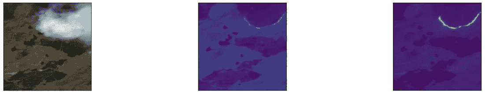

# III. 手动清理。

现在是我最不喜欢的部分。检查所有图片并确保每张图像是否有野火（记住，70%的置信度）并且图像本身是正确的，这是至关重要的。

例如，像这些这样的图像（没有热点）被采集并自动下载到野火文件夹中：

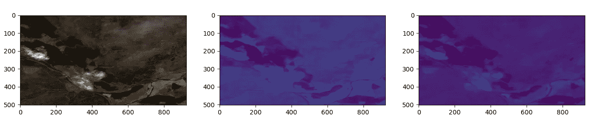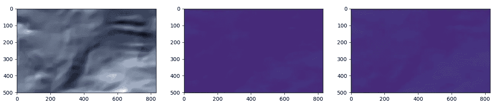

清理后的图像总数：**228**。

# IV. 获取无火灾图像。

最后阶段是获取没有热点的图像用于我们的数据集。由于我们正在构建一个分类任务的数据集，我们需要平衡两个类别，因此我们需要获取至少 200 张图片。

为了实现这一点，我们将从英国的领土中随机抽取点（我决定抽取 300 个）：

```py
min_x, min_y, max_x, max_y = polygon.bounds
points = []
while len(points)<300:
    random_point = Point(np.random.uniform(min_x, max_x), np.random.uniform(min_y, max_y))
    if random_point.within(polygon):
        points.append(ee.Geometry.Point(random_point.xy[0][0],random_point.xy[1][0]))
print('Done!')
```

然后，应用上面写的代码，我们获取 Sentinel-2 图像并保存它们。

# V. 再次手动清理 :((((

又是枯燥的阶段。现在我们需要确保这些点中没有野火、干扰或错误的图像。

做完这些后，我得到了**242**张这样的图像：

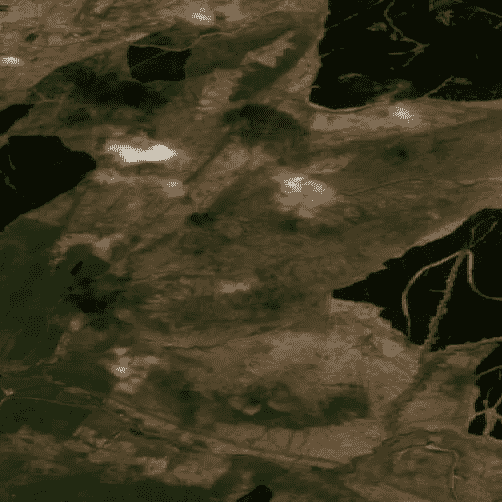

**VI. 数据增强。**

最终阶段是图像增强。简单来说，目的是利用已有的图像增加数据集中图像的数量。在这个数据集中，我们将简单地将图像旋转 180°，从而使数据集中的图片数量增加一倍！

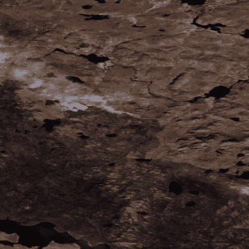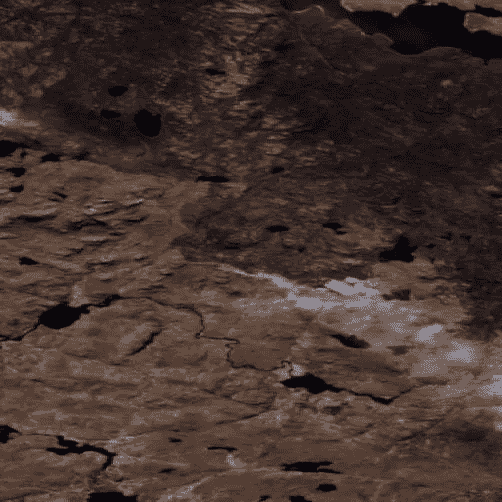

# 结果。

现在可以随机抽取两类图像并可视化它们了。

无火灾：

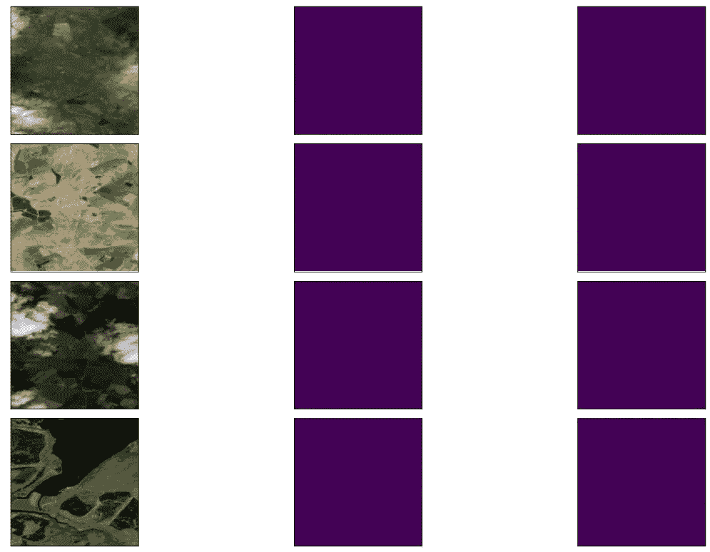

有火灾：

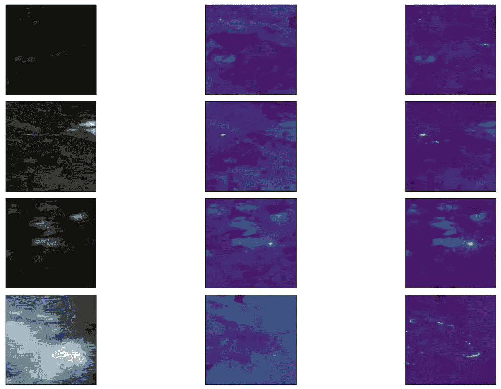

就这样，我们完成了！正如你所看到的，如果使用 GEE，收集大量遥感数据并不难。我们现在创建的数据集可以用于训练不同架构的卷积神经网络（CNN）并比较它们的性能。在我看来，这是一个完美的项目，可以加入到你的数据科学作品集中，因为它解决了一个非平凡且重要的问题。

希望这篇文章对你有所启发，能带给你信息！

===========================================

***参考文献：***

+   NASA 近实时和 MCD14DL MODIS 活跃火灾检测（TXT/CSV 格式）。数据集。在线提供[[/learn/find-data/near-real-time/firms/active-fire-data](https://www.earthdata.nasa.gov/learn/find-data/near-real-time/firms/active-fire-data)]

+   [FIRMS 数据政策](https://www.earthdata.nasa.gov/learn/find-data/near-real-time/firms/mcd14dl-nrt)

+   [Sentinel-2 数据许可证](https://scihub.copernicus.eu/twiki/pub/SciHubWebPortal/TermsConditions/Sentinel_Data_Terms_and_Conditions.pdf)

+   哥白尼 Sentinel 数据 2017–2024。

===========================================

***我在 Medium 上的所有出版物都是免费的并且开放访问的，因此如果你在这里关注我，我将非常感激！***

附言：我对（地理）数据科学、机器学习/人工智能和气候变化充满热情。如果你想一起合作某个项目，请通过[LinkedIn](https://www.linkedin.com/in/alexxxroz/)与我联系。

🛰️更多内容请关注🛰️
